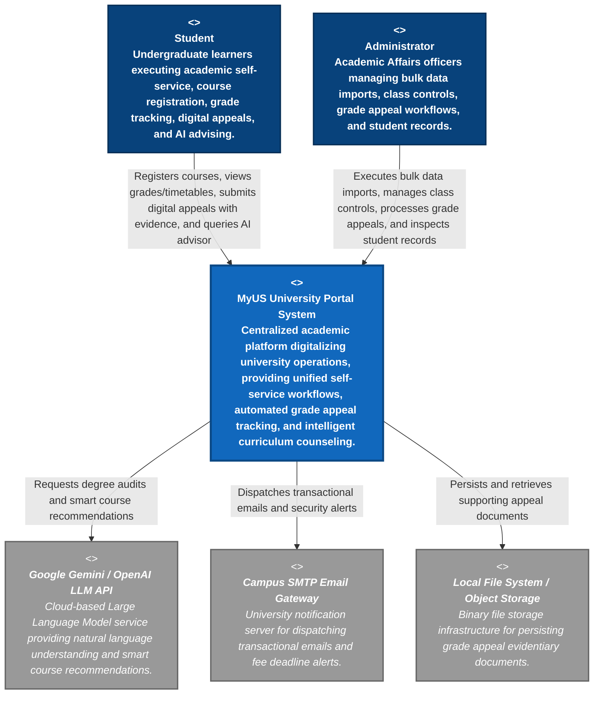

# B - Software Architecture: System Context Diagram
**Performed by:** Lê Thị Như Ý  | **Reviewed by:** Hồ Thị Như Ngọc  | **Edited by:** Lê Thị Như Ý

---

# 1. Introduction, Architectural Scope & C4 Model Principles

## 1.1. Executive Summary & System Purpose

The **MyUS University Portal System** is an enterprise-grade, integrated academic platform designed to digitalize and streamline university governance, administrative workflows, and student self-service operations. In a modern higher education environment, traditional paper-based administrative procedures—such as manual exam grade re-evaluations, physical course registration forms, and siloed academic advising—create severe operational bottlenecks and data inconsistencies.

MyUS addresses these challenges by establishing a unified, data-driven software ecosystem that connects undergraduate learners directly with university administrators. By centralizing daily academic activities into a single secure web application, MyUS eliminates physical paperwork, ensures real-time data synchronization across campus departments, guarantees the integrity of educational records, and enhances the overall student academic experience through 24/7 intelligent virtual counseling.

---

## 1.2. Evolutionary Project Scope (PA1 through PA4 Roadmap)

This architectural document encapsulates the complete end-to-end software system as evolved from **Project Assignment 1 (PA1)** through **Project Assignment 4 (PA4)**. The architecture comprehensively models the platform's domain boundaries and capabilities, implemented progressively across four iterative development milestones.

### PA1 & PA2 (Requirements Elicitation & Formal Modeling)

Established the foundational domain models, business rules, and actor hierarchies. During these phases, core user requirements were formalized into comprehensive use-case specifications, defining the operational boundaries between students and administrative staff across nine academic and administrative functional groups.

### PA3 (Core Infrastructure & Architectural Foundation)

Centered on foundational scaffolding and MVP execution.

This phase established:

- Secure Spring Boot Backend API
- React TypeScript Frontend
- SQL Server relational database schema
- Stateless JSON Web Token (JWT) authentication framework

Initial feature implementation focused on core student self-service capabilities, including:

- **Functional Group 1:** User Profile Updates
- **Functional Group 4:** Semester Grade Viewing & GPA Calculation

### PA4 (Spec-Driven Implementation of Core Appeals, FAQ Support & AI Chatbot)

Represents the full-scale expansion of the platform using **Spec Kit** to drive end-to-end full-stack implementation (UI + API/Logic + Data Persistence).

For this milestone, implementation focuses on three major modules.

#### Functional Group 2 – Grade Appeal System

End-to-end execution of the digital grade appeal workflow, including:

- Digital appeal submission
- Supporting evidence uploads (`.pdf`, `.jpg`, `.png`, maximum 5 MB)
- Real-time appeal status tracking:
  - `Submitted`
  - `Under Review`
  - `Approved`
  - `Denied`
  - `Withdrawn`
- Dynamic fee payment deadline enforcement (+5 business days)

#### Functional Group 6 – Support & FAQ

Implementation of a centralized searchable self-service knowledge base.

This module enables undergraduate students to independently find answers regarding:

- Campus administrative regulations
- Academic grading policies
- IT troubleshooting

without requiring manual helpdesk assistance.

#### AI Learning Path Chatbot (Section 4 / FG3 AI Module)

Integration of a Large Language Model (LLM)-based recommendation engine that provides 24/7 academic advising.

The chatbot supports:

- Transcript retrieval
- Degree audit analysis
- Completed credit evaluation
- Prerequisite and corequisite validation
- Personalized next-semester course recommendations
- Graduation timeline simulation

---

## 1.3. Key Architectural Quality Attributes & Non-Functional Requirements

The software architecture of MyUS is explicitly designed to satisfy critical architectural quality attributes, ensuring long-term system stability, security, and scalability.

### Security & Data Privacy (FERPA / Institutional Compliance)

Academic records, transcripts, and personal identifiers represent highly sensitive institutional data.

The architecture therefore enforces:

- Stateless JWT Bearer authentication
- Role-Based Access Control (RBAC)
- Method-level authorization
- Prevention of horizontal privilege escalation
- Prevention of vertical privilege escalation

These mechanisms ensure:

- Students can access only their own academic information.
- Administrators operate strictly within authorized permission boundaries.

---

### High Availability & Fault Tolerance

System availability is critical during peak academic periods such as:

- Course registration
- Grade publication
- Grade appeal deadlines

The platform incorporates resilient architectural patterns including:

- Circuit Breaker
- Graceful Degradation

If the external AI service becomes unavailable because of latency or service interruption, the platform automatically falls back to deterministic SQL-based recommendation algorithms to ensure uninterrupted academic support.

---

### Modularity & Separation of Concerns

The platform adopts a decoupled Full-Stack architecture by separating responsibilities across independent layers:

- Presentation Layer (React SPA)
- Business Logic / API Layer (Spring Boot)
- Relational Database Layer (SQL Server)
- Binary Object Storage

This separation improves maintainability while allowing individual containers and services to scale independently.

---

### Transaction Atomicity & Consistency

Academic operations that modify institutional records—including:

- Grade adjustments after appeals
- Course wishlist updates
- Tuition status updates

are executed inside atomic database transactions (`@Transactional`) to prevent:

- Race conditions
- Partial updates
- Data inconsistency

---

## 1.4. Theoretical Foundation of the C4 Model – Level 1 (System Context)

To communicate this architecture effectively without overwhelming stakeholders, this document adopts **Simon Brown's C4 Model**.

The C4 Model organizes software architecture into four abstraction levels:

| Level | Description |
|--------|-------------|
| Level 1 | System Context |
| Level 2 | Container Diagram |
| Level 3 | Component Diagram |
| Level 4 | Code Diagram |

Each level progressively reveals additional implementation details while maintaining architectural clarity.

---

### Purpose of the Level 1 System Context Diagram

Section **B** focuses exclusively on **C4 Level 1 – System Context Diagram**.

At this level, the architecture answers two fundamental questions:

1. Who uses the system?
2. What external software systems does the platform interact with?

The **MyUS University Portal System** is represented as a single **Software System (Black Box)**.

Internal implementation details—including:

- React frontend
- Spring Boot backend
- SQL Server database
- APIs
- Frameworks
- Source code

are intentionally omitted and deferred to the **Container Diagram (Level 2)** and **Component Diagram (Level 3)** presented later in the document.

Instead, the Level 1 diagram focuses on illustrating:

- The overall System Boundary
- Human users (`<<Person>>`)
- External Software Systems (`<<External Software System>>`)
- Bidirectional communication relationships
- High-level information exchanges between MyUS and external entities

# 2. Comprehensive Technology Stack & Architectural Justification
**Performed by:** Lê Thị Như Ý  | **Reviewed by:** Hồ Thị Như Ngọc  | **Edited by:** Lê Thị Như Ý
To satisfy the functional complexity of the defined use cases alongside stringent Non-Functional Requirements regarding security, responsiveness, and concurrent transaction safety, the **MyUS University Portal System** adopts a modern, decoupled Full-Stack architecture. Every technology and framework selected within this stack is justified by explicit domain constraints and operational requirements.

---

## 2.1. Frontend Layer (Client Presentation & Reactive State)

The client-side architecture is engineered as a **Single Page Application (SPA)** to ensure seamless, reload-free navigation across complex student self-service and administrative workflows.

### Core Framework — React 18
Selected for its declarative, component-driven UI model.

- **React Hooks** (`useState`, `useEffect`, `useMemo`, `useCallback`) manage localized state transitions efficiently, such as:
  - Dynamic calculations during **Course Registration (UC-03)**.
  - Term filtering and GPA computations in the **Grade Dashboard (UC-05)**.
  - Real-time step navigation in **Evaluation Surveys (UC-09)**.

### Programming Language — TypeScript (v5.x)

Enforces strict static typing and compile-time contract verification.

TypeScript is critical for modeling intricate Data Transfer Objects (DTOs), including:

- Multi-field Grade Appeal submissions (**UC-07**).
- Structured AI Course Recommendation cards (**UC-03b**).
- Bulk import validation previews (**UC-12**, **UC-13**).

This prevents runtime type errors and ensures consistency between frontend and backend data contracts.

### Styling & Responsive UI — Plain CSS with BEM Convention

The frontend uses plain CSS files organized per component, following the **BEM (Block Element Modifier)** naming convention to satisfy multi-device responsiveness requirements across desktop, laptop, tablet, and mobile breakpoints (**NFR ID13**).

It enables:

- Condensed daily-agenda layouts on mobile devices (**UC-04**).
- Clean and expandable UI patterns for the centralized FAQ library (**UC-10**).

without requiring additional CSS framework dependencies.

### Routing & Security — React Router DOM

React Router DOM manages client-side SPA routing and implements custom **Protected Route** wrappers.

These wrappers inspect:

- Authentication state.
- Role-Based Access Control (RBAC) privileges.

This ensures undergraduate students cannot access privileged administrative pages such as:

- Bulk import management.
- Student data administration.

(**UC-11** through **UC-18**)

### HTTP Client & Asynchronous Communication — Axios

Axios serves as the primary REST client and is configured with global request and response interceptors.

Its responsibilities include:

- Automatically attaching stateless JSON Web Tokens (JWT) as **Bearer** headers to all outbound requests (**UC-01**).
- Handling authentication failures.
- Serializing request payloads into:
  - Standard JSON.
  - `multipart/form-data` when uploading supporting documents for grade appeals (**UC-07a**).

### Build & Bundling Tooling — Create React App (react-scripts)

**Create React App (CRA)** with `react-scripts` is used as the build tool to provide:

- Rapid development environment with integrated Webpack configuration.
- Optimized production builds with tree-shaking for fast deployment.
- Out-of-the-box support for TypeScript compilation and testing infrastructure.

---

## 2.2. Backend Layer (API Gateway & Business Logic)

The backend operates as a stateless RESTful API server responsible for workflow orchestration, business rule enforcement, and transaction management.

### Core Framework — Spring Boot 3.x (Java 17/21)

Spring Boot provides an enterprise-grade **Model-View-Controller (MVC)** architecture.

It encapsulates mission-critical academic business logic, including:

- Curriculum prerequisite/corequisite verification (**UC-03a**).
- GPA calculation using both the 10-point and 4-point grading scales (**UC-05**).
- Automated routing of grade appeal queues (**UC-07**).

### Authentication & Security — Spring Security 6 + BCrypt + JWT

Implements a stateless authentication architecture (**UC-01**).

#### Password Hashing

- User passwords are encrypted using the **BCrypt** hashing algorithm with a minimum work factor of **10 rounds**.
- Plaintext passwords never appear in logs, database tables, or API payloads (**NFR ID09**).

#### Token-Based Session Control

- Authenticated sessions rely on configurable JWT Access Tokens and Refresh Tokens (**NFR ID10**).
- Unauthorized access attempts immediately receive **HTTP 401 Unauthorized** responses (**NFR ID06**).

#### Authorization Enforcement

Method-level security annotations (`@PreAuthorize`) enforce strict Role-Based Access Control (RBAC), ensuring students can only access or modify their own academic records and profiles (**NFR ID07**, **NFR ID08**).

### Data Persistence & ORM — Spring Data JPA + Hibernate ORM

Spring Data JPA abstracts relational SQL operations through repository interfaces while maintaining ACID compliance and efficient connection pooling.

Transaction management using `@Transactional` guarantees data integrity during high-concurrency operations, including:

- Course registration seat reservations (**UC-03**, **NFR ID24**).
- Multi-step grade appeal status updates (**UC-16**).

### Validation & Error Handling — Jakarta Bean Validation + `@ControllerAdvice`

Input validation is enforced at the controller layer.

Examples include:

- Verifying appeal reason length constraints in **AppealSubmitRequest** (**UC-07**).
- Validating username and password formats in **AuthRequest**.

A global `@ControllerAdvice` middleware intercepts exceptions and standardizes HTTP error responses into structured JSON payloads (**NFR ID14**).

### AI Orchestration Adapter — Spring AI / LangChain4j

Acts as the communication bridge between enterprise Java services and external Large Language Models (LLMs).

Responsibilities include:

- Formatting student transcripts and curriculum rules into Retrieval-Augmented Generation (RAG) prompts.
- Sending synchronous REST requests to AI services.
- Gracefully degrading when AI services experience latency or downtime (**NFR ID18**).

---

## 2.3. Database & Storage Layer

The persistence layer separates structured relational data from binary file storage to optimize query performance and storage efficiency.

### Relational Database — Microsoft SQL Server (2019/2022)

SQL Server serves as the primary system of record, ensuring referential integrity and relational consistency.

It stores structured schemas including:

- `users`
- `students`
- `course_offerings`
- `enrollments`
- `grade_appeals`
- `tuition_invoices`
- `class_transfer_requests`
- `chatbot_sessions`
- `faq_articles`
- `surveys`
- System audit logs

(**UC-11**, **UC-17**)

Database indexing strategies ensure that:

- Historical grade queries.
- Student record searches.

remain performant even with large datasets (**NFR ID05**).

### Binary Object Storage — Local File System / Object Storage

Managed through Spring Boot's **FileStorageService** for storing supporting documents submitted with grade appeals (**UC-07a**).

To avoid database bloat:

- Uploaded files undergo format and size validation.
- Files are stored separately from relational data.
- SQL Server stores:
  - Secure file URI.
  - Metadata.
  - Access-control references.

File access is restricted to the submitting student and authorized administrators (**NFR ID08**).

---

## 2.4. External Integration Services & APIs

To provide advanced capabilities without reinventing existing infrastructure, MyUS integrates with specialized external systems over encrypted **HTTPS/TLS 1.2+** connections (**NFR ID11**).

### AI Counseling Engine — Google Gemini / OpenAI LLM API

Provides the intelligence behind the **AI Learning Path Chatbot (UC-03b)**.

The AI service:

- Receives anonymized transcript summaries.
- Receives curriculum rules.
- Suggests next-semester courses.
- Simulates graduation roadmaps.

AI-generated recommendations are advisory only and **cannot bypass official prerequisite validation rules** (**NFR ID18**).

### Asynchronous Notification Gateway — Campus SMTP Email Gateway / JavaMailSender

Responsible for sending automated emails and system notifications.

Notifications are triggered during:

- Security lockouts (**UC-01 AF1**).
- Profile contact information updates (**UC-02 AF5**).
- Grade appeal fee-payment deadline creation by administrators (**UC-15**, **UC-16**).

---

## 2.5. DevOps, Quality Assurance & Spec-Driven Tooling

### Database Migration Management — Flyway

**Flyway** is integrated for version-controlled database schema migration. All schema changes are managed through SQL migration scripts located in `src/main/resources/db/migration/`, ensuring:

- Consistent database state across all environments (development, testing, production).
- Repeatable and auditable schema evolution history.
- Baseline support for existing databases without data loss.

### Spec-Driven Engineering — Spec Kit

Spec Kit serves as the primary implementation driver during Phase 4 development.

It systematically transforms:

- `spec.md`
- `plan.md`
- `tasks.md`

into verified end-to-end full-stack implementations.

### Automated Testing Suite — JUnit 5 & Mockito

JUnit 5 and Mockito are used to build comprehensive backend unit tests covering mission-critical business logic, including:

- Prerequisite validation algorithms (**UC-03a**, **NFR ID30**).
- Official GPA calculation algorithms (**UC-05**, **NFR ID30**).
- Grade appeal workflow state transitions (**UC-07**, **NFR ID30**).

## 3. C4 Model - Level 1: System Context Diagram
**Performed by:** Lê Thị Như Ý  | **Reviewed by:** Hồ Thị Như Ngọc  | **Edited by:** Lê Thị Như Ý
### C4 Model - Level 1 (Mermaid)

## 3.2. Detailed Architectural Narrative & System Boundaries

### A. The Target System: MyUS University Portal System

At the center of the architecture is the **MyUS University Portal System**, which encapsulates all business logic, data validation rules, security controls, and workflow orchestration required to execute the 18 defined Use Cases (UC-01 through UC-18).

The system bridges two distinct user domains:

#### Student Self-Service Domain (UC-01 to UC-10)

This domain encompasses the core self-service capabilities available to undergraduate students, including:

- Authentication (**UC-01**)
- Profile management (**UC-02**)
- Course registration with prerequisite validation (**UC-03**, **UC-03a**)
- AI-driven course recommendations (**UC-03b**)
- Timetable tracking (**UC-04**)
- Grade and GPA monitoring (**UC-05**)
- Tuition fee tracking (**UC-06**)
- Digital grade appeal submissions with supporting document uploads (**UC-07**, **UC-07a**)
- Appeal status tracking (**UC-08**)
- Evaluation survey submissions (**UC-09**)
- Centralized FAQ support (**UC-10**)

#### Administrative Governance Domain (UC-11 to UC-18)

This domain supports administrative operations, including:

- Bulk data and class control (**UC-11**)
- Data file imports (**UC-12**)
- Format validation reporting (**UC-13**)
- Appeal processing management (**UC-14**)
- Physical fee payment deadline configuration (**UC-15**)
- Appeal status updates (**UC-16**)
- Student data administration (**UC-17**)
- Multi-criteria student record searching (**UC-18**)

---

### B. Primary Actors (Human Users)

#### Student (`<<Person>>`)

Students access the platform through modern web browsers. Following secure authentication, they use MyUS to:

- Independently manage their academic progress.
- Complete digital academic workflows without relying on physical paperwork.
- Interact with the AI academic assistant for personalized learning guidance and course recommendations.

#### Administrator (`<<Person>>`)

Administrators are Academic Affairs officers operating under elevated authorization privileges.

They use dedicated administrative interfaces to:

- Upload master schedules.
- Perform bulk student and course data imports.
- Review grade appeal submissions and supporting evidence.
- Configure physical office fee-payment deadlines.
- Inspect and manage confidential student records.

---

### C. External Software Systems & Integration Mechanics

To provide advanced capabilities while avoiding duplication of core infrastructure, **MyUS** integrates with three external software systems.

#### Google Gemini / OpenAI LLM API (`<<External Software System>>`)

This external AI service powers the **AI Learning Path Chatbot (UC-03b)**.

The platform securely communicates with the cloud-based Large Language Model (LLM) by transmitting curriculum context and user queries. The AI service analyzes prerequisite constraints and generates:

- Intelligent course recommendations.
- Personalized graduation pathway guidance.
- Natural-language academic counseling responses.

---

#### Campus SMTP Email Gateway (`<<External Software System>>`)

The Campus SMTP Email Gateway serves as the university's centralized notification infrastructure.

It automatically delivers transactional email notifications triggered by events such as:

- Security incidents (e.g., account lockouts and password resets).
- Student profile modifications.
- Grade appeal status updates.
- Administrative fee-payment reminders.

---

#### Local File System / Object Storage (`<<External Software System>>`)

The Local File System / Object Storage provides dedicated infrastructure for storing supporting evidence uploaded during **Grade Appeal submissions (UC-07a)**.

By separating binary file storage from the primary relational database, the system:

- Ensures reliable long-term access to uploaded documents.
- Improves database performance by avoiding storage of large binary objects.
- Maintains efficient query execution while securely managing appeal attachments.
