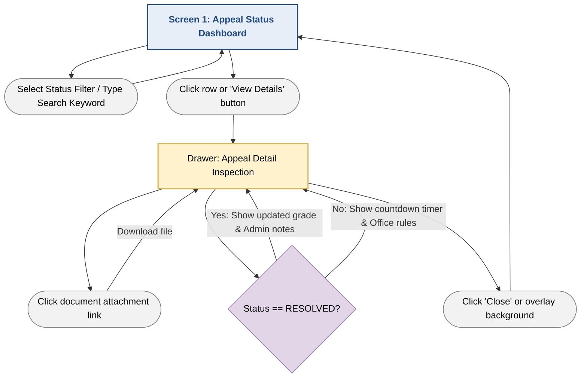

# Feature Specification: Track Grade Appeal Status (Functional Group 2)
**Author:** Lê Thị Như Ý | **Reviewer:** Trần Tường Vi | **Editor:** Lê Thị Như Ý
**Project:** MyUS University Portal System  
**Module:** Grade Appeal System  
**Target Actor:** Student  
**Status:** Approved  

---

# 1. Overview & Purpose

The **Track Grade Appeal Status** feature provides undergraduate students with a centralized, transparent dashboard to monitor the real-time processing progression of their submitted exam re-evaluation requests. This module eliminates administrative friction by displaying color-coded status milestones (`PENDING`, `PROCESSING`, `RESOLVED`, `REJECTED`), enforcing a clear visual countdown for mandatory physical fee payments at the Academic Affairs Office, and providing direct access to official faculty feedback and final grade adjustments.

---

# 2. User Stories

- **US-TS-01:** As a Student, I want to view a centralized data grid of all my submitted grade appeals so that I can quickly check which requests are pending, undergoing faculty review, or completed.
- **US-TS-02:** As a Student, I want to see a live countdown timer highlighting my fee payment deadline so that I do not miss the 5-business-day window at the academic office.
- **US-TS-03:** As a Student, I want to filter my appeal history by academic term, course code, or processing status to easily locate specific requests.
- **US-TS-04:** As a Student, I want to click on an individual appeal record to open a detail inspection panel showing my submitted reason, attached proof documents, and official administrative responses or grade changes.

---

# 3. Functional Requirements

## 3.1. Dashboard Display & Status Categorization

- **FR-01:** The system MUST retrieve and display all grade appeal records associated with the authenticated student's ID, ordered by submission timestamp (newest first).

- **FR-02:** The dashboard MUST categorize and display distinct status badges for each record:
  - `PENDING`: Request received, waiting for administrative check or fee payment.
  - `PROCESSING`: Fee verified, currently being re-graded by the academic department.
  - `RESOLVED`: Re-evaluation finished, grade officially updated.
  - `REJECTED`: Appeal denied (invalid proof or no grade change warranted).
  - `CANCELED`: System-expired due to unpaid fee within the required window.

## 3.2. Deadline Enforcement & Alerts

- **FR-03:** For appeals with `PENDING` status and `UNPAID` fee status, the system MUST dynamically compute and display a countdown timer (e.g., "3 days 4 hours remaining").

- **FR-04:** If the current timestamp exceeds the `feePaymentDeadline` and the fee remains unpaid, the frontend MUST display the status as expired/canceled and disable further follow-up actions.

## 3.3. Search, Filter, and Detail Inspection

- **FR-05:** The UI MUST provide instant client-side filtering by Status (`All`, `Pending`, `Processing`, `Resolved`, `Rejected`) and text search by Course Code or Tracking ID (e.g., `GA-2026-0891`).

- **FR-06:** The system MUST provide a detail slide-over drawer or modal when a record is selected, displaying:
  - Full course and exam metadata.
  - Student's original submission reason and expected grade.
  - Downloadable hyperlinks to all supporting documents attached during submission.
  - Official administrative feedback, reviewing lecturer notes, and the final updated score (if applicable).

---

# 4. Acceptance Criteria

## Scenario 1: Real-Time Status & Deadline Countdown Rendering

**Given**

- A logged-in Student navigates to the Appeal Status Dashboard.

**When**

- The page loads.

**Then**

- The system renders a table of all submitted appeals.
- Correct status badges are displayed.
- Any unpaid appeal with less than 24 hours remaining before the payment deadline is highlighted in bold red text.

---

## Scenario 2: Filtering and Keyword Searching

**Given**

- A Student has 10 historical appeal records across different semesters.

**When**

- The student selects **"Processing"** from the status filter dropdown.
- The student enters **"CSC10009"** into the search bar.

**Then**

- The table updates dynamically without a page reload.
- Only matching appeal records currently under faculty review are displayed.

---

## Scenario 3: Inspecting Resolved Appeal Feedback

**Given**

- An appeal record has been updated to `RESOLVED` by an administrator.

**When**

- The student clicks the **"View Details"** button.

**Then**

- A slide-over panel opens.
- The panel displays the administrative comment:
  > "Q3 score recalculated from rubric"
- The updated grade transition from **6.50 → 7.50** is shown.

---

# 5. Prototype Flow & UI Navigation

This section describes the navigation flow, screen transitions, and interactions for the **Track Grade Appeal Status** feature.

---

## 5.1. UI Flowchart (Mermaid)



---

## 5.2. Screen-by-Screen Interaction Breakdown

### Screen 1: Appeal Status Dashboard (`/appeals/status`)

**Purpose**

Provides students with a centralized dashboard for tracking all submitted grade appeals.

### Layout & UI Components

#### Top Metrics Ribbon

Summary statistic cards displaying:

- Active Appeals
- Pending Payments
- Resolved This Term

#### Filter Toolbar

Includes:

- Search input
  - Search by Course Name
  - Course Code
  - Tracking ID

- Status dropdown filter:
  - All
  - Pending
  - Processing
  - Resolved
  - Rejected
  - Canceled

#### Main Data Grid

Displays the following columns:

- Tracking Code (e.g., **GA-2026-0891**)
- Course Information
  - Course Code
  - Course Name
  - Credits
- Exam Type
  - Midterm
  - Final
  - Project
- Submitted Date
- Status Badge
- Action Required / Deadline
- View Details button

### State Behavior

If the student has no submitted appeals:

- Display an empty-state illustration.
- Show a primary button:

> **Submit Your First Appeal**

Clicking the button redirects the student to:

```
/appeals/new
```

---

### Drawer 1: Appeal Detail Inspection (`AppealDetailDrawer.tsx`)

**Purpose**

Allows students to inspect complete appeal information without leaving the dashboard.

### Behavior

- Slides in from the right side of the screen.
- Does not navigate away from the current page.
- Maintains the dashboard state in the background.

### Content Sections

#### Header

Displays:

- Tracking Code
- Status Badge
- Submission Timestamp

---

#### Section A: Course & Grade Comparison

Shows a highlighted comparison card including:

- Current Published Grade
- Expected Grade submitted by the student

---

#### Section B: Student's Submission

Displays:

- Full appeal reason
- Uploaded supporting documents as clickable attachment cards

Each attachment card contains:

- File icon
- File name
- File size

---

#### Section C: Administrative Response (Conditional)

##### If Status = `PENDING` or `PROCESSING`

Display an informational alert containing:

- Academic Affairs Office working hours
- Fee payment instructions
- Remaining payment countdown (if applicable)

##### If Status = `RESOLVED` or `REJECTED`

Display:

- Decision date
- Administrative feedback
- Lecturer review comments
- Final official grade stored in the academic system

---

### User Interaction

Students may close the drawer by:

- Clicking the **X** button.
- Clicking outside the drawer (overlay background).

After closing:

- The drawer slides out.
- Focus returns to the main Appeal Status Dashboard.
- Current filter, search keyword, and scroll position remain unchanged.
