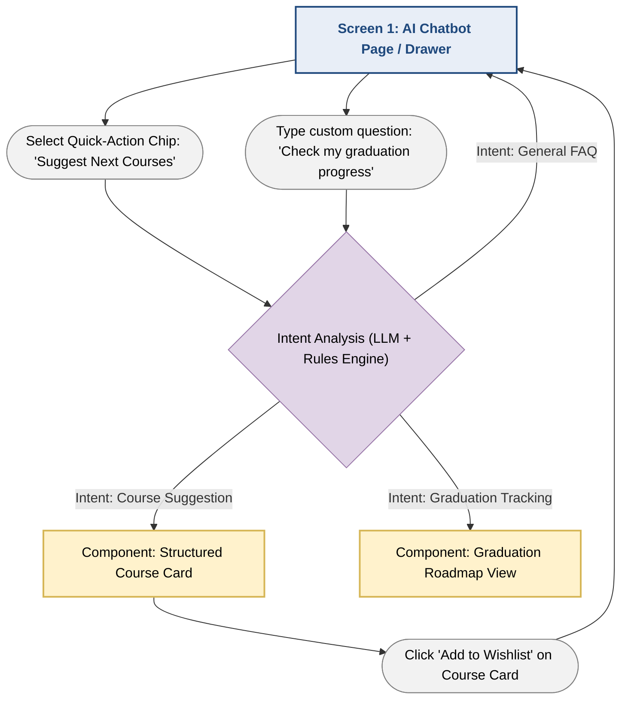

# Feature Specification: AI Learning Path Chatbot (Section 4 / Functional Group 3)
**Author:** Lê Thị Như Ý | **Reviewer:** Trần Tường Vi | **Editor:** Lê Thị Như Ý
**Project:** MyUS University Portal System  
**Module:** Course Enrollment & Academic Support System  
**Target Actor:** Student  
**Status:** Approved  

---

# 1. Overview & Purpose

The **AI Learning Path Chatbot** is an intelligent, 24/7 virtual assistant designed to guide undergraduate students through complex academic roadmaps. The chatbot analyzes a student's academic transcript, completed credits, curriculum requirements, prerequisite chains, and graduation progress to provide personalized course recommendations, graduation planning, and academic guidance. It helps students make informed enrollment decisions while minimizing the risk of delayed graduation.

---

# 2. User Stories

- **US-AI-01:** As a Student, I want the chatbot to automatically analyze my transcript and curriculum requirements so that I know how many credits I have completed and what courses remain.
- **US-AI-02:** As a Student, I want to receive intelligent recommendations for my next semester based on prerequisite eligibility so that I avoid registering for unavailable courses.
- **US-AI-03:** As a Student, I want to simulate different study plans and graduation timelines so that I can understand how my course load affects my graduation date.
- **US-AI-04:** As a Student, I want to ask natural language questions about university regulations, course difficulty, and graduation requirements so that I receive personalized academic guidance instantly.

---

# 3. Functional Requirements

## 3.1. Profile & Progress Analysis Engine

- **FR-01:** The system MUST securely retrieve the authenticated student's academic profile, including:
  - Cumulative GPA
  - Curriculum code
  - Completed courses
  - Earned credits

- **FR-02:** The analysis engine MUST compare completed coursework against official curriculum requirements, including:
  - General Education
  - Foundation Courses
  - Major Core Courses
  - Electives

---

## 3.2. Smart Course Suggestion Algorithm

- **FR-03:** The recommendation engine MUST evaluate prerequisite and corequisite rules before recommending any course.

- **FR-04:** Eligible courses MUST be ranked using the following priority:

  1. Mandatory major core courses that unlock future subjects.
  2. Previously failed courses requiring a retake.
  3. General curriculum requirements that help maintain a balanced semester load (15–18 credits).

---

## 3.3. Graduation Tracking & Pathway Simulation

- **FR-05:** The chatbot MUST estimate the minimum remaining semesters required for graduation based on the student's historical credit completion rate.

- **FR-06:** The system MUST display milestone reminders, for example:

  > "English Proficiency TOEIC 800+ required before Year 3 Semester 2."

---

## 3.4. Conversational Interface & Dialogue Management

- **FR-07:** The frontend MUST provide a responsive chat interface supporting:

  - Text messages
  - Quick-action suggestion chips
  - Rich course recommendation cards

- **FR-08:** The system MUST integrate an LLM orchestration layer (e.g., Google Gemini API through LangChain4j or a direct REST adapter) to:

  - Interpret user intent
  - Combine rule-based recommendations with AI responses
  - Generate conversational and empathetic replies

---

# 4. Acceptance Criteria

## Scenario 1: Automatic Course Recommendation

**Given**

- A logged-in Year 2 Information Technology student opens the AI Learning Path Chatbot.

**When**

- The student selects **"Suggest courses for next semester."**

**Then**

- The chatbot analyzes the student's transcript.
- It verifies that **Data Structures** has been completed.
- The chatbot recommends:
  - Computer Systems (`CSC10009`)
  - Database Systems
- Each recommendation includes an explanation describing why the course is important for timely graduation.

---

## Scenario 2: Preventing Invalid Course Registration

**Given**

- The student has not completed **Calculus 1**.

**When**

- The student asks:

  > "Can I take Artificial Intelligence next term?"

**Then**

- The chatbot explains that **Artificial Intelligence** is currently unavailable because the prerequisite **Calculus 1** has not been completed.
- The chatbot recommends enrolling in **Calculus 1** before attempting Artificial Intelligence.

---

## Scenario 3: Graduation Timeline Simulation

**Given**

- The student has completed **85 of 135 required credits**.

**When**

- The student asks:

  > "When will I graduate if I study 15 credits each semester?"

**Then**

- The chatbot calculates:
  - Remaining credits: **50**
  - Estimated graduation time: **3.5 semesters**
- The chatbot also displays milestone reminders, including completion of the required graduation internship before the following summer.

---

# 5. Prototype Flow & UI Navigation

This section describes the interaction flow of the AI Learning Path Chatbot.

---

## 5.1. UI Flowchart (Mermaid)

---

## 5.2. Screen-by-Screen Interaction Breakdown

### Screen 1: AI Academic Assistant Interface (`/support/ai-chatbot`)

**Purpose**

Provides students with an intelligent conversational assistant for course planning, graduation tracking, and academic consultation.

---

### Layout & UI Components

#### Header Banner

Displays:

- AI Assistant avatar
- Connection status
  - **Online – Connected to Degree Audit**
- Reset Conversation button

---

#### Message History Area

A vertically scrollable conversation panel displaying:

- Student message bubbles
- AI response cards
- Rich interactive components embedded inside responses

---

#### Quick-Action Prompt Chips

Displayed horizontally above the input field.

Available actions include:

- Suggest next term courses
- Check graduation audit
- Am I eligible for CSC10009?
- Explain degree prerequisites

---

#### Input Bar

Includes:

- Auto-growing text area
- Send button
- Advisory disclaimer:

> AI recommendations are for advisory purposes only. Please verify official academic regulations in the university course catalog.

---

### Interactive Output Components

#### Structured Course Card (`CourseSuggestionCard.tsx`)

Displayed whenever the chatbot recommends courses.

Each card contains:

- Course Code
- Course Name
- Credit Value
- Prerequisite Status Badge
  - Green: Cleared
  - Red: Missing prerequisite
- Short recommendation explanation
- **Save to Course Wishlist** button

---

#### Progress Audit Card (`GraduationRoadmapCard.tsx`)

Displays an overview of the student's academic progress, including:

- Credit progress bar

  Example:

  **85 / 135 Credits Completed (63%)**

- Estimated graduation semester
- Remaining required credits
- Outstanding curriculum requirements
- Major milestone alerts
- Degree completion percentage

---

### User Interaction Flow

1. The student opens the AI Academic Assistant.
2. The student either:
   - Selects a quick-action prompt, or
   - Types a natural language question.
3. The chatbot sends the request to the AI orchestration layer.
4. The system retrieves the student's academic profile and curriculum data.
5. The rules engine evaluates prerequisite eligibility and graduation requirements.
6. The LLM generates a personalized response.
7. Rich UI cards are rendered when appropriate, allowing the student to:
   - Review recommended courses.
   - Inspect graduation progress.
   - Save recommended courses to a wishlist.
8. The conversation history remains available throughout the session until manually reset.
