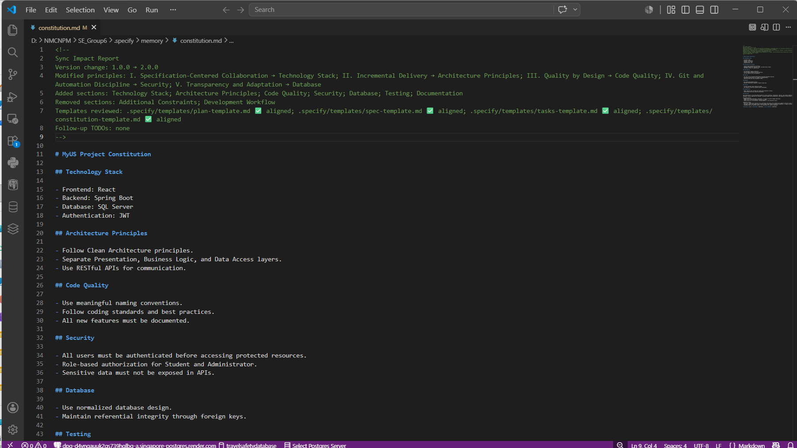
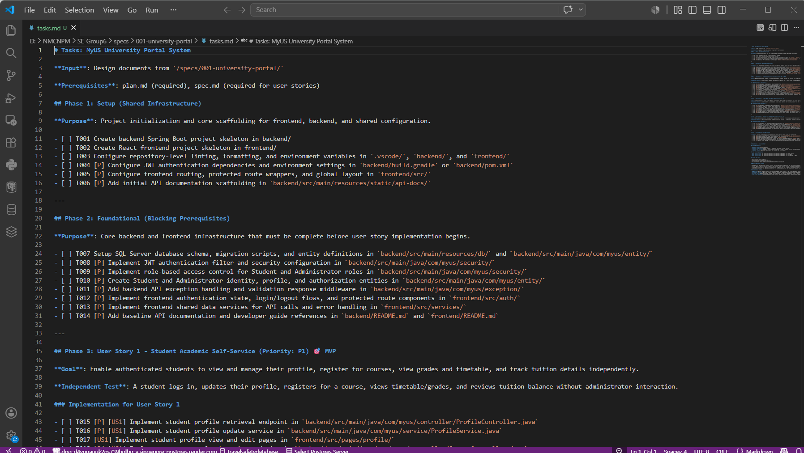
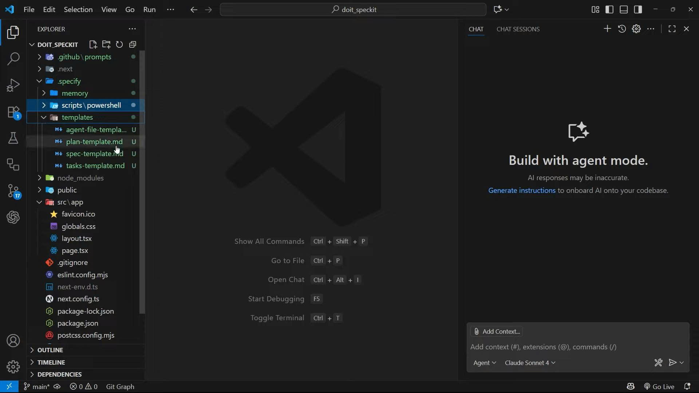
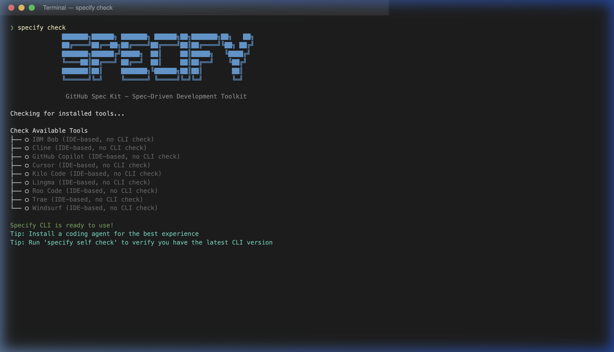
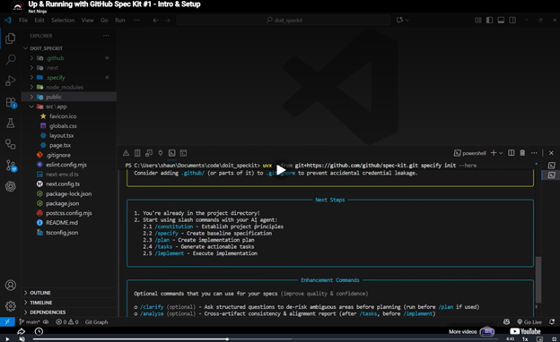
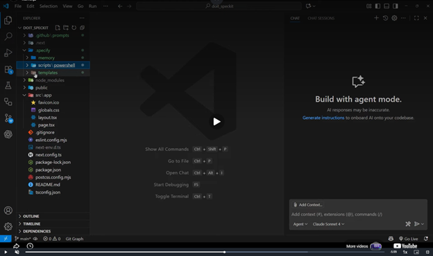

# GitHub Spec Kit Training Summary

**Project:** University Portal System
**Course:** CS300 - CSC13002 - Introduction to Software Engineering

This document summarizes the detailed learnings and practical takeaways of each team member after completing the "Up & Running with GitHub Spec Kit" training. It provides evidence of our understanding of Spec-Driven Development (SDD) and how to configure the toolset.

---

## 1. Lê Thị Như Ý
**Focus:** Full Workflow Execution and End-to-End Artifact Generation

**Summary of Learnings:**
My responsibility was to apply the GitHub Spec Kit across our entire University Portal project. I started by setting up the environment using the `uv` package manager and configuring the core `constitution.md` to strictly enforce our technology stack and architectural rules. 

Beyond the initial setup, I successfully executed the complete Spec-Driven Development workflow for the project. By interacting with the AI agent using the slash commands, I generated the full suite of structured artifacts. This included creating comprehensive feature specifications (`spec.md`), detailing the technical implementation plans (`plan.md`), and breaking them down into actionable task checklists (`tasks.md`) and other different files. This hands-on experience taught me how to effectively manage the AI's context and transition from high-level project requirements down to granular, ready-to-implement coding tasks.

**Evidence:**

---

## 2. Trần Tường Vi
**Focus:** Workspace Structure and Command Functions

**Summary of Learnings:**
Starting from an empty `/src` folder, I ran the Spec Kit init command in a VS Code terminal and chose GitHub Copilot as the AI assistant. I learned that this generates specific directories:
- **`.specify/memory/constitution.md`**: empty template, to be filled in later.
- **`.specify/`**: supporting scripts and templates for specs, plans, and tasks.
- **`.github/prompts/`**: slash-command prompt files for each Spec Kit command.

I also learned the distinct purpose of each command in the workflow:
- **`/speckit.constitution`**: Defines the project's core principles, coding conventions, and quality standards.
- **`/speckit.specify`**: Generates a feature specification from a plain-language description.
- **`/speckit.clarify`**: Asks follow-up questions to resolve ambiguous or missing details.
- **`/speckit.plan`**: Creates a technical implementation plan based on the spec.
- **`/speckit.tasks`**: Breaks the implementation plan into a checklist of specific, ordered development tasks.
- **`/speckit.analyze`**: Checks consistency, flagging gaps or mismatches before implementation starts.
- **`/speckit.implement`**: Begins generating actual code based on the tasks.

**Personal Takeaway:** Init only sets up structure and prompts. Real documents come from running the full workflow. Agent mode is needed since each command must read context and generate/edit multiple files automatically.

**Evidence:**

---

## 3. Hoàng Trung Kiên
**Focus:** Project Templates and Development Workflow

**Summary of Learnings:**
When a project is initialized, I learned that GitHub Spec Kit generates several predefined templates that standardize the development process:
* **`constitution-template.md`**: Defines project principles, coding standards, and development rules.
* **`spec-template.md`**: Describes feature requirements, user stories, and acceptance criteria.
* **`plan-template.md`**: Outlines the technical design and implementation strategy.
* **`tasks-template.md`**: Breaks the implementation plan into actionable development tasks.
These templates provide a consistent structure for both developers and AI assistants throughout the project lifecycle.

I also learned that a typical GitHub Spec Kit workflow follows these exact steps:
**Constitution → Specify → Clarify → Plan → Tasks → Analyze → Implement**
This workflow ensures that requirements, planning, and implementation remain aligned throughout development.

**Evidence:**

---

## 4. Dương Minh Huỳnh Khôi
**Focus:** Conceptual Framework: Spec-Driven Development vs. Vibe Coding

**Summary of Learnings:**
I learned that GitHub Spec Kit enables **Spec-Driven Development (SDD)** — a structured methodology where specifications are the authoritative source of truth, and code becomes a derived artifact. The traditional AI coding approach ("vibe coding") often leads to **architectural drift** — code that "looks right" but fails to meet actual requirements. 

I learned the key benefits of this framework:
* **Model Agnostic**: Works with multiple LLMs (Claude, GPT-4, Gemini, etc.) — no vendor lock-in.
* **Scalable for Complex Projects**: Moves architectural decisions upstream, making it easier to manage large applications.
* **Git Integration**: Leverages Git branching to manage parallel feature development.

**Comparison: Vibe Coding vs. Spec-Driven Development**
| Aspect | Vibe Coding | Spec-Driven Development |
|--------|-------------|------------------------|
| Starting point | Ad-hoc prompt | Structured specification |
| Requirements | Implicit, often unclear | Explicit, documented |
| AI context | Fragmented, inconsistent | Rich, structured artifacts |
| Architecture | Emergent (often drifts) | Designed upfront |
| Maintainability | Low — hard to trace decisions | High — specs serve as documentation |
| Rework rate | High | Low |

**Evidence:**

---

## 5. Hồ Thị Như Ngọc
**Focus:** Practical Execution Steps and Generated Artifacts

**Summary of Learnings:**
I focused on the practical execution steps to run the tool:

**Step 1:** Install `uv` via brew (Mac) or winget (Windows). Then use the CLI command `uvx` to run the specify tool in an existing project.

**Step 2:** Type the setup commands sequentially: `/constitution`, `/specify`, `/plan`, `/tasks`, and finally `/implement`.

I also analyzed the generated files and directories. The `.specify` directory includes 3 subdirectories: 

1. `memory/` containing the constitution file.

2. `scripts/` containing code snippets for automation.

3. `templates/` containing pre-formatted template files.

Next are the documents and source code created during the development process, including: 1 new Git branch for the feature, 1 specification file providing an overview, 1 technical plan detailing tools and methods, 1 list of coding tasks, and the actual source code.

**Evidence:**

