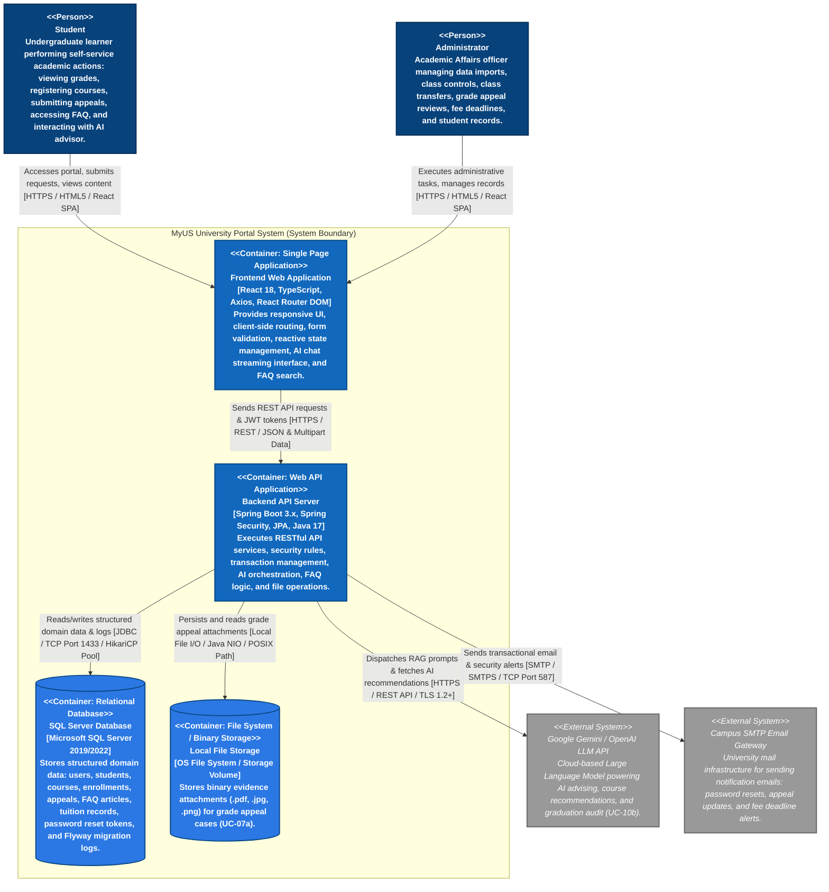

# Section C: Software Architecture - Container & Component Diagrams

---

## 1. C4 Model - Level 2: Container Diagram
**Performed by:** Trần Tường Vi | **Reviewed by:** Hoàng Trung Kiên | **Edited by:** Trần Tường Vi

### 1.1. Introduction & Container Boundary Overview

The **C4 Model Level 2 (Container Diagram)** zooms in on the single black-box system boundary established in Level 1 (System Context Diagram). While Level 1 illustrates how human actors and external software platforms interact with the **MyUS University Portal System** as a whole, Level 2 expands the internal architecture to reveal the high-level deployable units and executable containers that constitute the application suite.

The container topology of the **MyUS University Portal System** is structured into four primary internal containers:
1. **Frontend Web Application (React 18 SPA):** The client-side Single Page Application running within the user's web browser. It delivers responsive, interactive user interfaces for Student Self-Service and Administrative Governance workflows.
2. **Backend API Server (Spring Boot 3.x REST API):** The stateless core business logic engine, security gateway, transaction orchestrator, and external integration hub that processes client requests and enforces enterprise rules.
3. **Relational Database (Microsoft SQL Server):** The primary relational system of record storing all structured domain data, including user credentials, student profiles, course offerings, enrollment records, grade appeal cases, FAQ articles, tuition data, and system audit logs.
4. **Local File Storage System:** A dedicated binary object storage container responsible for persisting physical evidentiary attachments (`.pdf`, `.jpg`, `.png`) submitted during grade appeal workflows (**UC-07a**).

The Container Diagram also documents the precise communication protocols (HTTPS/REST, JDBC, SMTP, Local File I/O) used across internal container boundaries and with external software integrations (**Google Gemini LLM API** and **Campus SMTP Email Gateway**).

---

### 1.2. C4 Level 2 Container Diagram (Mermaid)

---

### 1.3. Detailed Container Specifications

#### A. Frontend Web Application (React 18 SPA)

* **a) Primary Responsibility & Services Provided:**
  * Serves as the interactive Single Page Application (SPA) client executing entirely within the end-user's web browser.
  * Renders dynamic user interface views tailored to role-specific capabilities (Student Self-Service vs. Administrative Governance).
  * Manages client-side routing using `react-router-dom`, enforcing Role-Based Access Control (RBAC) through protected route wrappers to block unauthorized access to administrative modules.
  * Handles interactive client state using React custom hooks and Context API for course registration (**UC-03**), semester grade filtering (**UC-05**), real-time AI counseling sessions (**UC-10b**), and FAQ browsing (**UC-10a**).
  * Performs client-side form construction and runtime schema validation using `react-hook-form` and `zod` to validate user input before network transmission.
  * Manages asynchronous HTTP communications with the backend using `axios`, incorporating global request interceptors for automatic JWT Bearer header injection and response interceptors for centralized authentication failure handling.
  * Provides drag-and-drop file upload interface with format and size verification for supporting document submission in grade appeals (**UC-07a**).
  * Renders real-time streaming AI chat responses with Markdown formatting via `askGeminiStream` and falls back to `localChatbotService.ts` if the Gemini API is unavailable (**UC-10b AF2**).
  * Provides searchable, category-filtered FAQ interface with feedback rating (**UC-10a**).

* **b) Technology Stack & Framework Justification:**
  * **React 18.3:** Provides a declarative, component-driven UI architecture with efficient Virtual DOM reconciliation, enabling smooth state updates without page refreshes.
  * **TypeScript 5.4:** Guarantees strict compile-time type safety across DTO interfaces, API response structures, and component props, preventing runtime errors and maintaining exact contract synchronization with backend APIs.
  * **React Router DOM 6.23:** Delivers declarative SPA client routing, code-splitting capabilities, and navigation guard integration for 14 defined application routes.
  * **Axios 1.7:** Provides a robust HTTP client supporting request/response interceptors, request cancellation, and multi-part upload handling.
  * **React Hot Toast:** Provides non-blocking toast notification system for success/error feedback throughout the application.
  * **Plain CSS with BEM Convention:** Enables modular, responsive styling adhering to multi-device viewport breakpoints without requiring third-party CSS framework dependencies.

* **c) Inter-Container Communication Protocols:**
  * **Target Container:** Backend API Server.
  * **Protocol:** HTTPS (HTTP/1.1 or HTTP/2 over TLS 1.2+ encryption).
  * **Data Payload Format:** Standard API calls transmit structured JSON (`application/json`). Supporting evidence file uploads use `multipart/form-data`.
  * **Authentication Transport:** Stateless HTTP Bearer authentication header (`Authorization: Bearer <JWT_TOKEN>`).

---

#### B. Backend API Server (Spring Boot 3.x REST API)

* **a) Primary Responsibility & Services Provided:**
  * Serves as the core business logic engine, security gateway, and API server for all university portal operations.
  * Enforces stateless authentication and method-level Role-Based Access Control (RBAC) using Spring Security 6, custom `JwtAuthenticationFilter`, and `@PreAuthorize` security annotations.
  * Validates incoming REST API request payloads via Jakarta Bean Validation (`@Valid`, `@NotNull`, `@Size`, `@Pattern`) before invoking business services.
  * Executes core academic domain logic, including prerequisite/corequisite validation algorithms (**UC-03a**), dual 10-point and 4-point GPA calculations (**UC-05**), and grade appeal state machine transitions (**UC-07**, **UC-12b**).
  * Manages transactional ACID boundaries across database operations using `@Transactional` annotations to prevent partial data writes during high-concurrency operations.
  * Coordinates binary document storage operations through `FileStorageService` to validate, store, and stream grade appeal evidence files (**UC-07a**).
  * Handles global error handling through a `@ControllerAdvice` middleware, transforming unexpected exceptions into standardized JSON error responses (**NFR ID14**).
  * Acts as an integration adapter, constructing RAG context prompts for the Google Gemini LLM API (`ChatbotController`) and generating transactional email notifications via JavaMailSender.
  * Implements the complete FAQ knowledge base service: category listing, keyword search, popular entries, individual article retrieval, and feedback submission (**UC-10a**).
  * Manages 6-digit password reset token lifecycle: generation, validation, and expiry enforcement (**UC-01 AF2**).

* **b) Technology Stack & Framework Justification:**
  * **Spring Boot 3.2.5 (Java 17):** Provides an enterprise-grade Java web framework with embedded Tomcat runtime, dependency injection, and comprehensive ecosystem support.
  * **Spring Security 6 & JJWT 0.12.5:** Enforces industry-standard authentication, BCrypt password hashing (10 work factor rounds), and stateless JWT generation/verification.
  * **Spring Data JPA & Hibernate ORM:** Simplifies relational database persistence, offering repository abstraction, connection pooling, and object-relational mapping while preventing SQL injection.
  * **MapStruct 1.5.5 & Lombok:** Automatically generates compile-time DTO-to-Entity mapper code, reducing boilerplate code and increasing maintainability.
  * **Flyway Core & Flyway SQL Server:** Executes version-controlled, repeatable database schema migrations (`V1__...sql`) during application startup.
  * **Spring Boot Actuator:** Exposes monitoring endpoints for application health checking and runtime metrics.

* **c) Inter-Container Communication Protocols:**
  * **Inbound (from Frontend Web App):** HTTPS REST API listening on Port 8080 (development) / Port 443 (production).
  * **Outbound (to Relational Database):** Synchronous JDBC protocol over TCP/IP Port 1433, managed by HikariCP Connection Pool.
  * **Outbound (to Local File Storage):** Direct POSIX / Java NIO FileSystem calls (`java.nio.file.Files`) accessing dedicated host directory `/uploads/appeals/`.
  * **Outbound (to Google Gemini API):** HTTPS REST API calls (TLS 1.2+) over Port 443 for AI chat, recommendations, and graduation progress.
  * **Outbound (to Campus SMTP Gateway):** SMTP / SMTPS protocol over TCP Port 587 using Spring `JavaMailSender`.

---

#### C. Relational Database (Microsoft SQL Server 2019/2022)

* **a) Primary Responsibility & Services Provided:**
  * Functions as the central System of Record (SSOT) for all persistent, structured domain entities within the MyUS ecosystem.
  * Maintains relational tables including `users`, `students`, `administrators`, `courses`, `course_offerings`, `course_registrations`, `grades`, `grade_appeals`, `appeal_attachments`, `tuition_accounts`, `tuition_payments`, `faq_articles`, `exam_schedules`, `password_reset_tokens`, and system `audit_logs`.
  * Enforces referential integrity using primary key / foreign key relationships, cascade constraints, unique indexes, and check constraints.
  * Guarantees ACID compliance (Atomicity, Consistency, Isolation, Durability) for concurrent database transactions, such as seat reservation locks during course registration.
  * Records database schema evolution history through Flyway tracking tables (`flyway_schema_history`).
  * Maintains optimized indices on high-frequency search fields (student IDs, course codes, semester IDs, appeal statuses, FAQ categories) to maintain low query latency (**NFR ID05**).

* **b) Technology Stack & Framework Justification:**
  * **Microsoft SQL Server 2019/2022:** Chosen for its enterprise robustness, advanced indexing engine, strong ACID transaction guarantees, and institutional compatibility with university infrastructure.
  * **Flyway Database Migration Scripts:** Managed via SQL scripts in `src/main/resources/db/migration/` to guarantee identical schema state across development, testing, and production environments.

* **c) Inter-Container Communication Protocols:**
  * **Target Container:** Backend API Server.
  * **Protocol:** Synchronous JDBC (Java Database Connectivity) via Microsoft SQL Server JDBC Driver (`com.microsoft.sqlserver:mssql-jdbc`).
  * **Network Transport:** TCP/IP over Port 1433.
  * **Connection Management:** HikariCP connection pool with configurable min/max connection bounds, leak detection, and parameterized query execution to block SQL injection attacks.

---

#### D. Local File Storage Container (Binary Storage System)

* **a) Primary Responsibility & Services Provided:**
  * Operates as a dedicated binary file repository for persisting non-relational attachments uploaded during Grade Appeal submissions (**UC-07a**).
  * Stores supporting evidentiary documents (`.pdf`, `.jpg`, `.png`, up to 5 MB per file, maximum 5 files) within isolated server storage directories.
  * Executes file type verification, file size enforcement, and UUID-based file renaming to prevent file name collisions and directory traversal security attacks.
  * Provides binary file stream retrieval for authorized administrators reviewing appeals (**UC-12**) and students checking appeal status (**UC-08**).

* **b) Technology Stack & Framework Justification:**
  * **OS File System / Storage Volume:** Native file system storage directory managed through Spring Boot's `FileStorageService` bean.
  * **Architectural Justification:** Separating binary storage from the relational database avoids database BLOB bloat, improves database backup speeds, reduces memory usage during JPA queries, and enhances overall database query throughput.

* **c) Inter-Container Communication Protocols:**
  * **Target Container:** Backend API Server.
  * **Protocol:** Direct local file I/O operations via Java NIO (`java.nio.file.Path`, `java.nio.file.Files`).
  * **Storage Interface:** Synchronous file creation, reading, and deletion triggered by REST API file controller endpoints. Relational metadata (relative storage path, original filename, file size, MIME type, upload timestamp) is persisted in SQL Server, while raw binary files reside on disk.

---
## 2. C4 Model - Level 3: Component Diagrams
**Performed by:** Dương Minh Huỳnh Khôi | **Reviewed by:** Hoàng Trung Kiên | **Edited by:** Dương Minh Huỳnh Khôi

### 2.1. Introduction to Level 3 Component Diagrams

The **C4 Model Level 3 (Component Diagram)** zooms into the two primary containers identified in the Level 2 Container Diagram — the **Backend API Server (Spring Boot 3.x)** and the **Frontend Web Application (React 18 SPA)** — to reveal their internal component composition, responsibilities, and inter-component relationships.

While Level 2 illustrates how containers communicate across the system boundary, Level 3 exposes the internal modular structure of each container. This decomposition maps directly to the source code package structure, ensuring architectural documentation remains consistent with the actual implementation as required by the PA4 grading criteria.

The component topology for each container is organized as follows:

| Container | Architectural Style | Key Structural Layers |
|-----------|---------------------|-----------------------|
| **Backend API Server** | Layered Architecture (Controller → Service → Repository) | REST Controllers, Business Services, AI Services, Data Repositories, Security Infrastructure, Cross-Cutting Config & Exception Handling |
| **Frontend Web Application** | Component-Based SPA with Context API | Route-Level Pages, Shared UI Components, Chatbot Components, Appeal Components, Auth Module, API Service Layer, Utility Modules |

---

### 2.2. Backend API Server — Level 3 Component Diagram

The Backend API Server is structured as a **Layered Architecture** with four primary layers and two cross-cutting concern groups. The component diagram below reflects the actual package structure at `backend/src/main/java/com/myus/`.

#### 2.2.1. Component Diagram (Mermaid)

```mermaid
flowchart TB
    classDef controller fill:#1168bd,stroke:#0b4884,stroke-width:2px,color:#fff,font-weight:bold
    classDef service fill:#438dcc,stroke:#0b4884,stroke-width:2px,color:#fff,font-weight:bold
    classDef aiservice fill:#7b4bbf,stroke:#4a2870,stroke-width:2px,color:#fff,font-weight:bold
    classDef repository fill:#2b78e4,stroke:#0b4884,stroke-width:2px,color:#fff,font-weight:bold
    classDef security fill:#6c3a9e,stroke:#4a2870,stroke-width:2px,color:#fff,font-weight:bold
    classDef config fill:#7a9e3a,stroke:#5a7a2a,stroke-width:2px,color:#fff,font-weight:bold
    classDef exception fill:#c93a3a,stroke:#8b2020,stroke-width:2px,color:#fff,font-weight:bold
    classDef external fill:#999,stroke:#666,stroke-width:2px,color:#fff,font-style:italic

    subgraph ControllerLayer["REST CONTROLLER LAYER"]
        direction TB
        AuthCtrl["AuthController | POST /api/auth/login<br>POST /api/auth/forgot-password<br>POST /api/auth/reset-password | Auth & password reset"]:::controller
        CourseCtrl["CourseController | GET /api/courses<br>GET /api/courses/:id | Course catalog browsing"]:::controller
        EnrollmentCtrl["EnrollmentController | POST+GET /api/registrations<br>PUT /api/registrations/:id/drop<br>POST /api/admin/transfers | Enrollment & admin transfers"]:::controller
        GradeCtrl["GradeController | GET /api/v1/grades/me | Student grade retrieval"]:::controller
        FinanceCtrl["FinanceController | GET /api/v1/finance/tuition/balance | Tuition balance and payments"]:::controller
        ProfileCtrl["ProfileController | GET+PUT /api/v1/profile | Student profile view and update"]:::controller
        AppealCtrl["AppealController | POST /api/appeals<br>GET /api/appeals/me<br>GET /api/appeals/me/:id<br>PUT /api/appeals/:id/withdraw | Student appeal operations"]:::controller
        AppealAdminCtrl["AppealAdminController | GET /api/admin/appeals<br>GET /api/admin/appeals/:id<br>PUT /api/admin/appeals/:id/review<br>PUT /api/admin/appeals/:id/fee-deadline | Admin appeal processing"]:::controller
        FaqCtrl["FaqController | GET /api/faq<br>GET /api/faq/categories<br>GET /api/faq/popular<br>GET /api/faq/:id<br>POST /api/faq/:id/feedback | FAQ library"]:::controller
        ChatbotCtrl["ChatbotController | POST /api/v1/chatbot/chat<br>GET /api/v1/chatbot/recommendations<br>GET /api/v1/chatbot/progress | AI academic advisor"]:::controller
    end

    subgraph ServiceLayer["SERVICE LAYER"]
        direction TB
        CourseSvc["CourseService | browseCourses(), getOfferingById() | Paginated catalog with filters"]:::service
        EnrollmentSvc["EnrollmentService | registerCourse(), getMyRegistrations(), dropRegistration(), transferStudents() | Enrollment lifecycle & admin class transfers"]:::service
        GradeSvc["GradeService | getMyGrades() | GPA 10-point and 4-point scale calculation"]:::service
        FinanceSvc["FinanceService | getTuitionBalance(), getPaymentHistory() | Financial aggregation"]:::service
        ProfileSvc["ProfileService | getProfile(), updateProfile() | Profile CRUD with partial update"]:::service
        AppealSvc["AppealService | submit, list, detail, withdraw, review, setFeeDeadline | State machine + deadline logic"]:::service
        FaqSvc["FaqService | search(), getCategories(), getPopular(), getById(), submitFeedback() | FAQ knowledge base"]:::service
        TimetableSvc["TimetableService | getTimetable() | Schedule mapping for grid and list views"]:::service
    end

    subgraph AIServiceLayer["AI SERVICE LAYER"]
        direction TB
        ChatbotAI["ChatbotService | processChat() | Routes chat to Gemini or fallback"]:::aiservice
        RecommendAI["CourseRecommendationService | recommendCourses() | Next-semester course suggestions"]:::aiservice
        GradTrackAI["GraduationTrackingService | projectGraduation() | Degree audit & timeline simulation"]:::aiservice
        ProfileAI["ProfileAnalysisService | analyzeProfile() | Student context extraction for RAG"]:::aiservice
    end

    subgraph RepositoryLayer["REPOSITORY LAYER"]
        direction TB
        StudentRepo["StudentRepository | findByUsername(), existsByUsername()"]:::repository
        AdminRepo["AdministratorRepository | findByUsername()"]:::repository
        CourseRepo["CourseRepository | findByDepartment(), searchByKeyword()"]:::repository
        CourseOffRepo["CourseOfferingRepository | findByTerm(), search with custom @Query"]:::repository
        RegRepo["CourseRegistrationRepository | findByStudentUsername(), countActiveByOffering()"]:::repository
        GradeRepo["GradeRepository | findByStudentUsername(), findByStudentUsernameAndTerm()"]:::repository
        AppealRepo["AppealRepository | findByStudentUsername(), findByStatus(), countByStatus()"]:::repository
        TuitionAccRepo["TuitionAccountRepository | findByStudentUsername(), findByStudentUsernameAndTerm()"]:::repository
        TuitionPayRepo["TuitionPaymentRepository | findByAccountId()"]:::repository
        FaqRepo["FaqRepository | findByCategory(), searchByKeyword(), findTopByOrderByHelpfulCountDesc()"]:::repository
        ExamRepo["ExamScheduleRepository | findByStudentUsername()"]:::repository
        PwdResetRepo["PasswordResetTokenRepository | findByToken(), findByStudentAndUsed()"]:::repository
    end

    subgraph SecurityLayer["SECURITY INFRASTRUCTURE"]
        direction TB
        SecConfig["SecurityConfig | Filter chain: stateless, CSRF disabled, method security"]:::security
        JwtProvider["JwtTokenProvider | JWT generation, validation, claim extraction"]:::security
        JwtFilter["JwtAuthenticationFilter | Extracts Bearer token, sets SecurityContext"]:::security
        JwtEntry["JwtAuthenticationEntryPoint | Returns structured 401 JSON response"]:::security
        UserDetailsSvc["UserDetailsServiceImpl | Loads Student or Administrator by username"]:::security
        IsStudentAnn["@IsStudent / @IsAdministrator | Custom method-security meta-annotations"]:::security
    end

    subgraph ConfigLayer["CONFIGURATION"]
        direction TB
        CorsCfg["CorsConfig | Global CORS policy for frontend origin"]:::config
        JwtProps["JwtProperties | Binds jwt.secret and jwt.expiration-ms"]:::config
        DevInit["DevDataInitializer | Seeds admin and student users on dev startup"]:::config
    end

    subgraph ExceptionLayer["EXCEPTION HANDLING"]
        direction TB
        GlobalEx["GlobalExceptionHandler | @RestControllerAdvice: handles 400, 404, 409, 500"]:::exception
        ApiErr["ApiError | Standard error DTO: timestamp, status, message, path"]:::exception
    end

    Database[("SQL Server Database | myus schema | 15 tables")]:::external
    FileStore[("Local File Storage | Grade appeal evidence documents")]:::external
    GeminiAPI["Google Gemini LLM API | Cloud AI service"]:::external

    CourseCtrl --> CourseSvc
    EnrollmentCtrl --> EnrollmentSvc
    GradeCtrl --> GradeSvc
    FinanceCtrl --> FinanceSvc
    ProfileCtrl --> ProfileSvc
    AppealCtrl --> AppealSvc
    AppealAdminCtrl --> AppealSvc
    FaqCtrl --> FaqSvc
    ChatbotCtrl --> ChatbotAI
    ChatbotCtrl --> RecommendAI
    ChatbotCtrl --> GradTrackAI

    ChatbotAI --> ProfileAI
    ChatbotAI --> RecommendAI
    RecommendAI --> GradeRepo
    RecommendAI --> RegRepo
    GradTrackAI --> GradeRepo
    GradTrackAI --> StudentRepo
    ProfileAI --> StudentRepo

    CourseSvc --> CourseOffRepo
    CourseSvc --> RegRepo
    EnrollmentSvc --> RegRepo
    EnrollmentSvc --> CourseOffRepo
    EnrollmentSvc --> StudentRepo
    GradeSvc --> GradeRepo
    GradeSvc --> StudentRepo
    FinanceSvc --> TuitionAccRepo
    FinanceSvc --> TuitionPayRepo
    FinanceSvc --> StudentRepo
    ProfileSvc --> StudentRepo
    AppealSvc --> AppealRepo
    AppealSvc --> GradeRepo
    AppealSvc --> StudentRepo
    AppealSvc --> AdminRepo
    FaqSvc --> FaqRepo
    TimetableSvc --> RegRepo
    TimetableSvc --> ExamRepo

    StudentRepo -.-> Database
    AdminRepo -.-> Database
    CourseRepo -.-> Database
    CourseOffRepo -.-> Database
    RegRepo -.-> Database
    GradeRepo -.-> Database
    AppealRepo -.-> Database
    TuitionAccRepo -.-> Database
    TuitionPayRepo -.-> Database
    FaqRepo -.-> Database
    ExamRepo -.-> Database
    PwdResetRepo -.-> Database

    AuthCtrl --> PwdResetRepo
    AuthCtrl --> JwtProvider
    AuthCtrl -.-> SecConfig
    SecConfig --> JwtFilter
    SecConfig --> JwtEntry
    SecConfig --> UserDetailsSvc
    JwtFilter --> JwtProvider
    JwtFilter -.-> AuthCtrl
    UserDetailsSvc --> StudentRepo
    UserDetailsSvc --> AdminRepo

    ChatbotAI -.-> GeminiAPI
    AppealSvc -.-> FileStore

    GlobalEx -.-> AuthCtrl
    GlobalEx -.-> CourseSvc
    CorsCfg -.-> SecConfig
    JwtProps -.-> JwtProvider
```

#### 2.2.2. Detailed Component Descriptions — Backend

---

##### A. Controller Layer (Presentation)

The Controller Layer is the entry point for all HTTP requests. Each controller is annotated with `@RestController` and `@RequestMapping`, defining the API contract. Controllers are **thin**: they validate input via Jakarta Bean Validation (`@Valid`), extract the authenticated principal from the security context, delegate business logic to services, and return HTTP `ResponseEntity` objects wrapped around DTOs.

| Component | Base Path | Role | Auth Mechanism | Depends On |
|-----------|-----------|------|----------------|------------|
| **AuthController** | `/api/auth` | Authenticates users via Spring Security's `AuthenticationManager`, generates JWT tokens, returns `AuthResponse` with user info. Manages forgot-password (`POST /forgot-password`) and reset-password (`POST /reset-password`) workflows with 6-digit verification codes (**UC-01 AF2**). | Public (`POST /login`, `/forgot-password`, `/reset-password`) | `AuthenticationManager`, `JwtTokenProvider`, `PasswordResetTokenRepository` |
| **CourseController** | `/api/courses` | Provides paginated course catalog browsing with optional search, department, and term filters (**UC-03**). | `@PreAuthorize("isAuthenticated()")` | `CourseService` |
| **EnrollmentController** | `/api/registrations`, `/api/admin/transfers` | Manages the student course registration lifecycle (register, drop) and administrator-facing bulk class transfers (**UC-03**, **UC-03a**, **UC-14**). | `@IsStudent`, `@IsAdministrator` | `EnrollmentService` |
| **GradeController** | `/api/v1/grades` | Retrieves the authenticated student's grades with GPA computation (10-point and 4-point scales) (**UC-05**). | `@IsStudent` | `GradeService` |
| **FinanceController** | `/api/v1/finance` | Retrieves tuition balance summary and paginated payment history per term (**UC-06**). | `@PreAuthorize("hasRole('STUDENT')")` | `FinanceService` |
| **ProfileController** | `/api/v1/profile` | Views and partially updates student profile fields (phone, address) while preserving locked academic fields (**UC-02**). | `@PreAuthorize("hasRole('STUDENT')")` | `ProfileService` |
| **AppealController** | `/api/appeals` | Student-facing grade appeal operations: submit new appeal with evidence, list my appeals, view detail, withdraw pending appeal (**UC-07**, **UC-07a**, **UC-08**). | `@IsStudent` | `AppealService` |
| **AppealAdminController** | `/api/admin/appeals` | Administrator-facing appeal processing: list all appeals with status filter, view detail, review and update status, set fee payment deadline (**UC-12**, **UC-12a**, **UC-12b**). | `@IsAdministrator` | `AppealService` |
| **FaqController** | `/api/faq` | Provides the centralized FAQ knowledge base: category listing, keyword+category search, popular entries, individual article retrieval, and feedback submission (**UC-10a**). | `@PreAuthorize("isAuthenticated()")` | `FaqService` |
| **ChatbotController** | `/api/v1/chatbot` | AI Learning Assistant endpoints: natural-language chat processing, course recommendations for next semester, and graduation progress/degree audit (**UC-10b**). | `@PreAuthorize("hasRole('STUDENT')")` | `ChatbotService`, `CourseRecommendationService`, `GraduationTrackingService` |

**Architectural Notes:**
- API versioning is currently partially inconsistent: `/api/` prefix for courses, registrations, appeals, and FAQ; `/api/v1/` prefix for grades, profile, finance, and chatbot.
- Authorization uses a mix of `@PreAuthorize` with SpEL and custom `@IsStudent`/`@IsAdministrator` meta-annotations — both approaches are functionally equivalent.

---

##### B. Service Layer (Business Logic)

The Service Layer encapsulates all business rules, domain logic, and transaction management. Each service follows the **Interface + Implementation** pattern (`XxxService` interface with `XxxServiceImpl` class), enabling mock-based unit testing. Write operations are guarded by `@Transactional` to ensure ACID compliance.

| Component | Key Methods | Business Responsibilities | Depends On |
|-----------|-------------|---------------------------|------------|
| **CourseService** | `browseCourses(page, size, search, department, term)`, `getOfferingById(id)` | Paginated catalog queries with dynamic filters; uses JOIN FETCH on `CourseOfferingRepository`; counts active enrollments via `CourseRegistrationRepository`. Maps `CourseOffering` entities to `CourseOfferingResponse` DTOs. | `CourseOfferingRepository`, `CourseRegistrationRepository` |
| **EnrollmentService** | `registerCourse(username, request)`, `getMyRegistrations(username)`, `dropRegistration(username, id)`, `transferStudents(sourceId, targetId, studentIds)` | Validates seat availability, prerequisite eligibility (**UC-03a**), credit limit (max 24 per term), and schedule conflict detection; manages `Enrolled` → `Dropped` transitions; updates available seat counts; processes transaction-safe admin class transfers (**UC-14**). | `CourseRegistrationRepository`, `CourseOfferingRepository`, `StudentRepository` |
| **GradeService** | `getMyGrades(username)` | Retrieves all grade records for a student; computes cumulative GPA on both 10-point and 4-point scales; groups grades by academic term. | `GradeRepository`, `StudentRepository` |
| **FinanceService** | `getTuitionBalance(username)`, `getPaymentHistory(username)` | Computes current tuition balance (charges − payments − scholarships); checks financial hold status; retrieves chronological payment transaction history. | `TuitionAccountRepository`, `TuitionPaymentRepository`, `StudentRepository` |
| **ProfileService** | `getProfile(username)`, `updateProfile(username, request)` | Retrieves full student profile including personal info, major, enrollment status; performs partial updates on allowed fields (phone, address) while preserving immutable academic fields. | `StudentRepository` |
| **AppealService** | `submitAppeal(username, request)`, `getMyAppeals(username)`, `getAppealById(username, id)`, `withdrawAppeal(username, id)`, `getAllAppeals(status)`, `getAppealByIdAdmin(id)`, `reviewAppeal(id, adminUsername, request)`, `setFeeDeadline(id, adminUsername, request)` | Implements the full grade appeal state machine (`Submitted` → `Under Review` → `Approved`/`Denied`, or `Withdrawn`); calculates fee payment deadline (+5 business days); enforces duplicate appeal detection; supports file evidence attachment metadata tracking; provides both student-scoped and admin-scoped queries. | `AppealRepository`, `GradeRepository`, `StudentRepository`, `AdministratorRepository` |
| **FaqService** | `search(search, category, page, size)`, `getCategories()`, `getPopular(limit)`, `getById(id)`, `submitFeedback(id, helpful)` | Full FAQ knowledge base operations: category listing, paginated keyword+category search, popular entries ranked by helpfulness, individual article detail, and helpful/not-helpful feedback recording. | `FaqRepository` |
| **TimetableService** | `getTimetable(username, term)` | Retrieves student course registrations and maps them to weekly schedule grid slots (Monday–Saturday, Slots 1–6: 07:00–18:00); formats schedule data for both Grid View and List View (**UC-04**). | `CourseRegistrationRepository`, `ExamScheduleRepository` |

---

##### C. AI Service Layer (AI Orchestration)

The AI Service Layer provides specialized academic intelligence components that integrate with the Google Gemini LLM API. These services construct structured RAG prompts from academic data and process responses for delivery to students via `ChatbotController`.

| Component | Key Methods | Business Responsibilities | Depends On |
|-----------|-------------|---------------------------|------------|
| **ChatbotService** | `processChat(student, request)` | Routes natural-language academic queries to the Gemini API with full conversation history and academic context; enforces academic scope guardrails; falls back to `localChatbotService.ts` pattern when Gemini is unavailable (**UC-10b AF2**). | `ProfileAnalysisService`, `CourseRecommendationService` |
| **CourseRecommendationService** | `recommendCourses(student)` | Analyzes student transcript (completed courses, credits, GPA) and curriculum requirements to generate personalized next-semester course recommendations with prerequisite validation results (**UC-10b AF3**). | `GradeRepository`, `CourseRegistrationRepository` |
| **GraduationTrackingService** | `projectGraduation(student, creditsPerTerm)` | Audits remaining credit requirements against completed transcript; calculates estimated graduation timeline assuming a configurable credits-per-term loading rate (**UC-10b AF4**). | `GradeRepository`, `StudentRepository` |
| **ProfileAnalysisService** | `analyzeProfile(student)` | Extracts and formats student academic context (major, student type, current cumulative GPA, enrolled courses) into structured DTO payloads for Gemini RAG prompt construction (**UC-10b**). | `StudentRepository` |

---

##### D. Repository Layer (Data Access)

Each repository is a Spring Data JPA interface extending `JpaRepository<T, ID>`, providing standard CRUD operations plus custom query methods. The repositories abstract all SQL interactions behind Java method calls, supporting HikariCP connection pooling and parameterized queries to prevent SQL injection.

| Repository | Primary Entity | Key Custom Queries |
|------------|---------------|-------------------|
| **StudentRepository** | `Student` | `findByUsername(String)`, `existsByUsername(String)` |
| **AdministratorRepository** | `Administrator` | `findByUsername(String)` |
| **CourseRepository** | `Course` | `findByDepartment(String)`, custom search by keyword |
| **CourseOfferingRepository** | `CourseOffering` | `findByTerm(String)`, `findByDepartment(String)`, `@Query` with dynamic search/filter predicates |
| **CourseRegistrationRepository** | `CourseRegistration` | `findByStudentUsername(String)`, `findByOfferingId(Long)`, `countByOfferingId(Long)` for seat capacity checks |
| **GradeRepository** | `Grade` | `findByStudentUsername(String)`, `findByStudentUsernameAndTerm(String, String)` |
| **AppealRepository** | `Appeal` | `findByStudentUsername(String)`, `findByStatus(String)`, `countByStatus(String)` for admin dashboard metrics |
| **TuitionAccountRepository** | `TuitionAccount` | `findByStudentUsername(String)`, `findByStudentUsernameAndTerm(String, String)` |
| **TuitionPaymentRepository** | `TuitionPayment` | `findByAccountId(Long)` ordered by payment date descending |
| **FaqRepository** | `FaqArticle` | `findByCategory(String)`, keyword search via `@Query`, `findTopNByOrderByHelpfulCountDesc()` for popular entries |
| **ExamScheduleRepository** | `ExamSchedule` | `findByStudentUsername(String)` for timetable exam slot integration |
| **PasswordResetTokenRepository** | `PasswordResetToken` | `findByToken(String)`, `findByStudentAndUsed(Student, boolean)` for reset token lifecycle management |

---

##### E. Security Infrastructure (Cross-Cutting)

The Security Infrastructure implements **stateless JWT-based authentication** with role-based access control. The filter chain processes every HTTP request before it reaches the controller layer.

| Component | Type | Responsibility |
|-----------|------|----------------|
| **SecurityConfig** | `@Configuration` | Defines the Spring Security filter chain: disables CSRF (stateless API), sets session management to `STATELESS`, configures CORS via `CorsConfigurationSource`, registers `JwtAuthenticationFilter` before `UsernamePasswordAuthenticationFilter`, enables method-level security (`@EnableMethodSecurity`). |
| **JwtTokenProvider** | `@Component` | Generates signed JWT access tokens with embedded roles claim; validates token signature, expiry, and structure; extracts username and roles from validated tokens. Configured via `JwtProperties`. |
| **JwtAuthenticationFilter** | `OncePerRequestFilter` | Intercepts every HTTP request; extracts the `Bearer` token from the `Authorization` header; validates it via `JwtTokenProvider`; if valid, builds a `UsernamePasswordAuthenticationToken` and sets it in the `SecurityContextHolder`. |
| **JwtAuthenticationEntryPoint** | `AuthenticationEntryPoint` | Returns a structured JSON `ApiError` response (HTTP 401) when an unauthenticated request reaches a protected endpoint, instead of the default servlet container error page. |
| **UserDetailsServiceImpl** | `UserDetailsService` | Loads user details during authentication by looking up the username in both `StudentRepository` and `AdministratorRepository`; returns the matching entity (which implements `UserDetails`). |
| **@IsStudent** | Custom Annotation | Meta-annotation combining `@PreAuthorize("hasRole('STUDENT')")` for cleaner controller code. |
| **@IsAdministrator** | Custom Annotation | Meta-annotation combining `@PreAuthorize("hasRole('ADMINISTRATOR')")` for cleaner controller code. |

**Authentication Flow:**
1. `POST /api/auth/login` → `AuthController` authenticates via `AuthenticationManager` → `UserDetailsServiceImpl` loads user → `JwtTokenProvider` generates token → client stores token in `localStorage`.
2. Subsequent requests: `JwtAuthenticationFilter` extracts token → validates → sets `SecurityContext` → controller processes request with `Principal` available.
3. Authorization: `@IsStudent` / `@IsAdministrator` / `@PreAuthorize` annotations enforce role checks at the method level.
4. Forgot Password: `POST /api/auth/forgot-password` → generates `PasswordResetToken` (6-digit code, 15 min TTL) → returns masked email. `POST /api/auth/reset-password` → validates token → updates BCrypt-hashed password → marks token used.

---

##### F. Configuration & Exception Handling (Cross-Cutting)

| Component | Type | Responsibility |
|-----------|------|----------------|
| **CorsConfig** | `@Configuration` | Defines a `CorsConfigurationSource` bean allowing cross-origin requests from the React frontend (`http://localhost:3000`), supporting common HTTP methods and the `Authorization` header. |
| **JwtProperties** | `@ConfigurationProperties` | Binds `jwt.secret` and `jwt.expiration-ms` from `application.properties` into a typed configuration object. |
| **DevDataInitializer** | `@Component` (dev profile) | Seeds the database with demo users on application startup when the `dev` profile is active. |
| **GlobalExceptionHandler** | `@RestControllerAdvice` | Centralized exception-to-JSON mapping. Handles: `MethodArgumentNotValidException` (400 with field-level details), `ResourceNotFoundException` (404), `AppealException` (409), `EnrollmentException` (409), `ConstraintViolationException` (400), and generic `Exception` (500). |
| **ApiError** | POJO | Standardized error response structure: `timestamp` (Instant), `status` (int), `error` (String), `message` (String), `path` (String), plus optional `fieldErrors` list for validation failures. |

---

### 2.3. Frontend Web Application — Level 3 Component Diagram

The Frontend Web Application is structured as a **Component-Based Single Page Application (SPA)** using React 18 with TypeScript. It follows a modular architecture with route-level pages, shared UI components, specialized chatbot and appeal components, a centralized auth module, and a service-based API communication layer.

#### 2.3.1. Component Diagram (Mermaid)

```mermaid
flowchart TB
    classDef app fill:#08427b,stroke:#052e56,stroke-width:3px,color:#fff,font-weight:bold
    classDef page fill:#1168bd,stroke:#0b4884,stroke-width:2px,color:#fff,font-weight:bold
    classDef component fill:#438dcc,stroke:#0b4884,stroke-width:2px,color:#fff,font-weight:bold
    classDef auth fill:#6c3a9e,stroke:#4a2870,stroke-width:2px,color:#fff,font-weight:bold
    classDef service fill:#2b78e4,stroke:#0b4884,stroke-width:2px,color:#fff,font-weight:bold
    classDef util fill:#7a9e3a,stroke:#5a7a2a,stroke-width:2px,color:#fff,font-weight:bold
    classDef external fill:#999,stroke:#666,stroke-width:2px,color:#fff,font-style:italic

    subgraph AppShell["APP SHELL AND ROUTING"]
        direction TB
        AppEntry["App.tsx | BrowserRouter + AuthProvider + ThemeProvider + ChatbotProvider + Toaster + Suspense | 14 lazy-loaded routes"]:::app
        IndexEntry["index.tsx | ReactDOM.createRoot entry point"]:::app
        GlobalCSS["index.css | CSS custom properties, reset, typography scale, utility classes"]:::app
    end

    subgraph AuthModule["AUTH MODULE"]
        direction TB
        AuthProvider["AuthProvider / useAuth | React Context: user, isLoggedIn, setUser, logout | Rehydrates from localStorage"]:::auth
        ProtectedRoute["ProtectedRoute | Route guard: checks isLoggedIn and optional requiredRole | Redirects to /login or /dashboard | Shows UnauthorizedScreen on role mismatch"]:::auth
        AuthServiceComp["authService | login() via POST /api/auth/login | logout() clears localStorage"]:::auth
        UnauthorizedScr["UnauthorizedScreen | Displays role-based access denied message with back navigation"]:::auth
    end

    subgraph PagesLayer["PAGE COMPONENTS"]
        direction TB
        LoginPg["LoginPage | react-hook-form + zod validation | Route: /login (Public)"]:::page
        ForgotPwdPg["ForgotPasswordPage | 2-step: enter student ID, then enter 6-digit code + new password | Route: /forgot-password (Public)"]:::page
        DashboardPg["DashboardPage | Role-based quick-access grid | Route: / (Protected)"]:::page
        ProfilePg["ProfilePage | View and edit profile (phone, address) | Route: /profile (Protected)"]:::page
        CoursesPg["CoursesPage | Browse catalog and manage enrollments with conflict detection | Route: /courses (Protected)"]:::page
        TimetablePg["TimetablePage | Weekly schedule grid and detailed list with slot mapping | Route: /timetable (Protected)"]:::page
        GradesPg["GradesPage | GPA 10-point and 4-point, term filtering | Route: /grades (Protected)"]:::page
        TuitionPg["TuitionPage | 4 KPI cards and payment history table | Route: /tuition (Protected)"]:::page
        AppealsPg["AppealsPage | Appeal submission form + status tracking dashboard | Route: /appeals/* (Protected)"]:::page
        SupportPg["SupportPage | Help and Support hub with 2 service cards | Route: /support (Protected)"]:::page
        FaqPg["FaqPage | FAQ search + category filter + feedback + popular entries | Route: /support/faq (Protected)"]:::page
        AIChatbotPg["AIChatbotPage | Gemini streaming chat + quick actions + course/graduation cards | Route: /support/ai-chatbot (Protected)"]:::page
        AdminPg["AdminPage | Admin dashboard for class control and bulk transfers (UC-14) | Route: /admin/* (Admin Only)"]:::page
        NotFoundPg["NotFoundPage | 404 with link back to dashboard | Route: /404 (Public)"]:::page
    end

    subgraph SharedComponents["SHARED UI COMPONENTS"]
        direction TB
        LayoutComp["Layout | Authenticated page shell: Sidebar + main content area (CSS Grid)"]:::component
        SidebarComp["Sidebar | Role-based nav: 9 student items or 5 admin items | NavLink + logout"]:::component
        PlaceholderComp["PlaceholderPage | Reusable 'Coming Soon' for features under development"]:::component
        ThemeCtx["ThemeContext / ThemeProvider | Dark/light mode toggle + background density setting"]:::component
        SkyBg["SkyBackground | Animated day/night sky gradient background"]:::component
        AtomBg["AtomBackground | Particle system background for dark mode"]:::component
        ClickFx["ClickEffect | Ripple/sparkle animation on mouse click"]:::component
    end

    subgraph AppealComponents["APPEAL UI COMPONENTS"]
        direction TB
        AppealDetailDrawer["AppealDetailDrawer | Slide-in drawer showing full appeal detail: course, scores, reason, attachments, reviewer notes, timeline, fee deadline"]:::component
        AppealFilterToolbar["AppealFilterToolbar | Status filter chips + search bar for appeal list"]:::component
        AppealStatusBadge["AppealStatusBadge | Color-coded status pill: Submitted / Under Review / Approved / Denied / Withdrawn"]:::component
        DeadlineCountdown["DeadlineCountdown | Real-time countdown timer for fee payment deadlines"]:::component
    end

    subgraph ChatbotComponents["CHATBOT UI COMPONENTS"]
        direction TB
        ChatbotCtxComp["ChatbotContext | Global chatbot state: conversation history, loading, session ID"]:::component
        ChatMsgBubble["ChatMessageBubble | Renders chat messages with Markdown, role avatars, and streaming animation"]:::component
        CourseSuggCard["CourseSuggestionCard | Displays AI-recommended course with credits, prerequisites, and career relevance"]:::component
        GradRoadmapCard["GraduationRoadmapCard | Shows degree audit: completed credits, remaining credits, estimated graduation term"]:::component
        QuickActionChips["QuickActionChips | Preset quick-action buttons: Course Advising, Graduation Tracking, Course Explanations, Academic Policies"]:::component
    end

    subgraph ServiceLayerFE["API SERVICE LAYER"]
        direction TB
        AxiosInst["axiosInstance | Base URL, JWT request interceptor, 401 response handler"]:::service
        ApiWrapper["api.ts | Generic HTTP wrapper: get(), post(), put(), delete() | Returns response.data"]:::service
        CourseSvcFE["courseService | getCourses(), getMyRegistrations(), registerCourse(), dropRegistration()"]:::service
        ProfileSvcFE["profileService | getMyProfile(), updateMyProfile()"]:::service
        AppealSvcFE["appealService | submitAppeal(), getMyAppeals(), getAppealById(), withdrawAppeal()"]:::service
        FaqSvcFE["faqService | getCategories(), searchFaqs(), getPopular(), getById(), submitFeedback()"]:::service
        ChatbotSvcFE["chatbotService | getRecommendations(), getProgress() | Calls backend /api/v1/chatbot/*"]:::service
        GeminiSvcFE["geminiService | askGeminiStream() | Direct Gemini API streaming with SSE | Academic scope guardrails"]:::service
        LocalChatbotSvc["localChatbotService | Offline knowledge base fallback | UC-10b AF2"]:::service
    end

    subgraph UtilLayer["UTILITY AND TYPE MODULES"]
        direction TB
        ConstantsUtil["constants.ts | ROUTES paths (14 routes), ROLES enum, API_BASE_URL, STORAGE_KEYS"]:::util
        TokenUtil["tokenUtils.ts | getAccessToken(), isAuthenticated(), clearSession() | JWT decode"]:::util
        TypesDef["types/index.ts | AuthUser, Course, CourseOffering, Appeal, FaqArticle, ChatMessage, GradeDTO, TuitionBalance, PagedResponse etc."]:::util
    end

    BackendAPI["Backend API Server | Spring Boot REST API | HTTPS + JWT Bearer"]:::external
    GeminiCloud["Google Gemini LLM API | Cloud AI streaming service"]:::external

    IndexEntry --> AppEntry
    AppEntry --> AuthProvider
    AppEntry --> ThemeCtx
    AppEntry --> ChatbotCtxComp
    AppEntry --> LoginPg
    AppEntry --> DashboardPg

    ProtectedRoute -.-> DashboardPg
    ProtectedRoute -.-> ProfilePg
    ProtectedRoute -.-> CoursesPg
    ProtectedRoute -.-> TimetablePg
    ProtectedRoute -.-> GradesPg
    ProtectedRoute -.-> TuitionPg
    ProtectedRoute -.-> AppealsPg
    ProtectedRoute -.-> SupportPg
    ProtectedRoute -.-> FaqPg
    ProtectedRoute -.-> AIChatbotPg
    ProtectedRoute -.-> AdminPg

    DashboardPg --> LayoutComp
    ProfilePg --> LayoutComp
    CoursesPg --> LayoutComp
    TimetablePg --> LayoutComp
    GradesPg --> LayoutComp
    TuitionPg --> LayoutComp
    AppealsPg --> LayoutComp
    SupportPg --> LayoutComp
    FaqPg --> LayoutComp
    AIChatbotPg --> LayoutComp
    AdminPg --> LayoutComp
    LayoutComp --> SidebarComp

    AppealsPg --> AppealDetailDrawer
    AppealsPg --> AppealFilterToolbar
    AppealsPg --> AppealStatusBadge
    AppealsPg --> DeadlineCountdown

    AIChatbotPg --> ChatMsgBubble
    AIChatbotPg --> CourseSuggCard
    AIChatbotPg --> GradRoadmapCard
    AIChatbotPg --> QuickActionChips
    AIChatbotPg --> ChatbotCtxComp

    LoginPg --> AuthServiceComp
    ProfilePg --> ApiWrapper
    CoursesPg --> CourseSvcFE
    TimetablePg --> ApiWrapper
    GradesPg --> ApiWrapper
    TuitionPg --> ApiWrapper
    AppealsPg --> AppealSvcFE
    FaqPg --> FaqSvcFE
    AIChatbotPg --> GeminiSvcFE
    AIChatbotPg --> ChatbotSvcFE
    AIChatbotPg --> LocalChatbotSvc

    CourseSvcFE --> AxiosInst
    ProfileSvcFE --> AxiosInst
    AppealSvcFE --> AxiosInst
    FaqSvcFE --> AxiosInst
    ChatbotSvcFE --> AxiosInst
    ApiWrapper --> AxiosInst

    AuthProvider --> TokenUtil
    ProtectedRoute --> AuthProvider
    SidebarComp --> AuthProvider

    AxiosInst -.-|"All REST calls to backend"| BackendAPI
    AuthServiceComp -.-|"POST /api/auth/login"| BackendAPI
    GeminiSvcFE -.-|"SSE streaming"| GeminiCloud
    %% LocalChatbotSvc is a fallback alternative to GeminiSvcFE (UC-10b AF2), not a dependency
```

#### 2.3.2. Detailed Component Descriptions — Frontend

---

##### A. App Shell & Routing

The App Shell is the entry point and architectural backbone of the SPA. It establishes the global provider hierarchy and defines all client-side routes.

| Component | File | Responsibility |
|-----------|------|----------------|
| **index.tsx** | `frontend/src/index.tsx` | Creates the React DOM root, renders `<App />` into the `#root` element, imports global CSS. |
| **App.tsx** | `frontend/src/App.tsx` | Configures `BrowserRouter`, wraps the entire tree in `ThemeProvider`, `AuthProvider`, `ChatbotProvider`, and `Toaster`. Defines 14 routes with `React.lazy()` code-splitting and a `Suspense` fallback spinner. Renders visual effects (`SkyBackground`, `AtomBackground`, `ClickEffect`). Redirects unknown paths (`*`) to `/404`. |
| **index.css** | `frontend/src/index.css` | Defines CSS custom properties (design tokens for colors, typography, spacing), global reset, and shared utility classes used across all pages and components. |

**Route Table:**

| Path | Component | Guard | Layout | Status |
|------|-----------|-------|--------|--------|
| `/login` | LoginPage | Public (no guard) | None | Implemented |
| `/forgot-password` | ForgotPasswordPage | Public (no guard) | None | Implemented |
| `/` | DashboardPage | Protected (any authenticated) | Layout + Sidebar | Implemented |
| `/profile` | ProfilePage | Protected (any authenticated) | Layout + Sidebar | Implemented |
| `/courses` | CoursesPage | Protected (any authenticated) | Layout + Sidebar | Implemented |
| `/timetable` | TimetablePage | Protected (any authenticated) | Layout + Sidebar | Implemented |
| `/grades` | GradesPage | Protected (any authenticated) | Layout + Sidebar | Implemented |
| `/tuition` | TuitionPage | Protected (any authenticated) | Layout + Sidebar | Implemented |
| `/appeals/*` | AppealsPage | Protected (any authenticated) | Layout + Sidebar | Implemented |
| `/support` | SupportPage | Protected (any authenticated) | Layout + Sidebar | Implemented |
| `/support/faq` | FaqPage | Protected (any authenticated) | Layout + Sidebar | Implemented |
| `/support/ai-chatbot` | AIChatbotPage | Protected (any authenticated) | Layout + Sidebar | Implemented |
| `/admin/*` | AdminPage | Protected + Admin role | Layout + Sidebar | Placeholder |
| `/404` | NotFoundPage | Public | None | Implemented |
| `*` | Redirect to `/404` | — | — | Implemented |

---

##### B. Auth Module

The Auth Module manages authentication state, protects routes, and handles login/logout API communication.

| Component | File | Responsibility | Consumed By |
|-----------|------|----------------|-------------|
| **AuthProvider** | `auth/useAuth.tsx` | React Context provider holding global auth state (`user`, `isLoggedIn`). Rehydrates `AuthUser` from `localStorage` on mount via `getStoredUser()` and `isAuthenticated()`. Provides `setUser` and `logout` functions. | Entire component tree (wrapped in `App.tsx`) |
| **useAuth()** | `auth/useAuth.tsx` | Custom hook exposing `{ user, isLoggedIn, setUser, logout }`. Components call this hook instead of consuming context directly. | `ProtectedRoute`, `Sidebar`, `DashboardPage` |
| **ProtectedRoute** | `auth/ProtectedRoute.tsx` | Route guard component. Checks `isLoggedIn` from `useAuth()` — redirects to `/login` if unauthenticated. If `requiredRole` prop is set, also checks `user.role` — renders `UnauthorizedScreen` on mismatch. Preserves attempted URL in `location.state.from`. | All protected route definitions in `App.tsx` |
| **authService** | `auth/authService.ts` | `login(username, password)`: calls `POST /api/auth/login` via `axiosInstance`, stores JWT in `localStorage` via `tokenUtils`, returns `AuthResponse`. `logout()`: clears `localStorage` keys. | `LoginPage` (`login`), `AuthProvider` (`logout`) |
| **UnauthorizedScreen** | `components/UnauthorizedScreen/` | Displayed when an authenticated user tries to access a route they lack the required role for. Shows an access-denied message with navigation options. | `ProtectedRoute` |

**Authentication Data Flow:**
1. `LoginPage` → `authService.login()` → `POST /api/auth/login` → receives JWT + user info → stores in `localStorage` via `tokenUtils` → calls `setUser()` on `AuthProvider`.
2. On page reload: `AuthProvider` mounts → `isAuthenticated()` checks token expiry → `getStoredUser()` decodes JWT payload → state rehydrated.
3. `ProtectedRoute` reads `isLoggedIn` from `useAuth()` → allows or redirects.
4. `axiosInstance` request interceptor reads token from `tokenUtils.getAccessToken()` and attaches `Authorization: Bearer <token>` to every API call.
5. On 401 response: `axiosInstance` response interceptor clears `localStorage` and redirects to `/login`.

---

##### C. Shared UI Components

| Component | File | Responsibility | Used By |
|-----------|------|----------------|---------|
| **Layout** | `components/Layout/Layout.tsx` | Provides the authenticated page shell: a CSS Grid layout with the `Sidebar` on the left and a scrollable `<main>` content area on the right. Wraps `children` passed from route definitions. | All protected route pages |
| **Sidebar** | `components/Sidebar/Sidebar.tsx` | Renders role-based navigation menu. For students: 9 nav items (Dashboard, Profile, Courses, Timetable, Grades, Tuition, Appeals, Support/FAQ, AI Chatbot). For admins: 5 admin nav items. Uses `NavLink` for active-state CSS highlighting. Displays current user name/role and a logout button in the footer. | `Layout` |
| **PlaceholderPage** | `components/PlaceholderPage/PlaceholderPage.tsx` | Reusable "Under Development" placeholder with a title, description, and optional icon. Used for features planned but not yet fully implemented. | `AdminPage` |
| **ThemeContext / ThemeProvider** | `context/ThemeContext.tsx` | Manages application-wide dark/light mode toggle and background particle density setting. Exposes `{ mode, bgDensity, toggleMode }` via React Context. | `App.tsx`, `AppInner`, `Sidebar` |
| **SkyBackground** | `components/SkyBackground/SkyBackground.tsx` | Renders animated sky gradient background that responds to day/night theme mode. | `App.tsx` (AppInner) |
| **AtomBackground** | `components/AtomBackground/AtomBackground.tsx` | Renders animated particle/atom system background in dark mode with configurable density and speed. | `App.tsx` (AppInner) |
| **ClickEffect** | `components/ClickEffect/ClickEffect.tsx` | Adds interactive ripple/sparkle click animations to the global document surface. | `App.tsx` (AppInner) |

---

##### D. Appeal UI Components

These components are composed within `AppealsPage` to deliver the full grade appeal submission and tracking experience (**UC-07**, **UC-07a**, **UC-08**).

| Component | File | Responsibility | Used By |
|-----------|------|----------------|---------|
| **AppealDetailDrawer** | `components/appeals/AppealDetailDrawer.tsx` | Slide-in detail panel displaying full appeal record: course code/title, grade component, current score, expected score, submitted justification reason, attached evidence file list (`attachments`), administrator reviewer comments, status processing timeline, and fee payment deadline countdown (**UC-08**). | `AppealsPage` (AppealStatusDashboard) |
| **AppealFilterToolbar** | `components/appeals/AppealFilterToolbar.tsx` | Renders status filter chip row and keyword search input for filtering the appeals list on the tracking dashboard (**UC-08**). | `AppealsPage` (AppealStatusDashboard) |
| **AppealStatusBadge** | `components/appeals/AppealStatusBadge.tsx` | Color-coded status indicator pill. Maps `Submitted` (blue), `Under Review` (yellow), `Approved` (green), `Denied` (red), `Withdrawn` (gray) to distinct visual styles (**UC-08**). | `AppealsPage`, `AppealDetailDrawer` |
| **DeadlineCountdown** | `components/appeals/DeadlineCountdown.tsx` | Real-time countdown timer that displays days/hours/minutes remaining until the administrator-set fee payment deadline expires (**UC-12a**). | `AppealDetailDrawer` |

---

##### E. Chatbot UI Components

These components are composed within `AIChatbotPage` to deliver the full AI Learning Assistant experience (**UC-10b**).

| Component | File | Responsibility | Used By |
|-----------|------|----------------|---------|
| **ChatbotContext** | `components/chatbot/ChatbotContext.tsx` | React Context provider managing global chatbot state: conversation message history, loading/streaming indicator state, and session ID. Provides `addMessage()`, `clearHistory()`, and `setLoading()` actions. | `AIChatbotPage`, `App.tsx` (ChatbotProvider) |
| **ChatMessageBubble** | `components/chatbot/ChatMessageBubble.tsx` | Renders individual chat messages with role-based avatars (student avatar vs. AI logo), Markdown rendering (bold, lists, code blocks, emoji), and animated streaming-text indicator while the AI is generating a response (**UC-10b**). | `AIChatbotPage` |
| **CourseSuggestionCard** | `components/chatbot/CourseSuggestionCard.tsx` | Structured card component displaying an AI-recommended course with course code, course name, credit count, prerequisite list, and career relevance summary (**UC-10b AF3**). | `AIChatbotPage` |
| **GraduationRoadmapCard** | `components/chatbot/GraduationRoadmapCard.tsx` | Structured card component presenting the student's degree audit summary: total required credits, credits completed, credits remaining, estimated terms to graduation, and projected graduation semester (**UC-10b AF4**). | `AIChatbotPage` |
| **QuickActionChips** | `components/chatbot/QuickActionChips.tsx` | Renders preset quick-action prompt buttons (Course Advising, Graduation Tracking, Course Explanations, Academic Policies) that auto-fill the chat input and submit a predefined query when clicked (**UC-10b**). | `AIChatbotPage` |

---

##### F. Page Components

Each page component is a route-level React component rendered inside the `Layout` shell (except `LoginPage`, `ForgotPasswordPage`, and `NotFoundPage`, which are standalone).

| Page | Status | API Dependencies | Key UI Elements | User Interactions |
|------|--------|-----------------|-----------------|-------------------|
| **LoginPage** | Implemented | `authService.login()` → `POST /api/auth/login` | Username + password fields (react-hook-form + zod), submit button, error alert, "Forgot Password" link. | Login → store JWT → navigate to dashboard. |
| **ForgotPasswordPage** | Implemented | `POST /api/auth/forgot-password`, `POST /api/auth/reset-password` | Step 1: Student ID input → masked email confirmation. Step 2: 6-digit code + new password + confirm password fields. | Enter ID → get masked email → enter code + new password → redirect to login. |
| **DashboardPage** | Implemented | None (pure navigation hub) | Role-based card grid: Student sees 8 quick-access cards with animated hover effects, Admin sees admin tool cards. | Click card → navigate to feature page. |
| **ProfilePage** | Implemented | `api.get/put('/api/v1/profile')` | Read-only info (student ID, name, email, major, status) + editable fields (phone, address) + avatar display. | Edit → form validation → save → toast confirmation. |
| **CoursesPage** | Implemented | `courseService.getCourses()`, `getMyRegistrations()`, `registerCourse()`, `dropRegistration()` | Two tabs (Browse Courses + My Registrations), search bar, department/term filters, paginated course cards with seat availability and schedule conflict warning banner. | Search/filter → browse → register → success toast or conflict warning → drop enrollment. |
| **TimetablePage** | Implemented | `GET /api/registrations/me` (with fallback to demo data) | Term selector, prev/next week navigation, 3 KPI cards, weekly grid (Mon–Sat × Slot 1–6), detailed schedule table (Day, Course Code, Name, Time, Room, Instructor, Type). | Select term → change week → toggle Grid/List view. |
| **GradesPage** | Implemented | `api.get('/api/v1/grades/me')` | Term filter dropdown, 3 KPI cards (GPA 10-point, GPA 4-point, Credits Earned), detailed grade table (Course Code, Name, Credits, Midterm, Final, Score, Letter Grade). | Select term → filter grades → view GPA recalculated. |
| **TuitionPage** | Implemented | `api.get()` for balance + payment history | 4 KPI summary cards (Total Charges, Scholarship, Amount Paid, Remaining Balance) with accent borders, account status badge (Good Standing / Financial Hold), payment history table. | View financial overview → inspect payment transactions. |
| **AppealsPage** | Implemented | `appealService.*` → `POST /api/appeals`, `GET /api/appeals/me`, `GET /api/appeals/me/:id`, `PUT /api/appeals/:id/withdraw` | Appeal submission form (AppealForm) with course/component/score/reason fields and file upload drag-and-drop (UC-07a); Appeal status dashboard (AppealStatusDashboard) with KPI metrics, filter toolbar, appeals list table; Detail view with AppealDetailDrawer, StatusBadge, DeadlineCountdown. | Submit appeal with evidence → tracking dashboard → view detail → withdraw pending appeal. |
| **SupportPage** | Implemented | None (navigation hub) | Help & Support hub with 2 large navigation cards: "Help & FAQ" linking to `/support/faq`, "AI Learning Assistant" linking to `/support/ai-chatbot`. | Select service card → navigate to FAQ or AI Chatbot page. |
| **FaqPage** | Implemented | `faqService.*` → `GET /api/faq/categories`, `GET /api/faq`, `GET /api/faq/popular`, `GET /api/faq/:id`, `POST /api/faq/:id/feedback` | Category filter cards (Academic Policies, Registration, Grades & Appeals, Tuition, IT/Technical Support), keyword search bar, paginated Q&A result cards with expandable answers, "Helpful"/"Not Helpful" feedback buttons, popular FAQs fallback, contact support section. | Search keyword or select category → browse results → expand answer → rate helpfulness. |
| **AIChatbotPage** | Implemented | `geminiService.askGeminiStream()`, `chatbotService.getRecommendations()`, `chatbotService.getProgress()`, `localChatbotService` (fallback) | Chat interface with message history (ChatMessageBubble), quick-action chips (QuickActionChips), streaming AI response display, CourseSuggestionCard and GraduationRoadmapCard for structured AI outputs, "AI is thinking..." loading indicator. | Type academic query or click quick action → streaming AI response → view course suggestion / graduation audit cards. |
| **AdminPage** | Placeholder | Not yet integrated | PlaceholderPage with "Admin — Coming Soon" message. | — |
| **NotFoundPage** | Implemented | None | "404 — Page Not Found" with a link back to the dashboard. | Click link → navigate to dashboard. |

---

##### G. API Service Layer

The API Service Layer decouples page components from raw HTTP communication details. It handles JWT attachment, error interception, and response unwrapping.

| Component | File | Responsibility |
|-----------|------|----------------|
| **axiosInstance** | `api/axiosInstance.ts` | Pre-configured Axios instance with `baseURL` from constants, 10-second timeout, request interceptor that attaches `Authorization: Bearer <token>` from `tokenUtils.getAccessToken()`, response interceptor that handles 401 (clear storage → redirect to `/login`), 403 (log forbidden), and 5xx (log server error). |
| **api.ts** | `services/api.ts` | Generic HTTP wrapper (`get`, `post`, `put`, `delete`) that returns `response.data` directly (unwrapping the Axios response object). Used by `ProfilePage`, `TimetablePage`, `GradesPage`, and `TuitionPage` for direct endpoint access. |
| **courseService** | `services/courseService.ts` | Typed service functions for course catalog and enrollment. Uses `axiosInstance` directly: `getCourses(params)` → `GET /api/courses`, `getMyRegistrations()` → `GET /api/registrations/me`, `registerCourse(offeringId)` → `POST /api/registrations`, `dropRegistration(id)` → `PUT /api/registrations/{id}/drop`. |
| **profileService** | `services/profileService.ts` | Typed service functions for student profile: `getMyProfile()`, `updateMyProfile(updates)`. |
| **appealService** | `services/appealService.ts` | Typed service functions for student grade appeals: `submitAppeal(formData)` → `POST /api/appeals` (multipart), `getMyAppeals()` → `GET /api/appeals/me`, `getAppealById(id)` → `GET /api/appeals/me/{id}`, `withdrawAppeal(id)` → `PUT /api/appeals/{id}/withdraw`. |
| **faqService** | `services/faqService.ts` | Typed service functions for the FAQ knowledge base: `getCategories()` → `GET /api/faq/categories`, `searchFaqs(params)` → `GET /api/faq`, `getPopular(limit)` → `GET /api/faq/popular`, `getById(id)` → `GET /api/faq/{id}`, `submitFeedback(id, helpful)` → `POST /api/faq/{id}/feedback`. |
| **chatbotService** | `services/chatbotService.ts` | Backend AI endpoint wrapper: `getRecommendations()` → `GET /api/v1/chatbot/recommendations`, `getProgress()` → `GET /api/v1/chatbot/progress`. |
| **geminiService** | `services/geminiService.ts` | Direct Google Gemini API integration. `askGeminiStream(messages, userContext, courseData)`: constructs system prompt with academic guardrails (`SYSTEM_PROMPT`), RAG context from `courses.json`, and conversation history; streams response chunks in real-time via Server-Sent Events (SSE); enforces academic-only topic filtering. |
| **localChatbotService** | `services/localChatbotService.ts` | Offline fallback knowledge base activated when Gemini API is unreachable (**UC-10b AF2**). Responds to common academic queries about registration, grading, and university policies from a static local knowledge corpus without network dependency. |

**API Communication Patterns:**
- **Pattern 1 (Service-based):** Page → `courseService`/`appealService`/`faqService`/`chatbotService` → `axiosInstance` → backend. Used for all fully-typed domain-specific operations.
- **Pattern 2 (Direct wrapper):** Page → `api.ts` → `axiosInstance` → backend. Used by `GradesPage`, `TuitionPage`, `ProfilePage`, and `TimetablePage`.
- **Pattern 3 (Auth):** `LoginPage` → `authService` → `axiosInstance` → backend. Auth-specific because it triggers the login flow and state update.
- **Pattern 4 (Direct Gemini):** `AIChatbotPage` → `geminiService.askGeminiStream()` → Google Gemini Cloud API. Direct browser-to-cloud streaming for real-time AI chat. Falls back to `localChatbotService` on API failure.

---

##### H. Utility & Type Modules

| Component | File | Responsibility |
|-----------|------|----------------|
| **constants.ts** | `utils/constants.ts` | Centralizes all route path strings (`ROUTES` object with 14 route constants), role constants (`ROLES.STUDENT`, `ROLES.ADMIN`), `API_BASE_URL`, and `STORAGE_KEYS` for localStorage access. |
| **tokenUtils.ts** | `utils/tokenUtils.ts` | Client-side JWT management: `getAccessToken()` reads token from `localStorage`, `getStoredUser()` decodes JWT payload to extract `AuthUser`, `isAuthenticated()` checks token existence and expiry, `clearSession()` removes all auth-related localStorage keys. |
| **types/index.ts** | `types/index.ts` | TypeScript interface definitions for: `AuthUser` (userId, displayName, role), `StudentProfile`, `Course`, `CourseOffering`, `CourseRegistration`, `Appeal`, `AppealAttachment`, `FaqArticle`, `FaqFeedback`, `ChatMessage`, `CourseSuggestion`, `GraduationProgress`, `UserRole`, `PagedResponse<T>`, `GradeDTO`, `TuitionBalance`, `TuitionPayment`, and other API response types. Ensures type safety across all pages and services. |

---

### 2.4. Architectural Consistency Verification

Per PA4 requirements, the architecture diagrams must accurately reflect the actual source code implementation. The following verification was performed against the codebase at `backend/src/main/java/com/myus/` and `frontend/src/`:

| Artifact | Diagram Coverage | Source Code Match |
|----------|-----------------|-------------------|
| Backend Controllers | All 10 controllers documented with exact endpoint paths | Verified: `AuthController`, `CourseController`, `EnrollmentController`, `GradeController`, `FinanceController`, `ProfileController`, `AppealController`, `AppealAdminController`, `FaqController`, `ChatbotController` |
| Backend Services | All 8 service interface/impl pairs documented | Verified: `AppealService`, `CourseService`, `EnrollmentService`, `FinanceService`, `GradeService`, `ProfileService`, `FaqService`, `TimetableService` |
| Backend AI Services | All 4 AI service components documented | Verified: `ChatbotService`, `CourseRecommendationService`, `GraduationTrackingService`, `ProfileAnalysisService` |
| Backend Repositories | All 12 repository interfaces documented | Verified: matches `backend/src/main/java/com/myus/repository/` |
| Backend Security | All 7 security components documented | Verified: `SecurityConfig`, `JwtTokenProvider`, `JwtAuthenticationFilter`, `JwtAuthenticationEntryPoint`, `UserDetailsServiceImpl`, `@IsStudent`, `@IsAdministrator` |
| Backend Exception Handling | `GlobalExceptionHandler` + `ApiError` documented | Verified: matches `backend/src/main/java/com/myus/exception/` |
| Frontend Pages | All 14 page components documented | Verified: matches `frontend/src/pages/` |
| Frontend Auth | All 5 auth module components documented | Verified: `useAuth.tsx`, `ProtectedRoute.tsx`, `authService.ts`, `UnauthorizedScreen` |
| Frontend Shared Components | All 7 shared components documented | Verified: `Layout`, `Sidebar`, `PlaceholderPage`, `ThemeContext`, `SkyBackground`, `AtomBackground`, `ClickEffect` |
| Frontend Appeal Components | All 4 appeal UI components documented | Verified: `AppealDetailDrawer`, `AppealFilterToolbar`, `AppealStatusBadge`, `DeadlineCountdown` |
| Frontend Chatbot Components | All 5 chatbot UI components documented | Verified: `ChatbotContext`, `ChatMessageBubble`, `CourseSuggestionCard`, `GraduationRoadmapCard`, `QuickActionChips` |
| Frontend Services | All 9 service modules documented | Verified: `api.ts`, `courseService.ts`, `profileService.ts`, `appealService.ts`, `faqService.ts`, `chatbotService.ts`, `geminiService.ts`, `localChatbotService.ts`, `enrollmentService.ts` |
| Frontend Utils | All 3 utility/type modules documented | Verified: `constants.ts`, `tokenUtils.ts`, `types/index.ts` |
| Frontend Routes | All 14 application routes documented with guard and status | Verified: matches `App.tsx` route definitions |
