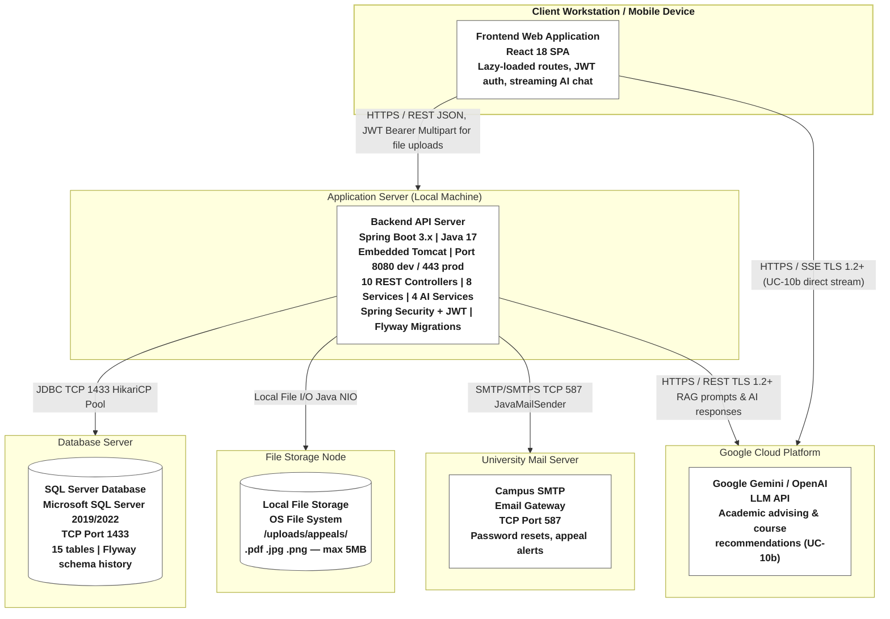

# Section D: Deployment Diagram
**Performed by:** Trần Tường Vi | **Reviewed by:** Hoàng Trung Kiên | **Edited by:** Trần Tường Vi

---

## 1. Introduction & Deployment Overview

The **Deployment Diagram** maps the four internal containers defined in **Section C** — the Frontend Web Application, Backend API Server, SQL Server Database, and Local File Storage — onto the physical/logical infrastructure nodes that execute them, alongside the two external cloud/network services the system integrates with (Google Gemini LLM API and the Campus SMTP Email Gateway).

The **MyUS University Portal System** currently runs in a **local development topology**: all server-side containers execute on a single development machine. Per the assignment's instruction for locally-run systems, each container below is represented as if deployed on its own **separate logical node**, since in a production rollout each would typically be hosted on independent physical or cloud infrastructure (e.g., a CDN for the frontend, a managed app server for the backend, a managed database instance, and cloud object storage). Production-equivalent infrastructure choices are noted alongside each node.

The system supports the following communication flows across nodes:

- **Student / Admin → Client Node:** End-users access the React SPA through a modern web browser (Chrome, Edge, Firefox, Safari).
- **Client Node → Application Server:** HTTPS/REST with JWT Bearer tokens for all API calls; `multipart/form-data` for appeal document uploads (**UC-07a**); direct SSE streaming from browser to Google Gemini for AI chat (**UC-10b**).
- **Application Server → Database Server:** JDBC over TCP port 1433 for all relational data operations.
- **Application Server → File Storage Node:** Local file I/O for grade appeal evidence documents (**UC-07a**).
- **Application Server → Google Cloud Platform:** HTTPS/REST over TLS 1.2+ for AI course recommendations and graduation audits (**UC-10b**).
- **Application Server → University Mail Server:** SMTP/SMTPS over TCP port 587 for transactional notifications (password resets, appeal status updates, fee deadline alerts).

---

## 2. Deployment Diagram (Mermaid)

**Node stereotypes:** Client Workstation/Mobile Device = `<<Device>>`; Application Server, Database Server, File Storage Node = `<<Node>>`; Google Cloud Platform, University Mail Server = `<<Cloud/External Node>>`.

**Production-equivalent infrastructure:** Application Server → AWS EC2 / Azure App Service; Database Server → Azure SQL Database / AWS RDS for SQL Server; File Storage Node → AWS S3 / Azure Blob Storage; Frontend → Vercel / AWS CloudFront CDN.

---

## 3. Node-by-Node Description

### Client Workstation / Mobile Device

* **Infrastructure:** End-user's personal computer or mobile browser (no dedicated hardware provisioned by the system; Chrome, Edge, Firefox, or Safari on desktop/mobile).
* **Container(s) deployed:** **Frontend Web Application** — the compiled React 18 SPA bundle (static HTML/CSS/JS) is downloaded once and then executes entirely client-side.
* **Outbound protocols:**
  * Issues **HTTPS/REST** calls carrying JSON and multipart payloads, with a JWT Bearer token attached via the Axios interceptor, to the Application Server for all portal operations (UC-01 through UC-13a).
  * Issues **HTTPS/SSE** streaming calls directly to the Google Gemini Cloud API via `geminiService.askGeminiStream()` for real-time AI chat responses (**UC-10b**). Falls back to `localChatbotService.ts` offline knowledge base if Gemini is unreachable (**UC-10b AF2**).

---

### Application Server

* **Infrastructure:** Local development machine running the Spring Boot application inside an **embedded Apache Tomcat / Java 17 JVM** process. In production this maps to a managed compute service such as **AWS EC2, Azure App Service, or a containerized deployment (Docker/Kubernetes)**.
* **Container(s) deployed:** **Backend API Server** — the Spring Boot 3.x REST API with 10 REST controllers, 8 domain services, 4 AI orchestration services, Spring Security 6 filter chain, JPA/Hibernate ORM layer, Flyway migration runner, and AI integration logic.
* **Listening ports:** Port **8080** in development, Port **443 (HTTPS)** in production.
* **Protocols:**
  * **Inbound** from the Client Workstation: HTTPS/REST receiving JSON and `multipart/form-data` requests with JWT Bearer authentication.
  * **Outbound** to the Database Server: **JDBC over TCP port 1433**, managed through a HikariCP connection pool.
  * **Outbound** to the File Storage Node: **local file I/O** via Java NIO (`java.nio.file.Files`) to the `/uploads/appeals/` directory for storing and retrieving grade appeal evidence documents (**UC-07a**).
  * **Outbound** to Google Gemini: **HTTPS/REST over TLS 1.2+** for AI course recommendation (`GET /api/v1/chatbot/recommendations`) and graduation progress (`GET /api/v1/chatbot/progress`) endpoints (**UC-10b**).
  * **Outbound** to the Campus SMTP Gateway: **SMTP/SMTPS over TCP port 587** via Spring `JavaMailSender` for password reset verification codes (**UC-01 AF2**), appeal status notifications (**UC-12b**), and fee deadline alerts (**UC-12a**).

---

### Database Server

* **Infrastructure:** Local **Microsoft SQL Server 2019/2022** instance. Production-equivalent: a managed relational database service such as **Azure SQL Database** or **AWS RDS for SQL Server**.
* **Container(s) deployed:** **SQL Server Database** — stores all 15 domain tables: users, students, administrators, courses, course_offerings, course_registrations, grades, grade_appeals, appeal_attachments, tuition_accounts, tuition_payments, faq_articles, exam_schedules, password_reset_tokens, and Flyway migration history (`flyway_schema_history`).
* **Protocol:** Accepts connections from the Application Server via **JDBC over TCP port 1433** only; not exposed to the client tier directly.

---

### File Storage Node

* **Infrastructure:** A dedicated storage volume on the OS file system of the host machine under `/uploads/appeals/`. Production-equivalent: cloud object storage such as **AWS S3** or **Azure Blob Storage**.
* **Container(s) deployed:** **Local File Storage** — binary evidentiary attachments (`.pdf`, `.jpg`, `.png`, up to 5 MB per file, maximum 5 files per appeal) submitted during grade appeal workflows (**UC-07a**).
* **Protocol:** Accessed by the Application Server via **local file I/O (Java NIO, POSIX paths)**. SQL Server stores relational metadata (relative path, original filename, file size, MIME type, upload timestamp) while raw binary files reside on the file system. In a cloud deployment, this would become authenticated HTTPS API calls to an S3 or Azure Blob SDK.

---

### Google Cloud Platform (External)

* **Infrastructure:** Third-party managed **SaaS endpoint** — Google's cloud infrastructure hosting the Gemini LLM API (or OpenAI's equivalent).
* **Container(s) deployed:** None (external system, outside the system boundary) — provides the **Google Gemini / OpenAI LLM API** service consumed by both:
  * The **Backend** (via `ChatbotController` → AI Service Layer) for structured academic AI endpoints (**UC-10b AF3**, **UC-10b AF4**).
  * The **Frontend** (via `geminiService.askGeminiStream()`) for direct real-time streaming chat responses (**UC-10b**).
* **Protocol:** **HTTPS/REST over TLS 1.2+**, initiated outbound by both the Application Server and the browser client for streaming SSE responses.

---

### University Mail Server (External)

* **Infrastructure:** Campus IT-managed mail relay infrastructure, outside the system's deployment boundary.
* **Container(s) deployed:** None (external system) — provides the **Campus SMTP Email Gateway** used for automated transactional notifications:
  * 6-digit password reset verification codes (**UC-01 AF2**)
  * Grade appeal status change notifications (**UC-12b**)
  * Fee payment deadline alerts (**UC-12a**)
* **Protocol:** **SMTP/SMTPS over TCP port 587**, initiated outbound by the Application Server via Spring `JavaMailSender`.