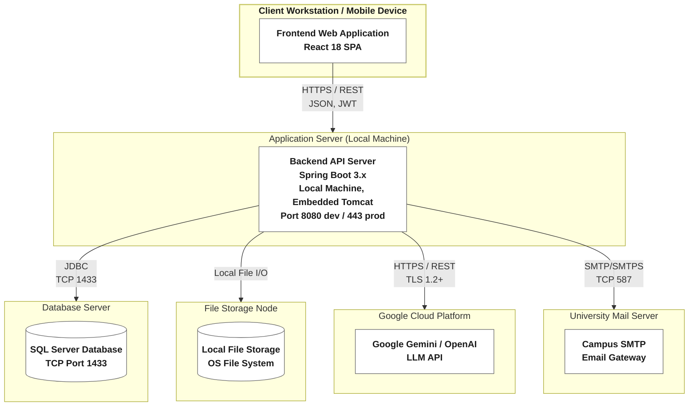

# Section D: Deployment Diagram

---

## 1. Introduction & Deployment Overview

The **Deployment Diagram** maps the four internal containers defined in **Section C** — the Frontend Web Application, Backend API Server, SQL Server Database, and Local File Storage — onto the physical/logical infrastructure nodes that execute them, alongside the two external cloud/network services the system integrates with (Google Gemini LLM API and the Campus SMTP Email Gateway).

The **MyUS University Portal System** currently runs in a **local development topology**: all server-side containers execute on a single development machine. Per the assignment's instruction for locally-run systems, each container below is represented as if deployed on its own **separate logical node**, since in a production rollout each would typically be hosted on independent physical or cloud infrastructure (e.g., a CDN for the frontend, a managed app server for the backend, a managed database instance, and cloud object storage). Production-equivalent infrastructure choices are noted alongside each node.

---

## 2. Deployment Diagram (Mermaid)

**Node stereotypes:** Client Workstation/Mobile Device = `<<Device>>`; Application Server, Database Server, File Storage Node = `<<Node>>`; Google Cloud Platform, University Mail Server = `<<Cloud/External Node>>`. Prod-equivalent infrastructure: Application Server → AWS EC2 / Azure App Service; Database Server → Azure SQL / AWS RDS; File Storage Node → AWS S3 / Azure Blob Storage.

---

## 3. Node-by-Node Description

### Client Workstation / Mobile Device
* **Infrastructure:** End-user's personal computer or mobile browser (no dedicated hardware provisioned by the system; Chrome, Edge, Firefox, or Safari on desktop/mobile).
* **Container(s) deployed:** **Frontend Web Application** — the compiled React 18 SPA bundle (static HTML/CSS/JS) is downloaded once and then executes entirely client-side.
* **Outbound protocol:** Issues **HTTPS/REST** calls carrying JSON and multipart payloads, with a JWT bearer token attached via the Axios interceptor, to the Application Server.

### Application Server
* **Infrastructure:** Local development machine running the Spring Boot application inside an **embedded Apache Tomcat / Java 17 JVM** process. In production this maps to a managed compute service such as **AWS EC2, Azure App Service, or a containerized deployment (Docker/Kubernetes)**.
* **Container(s) deployed:** **Backend API Server** — the Spring Boot 3.x REST API, Spring Security filters, JPA/Hibernate ORM layer, and AI orchestration logic.
* **Listening ports:** Port **8080** in development, Port **443 (HTTPS)** in production.
* **Protocols:**
  * **Inbound** from the client: HTTPS/REST.
  * **Outbound** to the Database Server: **JDBC over TCP port 1433**, managed through a HikariCP connection pool.
  * **Outbound** to the File Storage Node: **local file I/O** via Java NIO (same-host mounted volume in the current topology).
  * **Outbound** to Google Gemini: **HTTPS/REST over TLS 1.2+**.
  * **Outbound** to the Campus SMTP Gateway: **SMTP/SMTPS over TCP port 587**.

### Database Server
* **Infrastructure:** Local **Microsoft SQL Server 2019/2022** instance. Production-equivalent: a managed relational database service such as **Azure SQL Database** or **AWS RDS for SQL Server**.
* **Container(s) deployed:** **SQL Server Database** — stores users, student profiles, course offerings, enrollments, grade appeal cases, tuition data, audit logs, and Flyway migration history.
* **Protocol:** Accepts connections from the Application Server via **JDBC over TCP port 1433** only; not exposed to the client tier directly.

### File Storage Node
* **Infrastructure:** A dedicated storage volume on the OS file system of the host machine. Production-equivalent: cloud object storage such as **AWS S3** or **Azure Blob Storage**.
* **Container(s) deployed:** **Local File Storage** — binary evidentiary attachments (`.pdf`, `.jpg`, `.png`) submitted during grade appeal workflows (UC-07a).
* **Protocol:** Accessed by the Application Server via **local file I/O (Java NIO, POSIX paths)**; would become an authenticated HTTPS API call (e.g., S3 SDK) if migrated to a cloud object store.

### Google Cloud Platform (External)
* **Infrastructure:** Third-party managed **SaaS endpoint** — Google's cloud infrastructure hosting the Gemini LLM API (or OpenAI's equivalent).
* **Container(s) deployed:** None (external system, outside the system boundary) — provides the **Google Gemini / OpenAI LLM API** service consumed by the Backend for AI advising and course recommendations.
* **Protocol:** **HTTPS/REST over TLS 1.2+**, initiated outbound by the Application Server.

### University Mail Server (External)
* **Infrastructure:** Campus IT-managed mail relay infrastructure, outside the system's deployment boundary.
* **Container(s) deployed:** None (external system) — provides the **Campus SMTP Email Gateway** used for transactional notifications and fee deadline alerts.
* **Protocol:** **SMTP/SMTPS over TCP port 587**, initiated outbound by the Application Server.