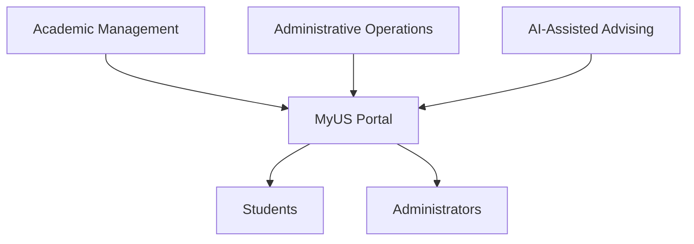
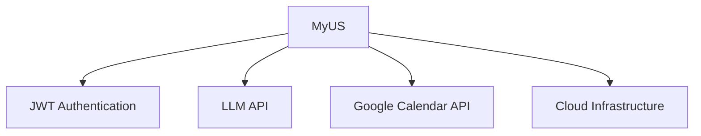
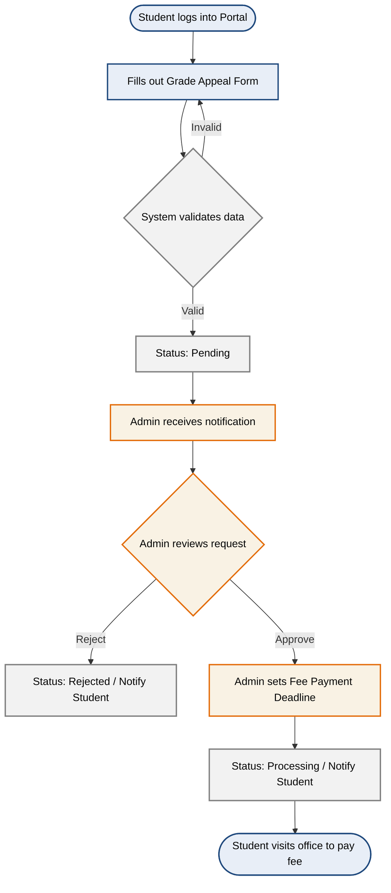
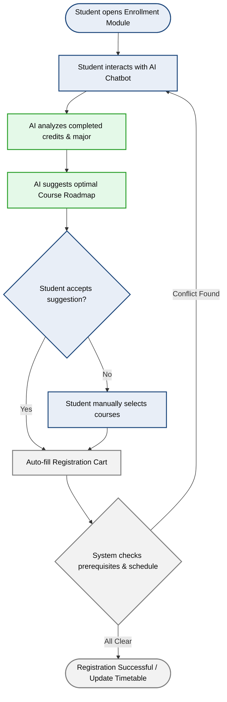
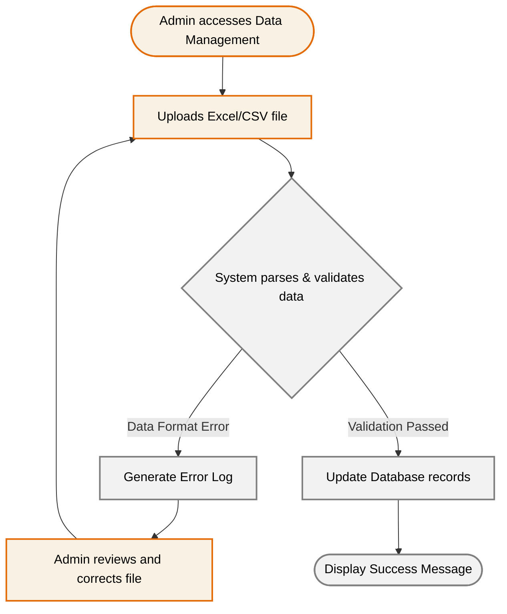

# DETAIL VISION DOCUMENT - MyUS

*Performed by: Hồ Thị Như Ngọc | Reviewed by: Lê Thị Như Ý | Edited by: Hồ Thị Như Ngọc*

## 1. Introduction

This Vision Document defines the purpose, scope, and direction of **MyUS** — an AI-integrated academic portal for university environments. 

It covers the problem being solved and product positioning, , stakeholder and user descriptions including existing alternatives, product perspective and assumptions, detailed feature descriptions with workflow diagrams, and measurable non-functional requirements.

### References

| Document | Description |
|---|---|
| Project Proposal (PA1) | Initial feature overview, target users, and AI feature description |
| PA1 Sprint Planning Meeting (25/05/2026) | Initial project direction, feature brainstorm, and role assignment |
| Weekly Meeting 1 (27/05/2026) | Task division and initial feature list |
| Weekly Meeting 2 (02/06/2026) | Proposal revisions based on TA feedback — scope reduction, chatbot redesign |
| PA2 Sprint Planning Meeting (07/06/2026) | Technical stack decisions and PA2 task breakdown |
| Weekly Meeting 1 - PA2 (11/06/2026) | Peer review of the Spec Kit; evaluated Phase 1 technical progress (project skeletons, formatting, JWT dependencies)|
| Weekly Meeting 2 - PA2 (16/06/2026) | Peer review of Phase 1 technical tasks (project skeletons, formatting, JWT dependencies); set next steps for executing Phase 2 technical tasks |
| PA3 Meeting Plan (26/06/2026) | Phase 3 and 4 technical tasks and PA3 documentation breakdown|

---

## 2. Positioning

### 2.1 Problem Statement

| Field | Description |
|---|---|
| **The problem of** | Fragmented and paper-based academic management processes in universities, where students must manually track grades, submit physical forms for grade appeals, cross-check curriculum handbooks for course planning, and wait for in-person appointments with academic advisors. |
| **Affects** | University students who struggle to manage their academic progress efficiently, and administrators who spend significant time processing manual requests, managing schedules, and maintaining student records across disconnected systems. |
| **The impact of which is** | Wasted time and effort for both students and staff, a higher risk of administrative errors, delays in processing academic requests, and an increased likelihood of students missing prerequisites or misplanning their graduation timeline. |
| **A successful solution would be** | A centralized, web-based academic portal that digitalizes all key student-facing and administrative workflows, including course registration, grade management, grade appeals, tuition tracking, and integrates an AI-powered chatbot that proactively guides students through their academic roadmap based on their individual progress. |

### 2.2 Product Position Statement

| Field | Description |
|---|---|
| **For** | Students and administrators at universities. |
| **Who** | Need a unified, digital platform to manage academic and administrative tasks efficiently. |
| **The product name** | MyUS |
| **That** | Provides a centralized portal for course registration, grade tracking, tuition management, grade appeals, and AI-powered academic advising, all accessible from any device via a modern web browser. |
| **Unlike** | Existing university portals, which provide core academic features but offer no personalized guidance, require physical paperwork for processes like grade appeals, and do not support AI-driven academic planning. |
| **Our product** | Integrates all core academic workflows into a single platform with role-specific interfaces for students and administrators, and features an AI Learning Path Chatbot that recommends courses based on each student's completed credits and degree requirements. It helps reducing the risk of delayed graduation and eliminating reliance on manual advising. |

---

## 3. Stakeholder and User Descriptions

### 3.1 Stakeholder Summary

| Stakeholder | Role | Interest in MyUS |
|---|---|---|
| Development Group (Group 6) | Product owner & builder | Deliver a functional portal that meets course requirements |
| Students | Primary end users | Access all academic services in one unified platform |
| Administrators | Secondary end users | Manage academic data, appeals, and class operations efficiently |
| University Management *(implicit)* | Indirect beneficiary | Improved operational efficiency and data accuracy |

### 3.2 User Summary

| User | Technical Literacy | Primary Role |
|---|---|---|
| Students (undergraduates only) | Average | Register courses, view grades, submit appeals, use AI chatbot |
| Administrators (single flat role) | Average | Manage schedules, process appeals, view student records |

### 3.3 User Environment

- **Platform:** Web application via modern browsers (Chrome, Edge, Firefox, Safari)
- **Devices:** Desktop, laptop, tablet, smartphone — equal priority, fully responsive
- **OS:** Windows, macOS, Linux, Android, iOS
- **Language:** Vietnamese
- **Authentication:** JWT
- **External Integrations:** Google Calendar API, external LLM API
- **Minimum Hardware:** 2 GB RAM on the client device — the floor needed to keep a modern browser responsive with the portal's UI, charts, and chatbot panel open simultaneously.
- **Minimum Browser Versions:** Chrome 100+, Edge 100+, Firefox 91+, Safari 14+ (baseline compatibility floor; per NFR ID21 in Section 6, the team commits to actively supporting the latest two major versions of each browser going forward).
- **Network Bandwidth:**
  - **1.5 Mbps** minimum for basic access — viewing profile, grades, timetable, and chatbot interaction.
  - **10 Mbps+** recommended for bulk operations — administrator file uploads/downloads (student records, course offerings) covered under Feature 7.

### 3.4 Key User Needs

| # | User | Need |
|---|---|---|
| 1 | Student | Single platform for all academic tasks |
| 2 | Student | Real-time grade and GPA visibility |
| 3 | Student | Transparent grade appeal status tracking |
| 4 | Student | AI-guided course registration and graduation planning |
| 5 | Student | Clear tuition and payment breakdown |
| 6 | Admin | Centralized dashboard for appeals and class management |
| 7 | Admin | Bulk schedule import |
| 8 | Admin | Searchable student records |

### 3.5 Alternatives and Competition

Three portals were surveyed in PA1 as competitive references:

| Portal | Weaknesses | Technical Symptom Observed (PA1 Testing) | Improvement Ideas |
|---|---|---|---|
| **HCMUS Portal** | Outdated and inconsistent UI; slow load during course registration; non-intuitive timetable | Team members observed intermittent **HTTP 503 (Service Unavailable)** responses during peak course-registration windows, consistent with an under-provisioned or non-scalable server tier | Personalized dashboard; global search; modern notification center |
| **UEH Portal** | Fragmented ecosystem (portal, LMS, email, surveys are separate); hard to track curriculum progress; non-intuitive timetable and exam schedule | Session state is not shared across the portal/LMS/survey sub-systems, forcing repeated logins per module | AI chatbot for curriculum tree visualization *(inspired MyUS's AI feature)*; Google Calendar integration |
| **My Bach Khoa** | Hard to look up curriculum information; too many raw data tables, little visualization | Layout does not reflow below tablet width — tables overflow horizontally on smartphone screens (**mobile scaling issue**), forcing horizontal scrolling to read curriculum data | Modern dashboard redesign with better data visualization |

**Mapping MyUS architectural advantages against these weaknesses:**

| Competitor Weakness | MyUS Architectural Response |
|---|---|
| HCMUS 503 errors under registration load | Stateless Spring Boot REST API (Section 4.1) sized to the NFR ID24 scalability requirement, so registration-day traffic doesn't degrade core services |
| UEH fragmented, repeated-login ecosystem | Single JWT session (Section 3.3 / NFR ID06, ID10) shared across all modules — one login for profile, grades, appeals, chatbot, and calendar |
| My Bach Khoa's non-responsive, table-heavy UI | Fully responsive design mandated at desktop/tablet/mobile breakpoints (NFR ID13), with the AI chatbot summarizing data instead of relying solely on raw tables |

**How MyUS differentiates overall:**
- Fully unified platform — no fragmented sub-systems
- AI chatbot for curriculum planning — absent in all three competitors
- Google Calendar integration for intuitive scheduling
- Student-first UI design, not an admin tool repurposed for students

> *Competitive understanding from PA1 remains largely unchanged — no significant new entrants identified. Technical symptoms above reflect the team's own informal testing during PA1 and should be re-verified before being cited as a formal claim outside this course project.*

---

## 4. Product Overview

### 4.1 Product Perspective

MyUS is a **greenfield, fully self-contained** web application — it does not extend or integrate with any existing university system. It owns its own database and all backend services.

**Tech stack:**

| Layer | Technology |
|---|---|
| Frontend | React + Vite |
| Backend | Spring Boot (Java) |
| Auth | JWT |
| AI Chatbot | External LLM API (Gemini / OpenAI) |
| Scheduling | Google Calendar API |
| Database | SQL Server

### 4.2 Assumptions and Dependencies

**Assumptions**

- All users have reliable internet access
- Users are comfortable with a Vietnamese-language interface
- Scope is limited to undergraduates only
- Single flat admin role — no permission hierarchy required
- Curriculum and prerequisite data is manually seeded; no external data feed
- All academic data (grades, schedules, tuition) is managed entirely within MyUS

**Dependencies**

| # | Dependency | Purpose | Risk if Unavailable |
|---|---|---|---|
| D1 | JWT | Session management & route protection | Authenticated routes become insecure |
| D2 | External LLM API | AI chatbot feature | AI feature entirely unavailable |
| D3 | Google Calendar API | Timetable & exam schedule display | Scheduling feature degraded |
| D4 | Cloud hosting | Backend availability & data persistence | Full system outage |

## 5. Product Features

### 5.1. Feature Descriptions

**1. Profile & Account Management**
This feature allows students to independently manage and update their personal information, contact details, and emergency contacts within the portal. It is needed to ensure that the university's central database remains highly accurate and up-to-date without requiring manual data entry by the administration. Students benefit by never missing critical academic announcements, while the university benefits from a reliable communication channel.

**2. Grade Appeal System for Students**
Students can digitally submit requests to review their exam grades and continuously track the real-time processing status of their appeals. This feature is necessary to replace the slow, error-prone paper-based petition process and provide clear deadlines for fee payments. Students benefit from a transparent, stress-free process, eliminating the need for repeated, time-consuming visits to the academic office.

**3. Course Enrollment & AI Chatbot**
This module enables students to self-enroll in standard classes while utilizing an intelligent virtual assistant to suggest optimal academic roadmaps. It is required because manual course selection often leads to frustrating scheduling conflicts, prerequisite misunderstandings, and delayed graduation. Students benefit by receiving personalized guidance to stay on track, while the university benefits from optimized class size distribution.

**4. Academic & Financial Tracking**
This comprehensive dashboard aggregates a student's academic performance, daily class timetables, and detailed financial status including tuition balances and deadlines. It is essential to promote transparency and help users effectively plan their daily schedules and prepare for financial obligations. Students and their families are the primary beneficiaries, as it removes the stress of tracking scattered information across multiple disconnected systems.

**5. Feedback & Evaluation Surveys**
At the end of each semester, students can access and complete structured surveys to evaluate course quality, lecturer performance, and campus facilities. This feature is needed to provide the university with measurable, structured feedback to continuously improve the learning environment. The administration benefits from gathering actionable data, while students benefit from having a voice in shaping their educational experience.

**6. Centralized Support & FAQ**
This feature provides a comprehensive, searchable library containing common questions and answers regarding university policies, academic rules, and IT support. It is highly needed to offer students instant, 24/7 answers to routine issues, significantly reducing the volume of repetitive support tickets. Students benefit from immediate problem resolution, while the support staff benefits from a drastically reduced administrative workload.

**7. Admin Bulk Data & Class Control**
Administrators can utilize file upload capabilities to quickly import massive volumes of system data (such as student profiles and course offerings) and manually execute student class transfers. This is urgently needed to eliminate the error-prone and labor-intensive process of manual data entry for thousands of records each semester. Administrators heavily benefit from a massive reduction in operational workload and increased flexibility in managing unexpected scheduling conflicts.

**8. Appeal Processing Management**
This centralized dashboard provides administrators with the tools to receive, review, and process incoming student grade appeal requests efficiently. It is needed to create a structured and traceable workflow, allowing staff to update statuses and assign specific deadlines for fee payments directly to the student. The academic office benefits from an organized, paperless system that prevents lost documents and significantly speeds up resolution time.

**9. Student Data Administration**
Administrators are granted privileged access to search and view comprehensive student profiles, including personal details, academic standing, and contact information. This capability is crucial for verifying student identities, contacting families during emergencies, and providing direct, accurate support when students face issues. The administrative and academic staff benefit by having immediate access to reliable data to make informed operational decisions.

### 5.2. Core User Workflows

Below are the workflow diagrams illustrating the three most critical processes in the system.

#### Workflow 1: Grade Appeal Process

#### Workflow 2: AI-Assisted Course Registration

#### Workflow 3: Admin Bulk Data Import Process

### 5.3 Detailed Functional Requirements

The 9 features in Section 5.1 are consolidated below into 5 core functional requirements (FR-01 → FR-05), each with testable Acceptance Criteria. These are Vision-Document-level requirements; the fully itemized backlog (FR-001 → FR-014) is maintained separately in spec.md.

**FR-01: Student Profile & Records Management**
*Consolidates Feature 1 (Profile & Account Management), Feature 4 (Academic & Financial Tracking), Feature 9 (Student Data Administration)*

| # | Acceptance Criteria |
|---|---|
| AC-01.1 | Given an authenticated student, when they update contact or emergency-contact info, then the change is saved and reflected immediately on their profile. |
| AC-01.2 | Given an authenticated student, when they open their dashboard, then current GPA, class timetable, and tuition balance are displayed together on one screen. |
| AC-01.3 | Given an authenticated administrator, when they search by student ID or name, then only student records within their authorized scope are returned. |

**FR-02: Grade Appeal Workflow**
*Consolidates Feature 2 (Grade Appeal System) and Feature 8 (Appeal Processing Management)*

| # | Acceptance Criteria |
|---|---|
| AC-02.1 | Given an authenticated student, when they submit a grade appeal with valid data, then the appeal is created with status "Pending" and the student is notified. |
| AC-02.2 | Given a pending appeal, when an administrator approves it and sets a fee deadline, then the status transitions to "Processing" and the student is notified in real time. |
| AC-02.3 | Given a pending appeal, when an administrator rejects it, then the status transitions to "Rejected" and the student is notified with a reason. |

**FR-03: Course Enrollment & AI-Assisted Advising**
*Consolidates Feature 3 (Course Enrollment & AI Chatbot)*

| # | Acceptance Criteria |
|---|---|
| AC-03.1 | Given a student with completed-credit data on file, when they open the AI chatbot, then it proposes a course roadmap based on completed credits and major requirements. |
| AC-03.2 | Given a proposed roadmap, when the student accepts it, then the registration cart is auto-filled with the suggested courses. |
| AC-03.3 | Given a registration attempt, when a prerequisite or schedule conflict exists, then the system blocks submission and returns the specific conflict to the student. |

**FR-04: Feedback, Support & FAQ**
*Consolidates Feature 5 (Feedback & Evaluation Surveys) and Feature 6 (Centralized Support & FAQ)*

| # | Acceptance Criteria |
|---|---|
| AC-04.1 | Given an active end-of-semester feedback period, when a student opens the survey module, then they can submit a course, lecturer, and facilities evaluation. |
| AC-04.2 | Given a student searches the FAQ library, when a matching entry exists, then it is returned without requiring a support ticket. |

**FR-05: Administrative Bulk Operations & Class Control**
*Consolidates Feature 7 (Admin Bulk Data & Class Control)*

| # | Acceptance Criteria |
|---|---|
| AC-05.1 | Given an administrator uploads an Excel/CSV file, when any record in the batch fails validation, then the import is rejected atomically, each failing row is logged, and no partial commit occurs (see NFR ID19). |
| AC-05.2 | Given a fully validated file, when the import completes, then the database is updated and a success confirmation is displayed to the administrator. |
| AC-05.3 | Given a class-transfer request, when the administrator confirms it, then the affected student's timetable reflects the change without manual database intervention. |

---

## 6. Non-Functional Requirements 

This document defines the measurable **Non-Functional Requirements** for the **MyUS University Portal System**. Non-Functional Requirements specify how the system should behave — covering quality attributes such as performance, security, usability, reliability, compatibility, scalability, and maintainability — as opposed to Functional Requirements which define what the system should do.

### References

| Document | Relevant Sections |
|---|---|
| Vision Document | Section 1 (Introduction), Section 2 (Positioning) |
| Project Proposal | Section 2 (Target Users and Environments) |
| Specification (spec.md) | Functional Requirements (FR-001 → FR-014), Success Criteria |
| Implementation Plan (plan.md) | Technical Context, Performance Goals, Constraints |
| Constitution | Technology Stack, Architecture Principles, Security, Testing |

---

### 1. Performance

| ID | Requirement | Metric | Rationale |
|---|---|---|---|
| ID01 | Core student pages (profile, timetable, grades, tuition) MUST load under normal load conditions. | Page load < **2.0s** (95th percentile). | plan.md: "Responsive page load for core student workflows." Threshold follows established UX guidance that responses beyond ~2s begin to break the user's sense of direct interaction (Nielsen response-time thresholds). |
| ID02 | Backend REST API endpoints MUST maintain stable response times under moderate campus load. | API response < **1s** (95th percentile, excluding AI endpoints). | plan.md: "Stable API response times under moderate campus load." 1s is a common production SLA target for CRUD-style REST endpoints. |
| ID03 | Bulk data import operations (student records, course offerings) MUST process efficiently with progress feedback to the administrator. | **10,000 records processed within 60s**, with incremental progress feedback. | Vision Document Feature 7: "quickly import massive volumes of system data." Sized to a campus-scale semester upload (course offerings + incoming class roster) completing within a single admin session. |
| ID04 | The AI Learning Path Chatbot MUST return course recommendations in a timely manner after receiving a student query. | AI response < **5.0s** end-to-end (including external LLM API round-trip). | Vision Document Feature 3: AI-driven chatbot provides real-time academic guidance. Ceiling reflects typical external LLM API latency (D2 dependency) plus application processing overhead. |
| ID05 | Database queries for grade retrieval and GPA calculation MUST complete efficiently for individual student records. | DB query < **500ms** (95th percentile) for single-student grade/GPA lookups. | spec.md FR-005: Students must be able to view grades, GPA, and academic progress. Consistent with the normalized schema in NFR ID25, which keeps single-record lookups index-backed. |

---

### 2. Security

| ID | Requirement | Metric | Rationale |
|---|---|---|---|
| ID06 | All protected pages and API endpoints MUST require JWT-based authentication. Unauthenticated requests MUST receive an HTTP 401 response. | 100% of protected endpoints enforce authentication. | Directly from spec.md FR-001 and constitution: "All users must be authenticated before accessing protected resources." |
| ID07 | The system MUST enforce role-based access control (RBAC) with at least two roles: **Student** and **Administrator**. Users MUST NOT access resources outside their role scope. | 0 unauthorized access incidents in acceptance testing. | Directly from spec.md FR-011 and constitution: "Role-based authorization for Student and Administrator." |
| ID08 | Sensitive student data (personal information, financial records, academic transcripts) MUST NOT be exposed in API responses to unauthorized users. | API responses contain no sensitive data leaks for unauthorized roles. | Directly from spec.md FR-012 and constitution: "Sensitive data must not be exposed in APIs." |
| ID09 | User passwords MUST be stored using a strong, one-way hashing algorithm (e.g., BCrypt with minimum 10 rounds). Plaintext passwords MUST NOT appear in logs, API responses, or database records. | 100% of stored passwords are hashed; 0 plaintext occurrences in logs/DB. | Industry standard (OWASP Password Storage Cheat Sheet). Implied by the constitution's security requirements. |
| ID10 | JWT tokens MUST have a configurable expiration time and support secure token refresh mechanisms. | Access token TTL configurable; refresh token TTL configurable. | plan.md authentication decision specifies JWT — based on OWASP session management guidelines. |
| ID11 | All client-server communication MUST use HTTPS (TLS 1.2+) in production environments. | 100% of production traffic over HTTPS. | Industry standard for web application security (OWASP Transport Layer Security Cheat Sheet). |

---

### 3. Usability

| ID | Requirement | Metric | Rationale |
|---|---|---|---|
| ID12 | 95% of authenticated students MUST be able to complete their primary portal tasks (profile review, course registration, grade lookup) in one session without external assistance. | Task completion rate ≥ 95%. | Directly from spec.md SC-001: exact measurable success criterion. |
| ID13 | The user interface MUST be responsive and functional across desktop (≥1024px), tablet (≥768px), and mobile (≥375px) screen widths. | UI renders correctly across all three breakpoints. | Directly from Project Proposal Section 2.2: "Responsive web interface for both desktop and mobile environments." |
| ID14 | The system MUST provide clear, user-friendly error messages for all validation failures (e.g., invalid form inputs, schedule conflicts, prerequisite gaps). | All validation errors display actionable messages; no raw server errors shown to users. | Vision Document Feature 3 describes prerequisite checks and conflict detection — clear feedback is essential for self-service workflows. |
| ID15 | Students MUST receive real-time status updates for grade appeal processing. Status transitions (Pending → Processing → Resolved/Rejected) MUST be visible promptly after an administrator action. | Appeal status updates visible in real-time. | Directly from spec.md SC-002: "Students can access real-time appeal status updates." |
| ID16 | The FAQ and support section MUST provide a searchable interface that returns relevant results promptly. | FAQ search returns results without noticeable delay. | Vision Document Feature 6: "instant, 24/7 answers to routine issues." |

---

### 4. Reliability & Availability

| ID | Requirement | Metric | Rationale |
|---|---|---|---|
| ID17 | The system MUST maintain high availability during the academic semester, excluding planned maintenance windows. | System is accessible during all critical academic periods. | Academic portals are critical during enrollment and examination periods. |
| ID18 | The system MUST handle graceful degradation when the AI chatbot service is unavailable. Students MUST still access all other portal features without interruption. | Non-chatbot features remain functional during chatbot outage. | Directly from spec.md assumptions: "The AI learning path chatbot feature is guidance-oriented and not a substitute for academic advising." |
| ID19 | Bulk data import MUST be transactional: if validation fails for any record in a batch, the system MUST NOT partially commit the import. A detailed error log MUST be generated. | 0 partial imports; error log generated for 100% of failed imports. | Directly from spec.md FR-008 and Vision Document Workflow 3: "Generate Error Log." |
| ID20 | The system MUST implement automated database backups to prevent academic data loss. | Backups performed regularly; restoration procedures verified. | Industry best practice for systems holding irreplaceable academic records. |

---

### 5. Compatibility

| ID | Requirement | Metric | Rationale |
|---|---|---|---|
| ID21 | The portal MUST function correctly on the latest two major versions of **Google Chrome**, **Microsoft Edge**, **Mozilla Firefox**, and **Safari**. | All critical user flows pass on 4 browsers × 2 versions. | Directly from Project Proposal Section 2.2: "Modern web browsers such as Google Chrome, Microsoft Edge, Mozilla Firefox, and Safari." |
| ID22 | The portal MUST function correctly on devices running **Windows**, **macOS**, **Linux**, **Android**, and **iOS**. | All critical user flows pass on all 5 operating systems. | Directly from Project Proposal Section 2.2: "Supported Operating Systems." |
| ID23 | The backend MUST run on **Java 17+** and the frontend MUST use **modern JavaScript/TypeScript** compatible with current LTS Node.js versions. | Build succeeds on Java 17+ and Node.js LTS. | Directly from plan.md Technical Context and constitution: "Backend: Spring Boot." |

---

### 6. Scalability

| ID | Requirement | Metric | Rationale |
|---|---|---|---|
| ID24 | The system architecture MUST support scaling to handle a campus-sized student body without degradation of core portal functions. | System maintains responsive performance under peak campus load. | plan.md: "Campus-sized student body." |
| ID25 | The database schema MUST use **normalized design** with referential integrity through foreign keys, supporting growth of student records over multiple academic years. | Schema passes 3NF validation; all relationships have foreign key constraints. | Directly from spec.md FR-013 and constitution: "Use normalized database design. Maintain referential integrity through foreign keys." |
| ID26 | The system MUST support the addition of new user roles (e.g., Faculty, Department Head) and feature modules without requiring architectural changes to the core authentication or authorization framework. | New role can be added via configuration and database changes only, with no core code refactoring. | Implied by spec.md assumptions: "Faculty and additional staff roles beyond Student and Administrator are out of scope for the initial release." |

---

### 7. Maintainability

| ID | Requirement | Metric | Rationale |
|---|---|---|---|
| ID27 | The codebase MUST follow **Clean Architecture** principles with clear separation of Presentation, Business Logic, and Data Access layers. | No cross-layer direct dependencies (e.g., controllers must not access repositories directly). | Directly from constitution: "Follow Clean Architecture principles. Separate Presentation, Business Logic, and Data Access layers." |
| ID28 | All new features MUST be documented with user stories and acceptance criteria before implementation begins. | 100% of implemented features have corresponding documentation. | Directly from spec.md FR-014 and constitution: "Major features must include user stories and acceptance criteria." |
| ID29 | Backend and frontend code MUST use consistent **naming conventions** and follow established coding standards enforced by linting tools. | 0 linting errors in CI pipeline. | Directly from constitution: "Use meaningful naming conventions. Follow coding standards and best practices." |
| ID30 | Critical business logic (GPA calculation, enrollment validation, appeal workflow) MUST be covered by unit tests. | Unit test coverage for critical services. | Directly from constitution: "Critical business logic should be tested." |
| ID31 | All backend REST API endpoints MUST be validated through **integration tests** before deployment. | 100% of API endpoints have at least one integration test. | Directly from constitution: "API endpoints should be validated before deployment." |

---

### Summary Matrix

| Category | Count | ID Range |
|---|---|---|
| Performance | 5 | ID01 → ID05 |
| Security | 6 | ID06 → ID11 |
| Usability | 5 | ID12 → ID16 |
| Reliability & Availability | 4 | ID17 → ID20 |
| Compatibility | 3 | ID21 → ID23 |
| Scalability | 3 | ID24 → ID26 |
| Maintainability | 5 | ID27 → ID31 |
| **Total** | **31** | |

*Note: Performance requirements (ID01 → ID05) now carry concrete numeric thresholds (see Section 6.1). These targets are design goals derived from common web/API performance standards and the project's own dependency constraints (Section 4.2); they should still be validated and re-calibrated against real load-test data once the backend is implemented.*
