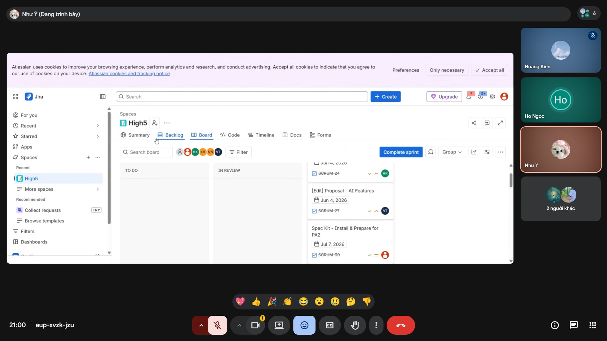

# Meeting Report 4 - Submission Review Meeting

**Course:** CSC13002 - Introduction to Software Engineering\
**Project Assignment:** PA1-2026\
**Group Name:** High5\
**Project Name:** MyUS\
**Meeting Type:** Submission Review Meeting\
**Meeting Date:** 06/06/2026

## 1. Meeting Overview
Members' Group

| Student ID | Full Name | Email |
| --- | --- | --- |
| 24127089 | Hồ Thị Như Ngọc | htnngoc2418@clc.fitus.edu.vn |
| 24127192 | Dương Minh Huỳnh Khôi | dmhkhoi2402@clc.fitus.edu.vn |
| 24127194 | Hoàng Trung Kiên | htkien2415@clc.fitus.edu.vn |
| 24127586 | Trần Tường Vi | ttvi2416@clc.fitus.edu.vn |
| 24127595 | Lê Thị Như Ý | ltny2424@clc.fitus.edu.vn |

Absentee(s): None

## 2. Meeting Objectives

The objectives of this meeting were:

1. Review the project proposal before submission.
2. Review the existing application survey report.
3. Review and finalize the team contract.
4. Review the weekly reports.
5. Change the AI feature according to the teaching assistant's advice and feedback.
5. Identify challenges in project management and team collaboration.
6. Review the PA2 requirements and discuss preparation for the next project milestone.

---

## 3. Main Discussion

### 3.1 Document Review

The team reviewed all PA1 deliverables, including the project proposal, existing application survey, team contract, and weekly progress report.

Members provided feedback on document structure, content completeness, and consistency among deliverables. Minor revisions were suggested before final submission.

### 3.2 AI Feature Discussion

The team reviewed the proposed AI-powered feature and decided to replace the previously discussed AI functionalities with an AI Chatbot for academic guidance.

The discussion focused on:

* Whether an AI chatbot is more practical and valuable than the previously proposed AI features.
* The chatbot's ability to recommend suitable study plans based on a student's academic progress, completed courses, and learning goals.
* The feasibility of implementing chatbot functionalities within the project timeline.
* The potential benefits of providing personalized academic advice and improving the student experience.

The team agreed that an AI Chatbot for study plan recommendations is more aligned with the project's objectives and provides a clearer value proposition for students. Therefore, the chatbot will become the primary AI-powered feature of MyUS.

### 3.3 Project Management Challenges

The team discussed difficulties encountered while using Jira for project management.

The main challenge identified was that several members were not yet familiar with Jira workflows, resulting in inconsistent task updates and progress tracking.

The team agreed to spend additional time learning Jira and establishing a consistent workflow for task management.

### 3.4 PA2 Preparation Discussion

The team reviewed the PA2 requirements released by the course instructors and discussed the expected deliverables for the next milestone.

Members briefly examined the scope of work, required documents, and development tasks that will be needed for PA2. The team agreed to study the requirements in more detail and prepare the necessary materials during the next class session before assigning specific responsibilities.

---

## 4. Decisions Made

The team made the following decisions:

1. The project proposal was reviewed and finalized for submission.
2. The existing application survey report was reviewed and approved.
3. The team contract was finalized.
4. The weekly progress report was reviewed and completed.
5. The current AI features (Smart Scheduling and Demand Forecasting) will be changed to AI Chatbot for Course Progress Recommendation.
6. Team members will improve their familiarity with Jira to support better project tracking.
7. The team will hold a meeting on Sunday (07/06/2026) to discuss further on PA2.

---

## 5. Action Items

| Task Description                          | Assigned To       | Status      |
| ----------------------------------------- | ----------------- | ----------- |
| Finalize project proposal                 | All members       | Done        |
| Finalize existing application survey      | All members       | Done        |
| Finalize team contract                    | All members       | Done        |
| Finalize weekly progress report           | All members       | Done        |
| Review AI feature feasibility             | Team Leader       | In Progress |
| Improve Jira workflow and task management | All members       | In Progress |
| Prepare for next project milestone        | All members       | In Progress |

---

## 6. Plans for next week
The team plans to:
1. Discuss the requirements and task distribution for PA2.
2. Review PA2 requirements in detail and prepare the necessary materials for the next class session.
3. Finalize all project features, including the AI chatbot functionality.
4. Continue tracking project progress and managing tasks using Jira.

## 7. Conclusion

The meeting focused on reviewing and finalizing the required PA1 deliverables, including the proposal, existing application survey, team contract, and weekly report. The team also discussed project features, AI functionality, and project management challenges. The meeting helped ensure that all submission documents were completed and that the team had a clearer understanding of the next development steps.

## 8. Appendix - Evidence

The following screenshot shows evidence of the Sprint Planning Meeting on 25/05/2026.

