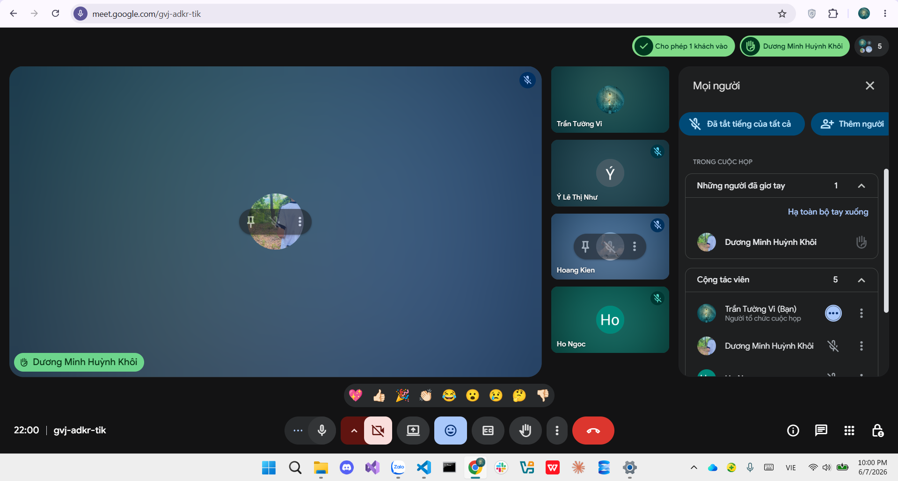

# Meeting Report 5 - Sprint Planning Meeting (Sprint 2 - PA2)

**Course:** CSC13002 - Introduction to Software Engineering\
**Project Assignment:** PA2-2026\
**Group Name:** High5\
**Project Name:** MyUS\
**Meeting Type:** Sprint Planning Meeting (Sprint 2)\
**Meeting Date:** 07/06/2026

---

## 1. Meeting Overview

Team members present:

| Student ID | Full Name | Email |
| --- | --- | --- |
| 24127089 | Hồ Thị Như Ngọc | htnngoc2418@clc.fitus.edu.vn |
| 24127192 | Dương Minh Huỳnh Khôi | dmhkhoi2402@clc.fitus.edu.vn |
| 24127194 | Hoàng Trung Kiên | htkien2415@clc.fitus.edu.vn |
| 24127586 | Trần Tường Vi | ttvi2416@clc.fitus.edu.vn |
| 24127595 | Lê Thị Như Ý | ltny2424@clc.fitus.edu.vn |

This meeting was held immediately after PA1 to kick off Sprint 2 (PA2). The team reviewed the PA2 guidelines and the `tasks.md` breakdown, then assigned all implementation and documentation tasks for the sprint.

---

## 2. Meeting Objectives

The objectives of this Sprint Planning Meeting were:

1. Kick off the implementation phase of MyUS.
2. Break down technical tasks from `tasks.md` into Phase 1 and Phase 2.
3. Assign documentation tasks for the PA2 deliverables.
4. Set deadlines and review pairs for all tasks.

---

## 3. Discussion Points

### 3.1. Documentation Track

The team defined the scope for the documentation deliverables required in PA2:

- **Project Plan:** Draft Sections 1–4 (including the 5-sprint roadmap, schedule, and risk management).
- **Vision Document:** Draft Sections 1–6 (covering positioning, user descriptions, product features with Mermaid diagrams, and non-functional requirements).
- **Spec Kit:** Initialize the repository and complete the `constitution.md` file.
- **AI Usage Report:** Document AI tool usage and provide the required usage log.
- **Weekly Report:** Record Sprint Planning, Scrum meetings, Sprint Review activities, and include Jira progress screenshots.

### 3.2. Technical Track (Phase 1 & Phase 2)

The team outlined the implementation workflow to achieve a working end-to-end authentication flow:

- **Repository Setup:** Initialize both backend (Spring Boot) and frontend (React TypeScript) repositories, configuring repo-level linting, formatting, and environment variables.
- **Database & Security:** Define the SQL Server database schema, write migration scripts, configure JWT authentication dependencies, and set up role-based access control for Students and Admins.
- **Core Flows:** Implement the login/logout authentication state on the frontend, establish backend API exception handling, and add baseline API/developer documentation.

---

## 4. Work Assignment

### A. Documentation Tasks

| For | Task Name | Task Description | Person in Charge | Reviewer | Requirement | Deadline |
| --- | --- | --- | --- | --- | --- | --- |
| Spec Kit | Complete all | Complete `constitution.md` after review | Lê Thị Như Ý | Trần Tường Vi |  | 14/06/2026 |
| Spec Kit | Summary and review  | Each member self-summarizes and reviews their Spec Kit section | Remaining members | Lê Thị Như Ý |  | 10/06/2026 |
| AI Usage Report & Weekly Report | AI Usage & Weekly Report | Document AI tool usage log and conduct sprint meeting reports | Trần Tường Vi | Hoàng Trung Kiên | Put in Management | 14/06/2026 |
| Project Plan | Sections 1, 2, 3 | Introduction, Project Overview, and Project Organization (team roles & risk management) | Trần Tường Vi | Hoàng Trung Kiên | Put in Management | 14/06/2026 |
| Project Plan | Section 4 | Detailed 5-sprint roadmap, schedule, and build plan | Hồ Thị Như Ngọc | Lê Thị Như Ý | Put in Management | 14/06/2026 |
| Vision Document | Sections 1, 2 | Introduction and Positioning (Problem Statement, Product Position Statement) | Trần Tường Vi | Hoàng Trung Kiên | Put in Requirement | 14/06/2026 |
| Vision Document | Sections 3, 4 | Stakeholder & User Descriptions and Product Overview | Hoàng Trung Kiên | Dương Minh Huỳnh Khôi | Put in Requirement | 14/06/2026 |
| Vision Document | Section 5 | Product Features with paragraph descriptions and Mermaid workflow diagrams | Lê Thị Như Ý | Trần Tường Vi | Put in Requirement | 14/06/2026 |
| Vision Document | Section 6 | Non-Functional Requirements (performance, security, platform standards) | Dương Minh Huỳnh Khôi | Hồ Thị Như Ngọc | Put in Requirement | 14/06/2026 |

### B. Technical Tasks (Phase 1 & Phase 2)

| For | Task Name | Task Description | Person in Charge | Reviewer | Requirement | Deadline |
| --- | --- | --- | --- | --- | --- | --- |
| Phase 1 | T001 | Create backend Spring Boot project skeleton in `backend/` | Dương Minh Huỳnh Khôi | Hồ Thị Như Ngọc | Follow `tasks.md` | 14/06/2026 |
| Phase 1 | T002, T005 | Create React frontend skeleton and configure routing, protected route wrappers, and global layout | Hoàng Trung Kiên | Lê Thị Như Ý | Follow `tasks.md` | 14/06/2026 |
| Phase 1 | T003 | Configure repo-level linting, formatting, and environment variables (`.vscode/`) | Lê Thị Như Ý | Dương Minh Huỳnh Khôi | Follow `tasks.md` | 14/06/2026 |
| Phase 1 | T004, T006 | Configure JWT authentication dependencies in `build.gradle` and add initial API documentation scaffolding | Hồ Thị Như Ngọc | Hoàng Trung Kiên | Follow `tasks.md` | 14/06/2026 |
| Phase 2 | T007, T010, T014 | Setup SQL Server schema, migration scripts, create Student/Admin entities, and add baseline API documentation | Trần Tường Vi | Hoàng Trung Kiên | Follow `tasks.md` | 14/06/2026 |
| Phase 2 | T008, T009 | Implement JWT authentication filter, security config, and role-based access control for Student & Admin | Dương Minh Huỳnh Khôi | Hồ Thị Như Ngọc | Follow `tasks.md` | 14/06/2026 |
| Phase 2 | T011 | Add backend API exception handling and validation response middleware | Hồ Thị Như Ngọc | Lê Thị Như Ý | Follow `tasks.md` | 14/06/2026 |
| Phase 2 | T012 | Implement frontend authentication state, login/logout flows, and protected route components | Hoàng Trung Kiên | Dương Minh Huỳnh Khôi | Follow `tasks.md` | 14/06/2026 |
| Phase 2 | T013, T014 | Implement frontend shared data services for API calls and error handling, and add developer guide references | Lê Thị Như Ý | Trần Tường Vi | Follow `tasks.md` | 14/06/2026 |

> **Note:** T014 — Lê Thị Như Ý handles frontend README, Trần Tường Vi handles backend README. Both reviewed together.

---

## 5. Decisions Made

1. The project will be developed using Java Spring Boot for the backend, React with TypeScript for the frontend, and Microsoft SQL Server as the database management system.
2. All Phase 1 and Phase 2 tasks must be completed and cross-reviewed by 14/06/2026 to ensure a fully functional end-to-end login flow is ready for evaluation.

---

## 6. Next Steps

1. Complete peer reviews, address feedback, and finalize all documentation and implementation deliverables before the sprint deadline.
2. Resolve identified issues from reviews and prepare the project for Phase 3 development activities.
3. A scrum meeting will be held on **15/06/2026** to evaluate the outcomes of **Sprint 2 (PA2)** and confirm readiness for Phase 3.

---

## 7. Conclusion

The Sprint 2 Planning Meeting was successfully completed. All five members have clear task assignments for both the technical and documentation tracks, with a firm deadline of **14/06/2026**. The team will follow Scrum practices, keep the Jira board updated, and enforce peer review on all tasks.

---

## 8. Appendix - Evidence

The following screenshot shows evidence of the Sprint Planning Meeting on 07/06/2026.

