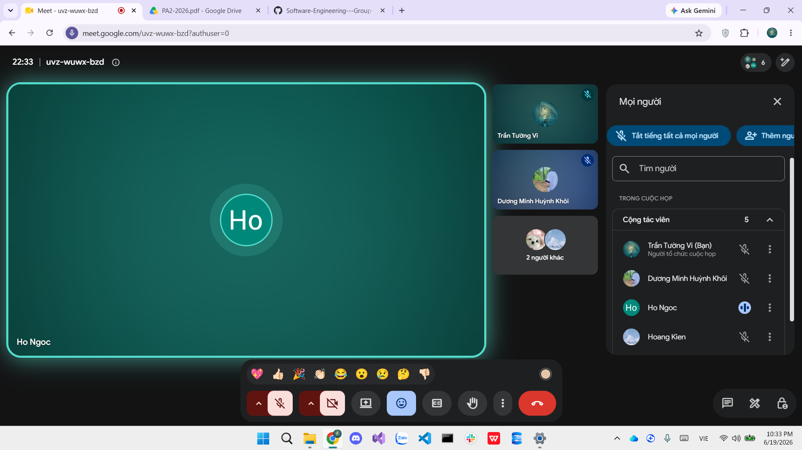

# Meeting Report 8 - Review Meeting

**Course:** CSC13002 - Introduction to Software Engineering\
**Project Assignment:** PA2-2026\
**Group Name:** High5\
**Project Name:** MyUS\
**Meeting Type:** Review Meeting\
**Meeting Date:** 19/06/2026

---

## 1. Meeting Overview

Team members present:

| Student ID | Full Name | Email |
| --- | --- | --- |
| 24127089 | Hồ Thị Như Ngọc | htnngoc2418@clc.fitus.edu.vn |
| 24127192 | Dương Minh Huỳnh Khôi | dmhkhoi2402@clc.fitus.edu.vn |
| 24127194 | Hoàng Trung Kiên | htkien2415@clc.fitus.edu.vn |
| 24127586 | Trần Tường Vi | ttvi2416@clc.fitus.edu.vn |
| 24127595 | Lê Thị Như Ý | ltny2424@clc.fitus.edu.vn |

This weekly meeting was held online to conduct a final comprehensive review of all Sprint 2 (PA2) deliverables, including the Spec Kit, Phase 1 & Phase 2 technical implementations, and all documentation.

---

## 2. Meeting Objectives

The objectives of this meeting were:
1. Review and approve the Spec Kit and PA2 documentation.
2. Evaluate the completion and stability of Phase 1 and Phase 2 technical tasks.
3. Assess team performance and highlight what went well.
4. Finalize all deliverables for PA2 submission.

---

## 3. Discussion Points

### 3.1. What Went Well
- **On-time Completion:** All technical and documentation tasks were completed strictly according to the set deadlines.
- **System Stability:** The integrated components from Phase 1 and Phase 2 are running stably without critical bugs.

### 3.2. Spec Kit & Documentation Review
- **Spec Kit:** `constitution.md` and individual summaries are finalized and approved.
- **Documentation:** Project Plan, Vision Document, and AI Usage Report are fully drafted, formatted correctly, and cross-checked for consistency.

### 3.3. Technical Progress (Phase 1 & Phase 2)
- **Phase 1:** Project skeletons, repository formatting, and JWT dependencies are fully configured and verified.
- **Phase 2:** Database schema, RBAC, frontend authentication state, protected routes, and exception handling are implemented and functioning as expected. 

---

## 4. Work Assignment 

All assigned tasks for PA2 are considered complete. The team will perform a final read-through and formatting check before the final submission.

---

## 5. Decisions Made

1. The Spec Kit, Documentation, Phase 1, and Phase 2 implementations are officially reviewed and approved.
2. The PA2 deliverables are ready for submission.

---

## 6. Next Steps

Discuss the requirements and task distribution for PA3.

---

## 7. Conclusion

The comprehensive review confirmed that the team successfully completed all PA2 requirements on time. The implemented infrastructure (Phase 1 & 2) is stable, and the documentation is complete. The immediate focus is on final submission and transitioning to the next sprint.

---

## 8. Appendix - Evidence

The following screenshot serves as proof of the weekly project alignment and review meeting held online on 19/06/2026.

