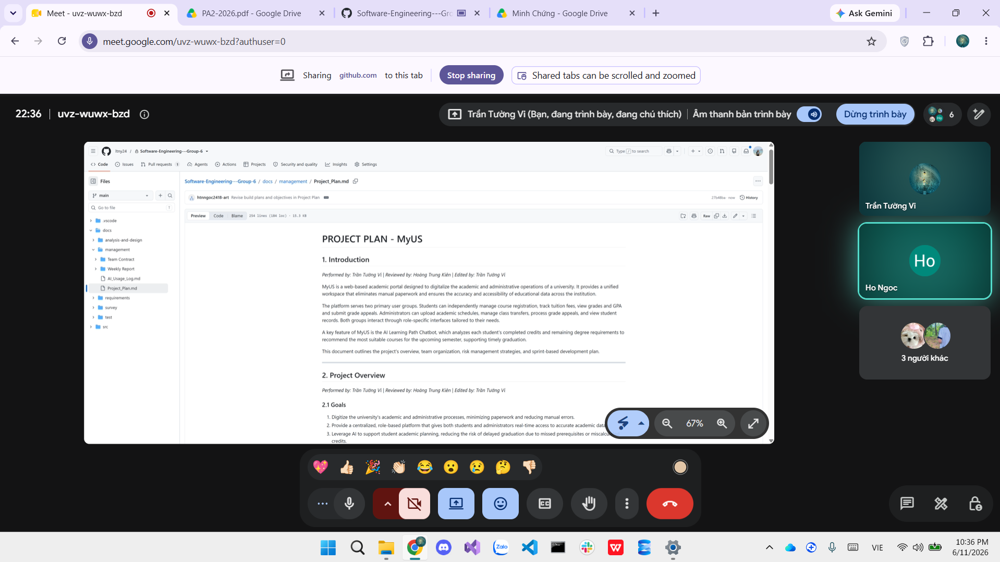

# Meeting Report 6 - Weekly Review 1 (Sprint 2 - PA2)

**Course:** CSC13002 - Introduction to Software Engineering\
**Project Assignment:** PA2-2026\
**Group Name:** High5\
**Project Name:** MyUS\
**Meeting Type:** Weekly Review & Spec Kit Review\
**Meeting Date:** 11/06/2026

---

## 1. Meeting Overview

Team members present:

| Student ID | Full Name | Email |
| --- | --- | --- |
| 24127089 | Hồ Thị Như Ngọc | htnngoc2418@clc.fitus.edu.vn |
| 24127192 | Dương Minh Huỳnh Khôi | dmhkhoi2402@clc.fitus.edu.vn |
| 24127194 | Hoàng Trung Kiên | htkien2415@clc.fitus.edu.vn |
| 24127586 | Trần Tường Vi | ttvi2416@clc.fitus.edu.vn |
| 24127595 | Lê Thị Như Ý | ltny2424@clc.fitus.edu.vn |

This weekly meeting was held online during Sprint 2 (PA2) to review the Spec Kit, evaluate ongoing Phase 1 technical tasks, and track the progress of PA2 documentation drafting.

---

## 2. Meeting Objectives

The objectives of this meeting were:
1. Conduct a peer review of the Spec Kit (`constitution.md` and individual summaries).
2. Evaluate the ongoing implementation of Phase 1 technical tasks (project skeletons, formatting, and JWT dependencies).
3. Track and continue the drafting process for PA2 documentation deliverables.
4. Set clear next steps for concluding Phase 1 and initiating Phase 2.

---

## 3. Discussion Points

### 3.1. Spec Kit Review & Documentation Progress
- **Spec Kit:** The team reviewed the initialized repository, the completed `constitution.md`, and the individual Spec Kit summaries to ensure all members understood the Git workflow and coding standards. 
- **PA2 Documentation:** Team members reported their current progress on the Project Plan, Vision Document, and AI Usage Report. Drafting is ongoing and remains on schedule.

### 3.2. Evaluation of Technical Progress (Phase 1)
- The team checked the status of the backend (Spring Boot) and frontend (React TypeScript) repository setups.
- Discussed the configuration of repo-level linting, formatting rules, and environment variables.
- Verified the progress of configuring JWT authentication dependencies in `build.gradle` and React routing skeletons. 
---

## 4. Work Assignment 

The team continues to execute the Documentation and Phase 1 technical tasks exactly as assigned in **Meeting Report 5**. No new tasks were assigned during this meeting.

---

## 5. Decisions Made

1. The Spec Kit `constitution.md` and individual summaries are approved.
2. The team will prioritize completing and reviewing Phase 1 implementation tasks before proceeding to Phase 2.
3. Documentation drafting will continue concurrently with technical implementation.

---

## 6. Next Steps

1. Complete and review all Phase 1 tasks and deliverables.
2. Begin implementation of Phase 2 technical tasks.
3. Finalize PA2 documentation (Vision Document, Project Plan, Weekly Reports) for submission.

---

## 7. Conclusion

The Weekly Review successfully covered the Spec Kit and aligned the team on the ongoing Phase 1 implementation and documentation efforts. The immediate focus is to finish and review Phase 1, then transition directly into Phase 2 development activities.

---

## 8. Appendix - Evidence

The following screenshot serves as proof of the weekly project alignment and review meeting held online on 11/06/2026.

