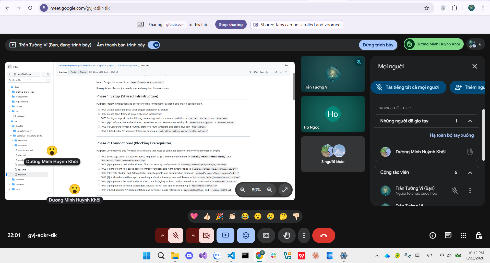

# Meeting Report 6 - Weekly Review & Phase 3 Planning Meeting (Sprint 2 - PA2)

**Course:** CSC13002 - Introduction to Software Engineering\
**Project Assignment:** PA2-2026\
**Group Name:** High5\
**Project Name:** MyUS\
**Meeting Type:** Weekly Review & Phase 3 Planning Meeting\
**Meeting Date:** 22/06/2026

---

## 1. Meeting Overview

Team members present:

| Student ID | Full Name | Email |
| --- | --- | --- |
| 24127089 | Hồ Thị Như Ngọc | htnngoc2418@clc.fitus.edu.vn |
| 24127192 | Dương Minh Huỳnh Khôi | dmhkhoi2402@clc.fitus.edu.vn |
| 24127194 | Hoàng Trung Kiên | htkien2415@clc.fitus.edu.vn |
| 24127586 | Trần Tường Vi | ttvi2416@clc.fitus.edu.vn |
| 24127595 | Lê Thị Như Ý | ltny2424@clc.fitus.edu.vn |

This weekly meeting was held online toward the end of Sprint 2 (PA2) to conduct a final cross-review of all submitted project documents, evaluate the successful implementation of the core technical foundation (Phase 1 & Phase 2), and strategically plan the task distribution for Phase 3 (MVP - Student Academic Self-Service) based on the master project plan.

---

## 2. Meeting Objectives

The objectives of this Weekly Review & Planning Meeting were:
1. Conduct a final review of the PA2 documentation deliverables (Vision Document, Project Plan, Spec Kit Summary, and AI Usage Report).
2. Evaluate the completion of Phase 1 and Phase 2 technical tasks (Authentication, project skeleton setup, and shared infrastructure configurations).
3. Allocate and commit to Phase 3 technical implementation tasks for the upcoming Student Self-Service MVP module.
4. Set precise deadlines, review pairs, and backup structures for all core features in Phase 3.

---

## 3. Discussion Points

### 3.1. Final Review of PA2 Documentation
The team systematically checked all drafted sections to ensure cross-document consistency:
- **Vision Document:** Confirmed that Section 5 now correctly details all 9 functional groupings in solid prose description alongside 3 comprehensive Mermaid workflow diagrams. Section 6 non-functional boundaries were validated.
- **Project Plan:** Verified the 5-sprint agile roadmap structure, scheduling logic, and the completeness of the risk management register.
- **Spec Kit Training Summary:** Formally approved the `Summary_Speckit.md` master document containing detailed individual learning evidence from all 5 members.

### 3.2. Evaluation of Technical Progress (Phase 1 & Phase 2)
The baseline infrastructure was cross-reviewed and verified on the repository:
- Project scaffolding (`backend/` and `src/frontend/`) is complete and stable.
- Workspace linting, formatting rules, and `.vscode/settings.json` are globally enforced at the repository root.
- Backend Spring Security with JWT authentication filters and initial role-based access tokens function correctly.
- Frontend shared Axios data service (`api.ts`) with custom request/response interceptors has been implemented to handle automated token embedding and global error parsing.
- Core developer guides and baseline API setups are well-documented in respective backend/frontend README files.

### 3.3. Phase 3 Planning and Allocation
The team discussed the implementation strategy for **Phase 3: MVP - Student Academic Self-Service**. The goal is to allow authenticated students to view and manage their profile, browse the course catalog, simulate or submit registrations, view their grades and timetable, and review tuition records securely without admin intervention.

---

## 4. Work Assignment (Phase 3: MVP - Student Academic Self-Service)

Based on the master roadmap in `Project_Plan.md`, the technical tasks for Phase 3 are assigned with explicit review pairs and staggered deadlines between 26/06/2026 and 10/07/2026:

| Task ID | Task Description | Person in Charge | Reviewer | Requirement | Deadline | Prerequisites | Backup Member |
| --- | --- | --- | --- | --- | --- | --- | --- |
| **T015** | Implement student profile retrieval endpoint | Trần Tường Vi | Dương Minh Huỳnh Khôi | Follow `tasks.md` | 26/06/2026 | None | Hồ Thị Như Ngọc |
| **T016** | Implement student profile update service | Trần Tường Vi | Dương Minh Huỳnh Khôi | Follow `tasks.md` | 27/06/2026 | T015 | Dương Minh Huỳnh Khôi |
| **T017** | Implement student profile view & edit UI | Lê Thị Như Ý | Hoàng Trung Kiên | Follow `tasks.md` | 28/06/2026 | T015, T016 | Hoàng Trung Kiên |
| **T018** | Implement course catalog browsing endpoint | Dương Minh Huỳnh Khôi | Hồ Thị Như Ngọc | Follow `tasks.md` | 30/06/2026 | None | Trần Tường Vi |
| **T020** | Implement enrollment record service | Dương Minh Huỳnh Khôi | Hồ Thị Như Ngọc | Follow `tasks.md` | 01/07/2026 | T018 | Hồ Thị Như Ngọc |
| **T019** | Implement frontend course browsing & registration | Hoàng Trung Kiên | Lê Thị Như Ý | Follow `tasks.md` | 02/07/2026 | T018, T020 | Lê Thị Như Ý |
| **T021** | Implement timetable & course schedule UI | Hoàng Trung Kiên | Lê Thị Như Ý | Follow `tasks.md` | 03/07/2026 | T019 | Lê Thị Như Ý |
| **T022** | Implement grade retrieval & GPA calculation | Hồ Thị Như Ngọc | Trần Tường Vi | Follow `tasks.md` | 05/07/2026 | None | Dương Minh Huỳnh Khôi |
| **T024** | Implement tuition balance & payment APIs | Trần Tường Vi | Dương Minh Huỳnh Khôi | Follow `tasks.md` | 06/07/2026 | None | Hồ Thị Như Ngọc |
| **T023** | Implement frontend grade dashboard & GPA | Lê Thị Như Ý | Hoàng Trung Kiên | Follow `tasks.md` | 07/07/2026 | T022 | Hoàng Trung Kiên |
| **T025** | Implement frontend tuition summary UI | Lê Thị Như Ý | Hoàng Trung Kiên | Follow `tasks.md` | 08/07/2026 | T024 | Hoàng Trung Kiên |
| **T026** | Add backend unit tests for US1 | Hồ Thị Như Ngọc | Dương Minh Huỳnh Khôi | Follow `tasks.md` | 10/07/2026 | T016, T020, T022, T024 | Trần Tường Vi |
| **T027** | Add frontend integration tests for US1 | Hoàng Trung Kiên | Lê Thị Như Ý | Follow `tasks.md` | 10/07/2026 | T017, T019, T021, T023, T025 | Lê Thị Như Ý |

---

## 5. Decisions Made

1. All documentation deliverables for PA2 are frozen, fully integrated, and approved for submission in both Markdown (.md) and PDF formats.
2. The core framework architecture (Spring Boot + React TypeScript) configured during Phase 1 & 2 is approved as the production-ready foundation for full feature development.
3. Task assignments, review cross-pairs, deadlines, and backup roles for Phase 3 are locked as shown in Section 4 to maintain strong momentum into the next phase.

---

## 6. Next Steps

1. Finalize the compression of the project package into `PA2-Group[GroupId].zip` containing the frozen documents, project base code, and necessary evidence screenshots.
2. Formally initiate execution of Phase 3 tasks immediately following the completion of PA2.
3. Maintain rigorous adherence to local formatting/linting and complete peer code reviews before issuing pull requests on GitHub.

---

## 7. Conclusion

The Weekly Review & Phase 3 Planning Meeting successfully finalized all tasks associated with Sprint 2 (PA2). The fundamental shared infrastructure and security services (Phase 1 & Phase 2) are operating flawlessly. All team members have committed to their respective functional ownership within Phase 3 (Student Self-Service MVP module). Development will follow proper Scrum timelines and maintain close code-verification loops.

---

## 8. Appendix - Evidence

The following screenshot serves as proof of the weekly project alignment and review meeting held online on 22/06/2026.

