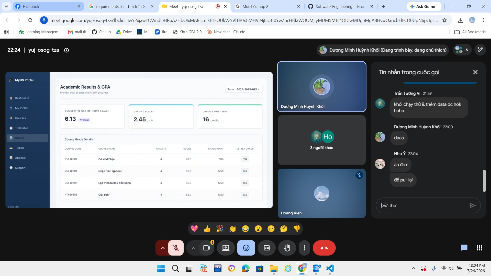

# Meeting Report 12 - Sprint Review (Sprint 3 - PA3)

**Course:** CSC13002 - Introduction to Software Engineering
**Project Assignment:** PA3-2026
**Group Name:** High5
**Project Name:** MyUS
**Meeting Type:** Sprint Review
**Meeting Date:** 24/07/2026

---

## 1. Meeting Overview

Team members present:

| Student ID | Full Name             | Email                                                               |
| ---------- | --------------------- | ------------------------------------------------------------------- |
| 24127089   | Hồ Thị Như Ngọc       | [htnngoc2418@clc.fitus.edu.vn](mailto:htnngoc2418@clc.fitus.edu.vn) |
| 24127192   | Dương Minh Huỳnh Khôi | [dmhkhoi2402@clc.fitus.edu.vn](mailto:dmhkhoi2402@clc.fitus.edu.vn) |
| 24127194   | Hoàng Trung Kiên      | [htkien2415@clc.fitus.edu.vn](mailto:htkien2415@clc.fitus.edu.vn)   |
| 24127586   | Trần Tường Vi         | [ttvi2416@clc.fitus.edu.vn](mailto:ttvi2416@clc.fitus.edu.vn)       |
| 24127595   | Lê Thị Như Ý          | [ltny2424@clc.fitus.edu.vn](mailto:ltny2424@clc.fitus.edu.vn)       |

This Sprint Review meeting was held online at the end of Sprint 3 to evaluate the PA3-2026 deliverables, review the completed documentation and Grade Appeal implementation, and verify the project’s readiness for final submission.

The meeting consolidated the progress, revisions, and quality-assurance activities discussed during Weekly Review 1 and Weekly Review 2, and prepare for PA4.

---

## 2. Meeting Objectives

The objectives of this meeting were:

1. Review the completion status of all PA3 sections from A to F.
2. Evaluate the consistency between the Vision Document, use-case model, use-case specifications, and UI prototypes.
3. Review the Grade Appeal functional group implementation and its Spec Kit artifacts.
4. Verify testing results, documentation evidence, repository organization, and submission requirements.
5. Identify any remaining issues that must be resolved before the final PA3 submission.

---

## 3. Discussion Points

### 3.1. Review of PA3 Documentation

The team reviewed the final or near-final versions of the PA3 documentation deliverables.

* **Revised Project Plan:** The project schedule, sprint roadmap, team organization, and risk management sections were updated based on PA2 feedback.
* **Detailed Vision Document:** Functional requirements, non-functional requirements, competitor analysis, and user environment descriptions were expanded and refined.
* **Changes.md:** Modifications made to the PA2 Project Plan and Vision Document were recorded and organized into separate sections.
* **Use-Case Model:** The Mermaid diagrams were checked for actor coverage, use-case naming, and appropriate `include`, `extend`, and generalization relationships.
* **Use-Case Specifications:** The team reviewed the basic flows, alternative flows, exception flows, preconditions, postconditions, and special requirements.
* **UI Prototypes:** Prototype screenshots were checked to ensure that they represented both successful workflows and important validation, confirmation, empty, and failure states.

Several minor formatting and terminology inconsistencies were identified and assigned for final correction.

### 3.2. Review of Grade Appeal Implementation

The team reviewed the Grade Appeal functional group developed for Section E.

The demonstrated functionality included:

* Student grade selection and appeal submission.
* Validation of appeal information.
* Student appeal-history and status tracking.
* Administrator appeal listing and review.
* Appeal approval or rejection with administrator feedback.
* Storage and retrieval of appeal information from the database.

The backend, frontend, and database components were reviewed for integration consistency.

The team also verified the main business rules:

* Students may only appeal grades associated with their own accounts.
* Duplicate unresolved appeals for the same grade are rejected.
* Only authorized administrators may review appeals.
* Invalid appeal-status transitions are rejected.
* Administrative decisions include appropriate feedback.

### 3.3. Spec Kit and Testing Review

The team reviewed the Spec Kit artifacts created for the Grade Appeal functional group:

* `spec.md`
* `plan.md`
* `tasks.md`

The artifacts were checked for consistency with the implemented functionality and the corresponding use-case specifications.

The team also reviewed the testing results for:

* Successful appeal submission.
* Missing or invalid data.
* Duplicate appeal submission.
* Unauthorized access.
* Appeal approval and rejection.
* Invalid status transitions.
* Frontend, backend, and database integration.
* Loading, empty, success, and error interface states.

Any implementation changes that differed from the original plan were documented in the related Spec Kit files.

### 3.4. Submission and Evidence Review

The team reviewed the remaining submission requirements:

* AI usage records were updated with the tools, prompts, purposes, and generated outputs used during Sprint 3.
* Jira screenshots showed task assignments and progress tracking.
* Weekly Review 1, Weekly Review 2, and Sprint Review reports were prepared with meeting evidence.
* Required Markdown documents were prepared for PDF conversion.
* The repository structure, filenames, links, screenshots, and Git history were checked.
* The Grade Appeal demonstration video was reviewed for functionality, narration, and visibility settings.

The team agreed to conduct one final inspection of the compressed submission package before uploading it.

### 3.8. Issues, Revisions, and Next Actions

Before concluding the meeting, the team summarized the main issues requiring attention:

* Finalize terminology and formatting in all documents according to the requirements.
* Progress is a bit slower than planned because of the Mid-term examination.
* Components of the product pages, as well as UI Prototypes, are not fully consistent.

---

## 4. Work Assignment

The team continued to complete the remaining revisions and final quality-assurance tasks based on the assignments established during Weekly Review 2.

No major new development tasks were introduced during this meeting.

The remaining responsibilities were:

| Task                                                | Person in Charge | Reviewer                          |
| --------------------------------------------------- | ---------------- | --------------------------------- |
| Finalize Sections A, B, and `Changes.md`            | Hồ Thị Như Ngọc  | Dương Minh Huỳnh Khôi             |
| Verify use-case model coverage and Mermaid syntax   | Lê Thị Như Ý     | Hoàng Trung Kiên                  |
| Use-case specifications + UI for administrator role | Hoàng Trung Kiên | Lê Thị Như Ý, Trần Tường Vi       |
| Use-case specifications + UI for student role       | Hồ Thị Như Ngọc  | Hoàng Trung Kiên                  |
| Verify Grade Appeal implementation and testing      | Dương Minh Huỳnh Khôi, Trần Tường Vi, Lê Thị Như Ý   | Hoàng Trung Kiên, Hồ Thị Như Ngọc |
| Finalize AI usage, Jira, and weekly report evidence | Trần Tường Vi    | Dương Minh Huỳnh Khôi             |
| Compile and verify the final submission package     | All members      | Hồ Thị Như Ngọc, Hoàng Trung Kiên |

---

## 5. Decisions Made

1. The PA3 documentation (including revised documents and recently completed documents) was considered complete and formatted accurately.
2. The Grade Appeal implementation was accepted as the selected Section E functional group. Final demonstration video must show the student workflow, administrator workflow.
3. The Spec Kit artifacts must be preserved and submitted together with the implementation.
4. All required Markdown documents must be converted to PDF before submission.
5. The compressed submission package must be independently verified by all members before it is uploaded.

---

## 6. Next Steps

1. Correct the remaining formatting, terminology, and screenshot-placement issues.
2. Finalize the AI Usage Report, Jira screenshots, and meeting evidence.
3. Review and confirm the Grade Appeal demonstration video link.
4. Convert the required Markdown documents to PDF.
5. Compile the final `PA3-Group[GroupId].zip` submission package and submit it before the official deaddline.
6. Prepare the required documents and source codes for PA4.

---

## 7. Conclusion

The Sprint 3 Review successfully evaluated the progress and quality of the PA3-2026 deliverables.

The Revised Project Plan, Detailed Vision Document, use-case model, use-case specifications, and UI prototypes were reviewed for completeness and consistency. The Grade Appeal functional group was demonstrated and assessed across the frontend, backend, database, and Spec Kit artifacts.

The team confirmed that the main PA3 requirements had been addressed. Only minor corrections, final evidence collection, PDF conversion, and submission-package verification remained.

All members agreed to complete the final quality-assurance tasks and jointly verify the submission package before the PA3 deadline.

---

## 8. Appendix - Evidence

The following screenshot serves as evidence of the Sprint 3 Review meeting held online on 24/07/2026.

