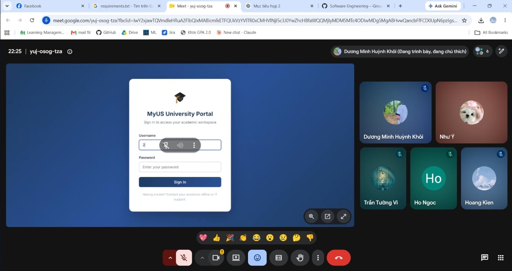

# Meeting Report 11 - Weekly Review & Planning Meeting (Sprint 3 - PA3)

**Course:** CSC13002 - Introduction to Software Engineering\
**Project Assignment:** PA3-2026\
**Group Name:** High5\
**Project Name:** MyUS\
**Meeting Type:** Weekly Review & Planning Meeting\
**Meeting Date:** 22/07/2026

---

## 1. Meeting Overview

Team members present:

| Student ID | Full Name | Email |
| --- | --- | --- |
| 24127089 | Hồ Thị Như Ngọc | htnngoc2418@clc.fitus.edu.vn |
| 24127192 | Dương Minh Huỳnh Khôi | dmhkhoi2402@clc.fitus.edu.vn |
| 24127194 | Hoàng Trung Kiên | htkien2415@clc.fitus.edu.vn |
| 24127586 | Trần Tường Vi | ttvi2416@clc.fitus.edu.vn |
| 24127595 | Lê Thị Như Ý | ltny2424@clc.fitus.edu.vn |

This weekly meeting was held online at the end of Sprint 3 (PA3) to review the completed work, evaluate current progress on the documentation revisions, validate and confirm the work for PA3 submission.

---

## 2. Meeting Objectives

The objectives of this Weekly Review & Planning Meeting were:

1. Review the progress and revised drafts of the Project Plan (Section A) and Detailed Vision Document (Section B) based on Teaching Assistant's feedback.
2. Evaluate the completeness and consistency of the use-case model (Section C), including actors, relationships, and use-case coverage.
3. Review the drafted use-case specifications and corresponding UI prototypes for basic and alternative flows (Section D).
4. Assess the progress of the selected functional group implementation using Spec Kit and verify its alignment with the approved requirements (Section E).
5. Establish the plan for final quality assurance, document formatting, repository organization, and submission preparation according to Teaching Assistant's feedback.

---

## 3. Discussion Points

### 3.1. Review of Revised Documentation (Sections A & B)

The team reviewed the latest versions of the Revised Project Plan and Detailed Vision Document after incorporating feedback from the previous meeting and PA2-2026 evaluation.

* **Revised Project Plan:** The updated project schedule, sprint roadmap, team responsibilities, communication procedures, and risk management plan were reviewed for consistency with the current project status.
* **Detailed Vision Document:** The team verified that all functional requirements, non-functional requirements, user environments, assumptions, constraints, alternatives, and competitor analyses were sufficiently detailed.
* **Changes.md:** The change log was checked to ensure that every major modification from the PA2-2026 documents was clearly identified and explained.
* Several minor issues related to terminology, document formatting, and consistency between functional group names were identified.
* Hồ Thị Như Ngọc was assigned to apply the final revisions and prepare Sections A and B for integration into the submission package.

### 3.2. Review of the Use-Case Model (Section C)

Lê Thị Như Ý presented the completed draft of the use-case model for team review.

* The model includes the two primary actors: **Student** and **Administrator**.
* The team verified that every functional requirement from the Detailed Vision Document is represented by at least one use case.
* Shared behaviors, including authentication, notification, data validation, and information retrieval, were reviewed to determine whether `include` relationships were appropriate.
* Optional or condition-based behaviors were examined for possible `extend` relationships.
* Actor and use-case generalization relationships were checked to avoid unnecessary complexity.
* The team identified several use cases whose names were too broad and agreed to divide them into smaller, goal-oriented use cases.
* The Mermaid diagrams will be revised to improve readability, reduce crossing relationships, and ensure consistent naming between Sections B, C, and D.

### 3.3. Review of Use-Case Specifications and Prototypes (Section D)

Hoàng Trung Kiên presented the use-case specifications for administrators, while Hồ Thị Như Ngọc demonstrated the specifications for students.

The team reviewed each specification according to the required structure:

* Use-case ID and name.
* Primary and supporting actors.
* Description and objective.
* Preconditions and triggering events.
* Basic flow.
* Alternative and exception flows.
* Postconditions.
* Special and non-functional requirements.
* Related UI prototype screens.

The following issues were identified during the review:

* Some basic-flow steps combined multiple actor or system actions and needed to be separated.
* Terminology used in the prototypes needed to match the use-case specifications and vision document.
* UI Prototypes between use cases are inconsistent.

The team agreed that each prototype screenshot should be altered for better consistency. Hoàng Trung Kiên and Hồ Thị Như Ngọc will update the affected prototype screens and documents.

### 3.4. Progress of the Grade Appeal Functional Group (Section E)

The team reviewed the implementation progress of the **Grade Appeal** functional group developed using the Spec Kit workflow.

#### Backend Progress

Khôi reported that the primary backend structure had been created:

* The `Appeal` entity and its relationships with the Student, Grade, and Course-related data were implemented.
* Repository, service, and controller layers were established.
* DTOs for appeal submission, review, and response were created.
* Initial validation was added to prevent incomplete or invalid appeal submissions.
* Custom exception handling was implemented for unavailable grades, duplicate appeals, unauthorized access, and invalid appeal status transitions.

#### Frontend Progress

Lê Thị Như Ý demonstrated the initial frontend screens:

* Student grade selection and appeal submission form.
* Appeal history and status-tracking page.
* Administrator appeal list.
* Administrator review interface with approval and rejection actions.

#### Database and Integration Progress

Vi reported that the appeal table and its foreign-key relationships had been prepared.

* Mock student, course, grade, and appeal data were added for testing.
* Initial API and database integration tests were conducted.
* Several mismatches between frontend field names and backend DTO properties were discovered.
* The team agreed to standardize request and response formats before continuing integration testing.
* Additional test data will be created for pending, approved, rejected, duplicate, invalid, and unauthorized appeal scenarios.

### 3.5. Spec Kit Artifact Review

The team reviewed the Spec Kit artifacts produced for the Grade Appeal functional group.

* The feature specification was checked against the corresponding vision requirements and use-case specifications.
* The implementation plan was reviewed to confirm the selected technologies, architectural approach, and component responsibilities.
* The team emphasized that implementation changes must remain consistent with the approved specification and plan.
* Any deviations made during implementation must be documented rather than applied without explanation.

### 3.6. Integration, Testing, and Quality Assurance

The team established a common testing approach for both documentation and implementation deliverables.

For documentation, reviewers will verify:

* Requirement traceability from the Vision Document to the use-case model and specifications.
* Consistent use-case IDs and names across all documents.
* Completeness of basic, alternative, and exception flows.
* Consistency between specifications and prototype screens.
* Correct Mermaid syntax, markdown formatting, filenames, and repository structure.

For the Grade Appeal implementation, the team will test:

* Successful appeal submission.
* Missing or invalid submission data.
* Duplicate appeal submission.
* Unauthorized student or administrator access.
* Appeal approval and rejection.
* Invalid status transitions.
* API, frontend, and database integration.
* Error messages and interface behavior.

Each major section will be reviewed by at least one member who was not its primary author.

### 3.7. Video Demonstration and Submission Preparation

The team discussed the requirements for the Section E demonstration video.

* The video will briefly introduce the Grade Appeal functional group.
* It will demonstrate the student submission flow, appeal status tracking, and administrator review flow.
* Both successful and selected alternative scenarios will be shown.
* The narration will explain how the implementation corresponds to the Spec Kit specifications, plans, and tasks.
* Khôi will prepare the initial recording, while the other members will review the video for technical clarity and completeness.
* The final video will be uploaded to YouTube with **Unlisted** visibility, and the link will be added to the submission documentation.

### 3.8. Issues, Revisions, and Next Actions

Before concluding the meeting, the team summarized the main issues requiring attention:

* Finalize terminology and formatting in all documents.
* Complete missing alternative and exception flows in Section D.
* Complete source code integration and business-rule testing for the Grade Appeal feature.
* Conduct a final cross-section consistency review before submission.
* Progress is a bit slower than planned because of the Mid-term examination.

The team agreed that all revised documents and implementation components must be committed to the shared repository before the final review meeting.

---

## 4. Updated Work Assignment (PA3-2026)

Based on the progress review and issues identified during the meeting, the team updated the remaining tasks, review responsibilities, and deadlines.

### A. PA3 Document and Implementation Tasks Ongoing

| Section      | Current Status   | Remaining Task                                                                                                                                | Person in Charge                                                                    | Reviewer                                                | Updated Deadline | Dependencies                                  |
| ------------ | ---------------- | --------------------------------------------------------------------------------------------------------------------------------------------- | ----------------------------------------------------------------------------------- | ------------------------------------------------------- | ---------------- | --------------------------------------------- |
| **A**        | Completed | Apply final terminology, formatting, schedule, and risk-management corrections; verify `Changes.md` entries                                   | Hồ Thị Như Ngọc (24127089)                                                          | Dương Minh Huỳnh Khôi (24127192)                        | 22/07/2026       | PA2 Project Plan and TA feedback              |
| **B**        | Completed | Resolve inconsistencies in functional-group names, requirements, user environments, and competitor analysis; verify traceability to Section C | Hồ Thị Như Ngọc (24127089)                                                          | Dương Minh Huỳnh Khôi (24127192)                        | 22/07/2026       | PA2 Vision Document and TA feedback           |
| **C**        | Draft completed  | Revise Mermaid diagrams, improve readability, validate relationships, and ensure coverage of all functional requirements                      | Lê Thị Như Ý (24127595)                                                             | Hoàng Trung Kiên (24127194)                             | 22/07/2026       | Finalized Section B                           |    
| **D**        | Completed      | Update the AI usage log, Sprint 3 records, Jira evidence, meeting minutes, and weekly report                                                  | Trần Tường Vi (24127586)                                                            | Dương Minh Huỳnh Khôi (24127192)                        | 24/07/2026       | Jira records and team evidence                |
| **Final QA** | In Progress      | Conduct cross-document consistency review, test repository structure, convert documents to PDF, and verify submission package                 | All members                                                                         | Hồ Thị Như Ngọc (24127089), Hoàng Trung Kiên (24127194) | 24/07/2026       | Sections A–E completed                        |

### B. Section D — Use-Case Specification Revision Breakdown

| Sub-task ID     | Description                                                                                           | Person in Charge            | Reviewer                    | Deadline   |
| --------------- | ----------------------------------------------------------------------------------------------------- | --------------------------- | --------------------------- | ---------- |
| **D-PROTO**     | Add prototype screens for validation errors, confirmations, empty states, and unsuccessful operations | Hồ Thị Như Ngọc (24127089)  | Trần Tường Vi (24127586)    | 23/07/2026 |
| **D-INTEGRATE** | Insert screenshots, captions, and references into the appropriate use-case specifications             | Hồ Thị Như Ngọc (24127089)  | Hoàng Trung Kiên (24127194) | 23/07/2026 |

### C. Section E — Grade Appeal Implementation Breakdown

| Sub-task ID | Description                                                                                                                     | Person in Charge                 | Reviewer                         | Updated Deadline |
| ----------- | ------------------------------------------------------------------------------------------------------------------------------- | -------------------------------- | -------------------------------- | ---------------- |
| **E-FE**    | Complete appeal submission, appeal tracking, and administrator review interfaces with loading, empty, success, and error states | Lê Thị Như Ý (24127595)          | Dương Minh Huỳnh Khôi (24127192) | 23/07/2026       |
| **E-DB**    | Finalize the appeal schema, constraints, mock data, and database integration tests                                              | Trần Tường Vi (24127586)         | Lê Thị Như Ý (24127595)          | 24/07/2026       |
| **E-SK**    | Revise and complete `spec.md`, `plan.md`, and `tasks.md`; document implementation deviations where necessary                    | All Section E members            | Hoàng Trung Kiên (24127194)      | 24/07/2026       |
| **E-DEMO**  | Record a narrated demonstration, upload it to YouTube as Unlisted, and include the link in the submission documents             | Trần Tường Vi (24127586), Dương Minh Huỳnh Khôi (24127192) | All Section E members            | 25/07/2026       |

---

## 5. Decisions Made

1. Sections A and B are considered completed, but they will not be marked as final until terminology, formatting, and requirement traceability have been verified.

2. The use-case model must be revised so that every functional requirement in the Detailed Vision Document is represented by at least one use case.

3. Every use-case specification must contain complete basic, alternative, and exception flows. Alternative flows must identify the exact basic-flow step from which they originate.

4. Prototype screenshots must represent not only successful basic flows but also relevant validation, confirmation, empty, duplicate, authorization, and failure states.

5. The frontend and backend teams will use one standardized API contract for request fields, response fields, status values, and error messages.

6. All implementation work must remain traceable to the Spec Kit artifacts. Any implementation decision that differs from the original plan must be documented.

7. The final demonstration video must include the student submission flow, appeal-status tracking, administrator review, and at least one alternative or error scenario.

8. All final Markdown documents will be converted to PDF, while the original Markdown files will also be preserved in the repository and submission package where required.

---

## 6. Next Steps

1. **By 22/07/2026:** Hồ Thị Như Ngọc will apply the final corrections to Sections A and B and update `Changes.md`. Dương Minh Huỳnh Khôi will perform the final peer review.

2. **By 22/07/2026:** Lê Thị Như Ý will revise the use-case model, verify requirement coverage, and correct the Mermaid diagrams. Hoàng Trung Kiên will review the updated model.

3. **By 23/07/2026:** Hoàng Trung Kiên will complete the revision of basic, alternative, and exception flows for all use-case specifications for administrator role. Hồ Thị Như Ngọc will complete the revision of basic, alternative, and exception flows for all use-case specifications for student role

4. **By 23/07/2026:** Khôi and Vi will complete the backend, database constraints, mock data, validation, and exception-handling components of the Grade Appeal feature.

5. **By 24/07/2026:** Ý will complete the Grade Appeal frontend, while the Section E team will standardize the API request and response structures.

6. **By 24/07/2026:** The Section E team will complete integration testing and verify all required Grade Appeal scenarios.

7. **By 24/07/2026:** All Section E members will finalize `spec.md`, `plan.md`, and `tasks.md`, including documentation of any implementation changes.

8. **By 25/07/2026:** Khôi will record and upload the Grade Appeal demonstration video. The other team members will review its narration, functionality, and visibility settings after the review meeting.

9. **By 25/07/2026:** Trần Tường Vi will finalize the AI Usage Report, Jira screenshots, Sprint 3 meeting records, and weekly report after the review meeting.

---

## 7. Conclusion

The second Weekly Review & Planning Meeting for Sprint 3 focused on evaluating completed work, identifying inconsistencies, and organizing the remaining revision, implementation, testing, and submission activities.

Sections A and B were found to be close to completion, with only minor terminology, formatting, and traceability issues remaining. The use-case model requires several readability and relationship corrections, while the use-case specifications require additional alternative flows, exception scenarios, and prototype screens.

The Grade Appeal functional group has established its main backend, frontend, and database structure. However, the team must complete its business rules, API standardization, interface states, integration testing, and Spec Kit documentation before it can be considered complete.

Updated responsibilities and deadlines were assigned for every remaining task. The team agreed to apply a strict peer-review process and conduct a complete cross-section quality check before compiling the final PA3 submission package.

---

## 8. Appendix - Evidence

The following screenshot serves as proof of the weekly project alignment and review meeting held online on 22/07/2026.

