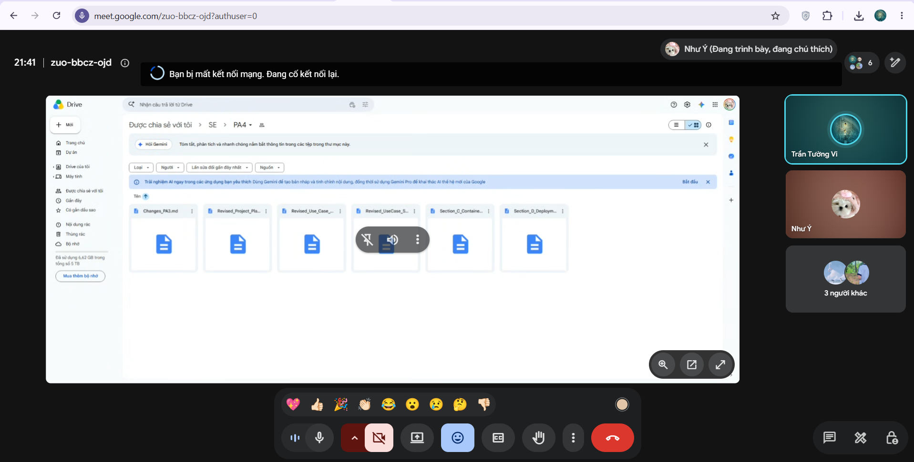

# Meeting Report 13 - Sprint Planning Meeting (Sprint 4 - PA4)

**Course:** CSC13002 - Introduction to Software Engineering  
**Project Assignment:** PA4-2026  
**Group Name:** High5 (Group 6)  
**Project Name:** MyUS  
**Meeting Type:** Sprint Planning Meeting (Sprint 4)  
**Meeting Date:** 27/07/2026  

---

## 1. Meeting Overview

**Team members present:**

| Student ID | Full Name | Email |
|------------|-----------|-------|
| 24127089 | Hồ Thị Như Ngọc | htnngoc2418@clc.fitus.edu.vn |
| 24127192 | Dương Minh Huỳnh Khôi | dmhkhoi2402@clc.fitus.edu.vn |
| 24127194 | Hoàng Trung Kiên | htkien2415@clc.fitus.edu.vn |
| 24127586 | Trần Tường Vi | ttvi2416@clc.fitus.edu.vn |
| 24127595 | Lê Thị Như Ý | ltny2424@clc.fitus.edu.vn |

This Sprint Planning Meeting was held online to officially kick off Phase 4 (PA4-2026). The team thoroughly reviewed the PA4 assignment requirements, established task assignments across all document and implementation sections (Sections A to F), configured the Spec Kit workflow, and set up a schedule for C4 architecture modeling, full-stack feature delivery, and video demonstration production.

---

## 2. Meeting Objectives

The objectives of this Sprint Planning Meeting were:

1. Review the PA4-2026 requirements document and understand the grading criteria across all sections (A through F).
2. Plan the documentation revisions (Section A: Revised Use-Case Specification and Project Plan adjustment).
3. Distribute the Software Architecture C4 modeling tasks in Mermaid syntax (Sections B, C, D: System Context, Container, Component, and Deployment diagrams).
4. Define the Spec Kit setup (`spec.md`, `plan.md`, `tasks.md`) and plan automated test generation for Section E.
5. Allocate implementation tasks for the required functional groups: Grade Appeal Workflow (FG2) and AI Chatbot & Support Workflow (FG3 & FG6).
6. Set clear milestone deadlines, peer review pairs, and the final submission preparation schedule leading to the submission deadline on **07/08/2026**.

---

## 3. Discussion Points

### 3.1. Review of PA4-2026 Requirements & Scope

The team systematically reviewed the PA4 guidelines:

- **Section A — Revised Use-Case Specification & Project Plan (10 points):** Revise the Use-Case Specification document based on PA3 feedback. Update the Project Plan schedule and task assignments for PA4. Document all modifications in `Changes.md`.
- **Section B — System Context Diagram (10 points):** Define tech stack and draw C4 Level 1 System Context diagram using Mermaid syntax.
- **Section C — Container & Component Diagrams (20 points):** Draw C4 Level 2 Container and Level 3 Component diagrams in Mermaid syntax to map frontend, backend, database, and internal backend components.
- **Section D — Deployment Diagram (10 points):** Map system deployment nodes, container runtime, and hosting environments in Mermaid syntax.
- **Section E — Functional Group Implementation using Spec Kit (45 points):** Implement two functional groups end-to-end (FG2 Grade Appeal & FG3/FG6 AI Chatbot & Support Workflow). Utilize Spec Kit artifacts (`spec.md`, `plan.md`, `tasks.md`) to drive development and auto-generate test suites. Record a narrated demonstration video.
- **Section F — AI Usage & Weekly Reports (5 points):** Maintain AI usage logs, document Scrum/planning meetings, and collect Jira task tracking screenshots.

### 3.2. Documentation & Architecture Tasks Allocation (Sections A–D)

The team allocated the documentation and C4 modeling deliverables based on expertise and previous sprint roles:

- **Section A (Revised Use-Case Spec & Project Plan):** **Hồ Thị Như Ngọc** will lead the revisions, incorporating PA3 feedback into the Use-Case Specification and updating `Revised_Project_Plan_PA4.md` and `Changes.md` by **30/07/2026**.
- **Section B (System Context Diagram):** **Lê Thị Như Ý** will draft the C4 Level 1 diagram detailing external users, administrative actors, and third-party API boundaries using Mermaid by **30/07/2026**.
- **Section C (Container Diagram):** **Trần Tường Vi** will create the C4 Level 2 diagram, visualizing the React/Vite frontend, Node/Express backend APIs, and PostgreSQL database connections by **30/07/2026**.
- **Section C (Component Diagram):** **Dương Minh Huỳnh Khôi** will design the C4 Level 3 diagram detailing backend modules, services, and repository layers (including Chatbot controller and service relationships) by **30/07/2026**.
- **Section D (Deployment Diagram):** **Hoàng Trung Kiên** will construct the deployment diagram mapping cloud services, containerization, and networking setup by **30/07/2026**.

### 3.3. Spec Kit & Testing Setup Plan (Section E)

**Lê Thị Như Ý** presented the Spec Kit execution plan:

- Prepare and structure the `spec.md`, `plan.md`, and `tasks.md` files for PA4 by **28/07/2026**.
- Utilize Spec Kit tools to auto-generate test specifications and test cases for both target functional groups by **04/08/2026**.
- Ensure generated test cases are organized inside the test directory structure for submission.

### 3.4. Functional Group Implementation Strategy (FG2 & FG3/FG6)

The team detailed the breakdown for full-stack implementation:

- **FG2: Grade Appeal Workflow:**
  - **Submit Appeal (Ngọc):** Develop student appeal submission UI, form validation, and backend submission API. Target completion: **30/07/2026**.
  - **Track Appeal Status (Vi):** Develop appeal tracking dashboard, real-time status indicators, and database integration. Target completion: **02/08/2026**.

- **FG3 & FG6: AI Chatbot & Support Workflow:**
  - **AI Chatbot (Khôi):** Integrate AI Chatbot service, prompt engine, and database context retrieval for student queries. Target completion: **02/08/2026**.
  - **Support/FAQ (Kiên):** Build FAQ static pages, support ticket schemas, and handle environment setup. Target completion: **05/08/2026**.

### 3.5. Video Demonstration & Submission Logistics (Section F)

- **Hoàng Trung Kiên** will record and narrate the demonstration video covering both FG2 and FG3 workflows by **05/08/2026**.
- **Trần Tường Vi** and **Lê Thị Như Ý** will manage AI usage logs, Jira evidence gathering, and weekly meeting report consolidation by **07/08/2026**.

---

## 4. Task Allocation (PA4-2026)

| Section | Description | Person in Charge | Reviewer | Target Deadline |
|---------|-------------|------------------|----------|-----------------|
| A | Revised Use-Case Spec (2nd sub) & Project Plan Adjustment | Hồ Thị Như Ngọc | Lê Thị Như Ý | 30/07/2026 |
| B | C4 Level 1: System Context Diagram (Mermaid) | Lê Thị Như Ý | Trần Tường Vi | 30/07/2026 |
| C | C4 Level 2: Container Diagram (Mermaid) | Trần Tường Vi | Dương Minh Huỳnh Khôi | 30/07/2026 |
| C | C4 Level 3: Component Diagram (Mermaid) | Dương Minh Huỳnh Khôi | Hồ Thị Như Ngọc | 30/07/2026 |
| D | C4 Deployment Diagram (Mermaid) | Hoàng Trung Kiên | Lê Thị Như Ý | 30/07/2026 |
| E | Spec Kit Setup (`spec.md`, `plan.md`, `tasks.md`) | Lê Thị Như Ý | Update `tasks.md` by 28/07 | 28/07/2026 |
| E | FG2: Grade Appeal - Submit Appeal (UI & API) | Hồ Thị Như Ngọc | Trần Tường Vi | 30/07/2026 |
| E | FG2: Grade Appeal - Track Appeal Status | Trần Tường Vi | Hồ Thị Như Ngọc | 02/08/2026 |
| E | FG3: AI Chatbot & Support Workflow | Dương Minh Huỳnh Khôi | Hoàng Trung Kiên | 02/08/2026 |
| E | Spec Kit Auto-Generated Test Suite Organization | Lê Thị Như Ý | Trần Tường Vi | 04/08/2026 |
| E | FG6: Support/FAQ & Demo Video Production | Hoàng Trung Kiên | All members | 05/08/2026 |
| F | AI Usage Log & Weekly Reports (Planning + Daily 1) | Trần Tường Vi | Lê Thị Như Ý | 07/08/2026 |
| F | Weekly Reports (Daily 2 + Review) & Submission Package | Lê Thị Như Ý | Dương Minh Huỳnh Khôi | 07/08/2026 |

---

## 5. Decisions Made

1. All software architecture diagrams (System Context, Container, Component, Deployment) will be drafted exclusively using Mermaid syntax for seamless rendering in repository documentation.
2. The team will maintain dual focus on two functional groups for PA4: FG2 (Grade Appeal) and FG3/FG6 (AI Chatbot & Support Workflow).
3. The Spec Kit workflow (`spec.md` -> `plan.md` -> `tasks.md`) will be strictly followed to generate automated test cases for Section E.
4. All documentation files (Sections A to D) must be completed and peer-reviewed by **30/07/2026**.
5. Daily Standup 2 / Weekly Review 2 will take place on **03/08/2026** to evaluate completed FG2 and FG3 modules before video recording.
6. Demonstration video recording will be completed by **05/08/2026** to allow buffer time for final QA and report formatting before submission on **07/08/2026**.

---

## 6. Next Steps

- **By 28/07:** Ý to complete initial Spec Kit setup and update `tasks.md`.
- **By 30/07:** Ngọc, Ý, Vi, Khôi, and Kiên to complete all documentation tasks (Sections A–D) and Submit Grade Appeal (FG2).
- **By 02/08:** Vi to finish Track Appeal (FG2) and Khôi to finish AI Chatbot (FG3).
- **By 03/08:** Conduct Daily Standup 2 / Weekly Meeting 2 to review implementation progress and verify diagram alignments.
- **By 04/08:** Ý to finalize Spec Kit test case organization.
- **By 05/08:** Kiên to complete FG6 Support/FAQ and finalize the Demo Video.
- **By 07/08:** Final report packaging, PDF conversions, and PA4 submission.

---

## 7. Conclusion

The Sprint Planning Meeting for PA4 successfully established a clear task distribution and timeline across all team members. With defined responsibilities, peer review pairs, and milestone targets, the team is fully prepared to deliver the architecture documentation, full-stack implementations, and Spec Kit test artifacts required for Sprint 4.

---

## 8. Appendix - Evidence

The following screenshot serves as proof of the Sprint Planning meeting held online on **27/07/2026**.

