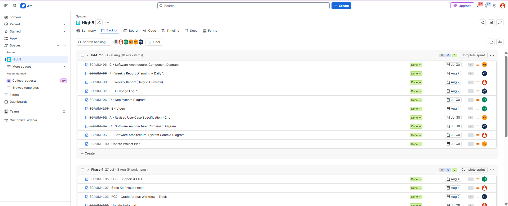
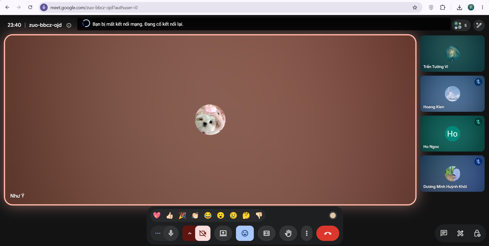

# Meeting Report 16 - Sprint Review (Sprint 4 - PA4)

**Course:** CSC13002 - Introduction to Software Engineering  
**Project Assignment:** PA4-2026  
**Group Name:** High5 (Group 6)  
**Project Name:** MyUS  
**Meeting Type:** Sprint Review  
**Meeting Date:** 07/08/2026  

## 1. Meeting Overview

**Team members present:**

| Student ID | Full Name | Email |
|------------|-----------|-------|
| 24127089 | Hồ Thị Như Ngọc | htnngoc2418@clc.fitus.edu.vn |
| 24127192 | Dương Minh Huỳnh Khôi | dmhkhoi2402@clc.fitus.edu.vn |
| 24127194 | Hoàng Trung Kiên | htkien2415@clc.fitus.edu.vn |
| 24127586 | Trần Tường Vi | ttvi2416@clc.fitus.edu.vn |
| 24127595 | Lê Thị Như Ý | ltny2424@clc.fitus.edu.vn |

This Sprint Review meeting was held online at the end of Sprint 4 to evaluate the PA4-2026 deliverables, review the completed Software Architecture diagrams, verify the implementation of the 2 Functional Groups using Spec Kit, and check the project’s readiness for final submission.

---

## 2. Meeting Objectives

The objectives of this meeting were:

- Review the completion status of all PA4 sections from A to F.
- Evaluate the newly created Software Architecture diagrams (System Context, Container, Component, and Deployment).
- Review the implementation of the two functional groups:
  - Grade Appeal Workflow (Submit & Track)
  - AI Chatbot & Support/FAQ
- Verify Spec Kit artifacts, generated tests, AI Usage report, Weekly reports, and Demo Video.
- Identify any remaining bugs or consistency issues that must be resolved before the final PA4 submission (Deadline: 07/08).

---

## 3. Discussion Points

### 3.1. Review of PA4 Documentation (Sections A - D)

The team reviewed the final versions of the documentation deliverables for PA4:

- **Section A (Revised Use-Case):**
  - The Use-Case model and specifications were revised based on TA feedback from PA3.
  - The Project Plan was updated.
  - A `Changes.md` file was created to explicitly list all modifications.

- **Section B (System Context Diagram):**
  - The tech stack was clearly defined.
  - The C4 Level 1 diagram was drawn using Mermaid syntax to show users and external system dependencies.

- **Section C (Container & Component Diagrams):**
  - The C4 Level 2 (Container) and Level 3 (Component) diagrams were reviewed.
  - The team verified that responsibilities, technologies, and communication protocols (HTTP/HTTPS, database connections) were accurately described and matched the actual source code.

- **Section D (Deployment Diagram):**
  - The infrastructure mapping was documented in Mermaid, showing where containers are deployed (e.g., local machine/cloud).

### 3.2. Review of Implementation (Section E)

The team reviewed the end-to-end implementation of the required functional groups.

The demonstrated functionality included:

- **FG2 (Grade Appeal Workflow):**
  - Reviewed the submission function.
  - Reviewed the tracking features for students to monitor their appeal statuses.

- **FG3 & FG6 (AI Chatbot & Support/FAQ):**
  - Reviewed the integration of the Chatbot for student support.
  - Reviewed the general FAQ and Helpdesk modules.

The backend, frontend, and database components were reviewed to ensure integration consistency across the full stack.

### 3.3. Spec Kit and Testing Review

The team reviewed the Spec Kit artifacts generated during the implementation process:

- `spec.md`
- `plan.md`
- `tasks.md`

The team verified that Spec Kit successfully generated test cases for the features. As per PA4 requirements, these tests were included in the submission bundle, with full refinement deferred to PA5.

### 3.4. Submission and Evidence Review (Section F)

The team reviewed the remaining submission requirements:

- **AI Usage Report:** Updated with logs of tools used during Sprint 4.
- **Weekly Reports:** Planning, Daily meetings, and Review notes were consolidated.
- **Jira Evidence:** Screenshots were taken showing task assignments and "Done" progress.
- **Demo Video:** Reviewed the narration and demonstration of the newly implemented features.

Final checks were made on the repository (`README.md`, Git log) and the `PA4-Group[GroupId].zip` structure.

### 3.5. Issues, Revisions, and Next Actions

- Some final bugs regarding the Chatbot and FG4 dependencies were fixed and merged into the main branch during the meeting.
- The team needs to ensure all `.md` files are exported to PDF properly.

---

## 4. Work Assignment

The team successfully completed tasks based on the planning on **26/07**.

| Task | Detail | Person in Charge |
|------|--------|------------------|
| A | Revised Use-Case Specification (2nd sub) & Project Plan | Hồ Thị Như Ngọc |
| B | Software Architecture: System Context Diagram | Lê Thị Như Ý |
| C | Software Architecture: Container Diagram | Trần Tường Vi |
| C | Software Architecture: Component Diagram | Dương Minh Huỳnh Khôi |
| D | Deployment Diagram | Hoàng Trung Kiên |
| E | Implement Spec Kit (+ tests) & Update `tasks.md` | Lê Thị Như Ý |
| E | Implement FG2: Grade Appeal (Submit) | Hồ Thị Như Ngọc |
| E | Implement FG2: Grade Appeal (Track) | Trần Tường Vi |
| E | Implement FG3: AI Chatbot | Dương Minh Huỳnh Khôi |
| E | Implement FG6: Support/FAQ + Demo Video | Hoàng Trung Kiên |
| F | AI Usage Report & Weekly Report (Planning + Daily 1) | Trần Tường Vi |
| F | Weekly Report (Daily 2 + Review) | Lê Thị Như Ý |

Below is the Jira task screenshot showing task assignments and progress for this sprint (PA4).

---

## 5. Decisions Made

- The Software Architecture diagrams strictly reflect the current implementation. Any inconsistencies identified were resolved during the meeting.
- The `Changes.md` file is finalized and adequately addresses the PA3 TA feedback.
- The generated Spec Kit tests will be submitted as-is, to be refined in PA5.
- The Git log and Jira board screenshots are approved as proof of teamwork.

---

## 6. Next Steps

- Convert all final Markdown documents (`.md`) to PDF format.
- Upload the Demo Video to YouTube (Unlisted) and attach the link.
- Compress all files (excluding `node_modules`, `venv`, etc.) into `PA4-Group06.zip`.
- Submit the package before the strict deadline on **07/08**.

---

## 7. Conclusion

The Sprint 4 Review successfully evaluated the progress and quality of the PA4-2026 deliverables. The team completed the complex Software Architecture documentation using the C4 model and successfully utilized the Spec Kit workflow to implement the Grade Appeal and Support/Chatbot functional groups.

All members agreed to complete the final PDF conversions and jointly verify the zip submission package before the deadline.

---

## 8. Appendix - Evidence

The following screenshot serves as evidence of the Sprint 4 Review meeting held online on **07/08/2026 at 23:40**.

