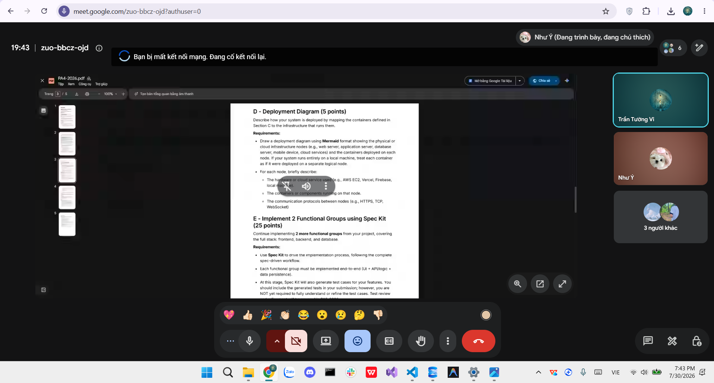

# Meeting Report 14 - Daily Standup 1 & Mid-Sprint Review (Sprint 4 - PA4)

**Course:** CSC13002 - Introduction to Software Engineering  
**Project Assignment:** PA4-2026  
**Group Name:** High5 (Group 6)  
**Project Name:** MyUS  
**Meeting Type:** Daily Standup 1 Meeting (Sprint 4)  
**Meeting Date:** 30/07/2026  

---

## 1. Meeting Overview

**Team members present:**

| Student ID | Full Name | Email |
|------------|-----------|-------|
| 24127089 | Hồ Thị Như Ngọc | htnngoc2418@clc.fitus.edu.vn |
| 24127192 | Dương Minh Huỳnh Khôi | dmhkhoi2402@clc.fitus.edu.vn |
| 24127194 | Hoàng Trung Kiên | htkien2415@clc.fitus.edu.vn |
| 24127586 | Trần Tường Vi | ttvi2416@clc.fitus.edu.vn |
| 24127595 | Lê Thị Như Ý | ltny2424@clc.fitus.edu.vn |

This Daily Standup meeting was held online as a mid-sprint progress review for Sprint 4 (PA4-2026). The primary goal was to evaluate completed milestones up to **30/07/2026** (specifically documentation deliverables and initial feature integrations), identify any potential blockers, and refine action items for the upcoming implementation deliverables leading to the 02/08, 03/08, and 05/08 targets.

---

## 2. Meeting Objectives

The objectives of this Daily Standup 1 Meeting were:

1. Review the completion status of documentation deliverables due on 30/07/2026 (Sections A, B, C, and D).
2. Verify the setup of the Spec Kit environment and the updating of `tasks.md`.
3. Check progress on functional group implementations (FG2 Grade Appeal Submit & Track, FG3 AI Chatbot, and FG6 Support/FAQ).
4. Assess impediments or technical bottlenecks across backend, frontend, or architecture modeling tasks.
5. Set clear action items and targets for the next development sprint phase (31/07 to 05/08).

---

## 3. Discussion Points & Progress Review

### 3.1. Progress Review & Status Updates (as of 30/07/2026)

Each team member presented their progress, completed deliverables, and ongoing work:

- **Hồ Thị Như Ngọc:**
  - **Completed:** Finalized the Revised Use-Case Specification (2nd submission incorporating PA3 TA feedback) and updated the Project Plan (`Revised_Project_Plan_PA4.md` and `Changes.md`) on schedule (30/07).
  - **Completed:** Finished the FG2 Grade Appeal "Submit Appeal" feature end-to-end, including form UI layout and backend submission API integration (30/07).

- **Lê Thị Như Ý:**
  - **Completed:** Created the C4 Level 1 System Context Diagram in Mermaid syntax, mapping external student/admin actors, tech stack definitions, and system boundaries (30/07).
  - **Completed:** Prepared the Spec Kit repository structure (`spec.md`, `plan.md`) and updated `tasks.md` to track PA4 implementation work items (28/07).

- **Trần Tường Vi:**
  - **Completed:** Finalized the C4 Level 2 Container Diagram in Mermaid syntax, illustrating frontend modules, REST APIs, and database interaction paths (30/07).
  - **In Progress:** Working on the FG2 Grade Appeal "Track Appeal Status" feature. Database query handlers and status indicators are under development and on track for the **02/08** deadline.

- **Dương Minh Huỳnh Khôi:**
  - **Completed:** Finalized the C4 Level 3 Component Diagram in Mermaid syntax detailing backend component breakdown (30/07).
  - **In Progress:** Initiated setup for the AI Chatbot & Support Workflow (FG3). Prompt structure design and database context retrieval modules are functional, progressing toward full UI polish by **02/08**.

- **Hoàng Trung Kiên:**
  - **Completed:** Finalized the C4 Deployment Diagram in Mermaid syntax showing container environments and cloud hosting services (30/07).
  - **In Progress:** Preparing environment for FG6 Support/FAQ implementation (drafting static FAQ pages and ticket schemas) and configuring screen recording tooling for demo video production (Target: **05/08**).

---

### 3.2. Architecture Diagrams & Documentation Verification

The team reviewed the four completed C4 architecture diagrams (Sections B, C, and D):

- All diagrams were successfully rendered using Mermaid syntax.
- Initial validation confirmed that system entities, APIs, and container relationships match the planned codebase layout.
- Final peer cross-checks will be conducted during integration testing.

---

### 3.3. Impediments & Risk Assessment

- **Blockers:** No major technical blockers reported.
- **Dependencies:** 
  - Track Appeal Status (Vi) depends on finalized appeal state schemas from Submit Appeal (Ngọc), which have been delivered on time.
  - Demo Video (Kiên) relies on complete UI flows from both Track Appeal and AI Chatbot by 02/08.

---

## 4. Mid-Sprint Work Status Summary

| Section | Deliverable / Task | Person in Charge | Target Date | Status on 30/07/2026 |
|---------|--------------------|------------------|-------------|----------------------|
| A | Revised Use-Case Spec & Project Plan Update | Hồ Thị Như Ngọc | 30/07/2026 | **Completed** |
| B | C4 Level 1: System Context Diagram | Lê Thị Như Ý | 30/07/2026 | **Completed** |
| C | C4 Level 2: Container Diagram | Trần Tường Vi | 30/07/2026 | **Completed** |
| C | C4 Level 3: Component Diagram | Dương Minh Huỳnh Khôi | 30/07/2026 | **Completed** |
| D | C4 Deployment Diagram | Hoàng Trung Kiên | 30/07/2026 | **Completed** |
| E | Spec Kit Setup & `tasks.md` update | Lê Thị Như Ý | 28/07/2026 | **Completed** |
| E | FG2: Grade Appeal - Submit Appeal | Hồ Thị Như Ngọc | 30/07/2026 | **Completed** |
| E | FG2: Grade Appeal - Track Appeal Status | Trần Tường Vi | 02/08/2026 | **In Progress** |
| E | FG3: AI Chatbot & Support Workflow | Dương Minh Huỳnh Khôi | 02/08/2026 | **In Progress** |
| E | Spec Kit Auto-Generated Test Suite | Lê Thị Như Ý | 04/08/2026 | **Scheduled** |
| E | FG6: Support/FAQ & Demo Video Production | Hoàng Trung Kiên | 05/08/2026 | **In Progress** |
| F | Weekly Reports & AI Logs | Trần Tường Vi / Lê Thị Như Ý | 07/08/2026 | **In Progress** |

---

## 5. Decisions & Immediate Action Items

1. **Documentation Sign-off:** Sections A, B, C, and D documentation deliverables are marked as completed for 30/07 milestone and undergo final peer review.
2. **Focus Shift to Functional Groups:** Development focus for 31/07 to 02/08 is shifted entirely to completing FG2 Track Appeal (Vi) and FG3 AI Chatbot (Khôi).
3. **Daily Standup 2 Meeting:** Schedule Daily Standup 2 / Weekly Meeting 2 for **03/08/2026** to review completed implementations and evaluate C4 diagram alignments.
4. **Testing Pipeline:** Ý will begin consolidating Spec Kit auto-generated tests into the project repository structure following feature completion.
5. **Video Preparation:** Kiên will prepare test data and script flow for demo video recording scheduled between 03/08 and 05/08.

---

## 6. Next Steps

- **By 02/08:** Vi to complete Track Appeal UI/API; Khôi to complete AI Chatbot integration.
- **By 03/08:** Conduct Daily Standup 2 / Weekly Meeting 2 to review FG2/FG3 implementations and resolve diagram alignment minor points.
- **By 04/08:** Ý to organize Spec Kit auto-generated test suite.
- **By 05/08:** Kiên to complete FG6 Support/FAQ pages and finish recording the narrated Demonstration Video.
- **By 07/08:** Vi and Ý to consolidate all meeting reports, Jira tracking proof, AI usage logs, convert Markdown files to PDF, and package final submission.

---

## 7. Conclusion

The Daily Standup 1 Meeting confirmed that all documentation tasks (Sections A through D) and the Submit Grade Appeal feature were successfully completed by the 30/07/2026 deadline. Mid-sprint progress remains on schedule without major blockers, establishing a solid foundation for completing the remaining implementation tasks, Spec Kit tests, and demonstration video over the next week.

---

## 8. Appendix - Evidence

The following screenshot serves as proof of the Daily Standup 1 progress review meeting held online on **30/07/2026**.

