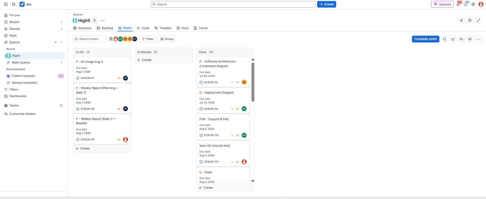
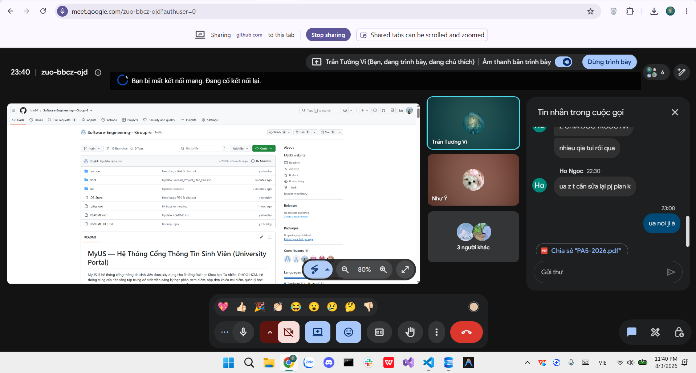

# Meeting Report 15 - Weekly Review & Planning Meeting (Sprint 4 - PA4)

**Course:** CSC13002 - Introduction to Software Engineering  
**Project Assignment:** PA4-2026  
**Group Name:** High5 (Group 6)  
**Project Name:** MyUS  
**Meeting Type:** Weekly Review & Planning Meeting  
**Meeting Date:** 01/08/2026  

## 1. Meeting Overview

**Team members present:**

| Student ID | Full Name | Email |
|------------|-----------|-------|
| 24127089 | Hồ Thị Như Ngọc | htnngoc2418@clc.fitus.edu.vn |
| 24127192 | Dương Minh Huỳnh Khôi | dmhkhoi2402@clc.fitus.edu.vn |
| 24127194 | Hoàng Trung Kiên | htkien2415@clc.fitus.edu.vn |
| 24127586 | Trần Tường Vi | ttvi2416@clc.fitus.edu.vn |
| 24127595 | Lê Thị Như Ý | ltny2424@clc.fitus.edu.vn |

This weekly meeting was held online near the end of Sprint 4 (PA4) to review the completed documentation (Sections A to D), evaluate the current progress on the functional group implementation (Section E), and outline the final tasks needed prior to the sprint review and submission.

---

## 2. Meeting Objectives

The objectives of this Weekly Review & Planning Meeting were:

- Review the Revised Use-Case Specification and updated Project Plan based on previous PA3 feedback (Section A).
- Evaluate the completeness, correctness, and Mermaid syntax of the Software Architecture diagrams:
  - System Context
  - Container
  - Component
  - Deployment (Sections B, C, D)
- Assess the implementation progress of the Grade Appeal Workflow and AI Chatbot & Support functional groups, ensuring alignment with the Spec Kit (Section E).
- Review the auto-generated test cases from the Spec Kit.
- Establish the plan for final quality assurance, demonstration video recording, and PA4 submission preparation.

---

## 3. Discussion Points

### 3.1. Review of Revised Documentation (Section A)

The team reviewed the latest versions of the Revised Use-Case Specifications and Project Plan.

- **Revised Use-Case Specification:** Hồ Thị Như Ngọc reported that the feedback from PA3 was incorporated.
- **Project Plan:** The plan was updated to reflect the new sprint schedule and task assignments for PA4.
- **Changes.md:** The change log was verified to ensure all modifications made after PA3 were clearly documented.

### 3.2. Review of Software Architecture Diagrams (Sections B, C, D)

The team reviewed the C4 model architecture diagrams drafted in Mermaid syntax.

- **System Context Diagram (Level 1):**
  - Lê Thị Như Ý presented the diagram, detailing the tech stack and the system's interactions with students, administrators, and external APIs.

- **Container & Component Diagrams (Levels 2 & 3):**
  - Trần Tường Vi presented the Container Diagram, mapping the frontend, backend, and database modules.
  - Dương Minh Huỳnh Khôi detailed the Component Diagram.
  - A slight mismatch was found between the backend components shown in the diagram and the actual implementation of the AI Chatbot module. Khôi will resolve this discrepancy.

- **Deployment Diagram:**
  - Hoàng Trung Kiên presented the deployment structure, illustrating the cloud hosting services and container deployment mappings.

### 3.3. Progress of Functional Group Implementations (Section E)

The team reviewed the status of the two required functional groups developed end-to-end.

#### FG2: Grade Appeal Workflow

- **Submit:**
  - Hồ Thị Như Ngọc successfully completed the grade appeal submission interface and backend logic ahead of the 30/07 deadline.

- **Track:**
  - Trần Tường Vi demonstrated the progress on the tracking functionality.
  - The integration with the database is mostly complete and is on track for the 02/08 deadline.

#### FG3 & FG6: AI Chatbot & Support/FAQ

- **AI Chatbot:**
  - Dương Minh Huỳnh Khôi showcased the initial chatbot integration.
  - The prompt handling and database context retrieval are functional.
  - Minor UI styling fixes are needed by 02/08.

- **Support/FAQ:**
  - Hoàng Trung Kiên has drafted the FAQ static pages and support ticket schemas.

### 3.4. Spec Kit Artifacts and Testing Review

Lê Thị Như Ý presented the Spec Kit artifacts:

- `spec.md`
- `plan.md`
- `tasks.md`

- The `tasks.md` was successfully updated to track the PA4 components.
- The team confirmed that the Spec Kit has successfully generated test cases for the implemented features.
- As per PA4 guidelines, these tests will be included in the submission bundle but do not require deep refinement until PA5.

### 3.5. Video Demonstration and Submission Preparation

The team outlined the plan for the Section E demonstration video.

- The video will cover both the Grade Appeal Workflow and the AI Chatbot functionalities.
- Hoàng Trung Kiên will handle recording and narration by **05/08**.
- Trần Tường Vi and Lê Thị Như Ý will finalize the AI Usage Reports and Weekly Meeting evidence by **07/08**.

### 3.6. Issues, Revisions, and Next Actions

Before concluding the meeting, the team summarized the main issues requiring attention:

- Fix the Mermaid syntax errors in the Component Diagram to accurately reflect the Chatbot's internal structure.
- Resolve minor styling bugs in the frontend Chatbot window.
- Complete integration testing for the "Track Appeal" module.

---

## 4. Updated Work Assignment (PA4-2026)

Based on the progress review, the team updated the remaining tasks, review responsibilities, and deadlines.

| Section | Description | Person in Charge | Reviewer | Deadline |
|---------|-------------|------------------|----------|----------|
| A | Finalize Revised Use-Case Specs & update Project Plan | Hồ Thị Như Ngọc | Lê Thị Như Ý | 30/07/2026 |
| B | Finalize System Context Diagram (Mermaid) | Lê Thị Như Ý | Trần Tường Vi | 30/07/2026 |
| C | Finalize Container Diagram (Mermaid) | Trần Tường Vi | Dương Minh Huỳnh Khôi | 30/07/2026 |
| C | Fix and finalize Component Diagram (Mermaid) | Dương Minh Huỳnh Khôi | Hồ Thị Như Ngọc | 30/07/2026 |
| D | Finalize Deployment Diagram | Hoàng Trung Kiên | Lê Thị Như Ý | 30/07/2026 |
| E | Finish FG2: Grade Appeal - Submit | Hồ Thị Như Ngọc | Trần Tường Vi | 30/07/2026 |
| E | Finish FG2: Grade Appeal - Track | Trần Tường Vi | Hồ Thị Như Ngọc | 02/08/2026 |
| E | Finish FG3: AI Chatbot | Dương Minh Huỳnh Khôi | Hoàng Trung Kiên | 02/08/2026 |
| E | Complete Spec Kit tasks (`tasks.md`) & generate tests | Lê Thị Như Ý | Trần Tường Vi | 04/08/2026 |
| E | Finish FG6: FAQ/Support & Record Demo Video | Hoàng Trung Kiên | All members | 05/08/2026 |
| F | Finalize AI Usage Report & Weekly Report (Planning + Daily1) | Trần Tường Vi | Lê Thị Như Ý | 07/08/2026 |
| F | Finalize Weekly Report (Daily2 + Review) | Lê Thị Như Ý | Dương Minh Huỳnh Khôi | 07/08/2026 |


---

## 5. Decisions Made

- All software architecture diagrams must strictly utilize standard Mermaid flowchart/graph syntax.
- The generated test cases from the Spec Kit will be included in the source code folder without further manual refinement at this stage.
- The Chatbot interface must handle empty states and connection errors gracefully before the final video recording.
- All final Markdown files must be converted to PDF before zipping into the final submission folder.

---

## 6. Next Steps

- **By 02/08:** Khôi and Vi will finalize their respective implementations for the Chatbot and Appeal Tracking modules.
- **By 04/08:** Ý will ensure all Spec Kit artifacts and generated tests are neatly organized in the repository.
- **By 05/08:** Kiên will complete the Demo Video, upload it to YouTube as Unlisted, and share the link with the team.
- **By 07/08:** Vi and Ý will consolidate all meeting reports, Jira evidence, and AI logs for the final PA4 submission package.

---

## 7. Conclusion

The Weekly Review & Planning Meeting for Sprint 4 successfully verified the drafted Software Architecture diagrams and the progress of the end-to-end functional groups. The C4 models correctly outline the system, with only minor alignment needed on the Component level. The Grade Appeal and Chatbot implementations are mostly functional and on track to meet their deadlines.

The team agreed on the final QA steps, the video recording schedule, and the PDF formatting requirements prior to the final PA4 deadline on **07/08**.

---

## 8. Appendix - Evidence

The following screenshot serves as proof of the weekly project alignment and review meeting held online on **01/08/2026**.


```markdown

```
