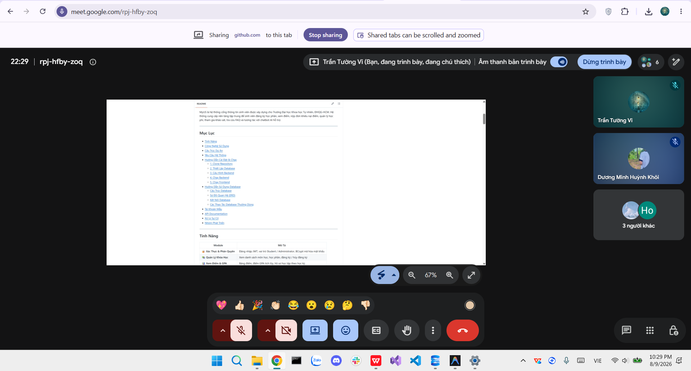

# Meeting Report 14 - Sprint Planning Meeting (Sprint 5 - PA5)

**Course:** CSC13002 - Introduction to Software Engineering

**Project Assignment:** PA5-2026

**Group Name:** High5 (Group 6)

**Project Name:** MyUS

**Meeting Type:** Sprint Planning Meeting (Sprint 5)

**Meeting Date:** 09/08/2026

---

## 1. Meeting Overview

**Team members present:**

| Student ID | Full Name | Email |
| --- | --- | --- |
| 24127089 | Hồ Thị Như Ngọc | htnngoc2418@clc.fitus.edu.vn |
| 24127192 | Dương Minh Huỳnh Khôi | dmhkhoi2402@clc.fitus.edu.vn |
| 24127194 | Hoàng Trung Kiên | htkien2415@clc.fitus.edu.vn |
| 24127586 | Trần Tường Vi | ttvi2416@clc.fitus.edu.vn |
| 24127595 | Lê Thị Như Ý | ltny2424@clc.fitus.edu.vn |

This online meeting was held to allocate tasks for Phase 5 (Administrator Academic Operations) and Phase 6 (Polish & Cross-Cutting Concerns). The scope includes implementing functional groups (FG5, FG7, FG8, FG9), testing, and documentation. Khôi is assigned as the general backup for the entire project.

---

## 2. Meeting Objectives

1. Assign foundational tasks: Generate UI and implement missing functions from previous phases.
2. Allocate Phase 5 tasks: FG7 (Master Schedule Upload), FG8 (Admin Grade Appeal), FG9 (Student Records).
3. Allocate Phase 6 tasks: FG5 (Evaluation Survey).
4. Define the system testing plan
5. Assign responsibilities for document and Weekly Reports.

---

## 3. Discussion Points

### 3.1. Preparation & Additions

* **Dương Minh Huỳnh Khôi** is responsible for generating the initial UI.
* **Trần Tường Vi** will complete the missing legacy functions based on the Use Case specification.

### 3.2. Phase 5 - Administrator Academic Operations

* **FG7:** **Khôi** will build the master schedule upload endpoint (T042), class transfer service (T043), and the corresponding UI (T044).
* **FG8:** **Vi** will handle the grade appeal processing endpoint (T045) and the dashboard UI (T046).
* **FG9:** **Kiên** will implement the student records retrieval endpoint (T047) and the detailed inspection UI (T048).

### 3.3. Phase 6 - Polish & Cross-Cutting Concerns

* **FG5:** **Lê Thị Như Ý** will develop the evaluation survey submission endpoint (T051) and the feedback form UI (T052).

### 3.4. Verification, Testing & Reports (Section A & C)

* **Hồ Thị Như Ngọc** will execute Unit & Integration Tests for Phase 4 (T040, T041), Backend/Frontend Tests for Phase 5 (T049, T050), and complete all Section A documentation (Test Plan, Test Cases, Test Execution, Bug Report).
* **Lê Thị Như Ý** is in charge of Section C (compiling the team's Reflective Reports).
* Weekly Reports are distributed evenly among members according to specific milestones.

---

## 4. Task Allocation (PA5-2026)

| Phase/Section | Task ID / Description | Assignee | Target Deadline |
| --- | --- | --- | --- |
| Preparation | Generate UI | Khôi | 09/08 |
| Preparation | Add missing functions per Use Case | Vi | 10/08 |
| Phase 5 | FG7 - Administrative Class Control | Khôi | 11/08 |
| Phase 5 | FG8 - Appeal Management | Ý | 11/08 |
| Phase 5 | FG9 - Student Data Administration | Kiên | 11/08 |
| Phase 6 | FG5 - Feedback & Evaluation | Ý | 16/08 |
| Phase 4 | Test - Unit & Integration tests Phase 4 | Ngọc | 18/08 |
| Phase 5 | Test - Backend & Acceptance tests Phase 5 | Ngọc | 18/08 |
| Report | Section A - Test Plan, Test Cases, Execution, Bug Report | Ngọc | 18/08 |
| Report | Section C - Reflective reports (Individual compilation) | Ý | 18/08 |
| Reports | Weekly Report: Planning | Ngọc | 21/08 |
| Reports | Weekly Report: Daily 1 | Khôi | 21/08 |
| Reports | Weekly Report: Daily 2 | Kiên | 21/08 |
| Reports | Weekly Report: Review | Vi | 21/08 |

---

## 5. Decisions Made

1. Khôi acts as the general backup for the entire project to mitigate risks.
2. All backend endpoints (T042, T045, T047) must be completed by 11/08 to ensure timely UI integration.
3. Test Plan and Docs (Section A), along with the Reflective Report (Section C), will be submitted concurrently on 18/08.
4. Each member must write 3-5 sentences of personal reflection for Ý to compile into Section C.
5. Progress will be continuously monitored and updated through the Weekly Report milestones.

---

## 6. Next Steps

* **09/08:** Khôi completes UI generation.
* **10/08:** Vi completes missing legacy functions; Ngọc finishes the Planning Report.
* **11/08:** Khôi, Vi, Kiên complete backend endpoints for FG7, FG8, FG9.
* **11/08:** Khôi, Vi, Kiên complete the corresponding UIs.
* **18/08:** Ngọc finishes Phase 4 testing; Khôi updates Daily 1 Report.
* **18/08:** Ngọc finishes Phase 5 testing.
* **16/08:** Ý completes all FG5 tasks.
* **18/08:** Ngọc submits Section A; Ý submits Section C; Kiên updates Daily 2 Report.
* **21/08:** Finalization of the compiled Weekly Report documents.

---

## 7. Conclusion

The Sprint Planning Meeting for PA5 established a clear workflow and deadlines for the administrative modules, evaluation surveys, and testing documentation. The team is committed to a strict schedule to ensure seamless integration between Backend, Frontend, and QA.

---

## 8. Appendix - Evidence

The following screenshot serves as proof of the Sprint Planning Meeting held online on 09/08/2026.

