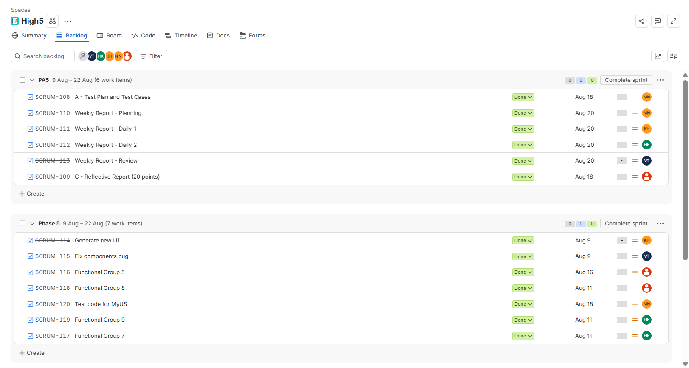
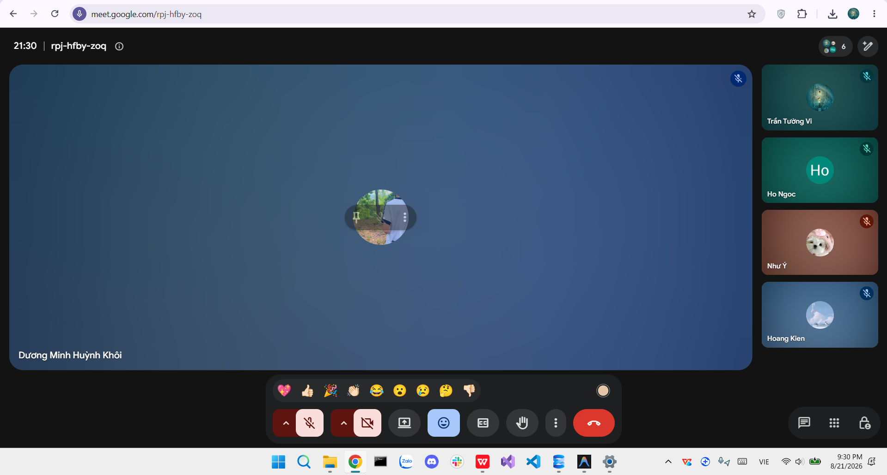

# Meeting Report 20 - Sprint Review (Sprint 5 - PA5)

**Course:** CSC13002 - Introduction to Software Engineering

**Project Assignment:** PA5-2026

**Group Name:** High5 (Group 6)

**Project Name:** MyUS

**Meeting Type:** Sprint Review (Sprint 5)

**Meeting Date:** 21/08/2026

---

## 1. Meeting Overview

**Team members present:**

| Student ID | Full Name | Email |
| --- | --- | --- |
| 24127089 | Hồ Thị Như Ngọc | htnngoc2418@clc.fitus.edu.vn |
| 24127192 | Dương Minh Huỳnh Khôi | dmhkhoi2402@clc.fitus.edu.vn |
| 24127194 | Hoàng Trung Kiên | htkien2415@clc.fitus.edu.vn |
| 24127586 | Trần Tường Vi | ttvi2416@clc.fitus.edu.vn |
| 24127595 | Lê Thị Như Ý | ltny2424@clc.fitus.edu.vn |

This online meeting was held at the conclusion of Sprint 5 to conduct a comprehensive review of all deliverables for Phase 5 (Administrator Academic Operations) and Phase 6 (Polish & Cross-Cutting Concerns), verify test execution results, review documentation (Section A & Section C), and confirm readiness for final project submission.

---

## 2. Meeting Objectives

1. Review completion status of all technical and documentation tasks assigned in the Sprint 5 Planning Meeting (09/08/2026).
2. Evaluate Phase 5 administrative modules: FG7 (Administrative Class Control), FG8 (Appeal Management), and FG9 (Student Data Administration).
3. Evaluate Phase 6 modules: FG5 (Feedback & Evaluation).
4. Review testing deliverables (Section A): Unit & Integration tests for Phase 4 (T040, T041), Backend & Acceptance tests for Phase 5 (T049, T050), and Section A documentation (Test Plan, Test Cases, Execution Results, Bug Report).
5. Review team reflective reports (Section C) compiled by Lê Thị Như Ý and weekly meeting reports.
6. Verify repository organization and final submission archive.

---

## 3. Discussion Points

### 3.1. Review of Preparation & Legacy Additions

* **Dương Minh Huỳnh Khôi** completed the initial UI generation, layout alignment, and UI components required across the new administrative views.
* **Trần Tường Vi** completed missing legacy functions based on the Use Case specification to ensure complete functional coverage and legacy integration.

### 3.2. Review of Phase 5 - Administrator Academic Operations

* **FG7 (Administrative Class Control):** **Khôi** demonstrated the master schedule upload endpoint (T042), class transfer service (T043), and the administrative schedule UI (T044), allowing admins to upload schedule data and manage student class transfers smoothly.
* **FG8 (Appeal Management):** **Ý** presented the grade appeal processing endpoint (T045) and appeal administrative dashboard (T046), enabling academic admins to view, review, approve/reject student appeals, and attach official responses.
* **FG9 (Student Data Administration):** **Kiên** demonstrated the student records retrieval endpoint (T047) and detailed student inspection UI (T048), supporting administrative lookup, filtering, and record verification.

### 3.3. Review of Phase 6 - Polish & Cross-Cutting Concerns

* **FG5 (Feedback & Evaluation):** **Lê Thị Như Ý** presented the evaluation survey submission endpoint (T051) and user feedback UI (T052), allowing students to submit course and instructor evaluation forms seamlessly.

### 3.4. Verification, Testing & Reports (Section A & C)

* **Hồ Thị Như Ngọc** presented the complete Section A documentation (Test Plan, Test Cases, Test Execution Results, and Bug Report). Ngọc executed Unit & Integration tests for Phase 4 (T040, T041) as well as Backend & Acceptance tests for Phase 5 (T049, T050), confirming high test coverage and system stability.
* **Lê Thị Như Ý** compiled Section C (Reflective Reports), consolidating individual reflections from all team members regarding technical contributions, challenges overcome, and overall sprint experience.
* **Weekly Reports:** The team verified that all weekly reports (Planning by Ngọc, Daily 1 by Khôi, Daily 2 by Kiên, and Review by Vi) were fully documented and aligned with sprint milestones.

---

## 4. Task Allocation & Execution Status (PA5-2026)

All tasks planned on 09/08/2026 were reviewed and confirmed as 100% completed:

| Phase/Section | Task ID / Description | Assignee | Target Deadline | Status |
| --- | --- | --- | --- | --- |
| Preparation | Generate UI | Khôi | 09/08 | Completed |
| Preparation | Add missing functions per Use Case | Vi | 10/08 | Completed |
| Phase 5 | FG7 - Administrative Class Control | Khôi | 11/08 | Completed |
| Phase 5 | FG8 - Appeal Management | Ý | 11/08 | Completed |
| Phase 5 | FG9 - Student Data Administration | Kiên | 11/08 | Completed |
| Phase 6 | FG5 - Feedback & Evaluation | Ý | 16/08 | Completed |
| Phase 4 | Test - Unit & Integration tests Phase 4 | Ngọc | 18/08 | Completed |
| Phase 5 | Test - Backend & Acceptance tests Phase 5 | Ngọc | 18/08 | Completed |
| Report | Section A - Test Plan, Test Cases, Execution, Bug Report | Ngọc | 18/08 | Completed |
| Report | Section C - Reflective reports (Individual compilation) | Ý | 18/08 | Completed |
| Reports | Weekly Report: Planning | Ngọc | 21/08 | Completed |
| Reports | Weekly Report: Daily 1 | Khôi | 21/08 | Completed |
| Reports | Weekly Report: Daily 2 | Kiên | 21/08 | Completed |
| Reports | Weekly Report: Review | Vi | 21/08 | Completed |

Below is the Jira task screenshot showing task assignments and progress for this sprint (PA5).

---

## 5. Decisions Made

1. All functional groups (FG7, FG8, FG9, FG5) were formally accepted and approved by the team after successful end-to-end integration testing.
2. Section A (Testing documentation & execution results) and Section C (Reflective reports) were approved for final submission.
3. Automated test execution results (Phase 4 Unit/Integration and Phase 5 Backend/Acceptance) were confirmed passing without blocking issues.
4. The submission package `PA5-Group06.zip` will be built and verified by all members prior to uploading.

---

## 6. Next Steps

* Export all Markdown (`.md`) documentation files across the repository into standard PDF format as required by submission guidelines.
* Conduct a final review of repository files to ensure no temporary artifacts, `node_modules`, or environment keys are included.
* Compress project deliverables into `PA5-Group06.zip`.
* Submit the final archive package on the LMS platform before the official deadline.

---

## 7. Conclusion

The Sprint 5 Review Meeting confirmed the complete and successful execution of all PA5 and Phase 6 tasks. Through effective division of responsibilities, diligent testing, and clear document management, the High5 team has completed all administrative operations, evaluation survey modules, QA reports, and reflective documentation. The project is fully ready for final PA5 submission.

---

## 8. Appendix - Evidence

The following screenshot serves as proof of the Sprint 5 Review Meeting held online on 21/08/2026.

