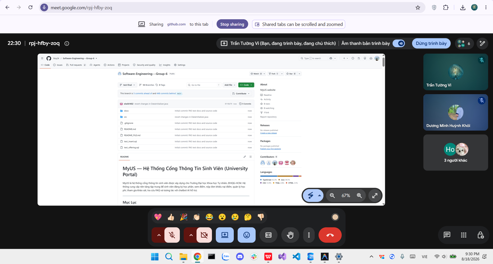

# Meeting Report 19 - Daily Meeting 2 (Sprint 5 - PA5)

**Course:** CSC13002 - Introduction to Software Engineering

**Project Assignment:** PA5-2026

**Group Name:** High5 (Group 6)

**Project Name:** MyUS

**Meeting Type:** Daily Meeting 2

**Meeting Date:** 18/08/2026

## 1. Meeting Overview

**Team members present:**

| Student ID | Full Name             | Email                                                               |
| ---------- | --------------------- | ------------------------------------------------------------------- |
| 24127089   | Hồ Thị Như Ngọc       | [htnngoc2418@clc.fitus.edu.vn](mailto:htnngoc2418@clc.fitus.edu.vn) |
| 24127192   | Dương Minh Huỳnh Khôi | [dmhkhoi2402@clc.fitus.edu.vn](mailto:dmhkhoi2402@clc.fitus.edu.vn) |
| 24127194   | Hoàng Trung Kiên      | [htkien2415@clc.fitus.edu.vn](mailto:htkien2415@clc.fitus.edu.vn)   |
| 24127586   | Trần Tường Vi         | [ttvi2416@clc.fitus.edu.vn](mailto:ttvi2416@clc.fitus.edu.vn)       |
| 24127595   | Lê Thị Như Ý          | [ltny2424@clc.fitus.edu.vn](mailto:ltny2424@clc.fitus.edu.vn)       |

This Daily Meeting was held to review the final implementation, testing, and documentation progress before the Sprint 5 Review. The team focused on completing the tasks scheduled for 18/08, reviewing the results of system testing, and recording remaining issues that would be fixed before the final sprint review.

---

## 2. Meeting Objectives

The objectives of this meeting were:

* Review the final implementation status of FG5, FG7, FG8, and FG9.
* Verify the completion of Phase 4 and Phase 5 testing.
* Review the status of Section A and Section C documentation.
* Identify remaining functional, database, and UI issues.
* Assign final fixes and prepare for the Sprint Review on 21/08.

---

## 3. Discussion Points

### 3.1. Review of Functional Group Implementation

The team reviewed the implementation of all functional groups scheduled for Sprint 5:

* **FG7 (Administrative Class Control):**

  * Khôi completed the master schedule upload and class transfer functionality.
  * During testing, issues were identified in Bulk Import validation and Class Transfer updates.
  * The team noted that the number of available seats and the student's class information should both be updated correctly after a transfer.

* **FG8 (Appeal Management):**

  * Ý completed the grade appeal processing workflow and administrative dashboard.
  * Additional corrections were identified for the fee deadline and grade-appeal score-related functionality.

* **FG9 (Student Data Administration):**

  * Kiên completed the student data administration functionality and dashboard.
  * The Status filter was reviewed and found to have issues with the **Graduated**, **On Leave**, and **Suspended** values because the corresponding migration had not yet been updated.

* **FG5 (Feedback & Evaluation):**

  * Ý completed the evaluation survey functionality and corresponding feedback interface.

### 3.2. Testing Review

Ngọc completed the planned testing activities for PA5:

* Phase 4 Unit & Integration Testing.
* Phase 5 Backend & Acceptance Testing.
* Review and refinement of previously generated test cases.
* Test execution recording.
* Bug Report preparation.

The testing process identified several issues requiring correction:

* Bulk Import returned **"Validation failed"** for files that followed the required column structure.
* Class Transfer did not consistently update seat availability and student class information.
* Course filtering produced incorrect results when two or more filters were used simultaneously.
* Student Data Administration did not correctly filter certain student statuses.
* The admin dashboard required additional layout improvements.
* The Support page was no longer required in the admin interface.

### 3.3. Section A - Test Plan, Test Cases, Execution and Bug Report

The team reviewed Ngọc's Section A documentation.

The test documentation covered the required test plan, test cases, test execution results, and bug reports. The identified failures and defects were recorded for further correction and regression testing.

The team agreed that the documentation should reflect the actual execution results and the defects discovered during the testing process.

### 3.4. Section C - Reflective Reports

Ý completed the compilation of Section C.

The reflective report collected individual reflections from all team members regarding:

* Team experience.
* Spec Kit experience.
* AI tools usage.
* Feedback on the SDLC process.
* Individual contributions and learning.

This follows the PA5 requirement for each member to provide an individual reflection as part of the Reflective Report.

### 3.5. UI and Final Integration Review

The team also reviewed remaining UI issues across the system:

* The login page should default to Light Mode instead of Dark Mode.
* The logo background and visibility should be improved.
* The evaluation chat box required better text visibility.
* Night Mode required improved text contrast.
* The admin dashboard should use a clearer quick-access layout with visible function names and feature blocks.
* The Support page should be removed from the admin interface.

---

## 4. Work Assignment

The team assigned the remaining fixes and final polishing tasks as follows:

| Task                         | Detail                                                               | Person in Charge      |
| ---------------------------- | -------------------------------------------------------------------- | --------------------- |
| Grade Appeal                 | Fix fee deadline functionality and add grade-appeal score adjustment | Lê Thị Như Ý          |
| Student Appeal               | Fix student-side grade appeal deadline functionality                 | Hồ Thị Như Ngọc       |
| Bulk Import                  | Fix validation issue when uploading valid files                      | Dương Minh Huỳnh Khôi |
| Class Transfer               | Update seat count and student class information after transfer       | Dương Minh Huỳnh Khôi |
| Bulk Import / Class Transfer | Improve administrative UI                                            | Dương Minh Huỳnh Khôi |
| Admin Dashboard              | Revise dashboard and quick-access layout                             | Hoàng Trung Kiên      |
| Course Filter                | Fix incorrect results when multiple filters are applied              | Hoàng Trung Kiên      |
| Admin Support                | Remove Support page from admin interface                             | Hoàng Trung Kiên      |
| Student Data Administration  | Fix Status filter and update migration                               | Hoàng Trung Kiên      |
| Login UI                     | Set Light Mode as default interface                                  | Trần Tường Vi         |
| Logo UI                      | Improve logo background and visibility                               | Trần Tường Vi         |
| Evaluation Chat UI           | Improve text visibility in the evaluation chat box                   | Trần Tường Vi         |
| Night Mode                   | Improve text contrast and readability                                | Trần Tường Vi         |

The testing and documentation milestones assigned to Ngọc and Ý were completed on 18/08, consistent with the sprint plan.

---

## 5. Decisions Made

* The main implementation of FG5, FG7, FG8, and FG9 was considered complete.
* Testing and documentation tasks assigned for 18/08 were completed.
* All remaining defects and UI issues were recorded and assigned to specific team members.
* The remaining fixes would be completed on 19/08 and 20/08 before the Sprint Review.
* A final regression and integration check would be performed before the submission package was prepared.

---

## 6. Next Steps

* **19/08:** Ý and Vi complete their assigned functional corrections and UI improvements.
* **20/08:** Khôi, Ngọc, and Kiên complete the remaining functional, database, and UI fixes.
* Re-run affected test cases after the corrections.
* Perform final integration and regression testing.
* Prepare the repository and documentation for the Sprint Review on 21/08.
* Verify the final submission package before submission.

---

## 7. Conclusion

The second Daily Meeting confirmed that the main implementation, testing, and documentation milestones of Sprint 5 had been completed. The team successfully finished the required functional groups and the Section A and Section C deliverables. The remaining work consisted primarily of targeted bug fixes, database migration updates, UI polishing, and regression testing before the final Sprint Review.

---

## 8. Appendix - Evidence

The following screenshot serves as evidence of the Daily Meeting 2 held online on **18/08/2026**.

