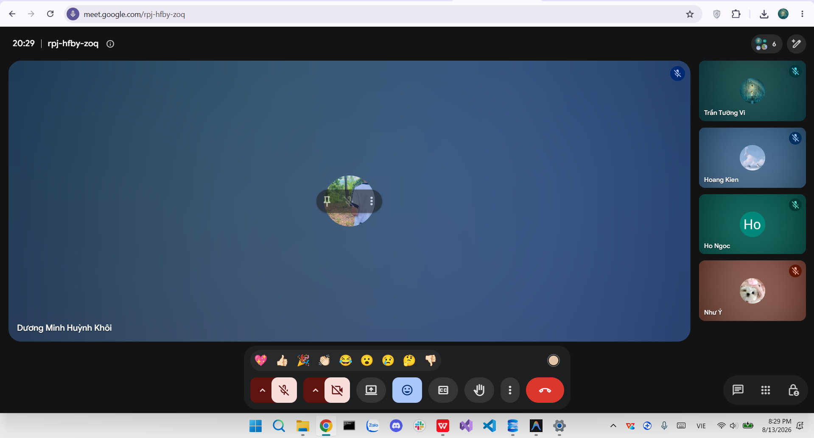

# Meeting Report 18 - Daily Meeting 1 (Sprint 5 - PA5)

**Course:** CSC13002 - Introduction to Software Engineering

**Project Assignment:** PA5-2026

**Group Name:** High5 (Group 6)

**Project Name:** MyUS

**Meeting Type:** Daily Meeting 1

**Meeting Date:** 13/08/2026

## 1. Meeting Overview

**Team members present:**

| Student ID | Full Name             | Email                                                               |
| ---------- | --------------------- | ------------------------------------------------------------------- |
| 24127089   | Hồ Thị Như Ngọc       | [htnngoc2418@clc.fitus.edu.vn](mailto:htnngoc2418@clc.fitus.edu.vn) |
| 24127192   | Dương Minh Huỳnh Khôi | [dmhkhoi2402@clc.fitus.edu.vn](mailto:dmhkhoi2402@clc.fitus.edu.vn) |
| 24127194   | Hoàng Trung Kiên      | [htkien2415@clc.fitus.edu.vn](mailto:htkien2415@clc.fitus.edu.vn)   |
| 24127586   | Trần Tường Vi         | [ttvi2416@clc.fitus.edu.vn](mailto:ttvi2416@clc.fitus.edu.vn)       |
| 24127595   | Lê Thị Như Ý          | [ltny2424@clc.fitus.edu.vn](mailto:ltny2424@clc.fitus.edu.vn)       |

This Daily Meeting was held during Sprint 5 to review the implementation progress of the functional groups assigned in the Sprint Planning Meeting on 09/08. The team focused on verifying the completion of FG7, FG8, and FG9, continuing FG5, and preparing the required testing and documentation for the 18/08 milestone.

---

## 2. Meeting Objectives

The objectives of this meeting were:

* Review the current implementation status of FG7, FG8, FG9, and FG5.
* Verify the integration of the newly implemented backend and frontend functions.
* Identify functional and UI issues before the formal testing stage.
* Review progress on the PA5 testing and documentation requirements.
* Confirm the remaining work needed before the 18/08 deadline.

---

## 3. Discussion Points

### 3.1. Review of Functional Group Implementation

The team reviewed the progress of the functional groups assigned during the Sprint Planning Meeting:

* **FG7 (Administrative Class Control):**

  * Khôi completed the main implementation of the master schedule upload functionality.
  * The class transfer functionality and corresponding administrative UI were also implemented.
  * The team began checking the correctness of class information and seat-related updates during class transfers.

* **FG8 (Appeal Management):**

  * Ý completed the grade appeal processing functionality.
  * The administrative dashboard for reviewing and processing student appeals was also implemented.

* **FG9 (Student Data Administration):**

  * Kiên completed the student records retrieval functionality.
  * The student administration interface and detailed record inspection functions were implemented.
  * Filtering functions were reviewed for consistency with the current database structure.

* **FG5 (Feedback & Evaluation):**

  * Ý continued the remaining work for the evaluation survey submission and feedback interface.
  * The feature remained on schedule for the planned completion date of 16/08.

### 3.2. Integration and Initial Verification

The team performed an initial integration review of the newly implemented features.

Several issues were identified for further verification and correction:

* Bulk Import could display **"Validation failed"** even when the uploaded file contained the required columns.
* Class Transfer required additional checking to ensure that the number of available seats and the student's class were updated correctly after a successful transfer.
* Course filtering needed to be tested when multiple filters were used at the same time.
* Student Data Administration filters needed to be verified against the latest database schema and migration.
* Several administrative interfaces required additional UI consistency checks.

The identified issues were recorded for subsequent fixing and regression testing.

### 3.3. Testing and Documentation Preparation

Ngọc continued preparing the testing activities required for PA5, including:

* Unit and Integration Testing for Phase 4.
* Backend and Acceptance Testing for Phase 5.
* Refinement and review of previously generated test cases.
* Preparation of execution results and Bug Report documentation.

Ý also continued preparing Section C, while the team reviewed the requirements for the individual reflective reports.

### 3.4. Remaining Work

The team agreed that the main implementation work was progressing according to the sprint plan, while the remaining effort should focus on:

* Completing FG5.
* Executing and documenting the required tests.
* Fixing issues discovered during integration.
* Finalizing Section A and Section C before 18/08.

---

## 4. Work Assignment

The team reviewed the task allocation from the Sprint Planning Meeting and confirmed the current responsibilities:

| Task                     | Detail                                        | Person in Charge                      |
| ------------------------ | --------------------------------------------- | ------------------------------------- |
| FG7                      | Administrative Class Control                  | Dương Minh Huỳnh Khôi                 |
| FG8                      | Appeal Management                             | Lê Thị Như Ý                          |
| FG9                      | Student Data Administration                   | Hoàng Trung Kiên                      |
| FG5                      | Feedback & Evaluation                         | Lê Thị Như Ý                          |
| Testing                  | Phase 4 Unit & Integration Tests              | Hồ Thị Như Ngọc                       |
| Testing                  | Phase 5 Backend & Acceptance Tests            | Hồ Thị Như Ngọc                       |
| Section A                | Test Plan, Test Cases, Execution & Bug Report | Hồ Thị Như Ngọc                       |
| Section C                | Reflective Reports                            | Lê Thị Như Ý                          |
| UI / Integration Support | UI generation and integration support         | Dương Minh Huỳnh Khôi / Trần Tường Vi |

The functional-group assignments are consistent with the Sprint Planning Meeting, which assigned FG7 to Khôi, FG8 to Ý, FG9 to Kiên, FG5 to Ý, and the testing and Section A documentation to Ngọc.

---

## 5. Decisions Made

* FG7, FG8, and FG9 are considered functionally implemented and will proceed to detailed testing and integration verification.
* FG5 will continue to be completed before its planned deadline on 16/08.
* Issues discovered during initial integration will be documented and fixed before the final testing stage.
* Testing and documentation activities will remain the priority for the 18/08 milestone.
* All members will review their assigned features before the next daily meeting.

---

## 6. Next Steps

* Complete the remaining FG5 implementation by 16/08.
* Continue Phase 4 and Phase 5 testing.
* Refine generated test cases and document their execution results.
* Fix issues discovered during the integration review.
* Finalize Section A and Section C documentation by 18/08.
* Perform another full review of the functional groups before the Sprint Review.

---

## 7. Conclusion

The Daily Meeting confirmed that the main functional groups for Sprint 5 were progressing according to the planned schedule. FG7, FG8, and FG9 had reached the implementation stage, while FG5 was still being finalized. Initial integration testing identified several functional and UI issues, which were assigned for correction before the formal testing and documentation deadlines.

---

## 8. Appendix - Evidence

The following screenshot serves as evidence of the Daily Meeting 1 held online on **13/08/2026**.

