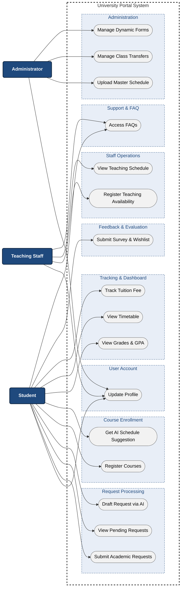

## 3. Key Features and Functional Groups
*Performed by: Lê Thị Như Ý | Reviewed by: Hoàng Trung Kiên | Edited by: Lê Thị Như Ý*

The application is designed to serve three distinct actors: Students, Teaching Staff (CBVC), and Administrators. The system is organized into 9 functional groups to comprehensively streamline academic operations.

### ACTOR 1: STUDENT 

#### Functional Group 1: Profile & Account Management
* **Student Profile Update:** This feature allows students to view and update their personal information and contact details. It ensures seamless communication between the university and the student, preventing missed critical announcements or administrative errors due to outdated records.

#### Functional Group 2: Request & Certificate Processing
* **Application Submission:** Students can submit various academic requests, such as grade appeals or certificate issuances, directly through the portal. This eliminates physical paperwork and long queues, significantly reducing the turnaround time for student requests.
* **AI-Assisted Request Drafting:** This tool utilizes AI to generate formal request templates based on simple user keywords. It helps students who struggle with formal writing express their issues professionally, reducing rejection rates due to formatting or clarity issues.

#### Functional Group 3: Course Enrollment System
* **Standard & Specialized Course Registration:** Users can self-enroll in both mandatory subjects and specialized academic topics for upcoming semesters. This gives students full autonomy over their academic path, ensuring they can secure necessary credits for timely graduation.
* **AI-Powered Schedule Suggestion:** The system analyzes the student's completed courses to automatically recommend an optimal study schedule. This minimizes schedule clashes and optimizes free time, reducing the cognitive load and stress associated with manual course planning.

#### Functional Group 4: Academic Performance Tracking
* **Grade Viewing & GPA Calculation:** Students can monitor their real-time academic results and view their automatically calculated cumulative GPA. This provides immediate visibility into their academic standing, empowering students to proactively adjust their study habits before final evaluations.

#### Functional Group 5: Schedule & Financial Monitoring
* **Timetable & Exam Scheduling:** This feature displays a personalized calendar containing daily class hours, locations, and upcoming examination dates. It prevents missed classes or exams by offering a reliable, centralized source of truth for the student's daily obligations.
* **Tuition Fee Tracking:** Users can view their current tuition balance, payment history, and impending financial deadlines. This promotes financial transparency and helps families plan payments ahead of time, avoiding unnecessary late fees.

#### Functional Group 6: Feedback & Information Hub
* **Surveys & Course Wishlist:** Students can participate in course evaluations and add desired future classes to a personal wishlist. This gives students a voice in shaping the curriculum and allows the administration to forecast demand for upcoming semesters accurately.
* **Centralized FAQ Access:** This module provides a comprehensive repository of frequently asked questions regarding university policies. It provides instant problem resolution for students, drastically reducing the support ticket volume for the administrative departments.

### ACTOR 2: TEACHING STAFF 

#### Functional Group 7: Staff Teaching Operations
* **Teaching Availability Registration:** Teaching staff can input their available hours and preferred time slots for the upcoming academic terms. This respects the instructors' time constraints and research commitments, leading to more effective scheduling by the administration.
* **Instructor Schedule Management:** Teachers can view their finalized teaching timetables, including class rosters and assigned room locations. This ensures instructors are thoroughly prepared for their specific classes and can manage their daily teaching workflow without confusion.

### ACTOR 3: ADMINISTRATOR 

#### Functional Group 8: Administrative Class Control
* **Master Schedule Uploading:** Administrators can upload and publish the global academic calendar, exam periods, and course schedules to the system. This centralizes the university's operational timeline, ensuring all students and staff are synchronized and preventing logistical chaos.
* **Student Class Transfer Management:** This tool enables administrators to process and approve requests for moving students between different class sections. It provides administrative flexibility to balance class sizes dynamically and resolve critical student scheduling conflicts efficiently.

#### Functional Group 9: System Form Administration
* **Dynamic Form Management:** Administrators have the ability to create, edit, and categorize various submission forms used across the portal. This makes the portal highly adaptable to new university policies without requiring constant developer intervention, saving long-term maintenance costs.
