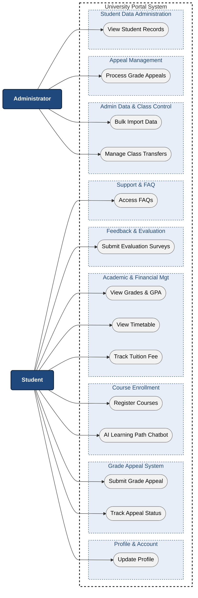

# PROJECT PROPOSAL - MyUS 

## 1. Introduction

*Performed by: Hồ Thị Như Ngọc | Reviewed by: Dương Minh Huỳnh Khôi | Edited by: Dương Minh Huỳnh Khôi, Hồ Thị Như Ngọc*

In a university environment, an integrated academic portal is essential for streamlining operations and connecting the institution with its learners. To meet this demand, MyUS is developed as an academic portal with AI integration that fully digitalizes daily administrative and academic activities, establishing a unified workspace for students and administrators. The platform handles comprehensive operations, from tracking grades and calculating GPA to course registration and resolving online grade appeals.

MyUS combines administrative efficiency with a data-driven digital learning environment. Additionally, an integrated chatbot provides learning path recommendations to support students throughout their studies. The platform eliminates paperwork, saves time, and ensures the accuracy and security of educational data. 

---

## 2. Target Users and Environments
*Performed by: Hoàng Trung Kiên | Reviewed by: Trần Tường Vi | Edited by:*

MyUS is designed to serve three primary user groups within the university, including students and administrators. Each group interacts with the platform through role-specific functionalities suited to their academic or administrative needs.

### 2.1. Target Users

#### Students

Students are the main users of the system. They use MyUS to manage academic activities such as course registration, viewing schedules, tracking grades, monitoring tuition fees, submitting academic requests, and accessing personalized course wishlists. The platform also supports AI-powered features, namely course schedule recommendations for undergraduates.

#### Administrators

Administrators are responsible for maintaining and operating the system. Their tasks include uploading academic schedules, managing forms and requests, handling class transfers, approving student submissions, and monitoring overall system operations.

### 2.2. Operating Environments

MyUS is developed as a web-based application to ensure accessibility and flexibility across multiple platforms and devices.

#### Supported Devices

* Desktop computers
* Laptops
* Tablets
* Smartphones

#### Supported Operating Systems

* Windows
* macOS
* Linux
* Android
* iOS

#### Supported Platforms and Technologies

* Modern web browsers such as Google Chrome, Microsoft Edge, Mozilla Firefox, and Safari
* Responsive web interface for both desktop and mobile environments
* Cloud-based database and server infrastructure for centralized data management

The system is designed to provide a consistent and user-friendly experience across different environments while ensuring data security, reliability, and scalability for future expansion.

---

## 3. Key Features and Functional Groups
*Performed by: Lê Thị Như Ý | Reviewed by: Hoàng Trung Kiên | Edited by: Lê Thị Như Ý*

### 3.1. System Use Case Diagram

The system is streamlined to serve two main actors: Students and Administrators. It is organized into 9 functional groups to ensure efficient university operations and data management.

### ACTOR 1: STUDENT 

#### Functional Group 1: Profile & Account Management
* **Student Profile Update:** This feature allows students to independently manage and update their personal information, contact details, and emergency contacts. Keeping this data current ensures seamless communication between the university and the student, preventing missed announcements or administrative errors.

#### Functional Group 2: Grade Appeal System
* **Submit Grade Appeal:** Students can digitally submit requests to review their exam grades directly through the portal. This replaces physical paperwork and ensures the request is immediately routed to the academic department.
* **Track Appeal Status:** A visual dashboard where students can monitor the real-time processing status of their grade appeal (e.g., Pending, Processing, Resolved). The system also clearly displays the deadline for the student to visit the academic office to complete the appeal fee payment.

#### Functional Group 3: Course Enrollment System
* **Standard & Specialized Course Registration:** This core module enables students to browse available subjects, check prerequisite conditions, and self-enroll in classes for the upcoming semester. It gives students full control over their academic progression and graduation timeline.
* **AI Learning Path Chatbot:** An intelligent virtual assistant designed to help students navigate their academic roadmap. Based on the student's major and completed credits, the chatbot suggests the most suitable courses to take next, keeping them on track for graduation.

#### Functional Group 4: Academic & Financial Management
* **Grade Viewing & GPA Calculation:** Students can access a detailed breakdown of their academic performance, including midterms, assignments, and final scores. The system also displays an automatically updated cumulative GPA to help students closely track their learning progress.
* **Timetable & Exam Scheduling:** This feature aggregates all registered courses and upcoming exams into a clear, personalized calendar. It displays exact class times and room locations, keeping students organized so they never go to the wrong room or miss an exam.
* **Tuition Fee Tracking:** Users can view a comprehensive breakdown of their financial status, including tuition balances, applied scholarships, payment history, and impending deadlines. This financial transparency helps students and their families plan their payments effectively.

#### Functional Group 5: Feedback & Evaluation
* **Submit Evaluation Surveys:** At the end of each semester, students can complete structured surveys to evaluate course quality, lecturer performance, and campus facilities. This provides the university with essential data to improve the learning environment.

#### Functional Group 6: Support & FAQ
* **Centralized FAQ Access:** A comprehensive, searchable library containing common questions and answers about university policies, academic rules, and IT support. This allows students to find instant solutions independently without waiting for helpdesk responses.

### ACTOR 2: ADMINISTRATOR 

#### Functional Group 7: Administrative Class Control
* **Master Schedule Uploading:** Administrators can upload and manage the global academic calendar, exam periods, and entire course offerings. This keeps all students and staff synchronized under one centralized timeline and prevents scheduling conflicts across departments.
* **Student Class Transfer Management:** This tool gives administrators the flexibility to manually move students between different class sections. It is essential for resolving unexpected scheduling conflicts, handling special cases, and balancing class sizes effectively.

#### Functional Group 8: Appeal Management
* **Process Grade Appeals:** A centralized dashboard where administrators receive and review student grade appeal requests. Admins can update the processing status and input a specific deadline date, notifying the student of exactly when they need to visit the office to pay the required fee.

#### Functional Group 9: Student Data Administration
* **View Student Records:** Administrators have privileged access to search and view detailed student profiles, including personal information, contact details, and academic standing. This is crucial for verifying student identities, contacting families during emergencies, and providing direct support when students encounter system issues.

---

# 4. AI-Powered Feature - AI Learning Path Chatbot
*Performed by: Trần Tường Vi | Reviewed by: Hồ Thị Như Ngọc | Edited by: Trần Tường Vi*

To improve the overall academic experience, MyUS integrates an advanced AI-driven  assistant designed to help students navigate their academic roadmap and keep them on track for graduation.

## 4.1. Feature Description
Navigating a university curriculum can be overwhelming, especially when balancing prerequisites and graduation timelines. 

This feature integrates an AI-driven chatbot directly into the system to dynamically guide students' academic journeys:

**1. Profile & Progress Analysis:** The chatbot automatically retrieves the student's academic transcript to analyze their current major, completed credits, and remaining degree requirements against the official university curriculum standards.

**2. Smart Course Suggestion:** By mapping the prerequisite and corequisite constraints, the AI dynamically filters out locked subjects and suggests the most optimal courses to take next based on the student's academic standing.

**3. Graduation Tracking:** The chatbot continuously simulates different academic pathways and tracks credit accumulation, ensuring students clear milestone requirements and stay on a predictable, optimized timeline for on-time graduation.

## 4.2 User Experience Enhancement

Compared to traditional methods where students must manually cross-check curriculum handbooks or wait for appointments with academic advisors, this feature:

* Provides 24/7 instant, personalized academic counseling tailored to each student's unique progress.

* Simplifies long-term planning by visualizing clear academic milestones and next steps.

* Minimizes the risk of delayed graduation due to missed prerequisite chains or miscalculated credit requirements.
