# MyUS Portal - Use-Case Specification

---

# Table of Contents
| # | Use Case | Actor(s) |
|---|----------|----------|
| UC-01 | Authenticate / Login | Student |
| UC-02 | Update Profile | Student |
| UC-03 | Register for Courses | Student |
| UC-03a | Check Prerequisites | Student, System |
| UC-04 | View Timetable | Student |
| UC-05 | View Grades & GPA | Student |
| UC-06 | Track Tuition Fee | Student |
| UC-07 | Submit Grade Appeal | Student |
| UC-07a | Upload Supporting Documents | Student |
| UC-08 | Track Appeal Status | Student |
| UC-09 | Submit Evaluation Surveys | Student |
| UC-10 | Access Help & Support | Student |
| UC-10a | Access FAQs | Student |
| UC-10b | AI Learning Assistant (Chatbot) | Student, AI Engine |
| UC-11 | Admin Bulk Data and Class Control | Administrator |
| UC-11a | Import Student/Course Data | Administrator |
| UC-11b | Validate Data Format | Administrator |
| UC-12 | Appeal Processing Management | Administrator |
| UC-12a | Set Fee Payment Deadline | Administrator |
| UC-12b | Update Appeal Status | Administrator |
| UC-13 | Student Data Administration | Administrator |
| UC-13a | Search Student Records | Administrator |

---

# UC-01. Authenticate / Login

**Use-Case ID:** UC-01

**Actor(s):** Student, Administrator (via generalized `User` actor)

## 1. Brief Description
Describes how a registered user (Student or Administrator) logs into the MyUS portal using their university credentials (username/Student ID and password) via the `/api/auth/login` endpoint to establish a JWT-authenticated session and access their role-specific dashboard. Includes forgot password and password reset workflows via 6-digit verification codes (`/api/auth/forgot-password` and `/api/auth/reset-password`).

## 2. Preconditions
- The user has an active MyUS portal account (Student ID or Admin username with password) provisioned in the database.
- The user has internet access and a supported modern web browser.

## 3. Flow of Events
### 3.1 Basic Flow
1. User navigates to the MyUS login page (`/login`).
2. System displays the authentication interface (Username/Student ID and Password fields).

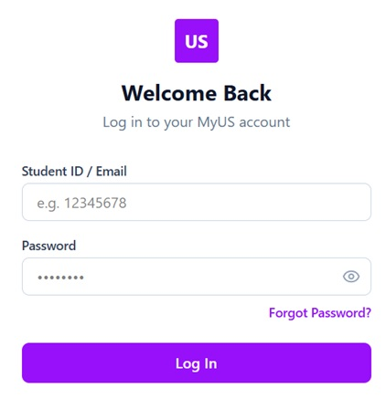

3. User enters their Student ID / username and password, then clicks "Log In".
4. Client sends a `POST /api/auth/login` request containing the authentication payload.
5. System validates credentials against the database using Spring Security `AuthenticationManager` and BCrypt password verification.
6. System generates a signed JWT token containing user identity and role authority (`ROLE_STUDENT` or `ROLE_ADMIN`), alongside token expiration metadata (`expirationMs`).
7. Client stores the JWT token in state and redirects the user to their personalized Dashboard (`/dashboard` for students, `/admin` for administrators).

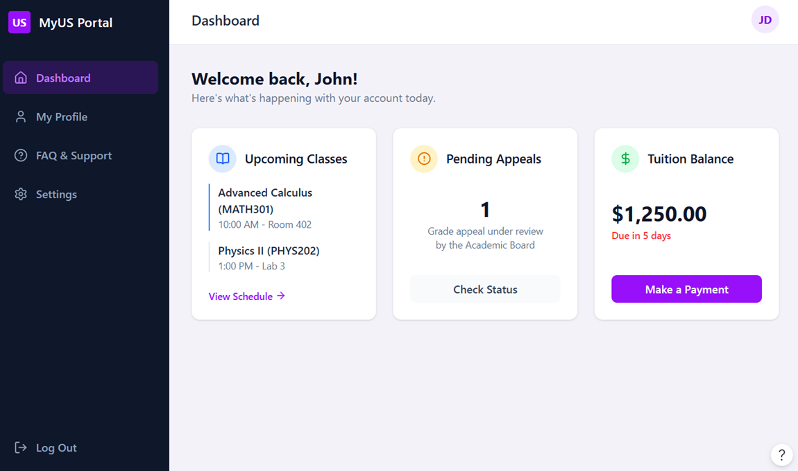

### 3.2 Alternative Flows
- **3.2.1 AF1 – Invalid Input / Authentication Failure (branches at step 3/5):** If the user enters a password shorter than 6 characters, client validation displays an inline warning ("Password must be at least 6 characters"). If credentials are incorrect, system displays an error alert ("Invalid Student ID or password") and retains user on the login screen.

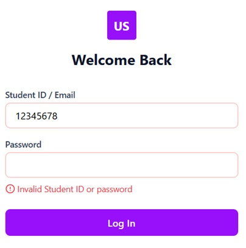

- **3.2.2 AF2 – Forgot Password & Verification Code Workflow (branches at step 3):** 
  1. User selects "Forgot Password" on the login screen, navigating to `/forgot-password`.
  2. User enters their registered Student ID / username and submits.
  3. System verifies student existence, invalidates prior unused reset tokens, generates a 6-digit verification code (`PasswordResetToken`, valid 15 minutes), and returns masked email details (e.g. `2412****@student.hcmus.edu.vn`).

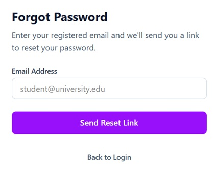

  4. User enters the 6-digit verification code, new password, and password confirmation, then submits.
  5. System validates the non-expired token via `POST /api/auth/reset-password`, updates the BCrypt-encoded password in the database, marks the token as used, and redirects to the login screen with a success notice.

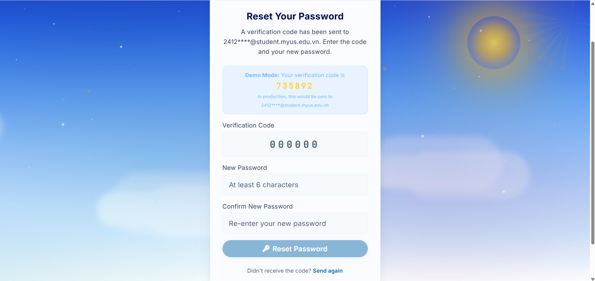

- **3.2.3 AF3 – Session Expiry (post-login):** If the JWT access token expires during a session, subsequent API requests receive an HTTP 401 error. Client clears authentication state, displays a session timeout notification, and redirects to the login page.
- **3.2.4 AF4 – Account Suspension / Inactive Hold (branches at step 5):** If the student account is marked inactive or suspended by administration, login is rejected and an administrative hold notice is displayed directing the user to contact the Academic Office.

## 4. Postconditions
- Success: JWT access token issued; authenticated user redirected to role dashboard (`/dashboard` or `/admin`).
- Failure: No session created; user remains on Login screen with appropriate error notice.

## 5. Special Requirements
- Passwords must be encoded using BCrypt hashing (minimum 10 strength rounds); plaintext passwords are never logged or stored.
- Communication between client and REST APIs must use HTTPS/TLS 1.2+.
- JWT tokens expire automatically based on system configuration (`expirationMs`).
- All protected REST endpoints require standard Bearer JWT header validation and return HTTP 401 on unauthenticated access.

## 6. Extension Points
- None.

## 7. Prototype Requirement
- Login Screen (`Prototype_Req/student/Login.jpg`)
- Personalized Dashboard (`Prototype_Req/student/Dashboard.jpg`)
- Invalid Credentials State (`Prototype_Req/student/InvalidLogin.jpg`)
- Forgot Password Request Screen (`Prototype_Req/student/forgotpass.jpg`)
- Reset Password Verification Screen (`Prototype_Req/student/resetpass.jpg`)

---
# UC-02. Update Profile

**Use-Case ID:** UC-02

**Actor(s):** Student

## 1. Brief Description
Allows an authenticated student to view their academic profile information (`GET /api/v1/profile`) and update allowable personal contact details (phone number and address via `PUT /api/v1/profile`) while protecting official academic records from unauthorized modification.

## 2. Preconditions
- Student is authenticated with a valid JWT token (UC-01).

## 3. Flow of Events
### 3.1 Basic Flow
1. Student navigates to "My Profile" (`/profile`).

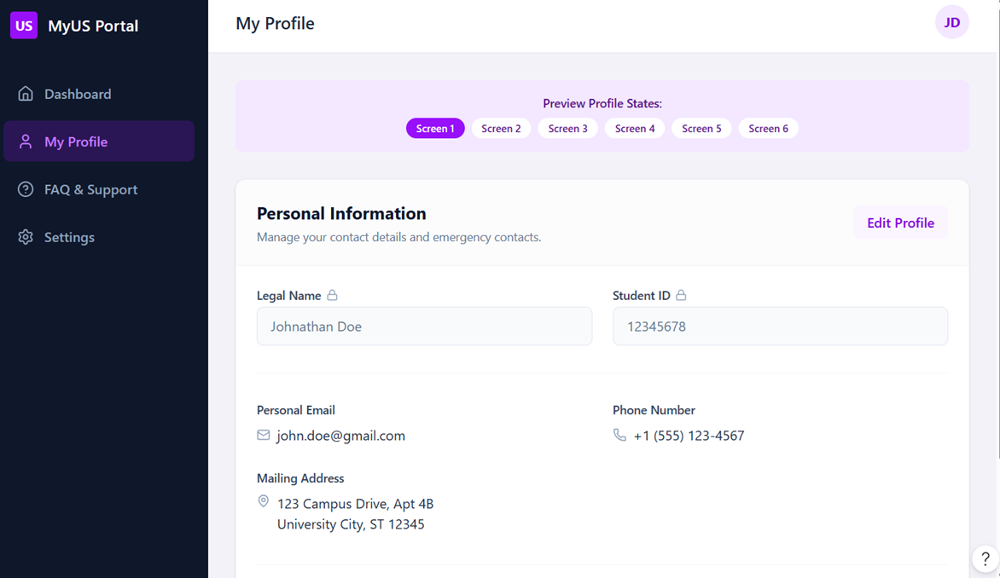

2. System fetches profile data via `GET /api/v1/profile` and displays student information: Student ID, Full Name, Email, Major, Date of Birth, Student Type, Enrollment Status, and current contact details (Phone, Address).
3. Student selects "Edit Profile".

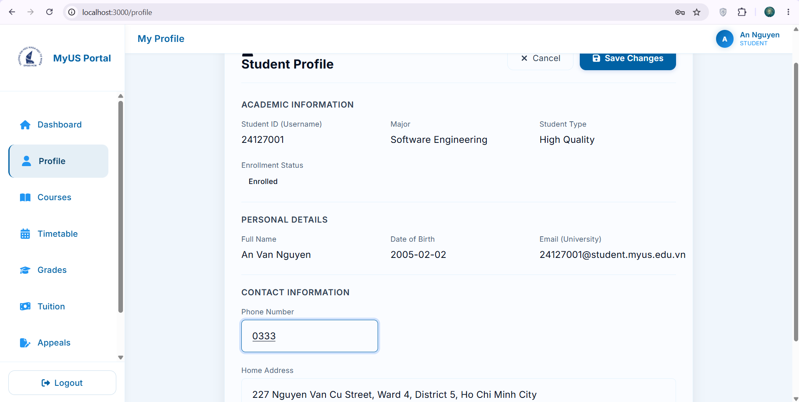

4. System enables input fields for allowable student-editable attributes (Phone, Address) while displaying administrative fields (Student ID, Name, Email, Major) as read-only.
5. Student modifies their phone number or address and selects "Save Changes".
6. System validates input formatting on both client and server (valid phone format, non-empty address).
7. Client submits a `PUT /api/v1/profile` request with the updated profile DTO.
8. System updates the student entity (`phone`, `address`), records the update timestamp (`updatedAt`), and returns the updated `StudentProfileResponse`.
9. System displays a "Profile updated successfully" confirmation toast.

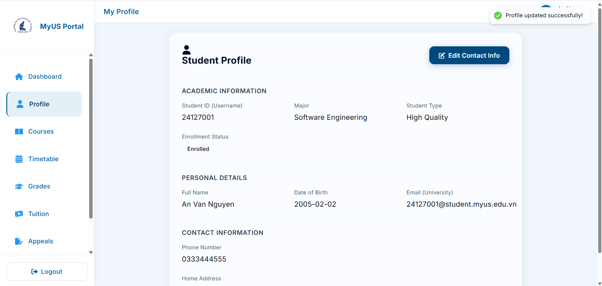

### 3.2 Alternative Flows
- **3.2.1 AF1 – Input Validation Error (branches at step 6):** If the phone number or address fails formatting rules, system displays an inline validation message and blocks submission until corrected.
- **3.2.2 AF2 – Cancel Profile Edit (branches at step 4/5):** Student selects "Cancel"; unsaved edits are discarded and the form reverts to the read-only view mode.
- **3.2.3 AF3 – Attempt to Modify Administrative / Locked Fields (branches at step 4):** Official identity fields (Student ID, Name, Major, Enrollment Status) remain locked; system displays a notification stating that official academic record modifications require a formal petition to the Academic Office.

## 4. Postconditions
- Success: Updated phone number and/or address saved to the database; timestamp updated.
- Failure: Database record unchanged; original profile details retained.

## 5. Special Requirements
- Role-based access control enforces that students can only access and update their own profile (`@PreAuthorize("hasRole('STUDENT')")`).
- Sensitive administrative fields must be strictly protected on the backend service layer (`ProfileServiceImpl`).

## 6. Extension Points
- None.

## 7. Prototype Requirement
- Profile View Screen (`Prototype_Req/student/myprofile.jpg`)
- Profile Edit Screen (`Prototype_Req/student/changePro.jpg`)
- Save Confirmation Notification (`Prototype_Req/student/successchange.jpg`)

---
# UC-03. Register for Courses

**Use-Case ID:** UC-03

**Actor(s):** Student; includes UC-03a (Check Prerequisites)

## 1. Brief Description
Enables an authenticated student to search and browse course offerings (`GET /api/courses`) under the "Browse Courses" tab, review section details (schedule, instructor, capacity, available seats), check prerequisite compliance via UC-03a, verify maximum per-term credit limits (24 credits), detect schedule time conflicts, register directly (`POST /api/registrations`), view registered courses under the "My Registrations" tab (`GET /api/registrations/me`), and drop active enrollments (`PUT /api/registrations/{id}/drop`).

## 2. Preconditions
- Student is authenticated with a valid JWT token.
- Course offerings exist in the system for the selected registration term.

## 3. Flow of Events
### 3.1 Basic Flow
1. Student navigates to "Course Registration" (`/courses`).
2. System presents the course page with two main sub-tabs: **Browse Courses** (active tab) and **My Registrations**.

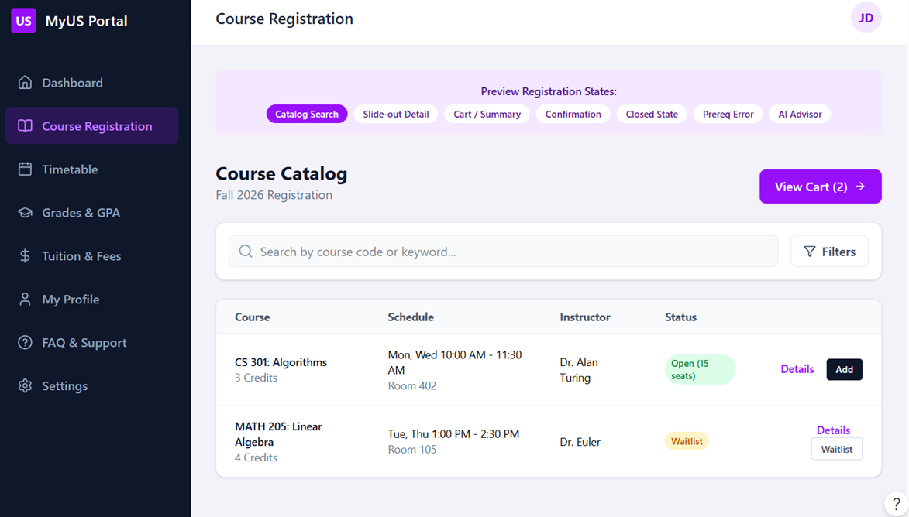

3. Under **Browse Courses**, student searches or filters offerings by term (`HKI 2025-2026`, `HKII 2025-2026`, `HKIII 2025-2026`) or department.
4. Student selects an open course offering and clicks "Register".
5. System executes **UC-03a (Check Prerequisites)** against the student's completed course history.
6. System verifies section seat availability (`enrolledCount < capacity`) and checks term credit limits (current registered credits + new course credits ≤ 24 credits).
7. System checks for schedule time overlaps against active enrollments and displays a schedule conflict warning banner if a time overlap exists.

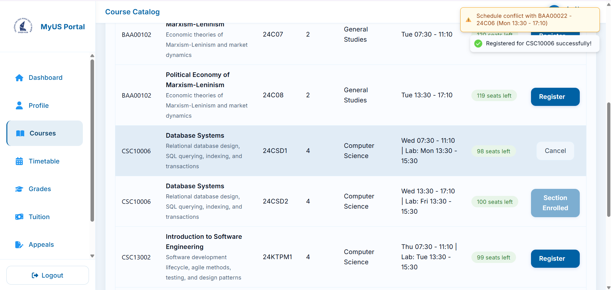

8. Client submits `POST /api/registrations` to register the course.
9. Backend creates a `CourseRegistration` record with status `Enrolled` and updates seat counts.
10. System displays a success confirmation toast ("Registered successfully!").

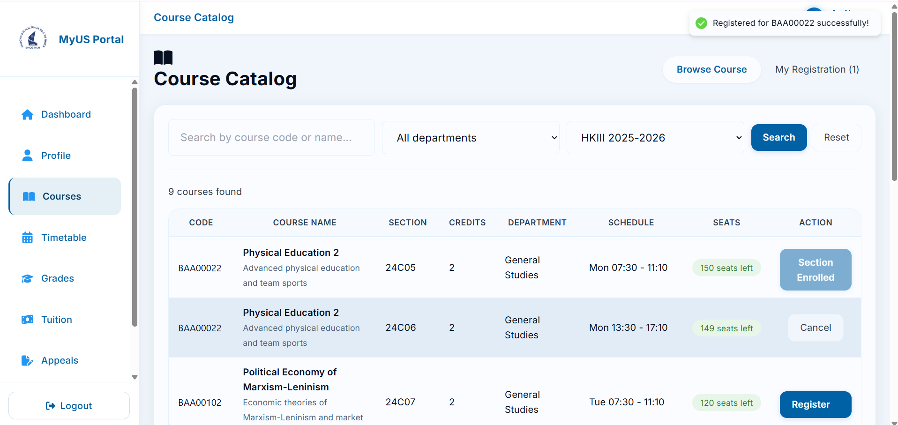

11. Student switches to the **My Registrations** tab to view all registered courses, credit totals, section details, and active enrollment status.

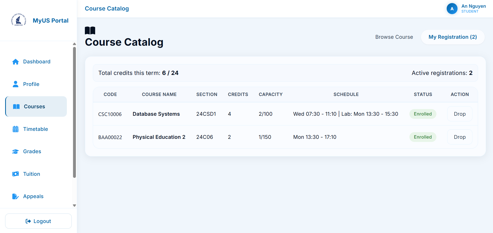

### 3.2 Alternative Flows
- **3.2.1 AF1 – Prerequisite Requirement Unmet (branches at step 5):** UC-03a returns a failure; enrollment is blocked; system displays an error identifying the missing prerequisite course code.
- **3.2.2 AF2 – Course Offering Full (branches at step 6/8):** Available seats = 0 (`enrolledCount >= capacity`). System rejects registration with an `EnrollmentException` ("Course offering is full").
- **3.2.3 AF3 – Credit Limit Exceeded (branches at step 6/8):** Total credits exceed the maximum 24 credits per semester. System blocks registration with an `EnrollmentException` ("Credit limit exceeded for term... max allowed: 24 credits").
- **3.2.4 AF4 – Duplicate Registration (branches at step 6/8):** Student is already registered for the offering (`status = Enrolled`). System rejects duplicate registration.
- **3.2.5 AF5 – Schedule Conflict Warning (branches at step 7):** If meeting schedules overlap in day and time slot, enrollment is completed with warning messages in the response DTO.
- **3.2.6 AF6 – Drop a Registered Course (post-submission):** Student switches to **My Registrations** tab (`cart.jpg`), views enrolled courses, and selects "Drop Course" (`PUT /api/registrations/{id}/drop`). System updates registration status to `Dropped`, decrements seat count, and updates the list.
- **3.2.7 AF7 – Closed Registration Window / Administrative Hold (branches at step 1):** If registration is closed or student has an active account hold, registration controls are disabled.

## 4. Postconditions
- Success: `CourseRegistration` entity saved with status `Enrolled`; seat counts updated; record visible in "My Registrations" tab.
- Failure: Registration rejected; error message displayed.

## 5. Special Requirements
- Maximum term credit limit is strictly set to 24 credits per semester.
- Capacity checks must maintain data consistency under concurrent student registration requests.

## 6. Extension Points
- None.

## 7. Prototype Requirement
- Browse Courses Catalog Tab (`Prototype_Req/student/regCourse.jpg`)
- Schedule Conflict Warning (`Prototype_Req/student/ScheduleConflict.jpg`)
- Registration Success Toast Notice (`Prototype_Req/student/RegSuc.jpg`)
- My Registrations List Tab (`Prototype_Req/student/cart.jpg`)

---
# UC-03a. Check Prerequisites

**Use-Case ID:** UC-03a

**Actor(s):** Student (indirectly, via UC-03); System

## 1. Brief Description
A supporting use case executed when adding a course section in UC-03, verifying that the student has completed all prerequisite courses listed in the curriculum before permitting enrollment.

## 2. Preconditions
- Invoked within UC-03 during course selection.

## 3. Flow of Events
### 3.1 Basic Flow
1. System reads course prerequisite rules from the `Course.prerequisites` attribute.
2. System retrieves the student's completed academic course history.
3. System verifies that required prerequisite courses exist in the student's completed transcript records.
4. System returns "Pass"; control returns to UC-03 at step 6.

### 3.2 Alternative Flows
- **3.2.1 AF1 – Prerequisite Requirement Missing (branches at step 3):** One or more prerequisite courses are missing from student records; system returns "Fail" and specifies missing prerequisite course codes.
- **3.2.2 AF2 – No Prerequisites Required (branches at step 1):** If `prerequisites` is empty or null, system returns "Pass".

## 4. Postconditions
- Pass: Course addition proceeds to credit and capacity checks in UC-03.
- Fail: Course addition blocked; prerequisite error notice shown to student.

## 5. Special Requirements
- In-memory validation matching prerequisite course codes against student completed enrollment history.

## 6. Extension Points
- None.

## 7. Prototype Requirement
- Handled inline within UC-03 Registration Cart.

---
# UC-04. View Timetable

**Use-Case ID:** UC-04

**Actor(s):** Student

## 1. Brief Description
Displays the student's weekly schedule for selected terms (`HKI 2025-2026`, `HKII 2025-2026`, `HKIII 2025-2026`), mapping class sessions across standard daily time slots (Slot 1–6: 07:00 to 18:00). Offers Weekly Grid view, Agenda List view, and detailed class information.

## 2. Preconditions
- Student is authenticated.

## 3. Flow of Events
### 3.1 Basic Flow
1. Student navigates to "Timetable" (`/timetable`).
2. System retrieves student course registrations (`GET /api/registrations/me`) and timetable schedule mappings.
3. System renders weekly calendar grid (Monday to Saturday) across daily time slots (1: 7:00-8:30, 2: 8:45-10:15, 3: 10:30-12:00, 4: 13:00-14:30, 5: 14:45-16:15, 6: 16:30-18:00).

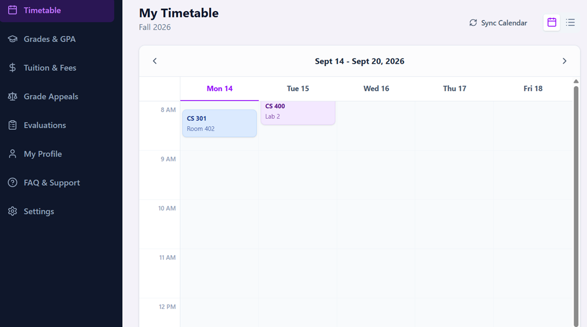

4. Student toggles between "Grid View" and "List View".

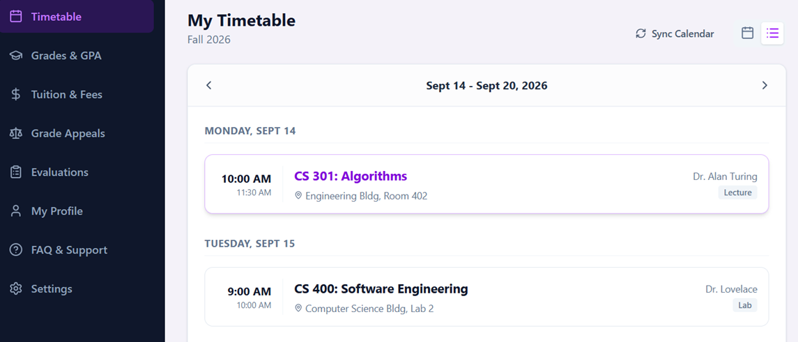

5. Student views a class block to see detailed class session information (course code, name, credits, room, lecturer, class type, schedule).

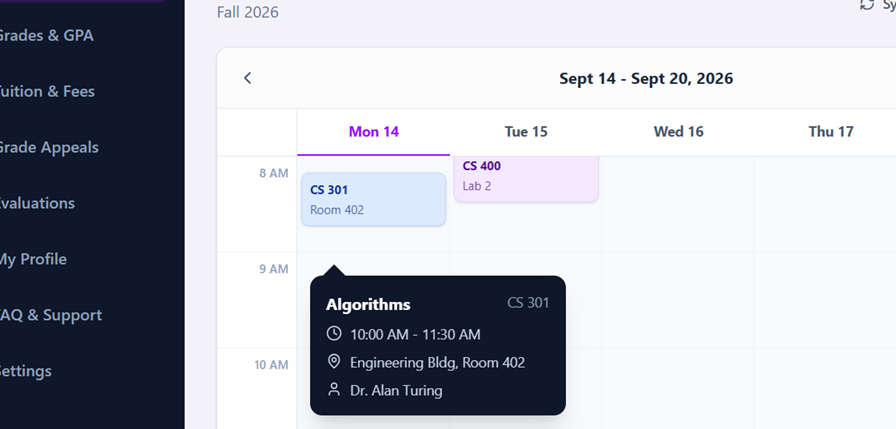

### 3.2 Alternative Flows
- **3.2.1 AF1 – No Classes Registered:** If student has no registered courses for the selected term, system displays an empty schedule state with a direct link to Course Registration (`/courses`).

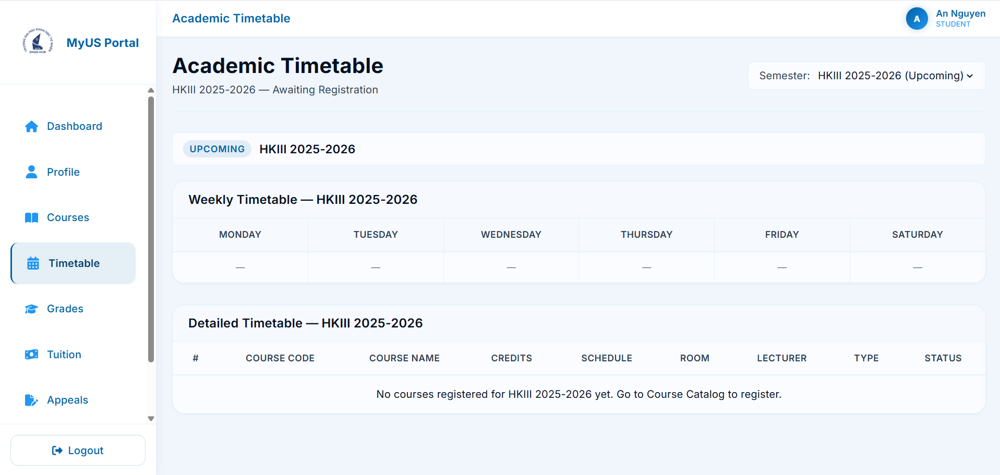

- **3.2.2 AF2 – Export Schedule:** Student exports schedule details or prints weekly timetable layout.

## 4. Postconditions
- Student timetable displayed in selected view mode.

## 5. Special Requirements
- Responsive layout adapting grid display for desktop and mobile viewports.

## 6. Extension Points
- None.

## 7. Prototype Requirement
- Timetable Grid View (`Prototype_Req/student/timetable.jpg`)
- Timetable Agenda List View (`Prototype_Req/student/timetablelist.jpg`)
- Class Details View (`Prototype_Req/student/detail.jpg`)
- Empty Schedule State (`Prototype_Req/student/noclass.jpg`)

---
# UC-05. View Grades & GPA

**Use-Case ID:** UC-05

**Actor(s):** Student

## 1. Brief Description
Provides the student with an academic performance summary (`GET /api/v1/grades/me`), displaying course component scores (midterm, final), overall numerical scores (0–10 scale), letter grades (A+, A, B+, B, C+, C, D+, D, F), grade points (4.0 scale), semester GPA, and cumulative GPA.

## 2. Preconditions
- Student is authenticated.

## 3. Flow of Events
### 3.1 Basic Flow
1. Student navigates to "Grades" (`/grades`).
2. System calls `GET /api/v1/grades/me` to retrieve student grade records.
3. System calculates and displays Cumulative GPA, Semester GPA, and Total Credits Earned summary metrics.

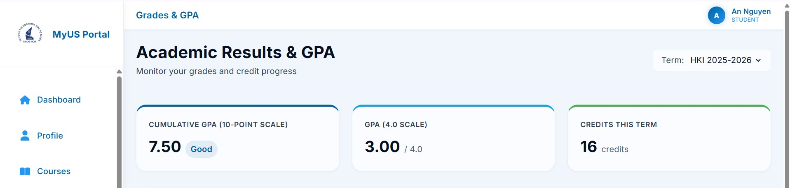

4. System renders grade breakdown per semester: Course Code, Course Name, Credits, Midterm, Final, Overall Score, Letter Grade, Grade Point.

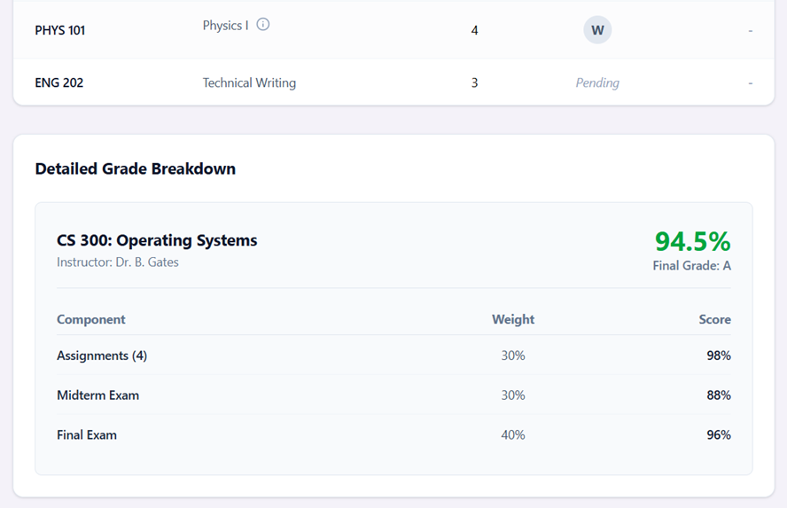

5. Student selects term dropdown filter to view historical semester performance.

### 3.2 Alternative Flows
- **3.2.1 AF1 – Grade Pending Release:** Ungraded components display "Pending" status and are excluded from calculated GPA until finalized by faculty.
- **3.2.2 AF2 – Initiate Grade Appeal (branches at step 4):** Student selects "Appeal Grade" on a course row, launching UC-07 (`/appeals`) with pre-filled course context.

## 4. Postconditions
- Grade details and calculated GPA metrics displayed.

## 5. Special Requirements
- GPA calculations must adhere to official 4.0 scale grade point formulas based on course credit weightings.

## 6. Extension Points
- None.

## 7. Prototype Requirement
- GPA Summary Card (`Prototype_Req/student/gpa.jpg`)
- Semester Grades Breakdown (`Prototype_Req/student/grade.jpg`)

---
# UC-06. Track Tuition Fee

**Use-Case ID:** UC-06

**Actor(s):** Student

## 1. Brief Description
Gives the student full financial visibility on a centralized dashboard (`GET /api/v1/finance/tuition/balance`), presenting tuition invoice summaries, itemized course credit fees, scholarship discounts, account standing status (Good Standing / Financial Hold), and payment transaction history.

## 2. Preconditions
- Student is authenticated.

## 3. Flow of Events
### 3.1 Basic Flow
1. Student navigates to "Tuition" (`/tuition`).
2. System loads student financial dashboard data (`GET /api/v1/finance/tuition/balance`).
3. System renders total charges, applied scholarships, total payments, balance due, account status badge, and payment transaction history table on the financial dashboard interface.

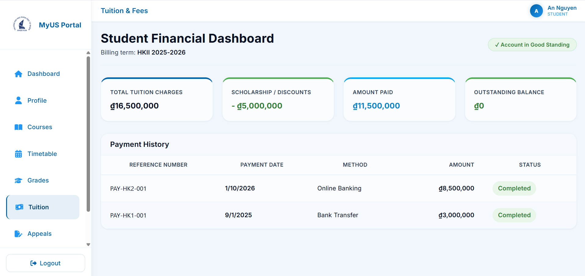

### 3.2 Alternative Flows
- **3.2.1 AF1 – Financial Hold Alert:** If account has an active financial hold (`financialHold = true`), status displays "Financial Hold" badge with account restriction guidance.

## 4. Postconditions
- Tuition statement metrics and payment transaction history displayed on the dashboard.

## 5. Special Requirements
- Financial figures must maintain exact transactional consistency with university billing records.

## 6. Extension Points
- None.

## 7. Prototype Requirement
- Student Financial Dashboard (`Prototype_Req/student/tution.jpg`)

---
# UC-07. Submit Grade Appeal

**Use-Case ID:** UC-07

**Actor(s):** Student; includes UC-07a (Upload Supporting Documents)

## 1. Brief Description
Enables a student to submit a formal digital grade appeal (`POST /api/appeals`), selecting course code, course title, grade component (Midterm, Final, Quiz, Assignment), current score, expected score, detailed justification, and mandatory supporting evidence attachments via UC-07a. Generates a unique tracking reference code and sets appeal status to `Submitted` / `Pending`.

## 2. Preconditions
- Student is authenticated.
- Finalized grade record exists for the selected course component.
- Grade appeal submission window is currently open.

## 3. Flow of Events
### 3.1 Basic Flow
1. Student navigates to "Grade Appeals" (`/appeals`) and opens the appeal submission form.

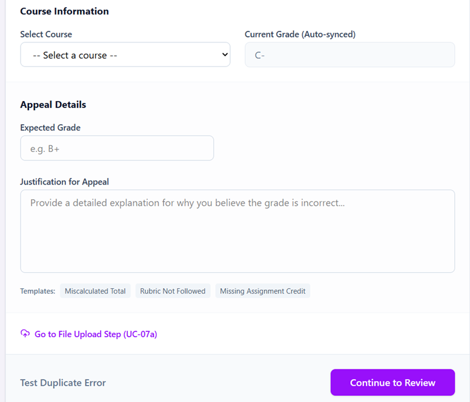

2. Student selects course, grade component (Midterm, Final, Quiz, Assignment), enters current score, expected score, and detailed appeal reason.
3. Student attaches required supporting document evidence using **UC-07a (Upload Supporting Documents)**.

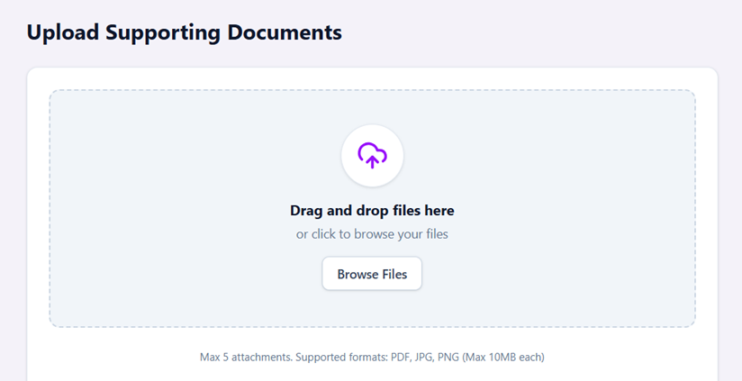

4. Student selects "Submit Appeal".
5. System validates that required fields and file evidence are present.
6. Client submits payload (`POST /api/appeals`). Backend creates appeal record with status `Pending` / `Submitted`, generates a unique tracking code (e.g. `AP-2026-001`), and logs submission timestamp.
7. System displays submission confirmation screen with reference code and direct link to track appeal status (UC-08).

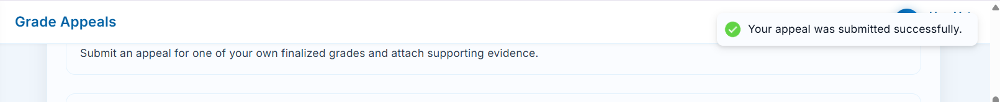

### 3.2 Alternative Flows
- **3.2.1 AF1 – Missing Field or File Attachment (branches at step 5):** Form submission blocked if required text fields or supporting evidence files are missing.

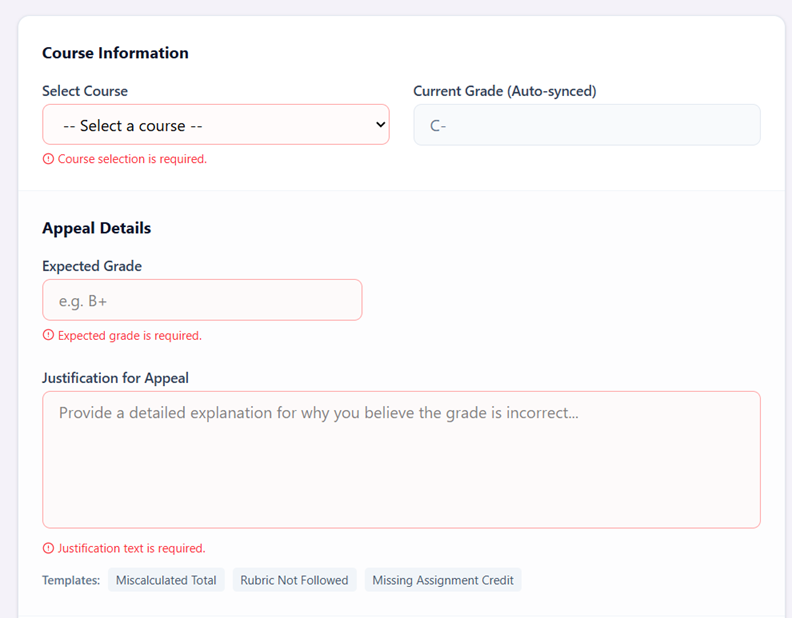

- **3.2.2 AF2 – Duplicate Active Appeal (branches at step 2/5):** If student already has an active pending appeal for the same course component, system blocks submission and alerts student.

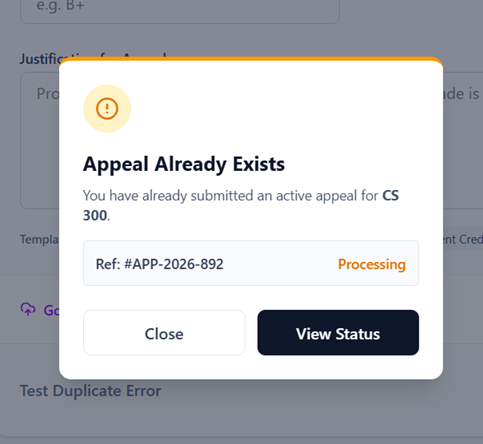

## 4. Postconditions
- Success: Appeal record saved with status `Pending` / `Submitted` and assigned unique tracking code; routed to administrator review queue.
- Failure: Submission rejected; error notice displayed.

## 5. Special Requirements
- System generates unique appeal tracking reference code.
- Mandatory file evidence attachment enforced.

## 6. Extension Points
- None.

## 7. Prototype Requirement
- Appeal Form (`Prototype_Req/student/formapp.jpg`)
- File Upload Section (`Prototype_Req/student/uppform.jpg`)
- Submission Confirmation (`Prototype_Req/student/appsub.jpg`)
- Missing Input / File Error (`Prototype_Req/student/missingapp.jpg`)
- Duplicate Appeal Alert (`Prototype_Req/student/dup.jpg`)

---
# UC-07a. Upload Supporting Documents

**Use-Case ID:** UC-07a

**Actor(s):** Student (indirectly, via UC-07)

## 1. Brief Description
A mandatory supporting use case for uploading evidence files (PDF, JPG, PNG, DOCX) to a grade appeal submission. Validates file format and file size limits (≤ 5MB per file, max 5 files).

## 2. Preconditions
- Invoked within UC-07 during appeal form entry.

## 3. Flow of Events
### 3.1 Basic Flow
1. System presents file upload widget (drag-and-drop or file selector) in appeal form.
2. Student selects evidence file(s).
3. System checks file format (PDF, JPG, PNG, DOCX) and size (≤ 5MB).
4. System uploads and stages file, displaying filename and size in uploaded list.

### 3.2 Alternative Flows
- **3.2.1 AF1 – Invalid Format or File Exceeds Limit:** System rejects file and displays inline error ("File size exceeds 5MB limit or invalid file format").

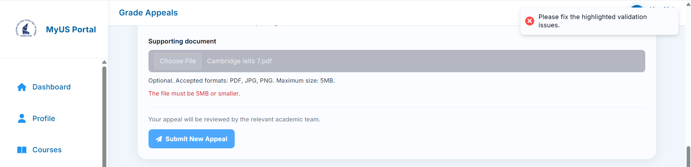

## 4. Postconditions
- Evidence files validated and attached to the appeal submission context.

## 5. Special Requirements
- Maximum file size limit 5MB per file; accepted formats PDF, JPG, PNG, DOCX.

## 6. Extension Points
- None.

## 7. Prototype Requirement
- Upload Component (`Prototype_Req/student/uppform.jpg`)
- Upload Validation Failure (`Prototype_Req/student/upfail.jpg`)

---
# UC-08. Track Appeal Status

**Use-Case ID:** UC-08

**Actor(s):** Student

## 1. Brief Description
Provides a tracking dashboard where students monitor real-time processing status for submitted grade appeals (`GET /api/appeals/me` or `GET /api/appeals/me/{appealId}`). Displays overall tracking summary metrics, appeal list table, and a detailed "View Details" view showing current vs. expected score, detailed justification, attached supporting evidence files, reviewer notes, status timeline, and fee payment deadline notices set by administrator (UC-12a) with payment location instructions.

## 2. Preconditions
- Student is authenticated.

## 3. Flow of Events
### 3.1 Basic Flow
1. Student navigates to "My Appeals" (`/appeals` or `/appeals/me`).
2. System loads student appeal tracking dashboard (`GET /api/appeals/me`), displaying summary KPI metrics (total appeals, pending/processing appeals, pending fee payments, resolved appeals), status filters, and the submitted appeals list table.

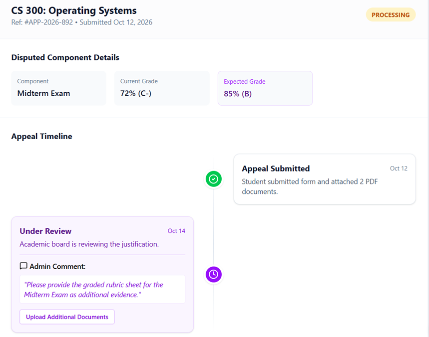

3. Student selects an appeal item and clicks "View Details".
4. System opens the Appeal Detail View (`GET /api/appeals/me/{appealId}`), presenting full submission details: course code/title, grade component, current score, expected score, submitted justification reason, attached evidence files (`attachments`), administrator reviewer comments, status processing timeline, and fee payment deadline notice set by administrator (date, time, Academic Office location).

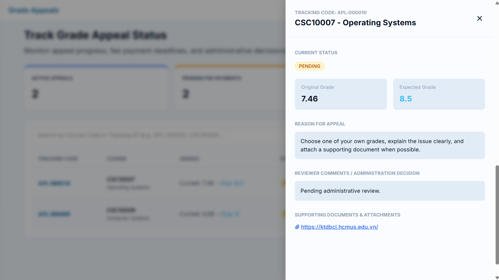

### 3.2 Alternative Flows
- **3.2.1 AF1 – No Appeals Submitted:** If student has no appeals, system displays an empty state with a shortcut button to "Submit New Appeal".

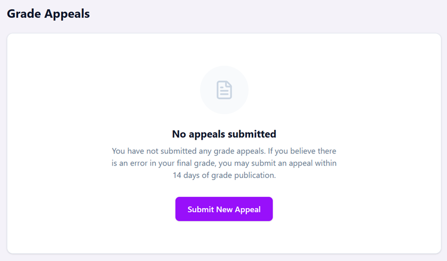

## 4. Postconditions
- Appeal tracking dashboard and itemized detail drawer displayed.

## 5. Special Requirements
- Real-time visibility of administrator status updates and fee payment deadline details.

## 6. Extension Points
- None.

## 7. Prototype Requirement
- Grade Appeals Tracking Dashboard Overview (`Prototype_Req/student/trackapp.jpg`)
- Appeal View Details (`Prototype_Req/student/viewdetail.jpg`)
- Empty Appeals State (`Prototype_Req/student/emptyapp.jpg`)

---
# UC-09. Submit Evaluation Surveys

**Use-Case ID:** UC-09

**Actor(s):** Student

## 1. Brief Description
Lets a student complete end-of-semester structured surveys evaluating course quality, lecturer performance, and campus facilities.

## 2. Preconditions
- Student is authenticated; the evaluation period for the current semester is open; student is enrolled in at least one course requiring evaluation.

## 3. Flow of Events
### 3.1 Basic Flow
1. Student navigates to "Evaluations" (or follows a notification that evaluations are open).
2. System displays pending surveys — one per enrolled course, plus any general campus-facilities survey.

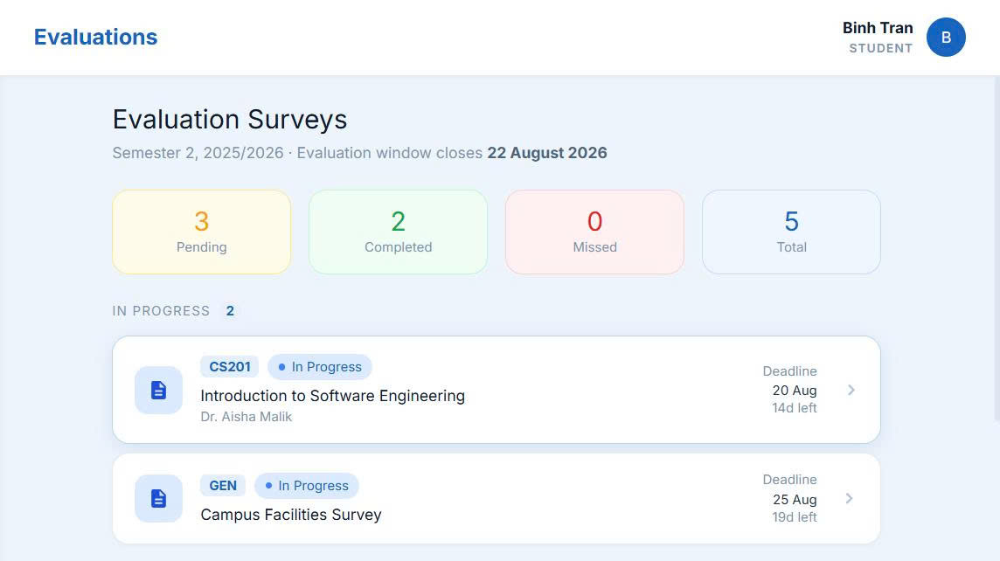

3. Student opens a survey.

4. System presents structured questions (rating scales for content, delivery, materials, facilities) plus optional open-text comments.

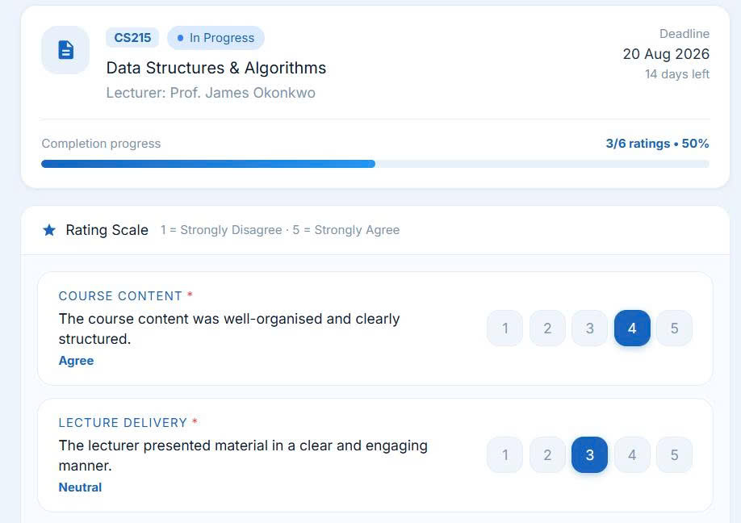

5. Student answers all required questions and selects "Submit."
6. System validates that all required questions are answered.

7. System records the response and marks the survey **Completed** for that student.

8. System returns to the survey list, showing updated completion status.

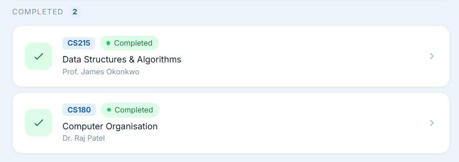

### 3.2 Alternative Flows
- **3.2.1 AF1 – Incomplete Submission (branches at step 6):** Unanswered required questions are highlighted and submission is blocked.

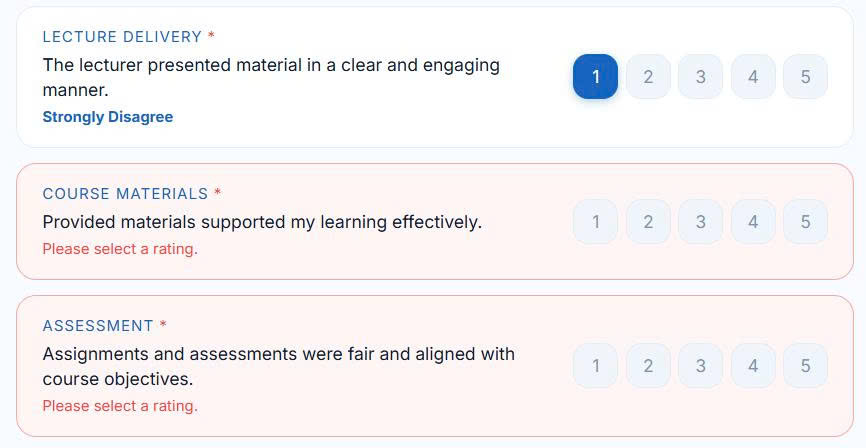

- **3.2.2 AF2 – Evaluation Period Closed (branches at step 1):** Completed vs. missed surveys are shown read-only; no further edits are allowed.
- 
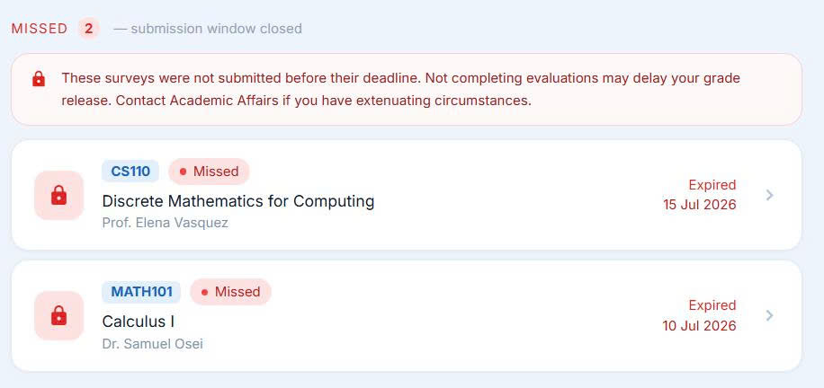

- **3.2.3 AF3 – Already Submitted (branches at step 3):** A completed survey opens read-only, optionally showing the student's own past responses.

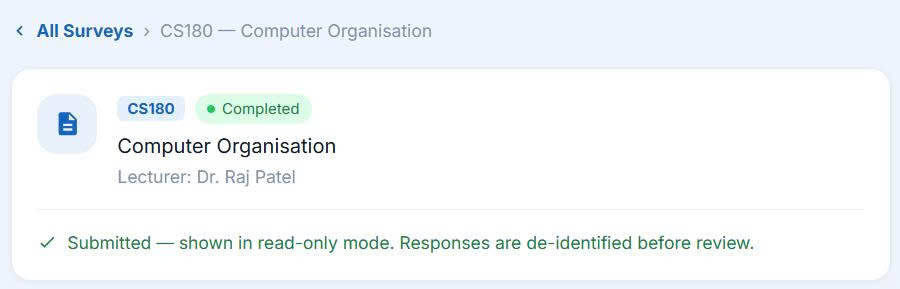

- **3.2.4 AF4 – Deadline Reminder:** As the window nears its end, the system sends a reminder for any incomplete required surveys.
- **3.2.5 AF5 – Save and Continue Later (branches at step 5):** Partial progress is saved and can be resumed before the deadline.

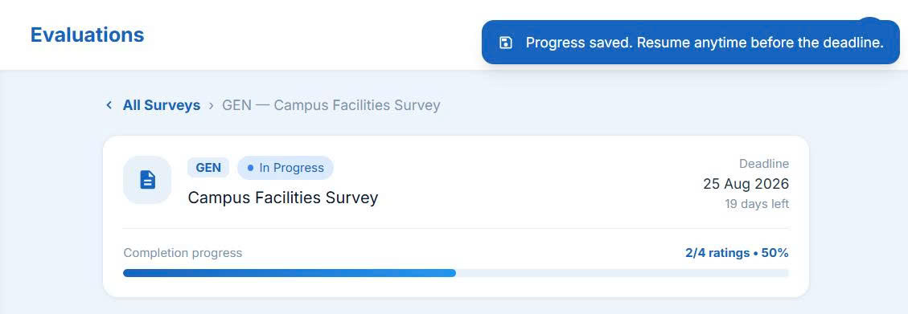
  
- **3.2.6 AF6 – Skip an Optional Survey (branches at step 3):** A non-mandatory survey (e.g., general facilities) can be dismissed without penalty.

## 4. Postconditions
- Response recorded; survey marked Completed; aggregated data becomes available to the university for quality review.

## 5. Special Requirements
- Responses should be de-identified before being visible to lecturers, to encourage candid feedback — a policy recommendation the university should confirm, since it isn't explicitly stated in the source documents.
- The survey must be quick to complete on mobile to maximize response rates (NFR ID13).
- Validation messages must be clear and specific (NFR ID14).

## 6. Extension Points
- None.

## 7. Prototype Requirement
Screens to design:
- Survey List
- Survey-Question Screen
- Locked / Read-Only Completed View
- Optional-Survey Skip Prompt
- Incomplete-Validation Error
- Submission-Confirmation Screen
- Save-and-Continue-Later State
- Deadline-Reminder Banner
- Period-Closed Read-Only View

---
# UC-10. Access Help & Support

**Use-Case ID:** UC-10

**Actor(s):** Student; includes UC-10a (Access FAQs) and UC-10b (AI Learning Assistant)

## 1. Brief Description
Provides a central self-service Help & Support Hub (`/support`), serving as the single portal entry point for students to access self-help resources. Presents two main service options: **Help & FAQ** (UC-10a) for searching university rules and academic knowledge base articles, and **AI Learning Assistant** (UC-10b) for interactive AI-powered course advising and graduation progress tracking.

## 2. Preconditions
- Student is authenticated.

## 3. Flow of Events
### 3.1 Basic Flow
1. Student navigates to "Help & Support" (`/support`).
2. System displays the Help & Support hub interface presenting two main navigation cards: **Help & FAQ** and **AI Learning Assistant**.

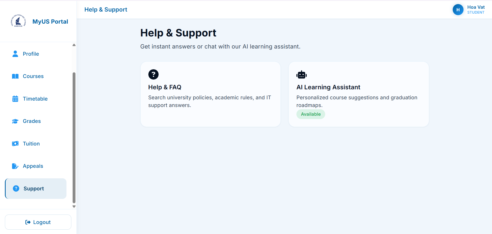

3. Student selects one of the two service cards:
   - Selecting "Help & FAQ" executes **UC-10a (Access FAQs)** (`/support/faq`).
   - Selecting "AI Learning Assistant" executes **UC-10b (AI Learning Assistant Chatbot)** (`/support/ai-chatbot`).

### 3.2 Alternative Flows
- None.

## 4. Postconditions
- Student navigated to the selected support service view (FAQ Search or AI Assistant Chatbot).

## 5. Special Requirements
- Centralized, accessible hub interface for all self-service student support.

## 6. Extension Points
- None.

## 7. Prototype Requirement
- Help & Support Hub Screen (`Prototype_Req/student/support_hub.jpg`)

---
# UC-10a. Access FAQs

**Use-Case ID:** UC-10a

**Actor(s):** Student (indirectly, via UC-10)

## 1. Brief Description
Provides a searchable knowledge base and FAQ support library (`GET /api/faq`, `GET /api/faq/categories`), allowing students to query questions, filter by category (Academic Policies, Registration, Grades & Appeals, Tuition, IT/Technical Support), view detailed answers (`GET /api/faq/{id}`), submit feedback ("Helpful" / "Not Helpful" via `POST /api/faq/{id}/feedback`), view popular FAQs (`GET /api/faq/popular`), and access support contact options.

## 2. Preconditions
- Invoked from Support Hub (UC-10) or direct navigation (`/support/faq`).

## 3. Flow of Events
### 3.1 Basic Flow
1. Student navigates to Support Hub (`/support`) and selects "Help & FAQ" (`/support/faq`).
2. System fetches categories (`GET /api/faq/categories`) and displays category cards (Academic Policies, Registration, Grades & Appeals, Tuition, IT/Technical Support).

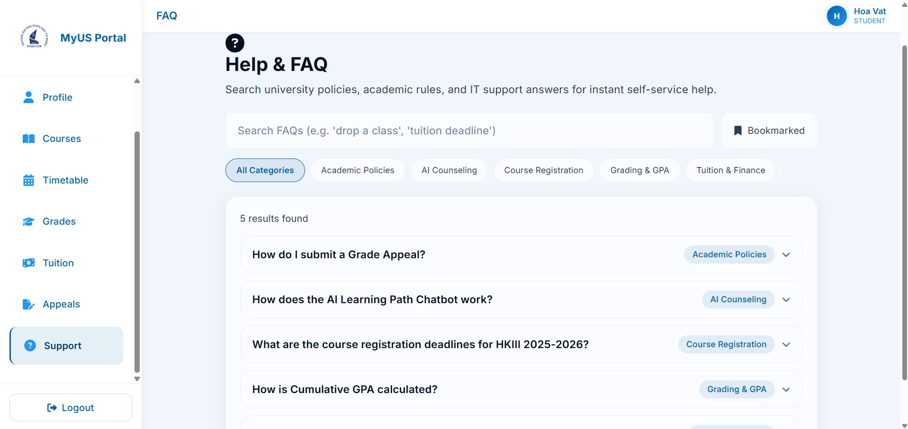

3. Student enters a keyword search or selects a category filter.
4. System queries `GET /api/faq` with search and category parameters, displaying matching Q&A cards and detailed answer text.

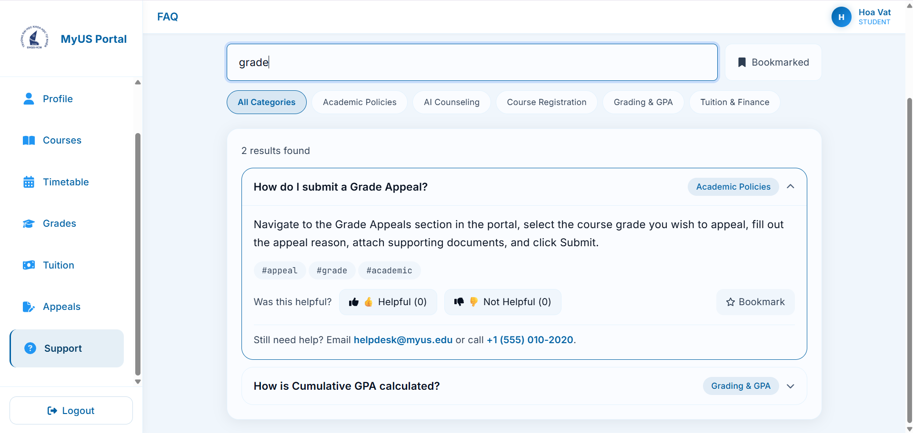

### 3.2 Alternative Flows
- **3.2.1 AF1 – No Search Matches:** If search returns no results, system displays "No matching FAQs found" and suggests popular FAQs (`GET /api/faq/popular`) or contact support.
- **3.2.2 AF2 – Submit Answer Feedback (Rate Answer):** Student selects "Helpful" or "Not Helpful" on an answer. Client calls `POST /api/faq/{id}/feedback`. System records feedback and displays a thank-you response.
- **3.2.3 AF3 – Contact Support / Helpdesk Info:** Student selects "Still need help?" to view helpdesk contact email and phone details.
- **3.2.4 AF4 – Bookmark FAQ Entry:** Student clicks bookmark icon on FAQ entry for quick future reference.

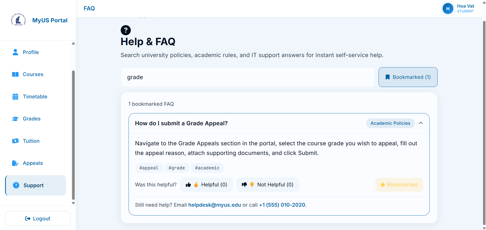

## 4. Postconditions
- FAQ knowledge base content displayed; feedback and bookmarks recorded if submitted.

## 5. Special Requirements
- Keyword search with fast response times and category filtering.

## 6. Extension Points
- None.

## 7. Prototype Requirement
- Support Hub & FAQ Categories (`Prototype_Req/student/UC10-category.jpg`)
- FAQ Search Results & Answer View (`Prototype_Req/student/UC10-SearchResult.jpg`)
- Bookmarked FAQ Entry View (`Prototype_Req/student/UC10-Bookmark.jpg`)

---
# UC-10b. AI Learning Assistant (Chatbot)

**Use-Case ID:** UC-10b

**Actor(s):** Student, AI Engine (Gemini LLM API via `AIChatbotPage.tsx`, `ChatbotController.java`, `askGeminiStream`, `geminiService.ts`)

## 1. Brief Description
Provides an intelligent AI academic advisor and chat interface (`/support/ai-chatbot`), integrating student profile context (major, student type, current GPA), course catalog knowledge (RAG via `courses.json`), course advising & recommendations (`GET /api/v1/chatbot/recommendations`), and graduation progress audit (`GET /api/v1/chatbot/progress`). It uses Gemini real-time streaming responses (`askGeminiStream`) with built-in academic scope guardrails to answer university-related queries while politely declining off-topic non-academic questions.

## 2. Preconditions
- Invoked from Support Hub (UC-10) or direct navigation (`/support/ai-chatbot`).
- Gemini AI service backend / API key is active.

## 3. Flow of Events
### 3.1 Basic Flow
1. Student navigates to Support Hub (`/support`) and selects "AI Learning Assistant" or opens `/support/ai-chatbot`.
2. System fetches the student's academic profile (name, major, student type) and current cumulative GPA to construct the AI user context payload.
3. System displays the AI Learning Assistant chat interface with a welcome message and quick action suggestions (Course Advising, Graduation Tracking, Course Explanations, Academic Policies).
4. Student enters a natural-language query (e.g. "Gợi ý cho tôi các môn học kỳ tới", "Giải thích môn Hệ điều hành", "Làm sao để tính điểm GPA?") hoặc nhấn nút quick action chip.
5. System displays a temporary thinking/loading indicator ("AI is thinking...") in the chat bubble window while preparing context.

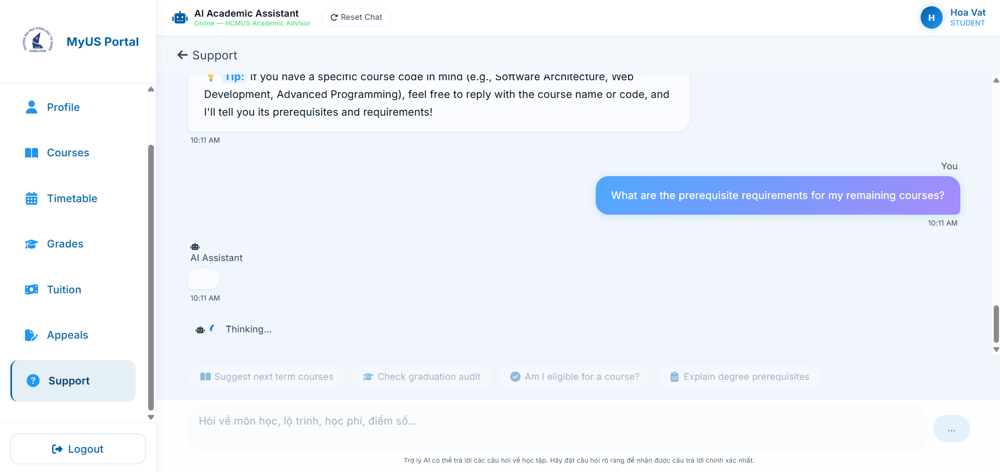

6. Client invokes `askGeminiStream` with the conversation history, user context, and RAG course catalog data.
7. System streams Gemini's response chunk-by-chunk in real-time, rendering Markdown formatting, bullet points, emoji indicators, and course recommendation links.

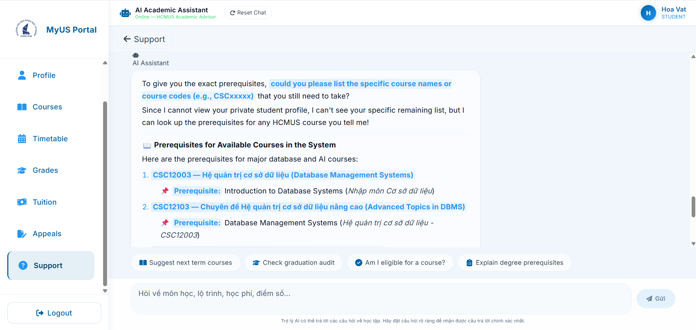

### 3.2 Alternative Flows
- **3.2.1 AF1 – Off-Topic / Non-Academic Question Refusal (branches at step 4):**
  - If the student submits a question outside university academic scope (e.g. politics, entertainment, sports, or general knowledge unrelated to HCMUS studies), the AI engine acts as a Gatekeeper per system prompt instructions (`SYSTEM_PROMPT`).
  - System detects the non-academic topic and streams a polite refusal in the user's language (e.g. *"Tôi là Trợ lý Học tập AI của HCMUS và chỉ có thể hỗ trợ các câu hỏi liên quan đến học tập, môn học, quy chế và học phí. Bạn vui lòng đặt câu hỏi liên quan đến việc học tại trường nhé!"*).

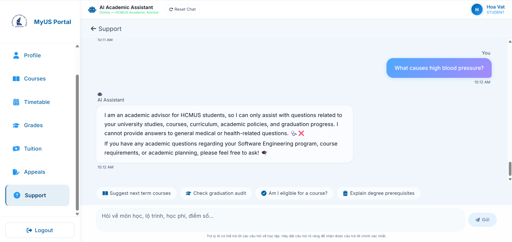

- **3.2.2 AF2 – AI Service Offline / API Quota Exceeded (branches at step 6):**
  - If the Gemini API is unreachable or rate-limited, system executes fallback chain: Direct Gemini → Backend Proxy → Offline Local Knowledge Base (`localChatbotService.ts`). System displays a fallback status notification without interrupting chat usability.
- **3.2.3 AF3 – Quick Course Recommendations (branches at step 4):**
  - Student selects "Course Advising"; backend executes `/api/v1/chatbot/recommendations` and streams course suggestion cards detailing credits, prerequisites, and career relevance.
- **3.2.4 AF4 – Graduation Progress & Degree Audit (branches at step 4):**
  - Student asks "Am I on track to graduate?"; backend calls `/api/v1/chatbot/progress?creditsPerTerm=15` and presents remaining credit requirements and estimated graduation timeline.

## 4. Postconditions
- Conversational academic guidance, course recommendations, or graduation audit metrics displayed in chat stream; off-topic questions politely declined.

## 5. Special Requirements
- Real-time text streaming via `askGeminiStream` with dynamic UI scroll-to-bottom behavior.
- Strict enforcement of academic scope guardrails refusing non-university queries.
- Context-aware personalization using student major and current GPA.

## 6. Extension Points
- None.

## 7. Prototype Requirement
- AI Prompt Input & Thinking Loading State (`Prototype_Req/student/AI_thinking.jpg`)
- Real-Time Streaming Response View (`Prototype_Req/student/AI_response.jpg`)
- Off-Topic Refusal Response View (`Prototype_Req/student/AI_refusal.jpg`)
---
# UC-11. Admin Bulk Data and Class Control

**Use-Case ID:** UC-11

**Actor(s):** Administrator

## 1. Brief Description
This use case allows the Administrator to manage student, course, and class data in bulk from a centralized Class Control page.

## 2. Preconditions
- Administrator is authenticated and has permission to access Class Control.

## 3. Flow of Events
### 3.1 Basic Flow
1. The Administrator selects **Class Control**.
2. The system displays the available bulk-data management functions.
3. The Administrator selects **Import Student/Course Data**.
4. The system performs **UC-12 – Import Student/Course Data**.
5. If the import is completed successfully:

   5.1. The system updates the related student, course, or class records.

   5.2. The system displays the import summary.

   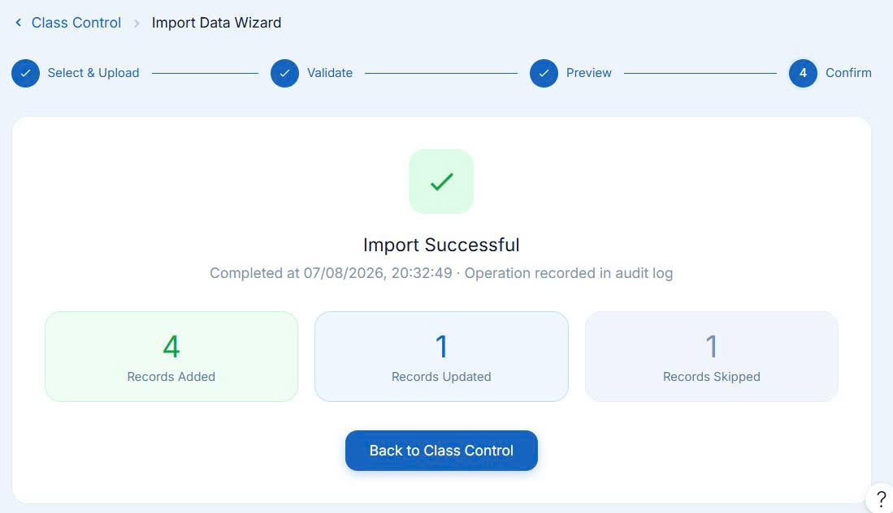

6. Else:

   6.1. The system displays the reason why the operation could not be completed.

   6.2. The system keeps the existing data unchanged.

   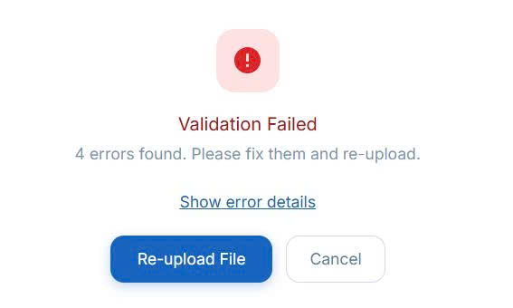

7. The system records the operation in the audit log.

   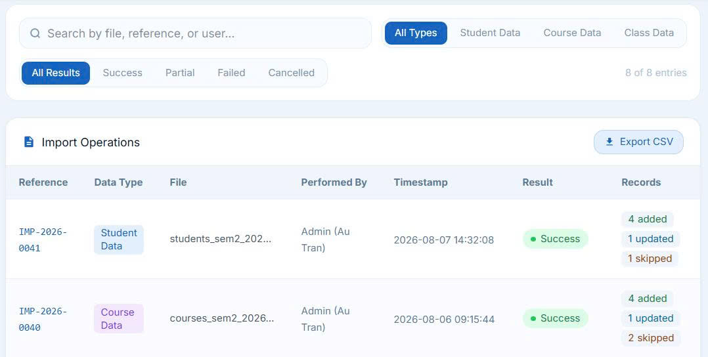

### 3.2 Alternative Flows
- **3.2.1 AF1 – Cancel before confirmation:** At any time before confirming the import, the Administrator may cancel the operation; the system discards the temporary import data and leaves existing academic records unchanged.
- **3.2.2 AF2 – Permission denied:** If the Administrator does not have sufficient permission, the system denies access and displays an authorization error.

   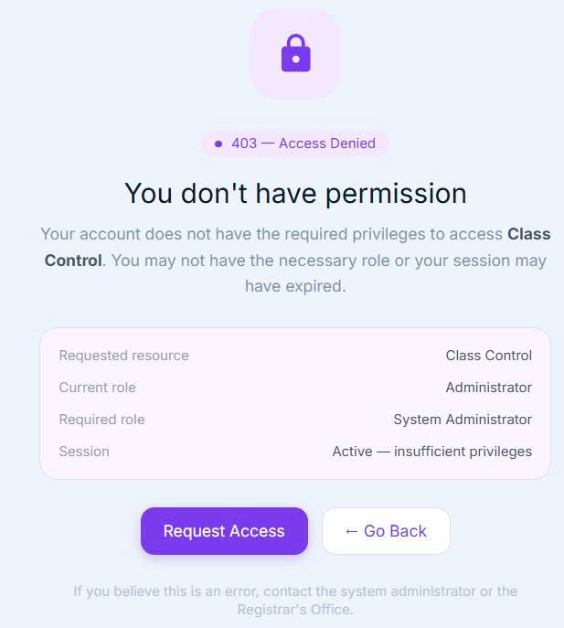

- **3.2.3 AF3 – Duplicate or conflicting records found:** If duplicate or conflicting records are detected, the system identifies the affected records and lets the Administrator choose to skip or update them before proceeding.

## 4. Postconditions
- The academic data is added, updated, or left unchanged, and the operation is recorded, according to the outcome of UC-12 – Import Student/Course Data.

## 5. Special Requirements
- Only authorized Administrators may access this function.
- All data changes must be recorded in the audit log.

## 6. Extension Points
- None.

---
# UC-11a. Import Student/Course Data

**Use-Case ID:** UC-11a

**Actor(s):** Administrator

## 1. Brief Description
This use case allows the Administrator to import student, course, or class data from a file.

## 2. Preconditions
- Invoked within UC-11, when the Administrator selects Import Student/Course Data.

## 3. Flow of Events
### 3.1 Basic Flow
1. The Administrator selects **Import Student/Course Data**.
2. The system asks the Administrator to select the data type and upload an import file.
3. The Administrator selects student, course, or class data and uploads the file.

   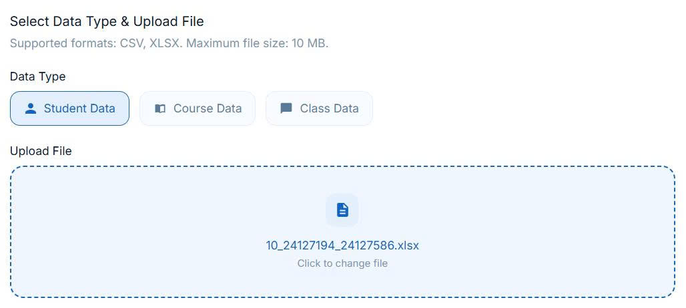

4. The system performs **UC-11b – Validate Data Format**.
5. If the uploaded data is valid:

   5.1. The system displays an import preview, including records to be added or updated.

6. The Administrator reviews the preview and confirms the import.

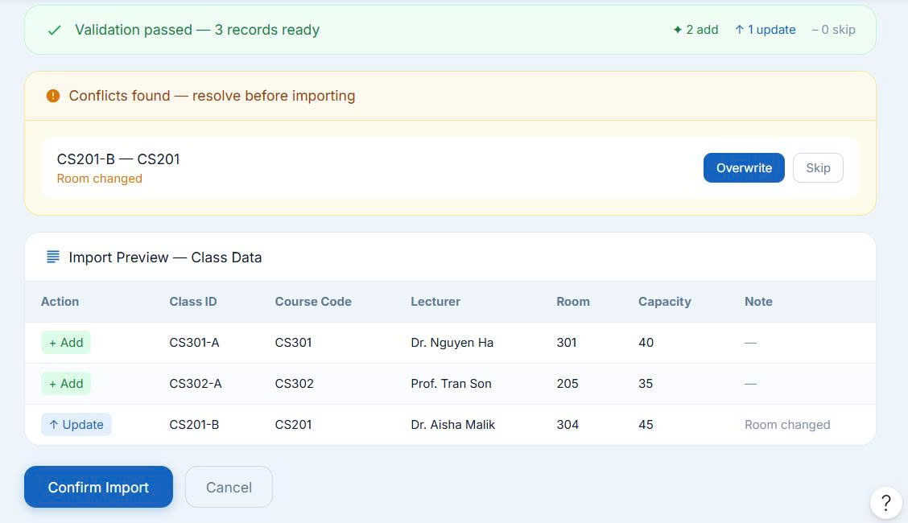

7. The system imports the approved records.
8. The system displays the number of added, updated, and skipped records.

### 3.2 Alternative Flows
- **3.2.1 AF1 – Invalid file/data:** If the uploaded file is malformed or contains invalid rows, the system displays detailed errors, does not generate an import preview, and asks the Administrator to correct and re-upload the file.
- **3.2.2 AF2 – Duplicate or conflicting records:** If duplicate or conflicting records are found, the system identifies the affected entries and allows the Administrator to skip, overwrite, or merge them before continuing.
- **3.2.3 AF3 – Cancel before confirmation:** At any time before confirming the import, the Administrator may cancel the operation; the system discards temporary import data and leaves existing records unchanged.
- **3.2.4 AF4 – Permission denied:** If the Administrator does not have sufficient permission, the system denies access and displays an authorization error.

## 4. Postconditions
- Success: valid and approved records are added or updated; an import summary is available; the operation is recorded.
- Failure: invalid, cancelled, or unconfirmed data is not imported; existing data remains unchanged.

## 5. Special Requirements
- The system should support CSV and XLSX files.
- The Administrator must review the data before confirming the import.
- The import must not leave incomplete database changes.

## 6. Extension Points
- None.

---
# UC-11b. Validate Data Format

**Use-Case ID:** UC-11b

**Actor(s):** Administrator

## 1. Brief Description
This use case checks whether an uploaded file follows the required structure and data rules.

## 2. Preconditions
- Invoked within UC-11a, after a file has been uploaded.

## 3. Flow of Events
### 3.1 Basic Flow
1. The system reads the uploaded file.
2. The system checks whether the required columns are present.
3. The system checks whether required fields contain values.
4. The system checks data formats, identifiers, references, and duplicate records.
5. If all records satisfy the validation rules:

   5.1. The system marks the records as valid.

   5.2. The system allows the import process to continue.

   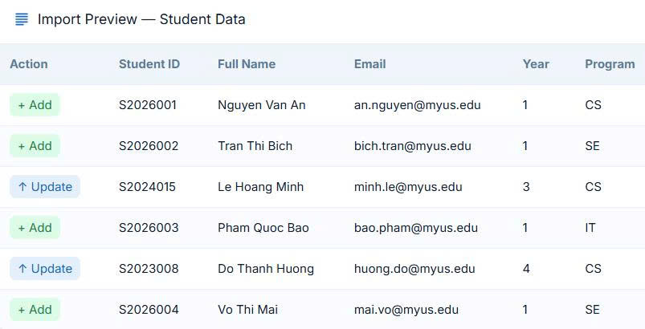

6. Else:

   6.1. The system marks the affected records as invalid or conflicting.

   6.2. The system identifies the related rows, fields, and errors.
7. The system displays the validation result.

   

### 3.2 Alternative Flows
- **3.2.1 AF1 – File unreadable:** If the system cannot read the uploaded file, it stops validation, shows an error message, and asks the Administrator to upload a corrected file.
- **3.2.2 AF2 – Data validation failures:** If specific rows or fields fail checks, the system reports the row number, field, and error description, and prevents continuation until corrected.
- **3.2.3 AF3 – Duplicate record detection:** If duplicate entries are found, the system marks the affected rows, explains the duplicate conflict, and requires the Administrator to resolve it before continuing.

## 4. Postconditions
- Each record has a validation result.
- A validation report is available.
- No data is imported during this use case.

## 5. Special Requirements
- Each validation error should include the row number, field name, and error description.
- The validation report should be downloadable.

## 6. Extension Points
- None.

---
# UC-12. Appeal Processing Management

**Use-Case ID:** UC-12

**Actor(s):** Administrator

## 1. Brief Description
This use case allows the Administrator to review and process student appeals.

## 2. Preconditions
- Administrator is authenticated and has permission to access Appeal Processing Management.
- At least one appeal has been submitted (UC-07).

## 3. Flow of Events
### 3.1 Basic Flow
1. The Administrator accesses **Appeal Processing Management**.
2. The system displays the list of submitted appeals.

   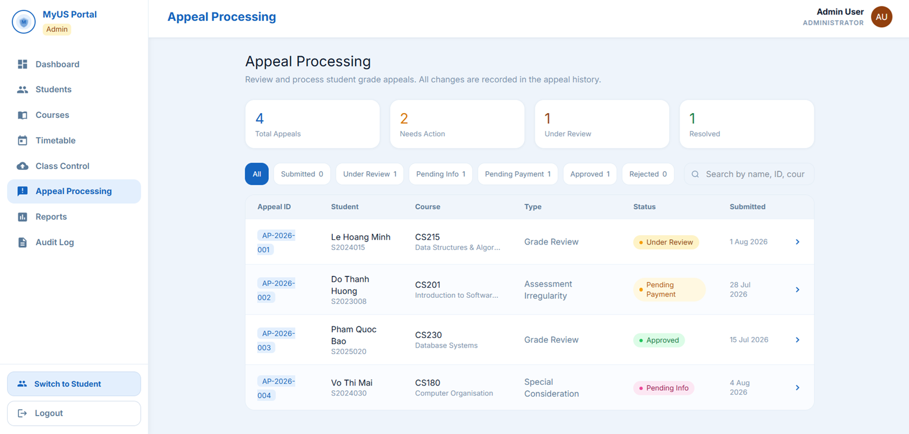

3. The Administrator selects an appeal to view its details.

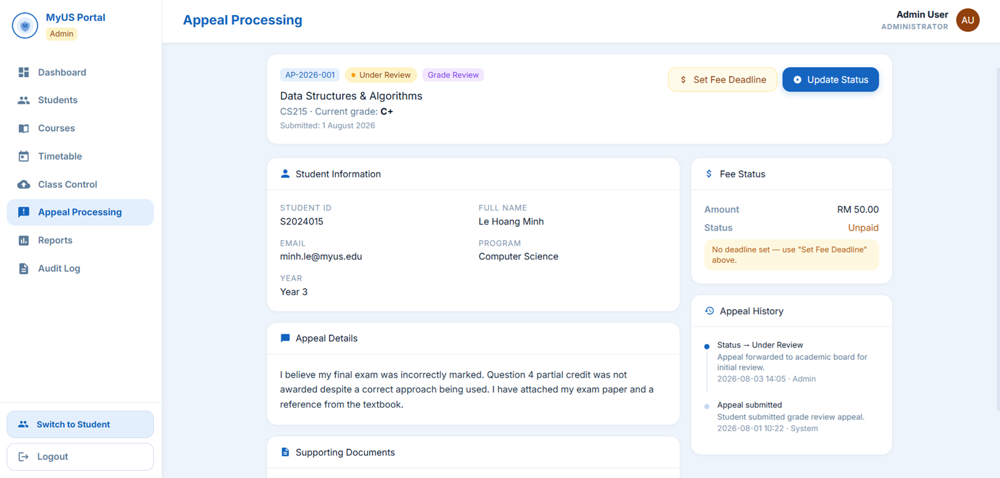

4. The Administrator updates the appeal status (**UC-12b – Update Appeal Status**).

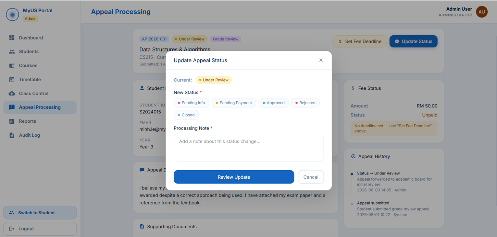

5. If the update is successful, the system saves the changes, notifies the student, and displays the updated appeal.

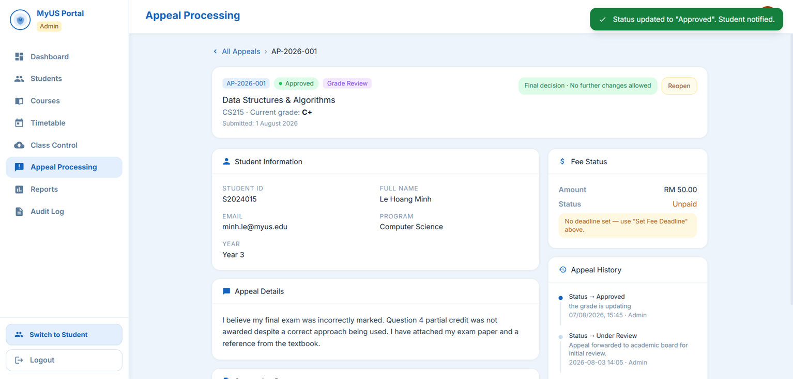

6. If the update fails, the system displays an error message and keeps the previous information unchanged.

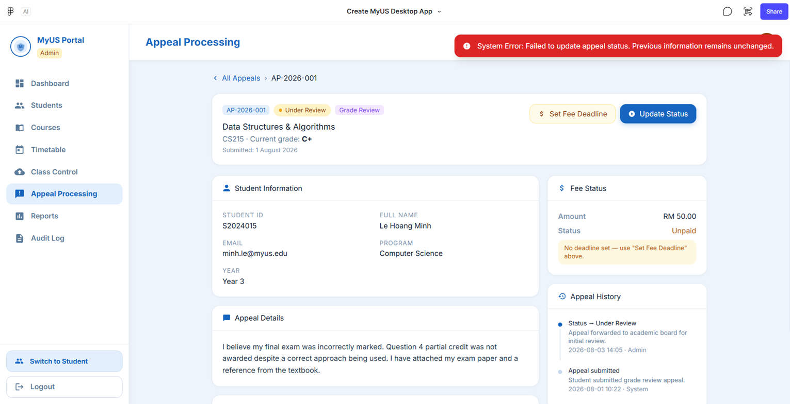

### 3.2 Alternative Flows
- **3.2.1 AF1 – No matching appeal found:** If no appeal matches the search criteria, the system displays a no-results message.

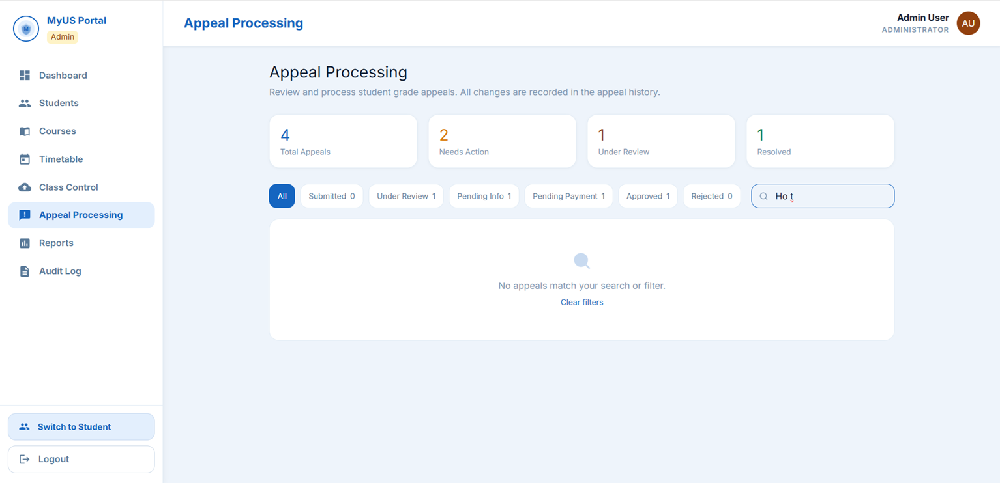

- **3.2.2 AF2 – Appeal already finalized:** If the appeal has reached a final status, the system prevents further changes.

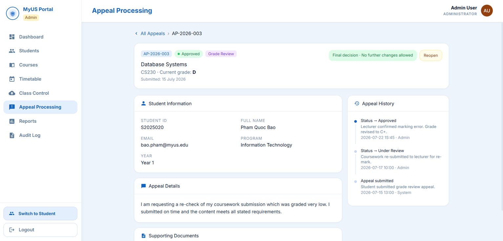

## 4. Postconditions
- The appeal’s payment deadline and/or processing status are updated, and the student is notified, according to the outcomes of UC-15 – Set Fee Payment Deadline and UC-16 – Update Appeal Status.

## 5. Special Requirements
- Appeal documents must only be accessible to authorized users.
- Each change must record the Administrator, date, time, and change details.

## 6. Extension Points
- None.

---
# UC-12a. Set Fee Payment Deadline

**Use-Case ID:** UC-12a

**Actor(s):** Administrator

## 1. Brief Description
This use case allows the Administrator to set or change the payment deadline for an appeal-processing fee.

## 2. Preconditions
1. An appeal has been selected.
2. The appeal requires a processing fee.
3. The processing fee has not been paid.
4. The appeal has not been closed.

## 3. Flow of Events
### 3.1 Basic Flow
1. The Administrator accesses **Set Fee Payment Deadline** and enters a new deadline.

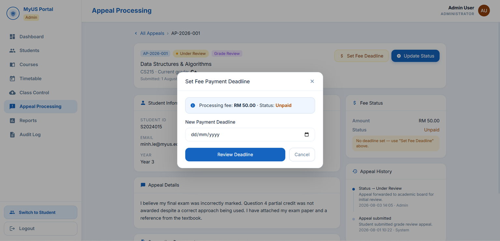

2. The system validates the entered deadline.

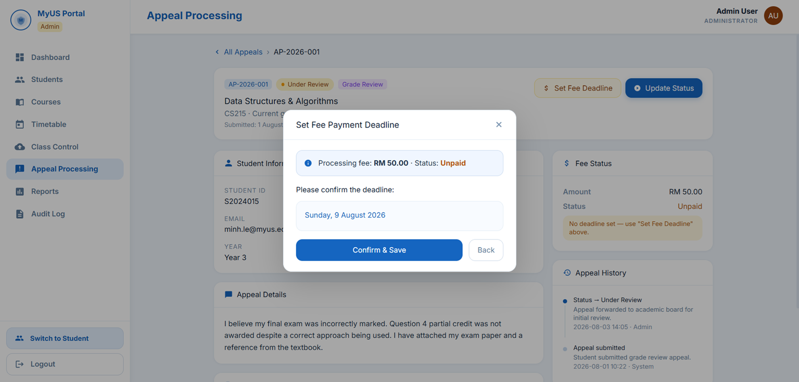

3. If the deadline is valid, the system saves the deadline, updates the appeal history, and notifies the student.

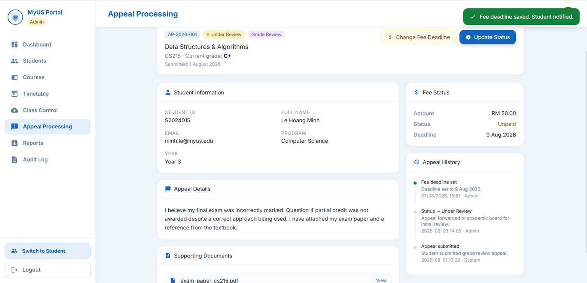

4. If the deadline is invalid, the system displays an error message and asks the Administrator to re-enter.

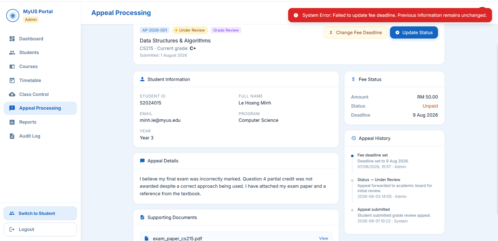

### 3.2 Alternative Flows
- **3.2.1 AF1 – Existing deadline being changed:** If a payment deadline already exists, the Administrator enters a new deadline and a reason for the change; the system records both the prior and the updated deadline.

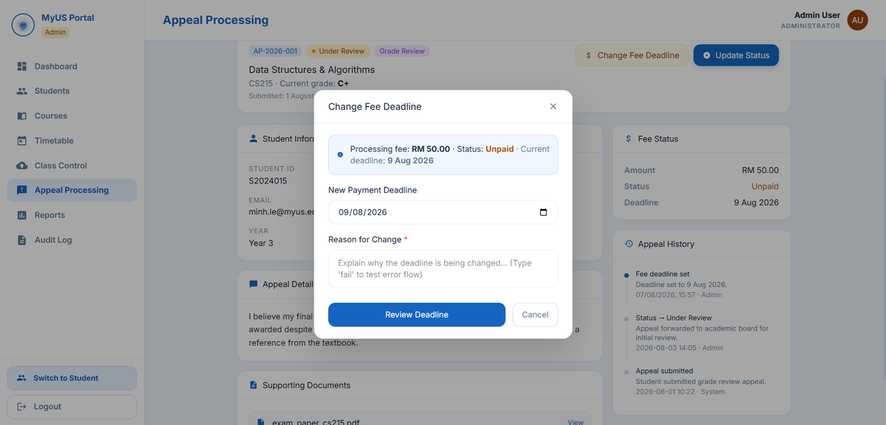

- **3.2.2 AF2 – Fee already paid or no fee required:** If the fee has already been paid, the system prevents deadline setting and displays current payment status.

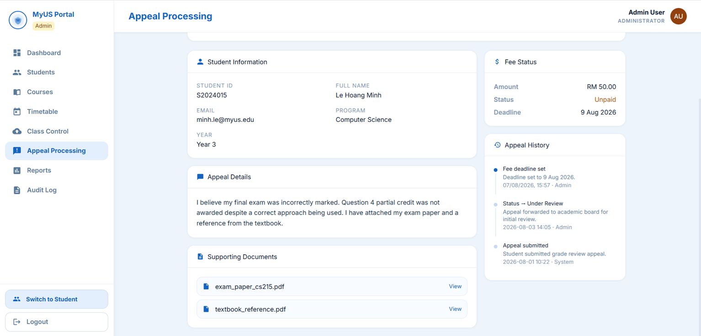

- **3.2.3 AF3 – Cancel before confirmation:** The Administrator may cancel before confirming; the system keeps the previous deadline unchanged.

## 4. Postconditions
- A valid payment deadline is associated with the appeal.
- The deadline is recorded in the appeal history.
- The student is notified.

## 5. Special Requirements
- The payment deadline must use the institution’s configured time zone.
- Changes to an existing deadline must include a reason.

## 6. Extension Points
- None.

---
# UC-12b. Update Appeal Status

**Use-Case ID:** UC-12b

**Actor(s):** Administrator

## 1. Brief Description
This use case allows the Administrator to change the processing status of an appeal.

## 2. Preconditions
1. An appeal has been selected.
2. The Administrator has permission to update the appeal.

## 3. Flow of Events
### 3.1 Basic Flow
1. The Administrator accesses Update Appeal Status, selects a new status, and enters a processing note.

2. The system validates the selected status and information.
3. If the update is valid, the system saves the new status, updates the appeal history, and notifies the student.

4. If the update is invalid (e.g., missing information), the system displays an error message and asks the Administrator to correct it.

### 3.2 Alternative Flows
- **3.2.1 AF1 – Additional information requested:** If the Administrator needs more details before changing status, they request it and the system notifies the student of the required information.

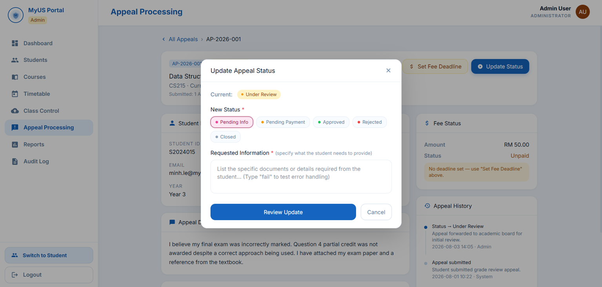

- **3.2.2 AF2 – Reopen completed appeal:** If the Administrator reopens a completed appeal, the system verifies permission, captures a reopening reason, and moves the appeal back to an active status.
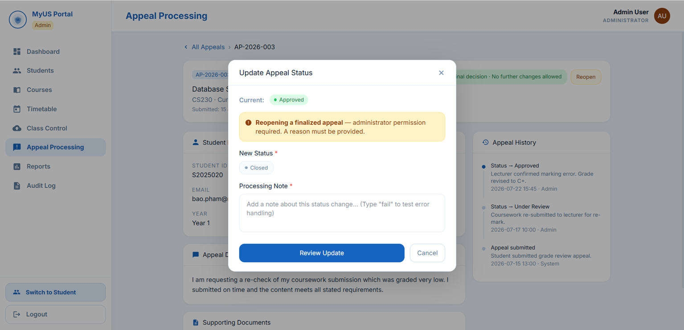

## 4. Postconditions
- The appeal has the selected valid status.
- The status change and processing note are recorded.
- The student is notified.

## 5. Special Requirements
- Approval and rejection statuses must include a decision explanation.
- The system must enforce valid status transitions.

## 6. Extension Points
- None.

---
# UC-13. Student Data Administration

**Use-Case ID:** UC-13

**Actor(s):** Administrator

## 1. Brief Description
Allows the Administrator to access and review student records through a searchable administration interface while enforcing role-based access control and audit logging.

## 2. Preconditions
- The Administrator is authenticated.
- The Administrator has permission to access student data.
- The student database is available.

## 3. Flow of Events
### 3.1 Basic Flow
1. The Administrator accesses Student Data Administration and searches for students **(UC-13a – Search Student Records)**.

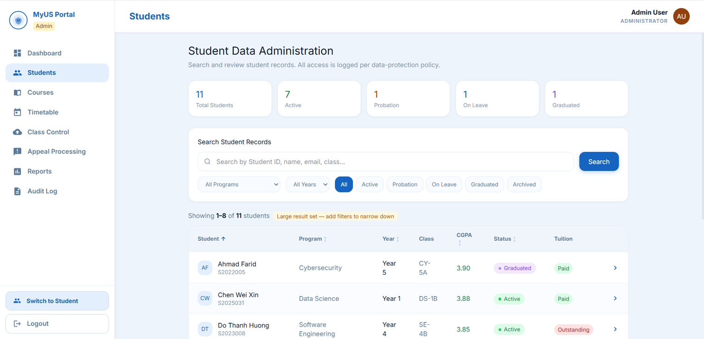

2. If one or more matching students are found:

   2.1. The system displays the matching student records.

   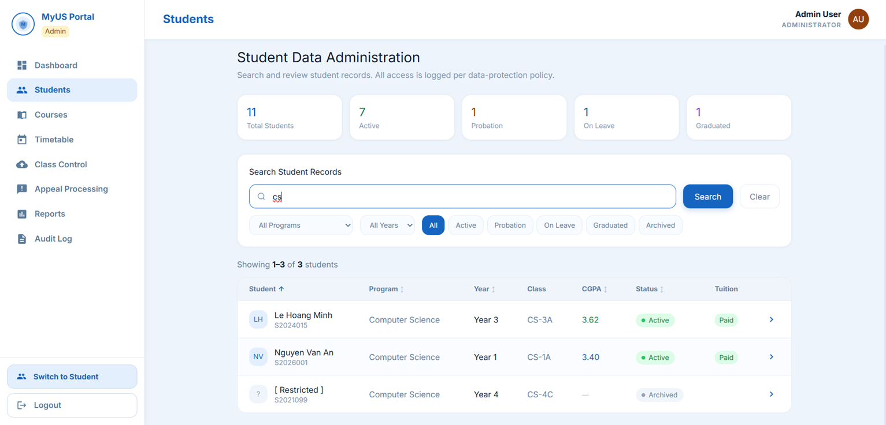

   2.2. The Administrator selects a student.

   2.3. The system displays the student information permitted by the Administrator’s role.

   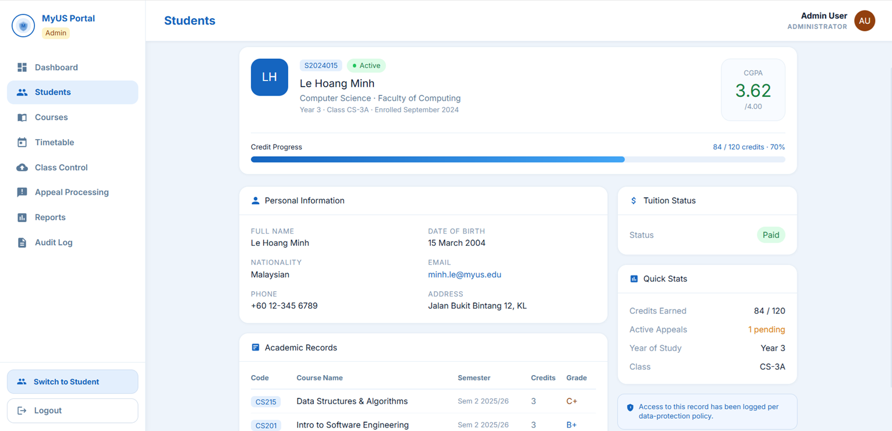

3. Else: The system informs the Administrator that no matching student was found.

   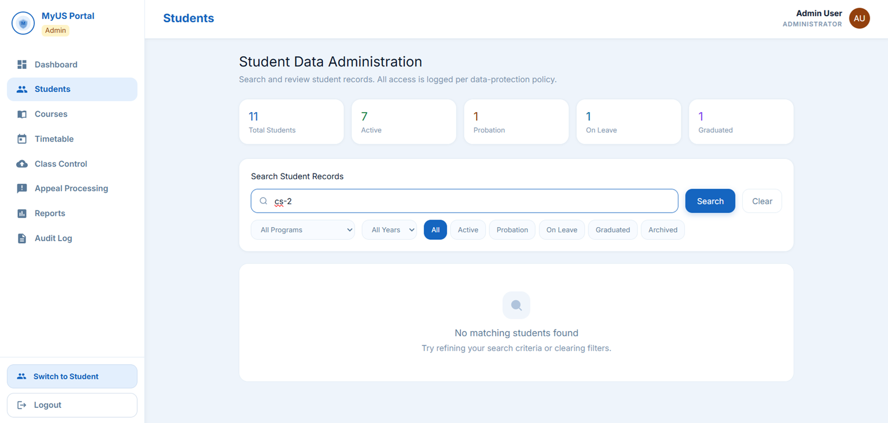

### 3.2 Alternative Flows
- **3.2.1 AF1 – Restricted student record:** If a matching student’s record is restricted or archived, the system indicates the restriction and limits the displayed data accordingly.

   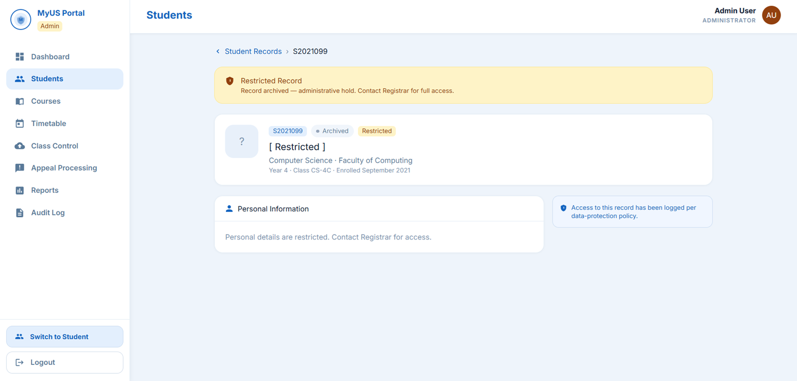

## 4. Postconditions
- The selected student information may be displayed according to the Administrator’s permissions.
- No student data is changed unless explicitly edited in a separate operation.

## 5. Special Requirements
- Student information must be protected using role-based access control.
- Access to confidential student records must be auditable.
- Search and record access must respect the Administrator’s assigned privileges.

## 6. Extension Points
- None.

---
# UC-13a. Search Student Records

**Use-Case ID:** UC-13a

**Actor(s):** Administrator

## 1. Brief Description
Allows the Administrator to search for students by one or more criteria and select a permitted student record for review.

## 2. Preconditions
- The Student Data Administration page is open.
- The student database is available.

## 3. Flow of Events
### 3.1 Basic Flow
1. The system asks the Administrator for search criteria (such as student ID, name, program, class, or status).
2. The system validates the search criteria.
3. If the criteria are valid: The system searches for matching student records.

   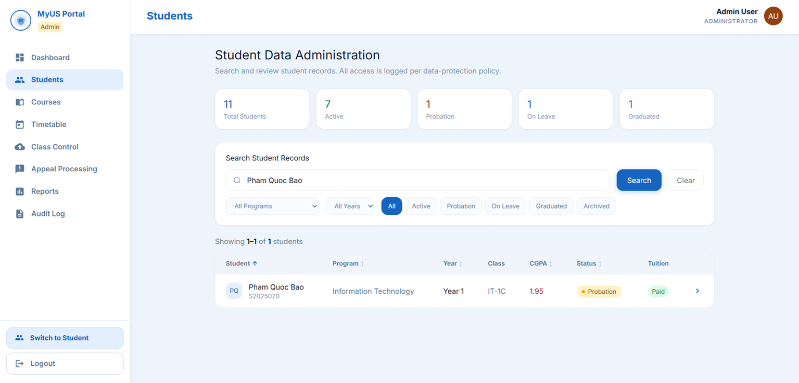

4. Else: The system identifies the invalid criteria and asks the Administrator to correct them.

5. If matching student records are found:

   5.1. The system displays the student ID, name, program, class, and status of each matching student.

   

   5.2. The Administrator may sort or filter the results.

   5.3. The Administrator selects a student.

   5.4. The system displays the permitted student information.

   

6. Else: The system informs the Administrator that no matching student was found.

   

### 3.2 Alternative Flows
- **3.2.1 AF1 – No search results:** If no matching students are found, the system displays a no-results message.

- **3.2.2 AF2 – Restricted or archived record:** If the selected student record is restricted, the system limits the displayed data accordingly.

   

## 4. Postconditions
- Matching student records may be displayed.
- A student record may be selected for review.
- No student data is changed.

## 5. Special Requirements
- Search input must be validated and sanitized.
- Search results must only display information permitted for the Administrator.
- Large result sets must be paginated.

## 6. Extension Points
- None.

---
