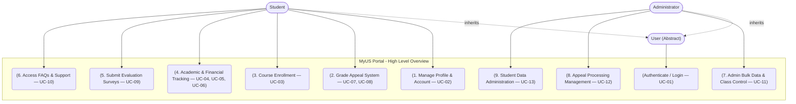
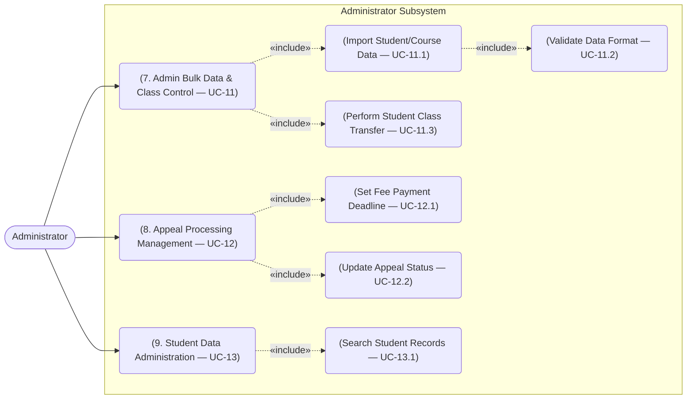

# MyUS Portal — Use-Case Model
---

| # | Issue Found | Resolution |
|---|---|---|
| 1 | **Tuition tracking was missing entirely.** Vision Doc Feature 4 and AC-01.2 explicitly name tuition balance as one of three items shown together on the student dashboard (with GPA and timetable), and UC-06 exists in the Use-Case Specification, but no diagram in v1.0 of this model showed it. | Added **Track Tuition Fee (UC-06)** as a third child of *Academic & Financial Tracking*, alongside View Timetable and View Grades & GPA. |
| 2 | **Incorrect «include» relationship.** The Student Subsystem diagram showed *Grade Appeal System* «include»-ing *Track Appeal Status*, but the accompanying text only justified including *Upload Supporting Documents*. Per the spec (UC-08), tracking status is reached independently via "My Appeals" and is not a mandatory step that executes every time an appeal is submitted — an «include» is incorrect here. | Removed the «include» edge; *Track Appeal Status* is now modeled as its own use case invoked directly by Student, grouped under the same Feature 2 boundary. |
| 3 | **Naming inconsistencies** between the two diagrams and the Use-Case Specification (e.g., "Submit Feedback & Surveys" vs. "Submit Feedback & Evaluation" vs. spec's "Submit Evaluation Surveys"; "Search Centralized Support & FAQ" vs. spec's "Access FAQs & Support"). | All node labels now match the Use-Case Specification's titles exactly. |
| 4 | **No traceability between diagrams and spec IDs.** A reader could not tell which spec use case (UC-01…UC-13.1) a diagram node referred to. | Every node now carries its Use-Case Specification ID, and a traceability table (below) maps each Vision Document feature to its use case(s). |
| 5 | **Missing "Class Transfer" capability.** Vision Doc Feature 7 explicitly states administrators "manually execute student class transfers," and AC-05.3 tests this behavior, but neither this model nor the Use-Case Specification (v1.0) contained a use case for it. | Added **Perform Student Class Transfer (UC-11.3)** under *Admin Bulk Data & Class Control*; the corresponding use case has been added to the revised Use-Case Specification (v1.1). |

### Table of Contents

| # | Vision Document Feature | Use-Case ID(s) |
|---|---|---|
| — | Authentication (shared, generalized `User` actor) | UC-01 |
| 1 | Profile & Account Management | UC-02 |
| 2 | Grade Appeal System for Students | UC-07, UC-07a, UC-08 |
| 3 | Course Enrollment & AI Chatbot | UC-03, UC-03a, UC-03b |
| 4 | Academic & Financial Tracking | UC-04, UC-05, UC-06 |
| 5 | Feedback & Evaluation Surveys | UC-09 |
| 6 | Centralized Support & FAQ | UC-10 |
| 7 | Admin Bulk Data & Class Control | UC-11, UC-11.1, UC-11.2, UC-11.3 |
| 8 | Appeal Processing Management | UC-12, UC-12.1, UC-12.2 |
| 9 | Student Data Administration | UC-13, UC-13.1 |

---

## 1. Overall System & Actor Generalization
This diagram illustrates the high-level actors interacting with the MyUS portal. Both Student and Administrator inherit from the generalized abstract `User` actor, allowing them to share foundational use cases such as Authentication. All 9 core functional groups from the Vision Document are represented here, each labeled with its corresponding Use-Case Specification ID(s) for full traceability.



## 2. Student Subsystem (Academic Self-Service & Support)
This diagram isolates the workflows specific to the Student actor, focusing on academic self-management, financial tracking, and support interactions. To accurately reflect the business logic confirmed in the Use-Case Specification, this model applies structural relationships strictly — an «include» is used only where the sub-process is a *mandatory* step that always executes, and independently-invokable use cases are connected directly to the Student actor instead.

- **«extend» Relationship:** The interaction with the external **AI Engine** during course enrollment is modeled as an extension (**Get AI Course Recommendations**, UC-03b). This indicates that AI consultation is an optional, value-adding feature that students can trigger to optimize their roadmap, rather than a mandatory step in the standard enrollment process.

- **«include» Relationships:** Complex workflows are decomposed into mandatory sub-processes.
  - **Submit Grade Appeal (UC-07)** includes **Upload Supporting Documents (UC-07a)**, since an appeal cannot be submitted without at least one supporting attachment (spec §3.1, step 4).
  - **Academic & Financial Tracking** includes the retrieval of the student's **timetable** (UC-04), **GPA records** (UC-05), and **tuition balance** (UC-06) — per Vision Doc AC-01.2, all three are essential components displayed together on the student dashboard.

- **Corrected relationship:** **Track Appeal Status (UC-08)** is *not* an «include» of Submit Grade Appeal. Per the spec, a student reaches it independently via "My Appeals" at any time after submission, not as a mandatory step of every submission. It is modeled here as a direct, sibling use case within the same Feature 2 (Grade Appeal System) boundary.

 ```mermaid
flowchart LR
    %% Actors
    Student(["Student"])
    AI(["AI Engine (External)"])

    %% System Boundary
    subgraph Student_Subsystem [Student Subsystem]
        direction TB

        UC1("(1. Manage Profile & Account — UC-02)")

        UC2("(2. Submit Grade Appeal — UC-07)")
        UC2a("(Upload Supporting Documents — UC-07a)")
        UC2b("(Track Appeal Status — UC-08)")

        UC3("(3. Course Enrollment — UC-03)")
        UC3a("(Check Prerequisites — UC-03a)")
        UC3b("(Get AI Course Recommendations — UC-03b)")

        UC4("(4. Academic & Financial Tracking)")
        UC4a("(View Timetable — UC-04)")
        UC4b("(View Grades & GPA — UC-05)")
        UC4c("(Track Tuition Fee — UC-06)")

        UC5("(5. Submit Evaluation Surveys — UC-09)")

        UC6("(6. Access FAQs & Support — UC-10)")
    end

    %% Actor Connections
    Student --> UC1
    Student --> UC2
    Student --> UC2b
    Student --> UC3
    Student --> UC4
    Student --> UC5
    Student --> UC6

    AI --- UC3b

    %% Relationships
    UC2 -.->|"«include»"| UC2a

    UC3 -.->|"«include»"| UC3a
    UC3b -.->|"«extend»"| UC3

    UC4 -.->|"«include»"| UC4a
    UC4 -.->|"«include»"| UC4b
    UC4 -.->|"«include»"| UC4c
```
## 3. Administrator Subsystem (Operations & Processing)
This diagram details the exclusive back-office operations performed by the Administrator role, which are critical for maintaining system data integrity and handling student requests. The model uses «include» relationships to define strict, mandatory operational procedures, and has been extended to cover the manual class-transfer capability required by the Vision Document but previously absent from the model:

- When executing **Admin Bulk Data & Class Control (UC-11)**, importing data always includes the **Validate Data Format (UC-11.2)** use case, to ensure that imported CSV/Excel files do not corrupt the database schema. The same feature also encompasses **Perform Student Class Transfer (UC-11.3)** — an alternative operation on the same Class Control page, added per Vision Doc Feature 7 ("manually execute student class transfers") and AC-05.3.

- During **Appeal Processing Management (UC-12)**, the workflow explicitly includes **Set Fee Payment Deadline (UC-12.1)** and **Update Appeal Status (UC-12.2)**. This guarantees that whenever an administrator processes a grade review, the system enforces a standardized administrative trail, ensuring transparency and automated notifications for the student.


