# MyUS Portal - Use-Case Specification
Version 1.0

---

# Table of Contents
| # | Use Case | Actor(s) |
|---|----------|----------|
| UC-01 | Authenticate / Login | Student |
| UC-02 | Update Profile | Student |
| UC-03 | Register for Courses | Student |
| UC-03a | Check Prerequisites (include) | Student, System |
| UC-03b | Get AI Course Recommendations (extend) | Student, AI Engine |
| UC-04 | View Timetable | Student |
| UC-05 | View Grades & GPA | Student |
| UC-06 | Track Tuition Fee | Student |
| UC-07 | Submit Grade Appeal | Student |
| UC-07a | Upload Supporting Documents (include) | Student |
| UC-08 | Track Appeal Status | Student |
| UC-09 | Submit Evaluation Surveys | Student |
| UC-10 | Access FAQs & Support | Student |
| UC-11 | Admin Bulk Data and Class Control | Administrator |
| UC-11.1 | Import Student/Course Data | Administrator |
| UC-11.2 | Validate Data Format | Administrator |
| UC-12 | Appeal Processing Management | Administrator |
| UC-12.1 | Set Fee Payment Deadline | Administrator |
| UC-12.2 | Update Appeal Status | Administrator |
| UC-13 | Student Data Administration | Administrator |
| UC-13.1 | Search Student Records | Administrator |

---

# UC-01. Authenticate / Login

**Use-Case ID:** UC-01

**Actor(s):** Student (inherited from the generalized `User` actor)

## 1. Brief Description
Describes how a registered undergraduate student logs into the MyUS portal with their university credentials to establish an authenticated session and reach their personalized dashboard. Every other use case in this document has this as a precondition.

## 2. Preconditions
- The student has a valid, active MyUS account (Student ID and password) provisioned by the university.
- The student has internet access and a supported browser/device (Chrome, Edge, Firefox, or Safari — latest two major versions — on Windows, macOS, Linux, Android, or iOS).

## 3. Flow of Events
### 3.1 Basic Flow
1. Student navigates to the MyUS login page.
2. System displays the login form (Student ID/email + password fields).
3. Student enters their Student ID and password, then submits.
4. System validates the credentials against the user database.
5. System issues a JWT access token and refresh token, and establishes an authenticated session.
6. System redirects the student to their personalized Dashboard, showing quick-access widgets (upcoming classes, pending appeals, tuition due).

### 3.2 Alternative Flows
- **3.2.1 AF1 – Invalid Credentials (branches at step 4):** If the Student ID or password is incorrect, the system shows an inline error ("Invalid Student ID or password") and returns to the form. After 5 consecutive failed attempts within 15 minutes, the account is temporarily locked for 30 minutes and a security-alert email is sent to the student's registered address.
- **3.2.2 AF2 – Forgot Password (branches at step 3):** Student selects "Forgot Password" → enters registered email → system sends a one-time reset link (valid 15 minutes) → student sets a new password → returns to the login form.
- **3.2.3 AF3 – First-Time Login / Forced Password Change (branches at step 4):** If the student is logging in with a university-issued temporary password for the first time, the system forces a password change (meeting complexity rules) before granting portal access.
- **3.2.4 AF4 – Session/Token Expiry (post-login):** If the JWT access token expires mid-session, the system attempts a silent refresh using the refresh token. If the refresh token is also expired or invalid, the system logs the student out and returns to the login page with a "Session expired, please log in again" message.
- **3.2.5 AF5 – Account Locked / Administrative Hold (branches at step 4):** If the account has been suspended (e.g., disciplinary or financial hold), the system denies login and displays a message directing the student to contact the Academic Office.

## 4. Postconditions
- Success: an authenticated session (JWT access + refresh token) is established; the student lands on the Dashboard.
- Failure: no session is created; the student remains on the Login screen.

## 5. Special Requirements
- Passwords must be hashed with BCrypt (minimum 10 rounds); plaintext must never appear in logs, API responses, or the database (NFR ID09).
- All traffic must use HTTPS/TLS 1.2+ (NFR ID11).
- JWT access and refresh tokens must have configurable expiration times (NFR ID10).
- Unauthenticated requests to any protected endpoint must receive an HTTP 401 (NFR ID06).

## 6. Extension Points
- None.

## 7. Prototype Requirement
Screens to design:
- Login Screen
- Forced Password-Change Screen
- Dashboard
- Invalid-Credentials Error
- Account-Locked / Hold Notice
- Forgot-Password Screen
- Reset-Password Screen
- Session-Expired Notice

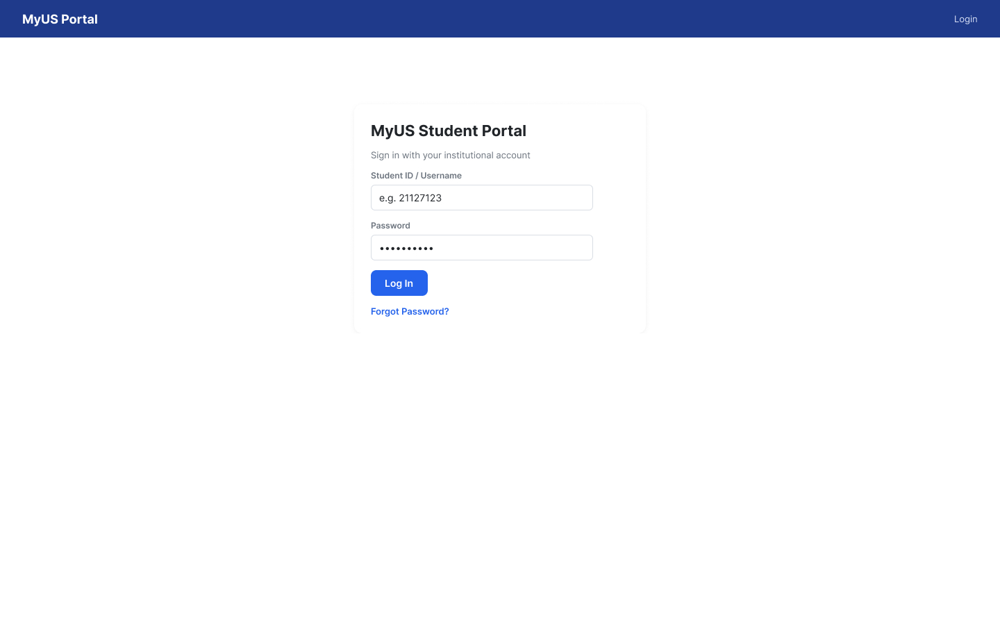

---
# UC-02. Update Profile

**Use-Case ID:** UC-02

**Actor(s):** Student

## 1. Brief Description
Allows a student to view and edit their own personal information, contact details, and emergency contacts, keeping university records accurate without administrative data entry.

## 2. Preconditions
- Student is authenticated (UC-01).

## 3. Flow of Events
### 3.1 Basic Flow
1. Student navigates to "My Profile."
2. System retrieves and displays the student's current profile: name and Student ID (read-only), contact phone, personal email, mailing address, and emergency contact (name, relationship, phone).
3. Student selects "Edit."
4. System switches the editable fields into input mode.
5. Student updates one or more fields.
6. Student selects "Save Changes."
7. System validates the input (required fields non-empty, valid phone/email format).
8. System persists the changes, timestamps the update for audit purposes, and displays a "Profile updated successfully" confirmation.

### 3.2 Alternative Flows
- **3.2.1 AF1 – Validation Error (branches at step 7):** If a field fails validation, the system highlights it with an inline message and does not save; the student corrects and resubmits.
- **3.2.2 AF2 – Cancel Edit (branches at step 4/5):** Student selects "Cancel"; the system discards unsaved changes and reverts to the read-only view.
- **3.2.3 AF3 – Attempt to Edit a Restricted Field (branches at step 5):** If the student attempts to change a university-locked field (legal name, Student ID, major/program), the system explains that such changes require a formal request to the Academic Office and does not allow inline editing.
- **3.2.4 AF4 – No Changes Made (branches at step 6):** Student selects "Save" without changing anything; the system returns to view mode without writing to the database.
- **3.2.5 AF5 – Contact-Info Change Confirmation:** If phone or email is changed, the system sends a confirmation notice to both the old and new contact point, as a fraud-prevention measure.

## 4. Postconditions
- Success: profile updated in the database; an audit-log entry is created.
- Failure: no changes persisted; original data remains.

## 5. Special Requirements
- A student may only view/edit their own profile; the system must not expose another student's profile data to them (RBAC, NFR ID07, ID08).
- Profile review must be completable in one session without external help, contributing to the ≥95% task-completion usability target (NFR ID12).
- Input must be validated on both client and server.

## 6. Extension Points
- None.

## 7. Prototype Requirement
Screens to design:
- Profile-View Screen
- Profile-Edit Screen
- Save-Confirmation Toast
- Validation-Error State
- Restricted-Field Notice
- No-Changes Notice

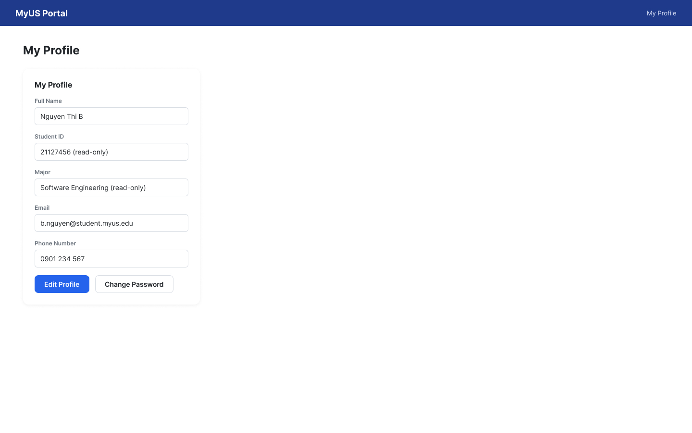

---
# UC-03. Register for Courses

**Use-Case ID:** UC-03

**Actor(s):** Student; includes UC-03a (Check Prerequisites); extended by UC-03b (Get AI Course Recommendations)

## 1. Brief Description
Lets a student browse the course catalog for the upcoming semester, verify eligibility, and self-enroll in class sections — giving them direct control over their academic progression, with an optional AI advisor available throughout.

## 2. Preconditions
- Student is authenticated.
- The registration window for the target term is currently open.
- Student has no administrative hold (e.g., unpaid balance, disciplinary hold) blocking registration.

## 3. Flow of Events
### 3.1 Basic Flow
1. Student navigates to "Course Registration."
2. System displays the registration screen: the student's program/credit summary and a searchable catalog of available sections (code, name, credits, schedule, instructor, seats remaining) for the current term.
3. Student searches/filters the catalog (department, course code, time slot) and selects a section to add.
4. System runs UC-03a (Check Prerequisites) against the selection.
5. System confirms eligibility, adds the section to the registration cart, and updates the running credit total and any schedule-conflict indicators.
6. Student repeats steps 3–5 to build a full course load.
7. Student reviews the cart summary (sections, total credits, estimated tuition impact).
8. Student selects "Submit Registration."
9. System finalizes enrollment, reserves seats in each section, and updates the tuition invoice accordingly.
10. System displays a registration confirmation with the finalized schedule.

### 3.2 Alternative Flows
- **3.2.1 AF1 – Prerequisite Not Met (branches at step 4):** UC-03a returns a failure; the system blocks the section from being added, names the missing prerequisite(s), and suggests the correct earlier course.
- **3.2.2 AF2 – Section Full / Waitlist (branches at step 5):** If the section has no seats left, the system offers to waitlist the student instead; if accepted, the student is notified automatically if a seat opens.
- **3.2.3 AF3 – Schedule Conflict (branches at step 5):** If the section's meeting time overlaps an already-selected course, the system warns the student and blocks adding both unless one is removed.
- **3.2.4 AF4 – Credit Limit Exceeded (branches at step 7/8):** If total selected credits exceed the university's per-semester maximum, the system blocks submission and directs the student to remove courses or request an Academic Office override.
- **3.2.5 AF5 – Consult AI Course Recommendations (branches at step 2/3; invokes UC-03b):** At any point while building their load, the student may open the AI Learning Path Chatbot. It analyzes completed credits and major requirements and suggests courses; the student accepts or declines each suggestion, and accepted ones auto-fill the cart, rejoining the flow at step 4. If the subsequent prerequisite/schedule check finds a conflict, the student is returned to the chatbot for a revised suggestion.
- **3.2.6 AF6 – Registration Window Closed (branches at step 1):** Outside the open registration period, the system shows a read-only view of the current schedule plus the add/drop deadline, with no editing allowed.
- **3.2.7 AF7 – Administrative Hold (branches at step 1):** If the student has an unresolved hold, the system blocks registration and explains the reason and how to resolve it.
- **3.2.8 AF8 – Draft Cart / Abandon Session:** The student may leave the cart unsubmitted; selections are retained as a draft, but seats are not reserved until final submission.
- **3.2.9 AF9 – Drop a Registered Course (post-submission, within the add/drop window):** The student returns to this screen to drop a previously registered course; the system updates enrollment and recalculates the tuition invoice.

## 4. Postconditions
- Success: student is enrolled in the selected sections; tuition invoice and timetable are updated.
- Failure: no new enrollment is recorded; the cart retains unsaved selections.

## 5. Special Requirements
- Seat reservation must be transaction-safe under concurrent load during peak registration windows, without degrading responsiveness for a campus-sized student body (NFR ID24).
- The registration flow must remain fully usable through manual course selection if the AI chatbot/external LLM API is unavailable (graceful degradation, NFR ID18).
- Enrollment-validation logic (prerequisites, credit limits, conflicts) is critical business logic and must be unit-tested (NFR ID30).
- Course registration must be completable in one session without external help (NFR ID12).

## 6. Extension Points
- **6.1 Get AI Course Recommendations (UC-03b):** Triggered by the student at any point while building their load.

## 7. Prototype Requirement
Screens to design:
- Administrative-Hold Notice
- Closed-Registration Read-Only View
- Course-Catalog / Search Screen
- Section-Detail Panel
- Prerequisite-Blocked Error
- Waitlist Confirmation
- Schedule-Conflict Warning
- Registration-Cart / Summary Screen
- Credit-Limit-Exceeded Notice
- Registration-Confirmation Screen

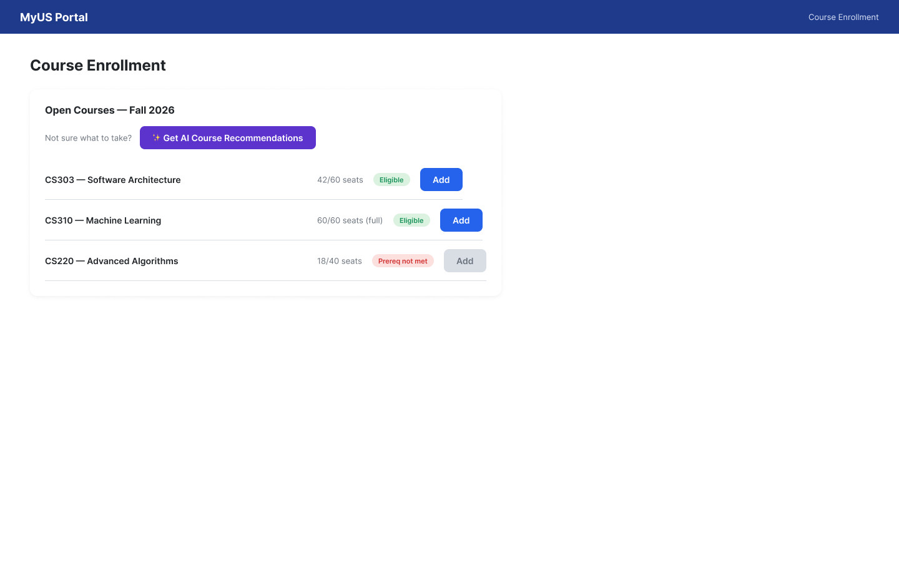

---
# UC-03a. Check Prerequisites

**Use-Case ID:** UC-03a

**Actor(s):** Student (indirectly, via UC-03); System

## 1. Brief Description
A supporting use case invoked every time a student attempts to add a course, verifying that the student satisfies the prerequisite/corequisite conditions defined in the official curriculum before the course can be added to the cart.

## 2. Preconditions
- Invoked only within UC-03; the curriculum's prerequisite rules and the student's transcript/in-progress course list are available.

## 3. Flow of Events
### 3.1 Basic Flow
1. Triggered when the student selects a course to add (UC-03, step 3–4).
2. System retrieves the prerequisite/corequisite rules for the selected course from the curriculum database.
3. System retrieves the student's completed and in-progress course history.
4. System compares the requirements against that history.
5. System returns "Pass"; control returns to UC-03 at step 5.

### 3.2 Alternative Flows
- **3.2.1 AF1 – Prerequisite Missing (branches at step 4):** One or more prerequisites are unmet; system returns "Fail" with the specific missing course code(s) (feeds UC-03's AF1).
- **3.2.2 AF2 – Corequisite Not Concurrently Registered (branches at step 4):** A required corequisite isn't yet in the student's cart; the system flags this and suggests adding it together.
- **3.2.3 AF3 – Prerequisite Rule Undefined (branches at step 2):** If no rule is configured for the course (a data gap), the system defaults to allowing registration but flags the course for administrative review.
- **3.2.4 AF4 – Transfer Credit / Waiver on File (branches at step 4):** If the student has an approved transfer-credit or waiver record substituting for a prerequisite, the system recognizes it and returns "Pass."

## 4. Postconditions
- Pass: the course proceeds to be added in UC-03.
- Fail: the course is not added; the student sees which requirement is missing.

## 5. Special Requirements
- Prerequisite and curriculum data is manually seeded/maintained by administrators, not fed from an external system, so the check is only as current as the last seeding (Vision Doc §4.2 assumptions).
- The check must complete quickly enough not to interrupt the registration flow.
- This logic is critical business logic and must be unit-tested (NFR ID30).

## 6. Extension Points
- None.

## 7. Prototype Requirement
Screens to design:
- Prerequisite-Blocked Error (shown in UC-03)
- Corequisite-Suggestion Modal

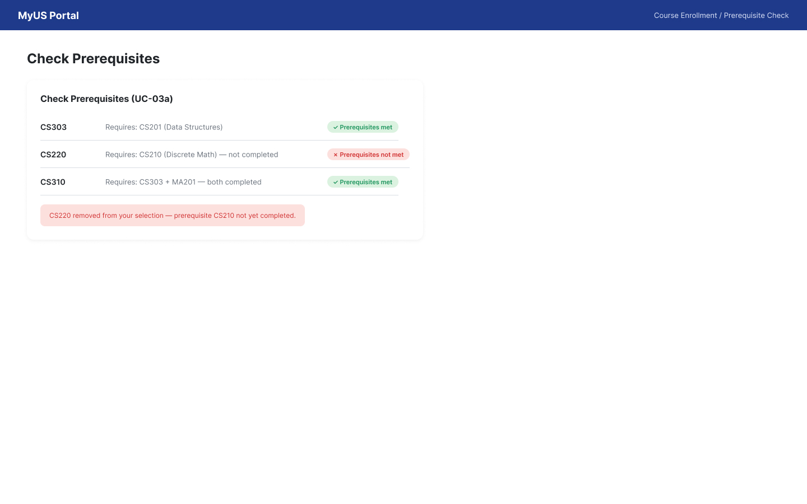

---
# UC-03b. Get AI Course Recommendations

**Use-Case ID:** UC-03b

**Actor(s):** Student; AI Engine (external LLM API — Gemini/OpenAI)

## 1. Brief Description
An optional conversational assistant that reads the student's transcript and the official curriculum to recommend the most suitable next courses and project a graduation timeline. It extends Course Registration but can also be opened independently from the Dashboard as a general planning tool. Per the Vision Document, it is explicitly guidance-oriented and not a substitute for a human academic advisor.

## 2. Preconditions
- Student is authenticated.
- The student's transcript (completed courses, grades, credits) and program curriculum map are available.
- The external LLM API is reachable.

## 3. Flow of Events
### 3.1 Basic Flow
1. Student opens the AI Learning Path Chatbot (from the Dashboard, or "Get AI Recommendations" inside Course Registration).
2. System sends the student's transcript and curriculum requirements to the AI Engine (Profile & Progress Analysis).
3. Student asks a question, e.g., "What should I take next semester?"
4. AI Engine filters out locked (ineligible) subjects against prerequisite/corequisite constraints and ranks the remaining eligible courses (Smart Course Suggestion).
5. System displays the recommendations as chat cards, each with a short rationale (e.g., "Required for your major," "Prerequisite for an upcoming course").
6. Student selects a recommended course to add it directly to the registration cart (rejoining UC-03 at step 4).
7. Student asks a follow-up, e.g., "Am I on track to graduate on time?"
8. AI Engine simulates the remaining pathway and returns a graduation timeline/milestone view (Graduation Tracking).
9. Student ends the session; the conversation and recommendations are saved to chat history.

### 3.2 Alternative Flows
- **3.2.1 AF1 – AI Engine Unavailable (branches at step 2/4):** If the external LLM API can't be reached, the system shows "The AI Advisor is temporarily unavailable, please try again later" and points the student to the curriculum handbook or an academic advisor. All other portal features remain unaffected (NFR ID18).
- **3.2.2 AF2 – Incomplete Transcript Data (branches at step 2):** If transcript data is incomplete (e.g., unprocessed transfer credits), the system flags that recommendations may be incomplete and suggests verifying with the Academic Office.
- **3.2.3 AF3 – No Eligible Courses Found (branches at step 4):** If the student is near graduation, the chatbot says so and lists only the remaining required courses or electives.
- **3.2.4 AF4 – Unclear Question (branches at step 3):** If the input can't be parsed into an actionable request, the chatbot asks a clarifying question or offers example prompts.
- **3.2.5 AF5 – Recommendation Rejected at Registration (branches at step 6):** If a recommended course later fails UC-03a's prerequisite check (e.g., curriculum data changed since the recommendation was made), the system informs the student of the discrepancy.
- **3.2.6 AF6 – What-If Simulation (branches at step 7):** Student asks a hypothetical ("What if I switch majors?" / "What if I take this course over the summer?"); the AI runs an alternate simulation and shows a comparative timeline without committing any change to the student's actual plan.
- **3.2.7 AF7 – Escalate to a Human Advisor (any point):** If the chatbot can't resolve a complex or personal question, it offers a "Talk to an academic advisor" option (may hand off toward Access FAQs & Support, UC-10, or an office appointment — out of scope for this feature).

## 4. Postconditions
- Success: student receives personalized recommendations and/or a graduation timeline; selected courses may be added to the registration cart.
- Failure: no recommendation delivered; student is redirected to manual resources.

## 5. Special Requirements
- AI suggestions are advisory only and must never bypass UC-03a's formal prerequisite validation (NFR ID18's "guidance-oriented" framing).
- Recommendations must return in a timely manner to keep the conversation feeling responsive (NFR ID04).
- Every recommendation must include a stated reason, for advising transparency and accountability.
- Chat history must be stored securely and visible only to the student and authorized academic staff (NFR ID08).

## 6. Extension Points
- None.

## 7. Prototype Requirement
Screens to design:
- Chat-Conversation Screen
- AI-Unavailable Error
- Incomplete-Data Notice
- Clarifying-Question Prompt
- Near-Graduation Notice
- Recommendation-Mismatch Notice
- Graduation-Timeline View
- What-If Comparison View
- Talk-to-Advisor Escalation Screen

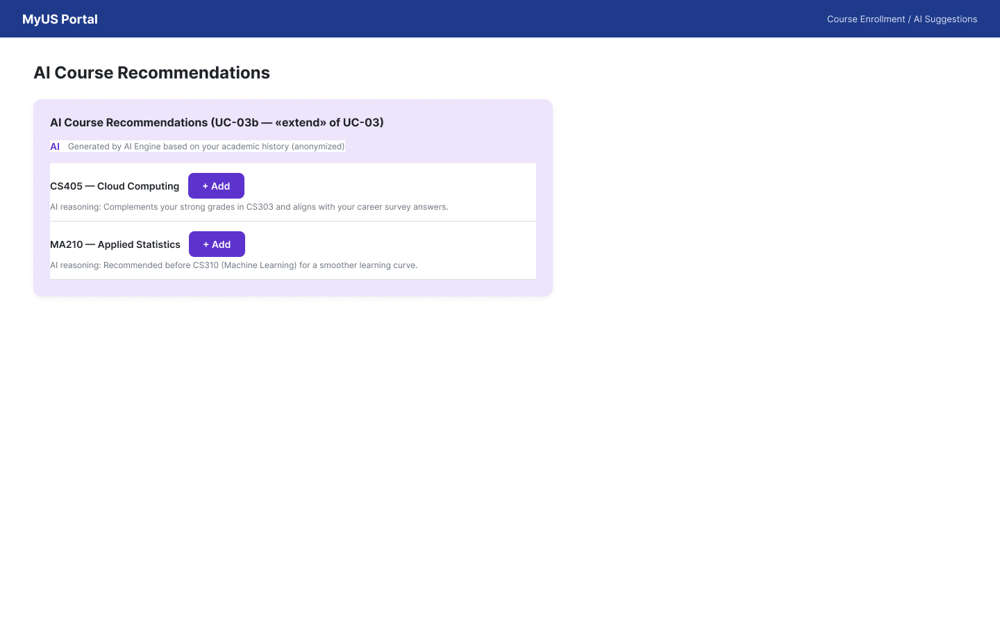

---
# UC-04. View Timetable

**Use-Case ID:** UC-04

**Actor(s):** Student

## 1. Brief Description
Gives the student a personalized calendar aggregating all registered class times, rooms, and upcoming exam schedules, with optional sync to Google Calendar.

## 2. Preconditions
- Student is authenticated; student has at least one registered course for the current term (otherwise the view is empty).

## 3. Flow of Events
### 3.1 Basic Flow
1. Student navigates to "Timetable."
2. System retrieves all currently registered sections and any scheduled exams for the term.
3. System renders a weekly calendar grid, one color-coded block per class (course, room, time).
4. Student toggles between Week / Month / List view.
5. Student selects a class block to see full details (instructor, room, section ID).

### 3.2 Alternative Flows
- **3.2.1 AF1 – No Registered Courses (branches at step 2):** System shows an empty state ("No classes scheduled — register for courses to see your timetable") with a shortcut to Course Registration.
- **3.2.2 AF2 – Room/Time Change Notification:** If an administrator changes a class's room or time, the system highlights the changed session with an "Updated" badge until acknowledged.
- **3.2.3 AF3 – Exam Overlay:** Student toggles "Show Exams" to overlay midterm/final exam dates and rooms onto the same calendar.
- **3.2.4 AF4 – Sync to Google Calendar:** Student selects "Sync to Google Calendar"; the system pushes the timetable to the student's Google Calendar via the Google Calendar API.
- **3.2.5 AF5 – Download Printable Schedule:** Student selects "Download PDF" for a printable weekly schedule.
- **3.2.6 AF6 – Schedule Conflict Flag:** If an administrative class transfer creates a time overlap between two of the student's sections, the system flags the conflict prominently and prompts the student to contact the Academic Office.
- **3.2.7 AF7 – Calendar Integration Unavailable (branches at AF4):** If the Google Calendar API is unreachable, sync fails gracefully with a retry option; the core in-portal timetable view is unaffected.

## 4. Postconditions
- Timetable displayed; read-only aside from the optional calendar-sync/export action.

## 5. Special Requirements
- Must reflect administrator-side schedule changes (e.g., class transfers) without requiring a full page reload.
- Google Calendar sync depends on the Google Calendar API (Vision Doc dependency D3); its unavailability must degrade only the sync feature, not core timetable viewing.
- Must render correctly at all three responsive breakpoints (NFR ID13), with a condensed daily-agenda layout on mobile.

## 6. Extension Points
- None.

## 7. Prototype Requirement
Screens to design:
- Empty State — No Courses
- Weekly-Calendar Grid
- List / Agenda View
- Class-Detail Popup
- Exam-Overlay View
- Sync-Confirmation State
- Sync-Unavailable Notice
- Schedule-Conflict Flag

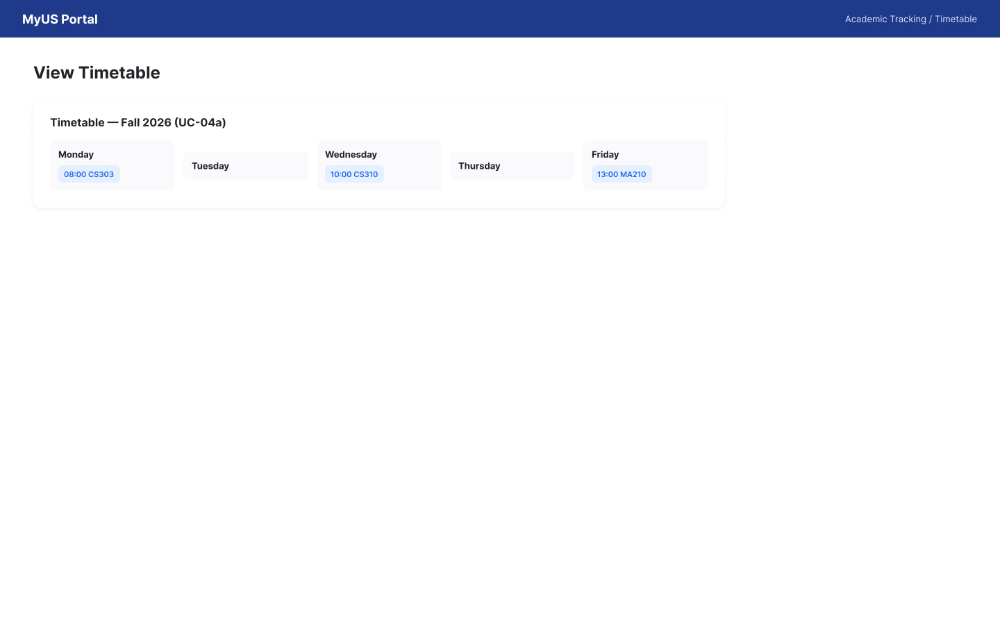

---
# UC-05. View Grades & GPA

**Use-Case ID:** UC-05

**Actor(s):** Student

## 1. Brief Description
Lets the student see a per-course breakdown of academic performance (midterm, assignments, final) and an automatically calculated semester and cumulative GPA.

## 2. Preconditions
- Student is authenticated; at least one grade has been recorded for the student.

## 3. Flow of Events
### 3.1 Basic Flow
1. Student navigates to "Grades."
2. System retrieves grade records for all enrolled/completed courses, grouped by semester.
3. System displays, per course: component scores, weights, and the computed course grade.
4. System displays semester GPA, cumulative GPA, and total credits earned.
5. Student selects a past semester from a dropdown to view historical grades.

### 3.2 Alternative Flows
- **3.2.1 AF1 – Grade Not Yet Released (branches at step 3):** An ungraded component shows "Pending"/"—" and is excluded from GPA calculation until finalized.
- **3.2.2 AF2 – Appeal a Grade (branches at step 3):** Student selects "Appeal this Grade" on a specific course, launching UC-07 (Submit Grade Appeal) pre-filled with that course's context.
- **3.2.3 AF3 – View GPA Trend:** Student toggles a chart showing cumulative-GPA progression across semesters.
- **3.2.4 AF4 – Download Unofficial Transcript:** Student requests a PDF export of all grades to date.
- **3.2.5 AF5 – Special Grade Codes (branches at step 3):** Courses marked Incomplete ("I") or Withdrawn ("W") show the code with an explanatory tooltip and are handled per the university's GPA-exclusion policy rather than as a numeric score.

## 4. Postconditions
- Grade/GPA data displayed; read-only aside from transcript-export logging.

## 5. Special Requirements
- GPA calculation must exactly match the university's official grading policy and is critical business logic requiring unit-test coverage (NFR ID30).
- Grade queries must complete efficiently even for students with several years of history (NFR ID05).
- Grade and transcript data is sensitive and must never be exposed to any user other than the student themself and authorized staff (NFR ID08).
- Grade lookup must be completable in one session without external help (NFR ID12).

## 6. Extension Points
- None.

## 7. Prototype Requirement
Screens to design:
- Current-Semester Grade Breakdown
- Cumulative-GPA Summary Card
- Historical-Semester Selector
- GPA-Trend Chart
- Transcript-Export Modal
- Pending-Grade Placeholder
- Incomplete/Withdrawn Code Tooltip

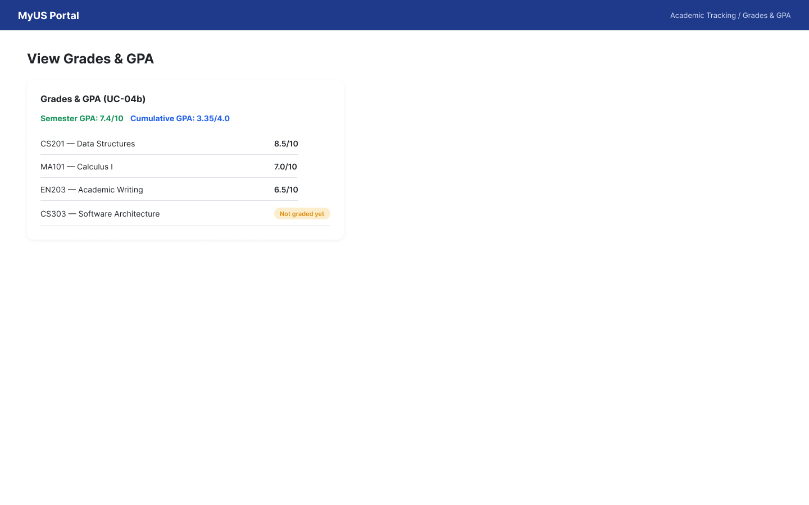

---
# UC-06. Track Tuition Fee

**Use-Case ID:** UC-06

**Actor(s):** Student

## 1. Brief Description
Gives the student a comprehensive view of their financial status — tuition owed, applied scholarships, payment history, and upcoming deadlines. MyUS tracks tuition status; it does not process payments directly (payment happens off-platform, e.g., in person or by bank transfer, consistent with how the Grade Appeal fee is handled in UC-08).

## 2. Preconditions
- Student is authenticated; at least one tuition invoice exists for the student (typically generated at registration).

## 3. Flow of Events
### 3.1 Basic Flow
1. Student navigates to "Tuition" / "Financial Status."
2. System retrieves the current invoice: total owed for the term, itemized by course/credit-hour and fees.
3. System displays any applied scholarships/financial-aid deductions.
4. System displays payment history (date, method, reference).
5. System displays the current outstanding balance and next due date.
6. Student selects a line item for more detail (e.g., scholarship terms, fee explanation).

### 3.2 Alternative Flows
- **3.2.1 AF1 – Overdue Balance (branches at step 5):** Past the due date with a balance outstanding, the system shows a prominent overdue banner and any resulting hold (e.g., a registration hold).
- **3.2.2 AF2 – Paid in Full (branches at step 5):** If the balance is fully settled, the system shows a "Paid in Full" confirmation instead.
- **3.2.3 AF3 – Download Invoice/Receipt:** Student downloads a PDF of the current invoice or a past payment receipt.
- **3.2.4 AF4 – Scholarship Pending (branches at step 3):** If a scholarship approval is still in process, the system shows "Pending" rather than a finalized deduction.
- **3.2.5 AF5 – How to Pay (branches at step 1/5):** Student selects "How to Pay" to view the university's available off-platform payment channels (bank transfer, in-person cashier, etc.), since MyUS does not process payments directly.
- **3.2.6 AF6 – Dispute a Charge:** If the student believes a charge is incorrect, they're directed to Access FAQs & Support (UC-10) or to contact the Academic Office; MyUS does not have a self-service charge-dispute workflow in this release.

## 4. Postconditions
- Financial data displayed; read-only aside from downloads.

## 5. Special Requirements
- Financial and payment-reference data is sensitive and must be access-controlled to the student and authorized staff only (NFR ID08).
- Balance and deadline data should stay closely synced with the university's financial records.

## 6. Extension Points
- None.

## 7. Prototype Requirement
Screens to design:
- Tuition-Summary Dashboard
- Itemized-Invoice Breakdown
- Scholarship / Aid Detail
- Payment-History List
- Overdue-Balance Warning
- Paid-in-Full Confirmation
- How-to-Pay Instructions Modal
- Invoice/Receipt PDF Download

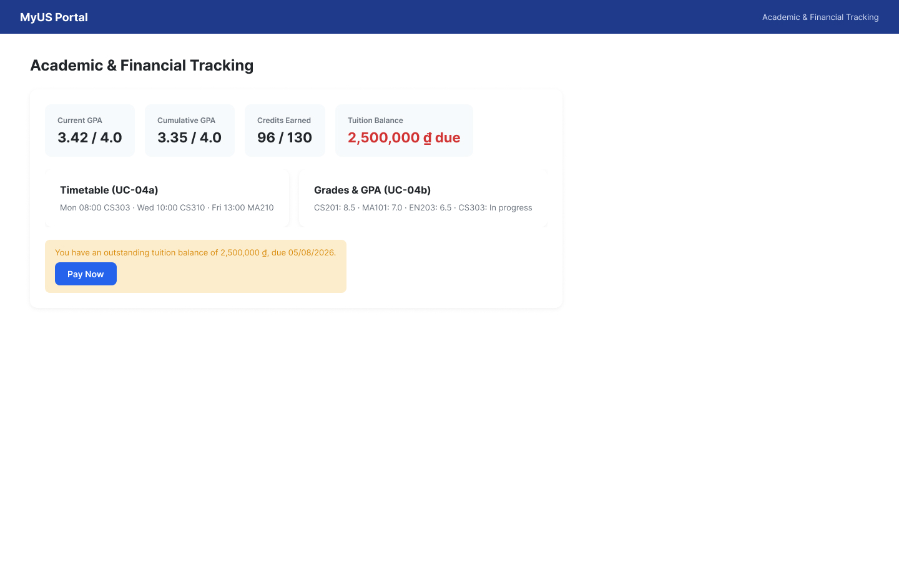

---
# UC-07. Submit Grade Appeal

**Use-Case ID:** UC-07

**Actor(s):** Student; includes UC-07a (Upload Supporting Documents)

## 1. Brief Description
Lets a student digitally submit a request to review a specific grade component, replacing paper petitions, with mandatory supporting evidence.

## 2. Preconditions
- Student is authenticated.
- At least one finalized grade exists that's eligible for appeal.
- The appeal window for that grading period is still open.

## 3. Flow of Events
### 3.1 Basic Flow
1. Student navigates to "Grade Appeals" → "Submit New Appeal" (or selects "Appeal this Grade" from UC-05, which pre-fills the course/component).
2. System displays the appeal form.
3. Student selects the specific grade component being disputed (if not already pre-filled) and enters a written justification.
4. System runs UC-07a (Upload Supporting Documents), requiring at least one attachment.
5. Student reviews the completed form.
6. Student selects "Submit Appeal."
7. System validates that all required fields and the attachment are present.
8. System creates the appeal record with status **Pending**, timestamps it, and routes it to the relevant department's admin queue.
9. System displays a confirmation with a reference number and a link to Track Appeal Status (UC-08).

### 3.2 Alternative Flows
- **3.2.1 AF1 – Missing Required Field/Attachment (branches at step 7):** The system blocks submission and highlights what's missing.
- **3.2.2 AF2 – Appeal Window Closed (branches at step 1):** "Submit New Appeal" is disabled, and the (past) deadline is shown.
- **3.2.3 AF3 – Duplicate Active Appeal (branches at step 1):** If the student already has a Pending or Processing appeal for the same grade component, the system blocks a duplicate and redirects to the existing appeal's status page.
- **3.2.4 AF4 – Save as Draft (branches at step 3/5):** Student exits before submitting; the system offers to save an in-progress, not-yet-submitted draft.
- **3.2.5 AF5 – Attachment Upload Failure (branches at step 4):** See UC-07a's alternative flows.
- **3.2.6 AF6 – Withdraw Before Review (post-submission, while status is still Pending):** Student withdraws the appeal from the tracking screen (UC-08).
- **3.2.7 AF7 – Appeal Rejected Outright (post-submission, administrator action):** The administrator reviews and declines the request without proceeding to a fee stage; status moves directly from Pending to **Rejected**, and the student is notified (visible via UC-08).

## 4. Postconditions
- Success: a new appeal record exists with status Pending, visible to administrators; the student has a reference number.
- Failure: no appeal record is created.

## 5. Special Requirements
- Status transitions (Pending → Processing → Resolved, or Pending → Rejected) must become visible to the student promptly after an administrator action (NFR ID15).
- Uploaded evidence must be virus-scanned and access-restricted to the student and the reviewing administrator.
- The appeal workflow is critical business logic and must be unit-tested (NFR ID30).
- All state transitions must be timestamped for audit purposes.

## 6. Extension Points
- None.

## 7. Prototype Requirement
Screens to design:
- My-Appeals Landing Screen
- Appeal-Window-Closed Notice
- Duplicate-Appeal Redirect
- New-Appeal Form
- Save-as-Draft State
- Review-Before-Submit Summary
- Missing-Field Error
- Submission-Confirmation Screen

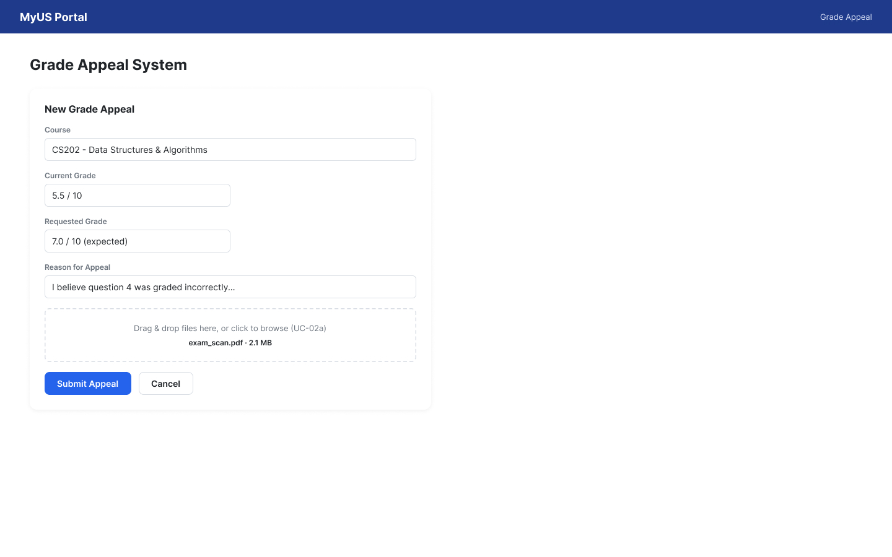

---
# UC-07a. Upload Supporting Documents

**Use-Case ID:** UC-07a

**Actor(s):** Student (indirectly, via UC-07)

## 1. Brief Description
A mandatory supporting use case for attaching evidence files to a grade appeal — an appeal cannot be processed without it.

## 2. Preconditions
- Invoked within UC-07, at the attachment step.

## 3. Flow of Events
### 3.1 Basic Flow
1. System presents an upload widget (drag-and-drop or "Browse Files") within the appeal form.
2. Student selects one or more files.
3. System validates each file's format (e.g., PDF, JPG, PNG, DOCX) and size (e.g., ≤10MB).
4. System uploads the file(s) with a progress indicator.
5. System lists the uploaded file names/thumbnails, each with a "Remove" option.
6. Control returns to UC-07 at step 5 (review).

### 3.2 Alternative Flows
- **3.2.1 AF1 – Unsupported Format (branches at step 3):** File is rejected with an inline message naming acceptable formats.
- **3.2.2 AF2 – File Too Large (branches at step 3):** File is rejected with the size limit shown.
- **3.2.3 AF3 – Upload Failure (branches at step 4):** Network error mid-transfer offers a retry.
- **3.2.4 AF4 – Remove/Replace a File (branches at step 5):** Student removes a file and uploads a replacement before final submission.
- **3.2.5 AF5 – Maximum Attachment Count Reached (branches at step 2):** Once the configured maximum (e.g., 5 files) is reached, further uploads are blocked until one is removed.

## 4. Postconditions
- One or more valid files are attached to the in-progress appeal (staged until UC-07's final submission).

## 5. Special Requirements
- Files must be malware-scanned before being persisted.
- Storage access is restricted to the student and the reviewing administrator (NFR ID08).

## 6. Extension Points
- None.

## 7. Prototype Requirement
Screens to design:
- Upload Widget
- Unsupported-Format / Too-Large Error
- Upload-Progress State
- Upload-Failure Retry Prompt
- Uploaded-File List
- Max-Attachments Notice

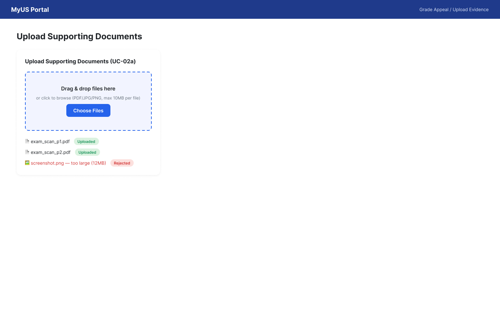

---
# UC-08. Track Appeal Status

**Use-Case ID:** UC-08

**Actor(s):** Student

## 1. Brief Description
A dashboard where students monitor the real-time processing status of their submitted appeals — Pending, Processing, Resolved, or Rejected — including any fee-payment deadline the administrator sets.

## 2. Preconditions
- Student is authenticated; at least one appeal has been submitted (UC-07).

## 3. Flow of Events
### 3.1 Basic Flow
1. Student navigates to "My Appeals" / "Appeal Status."
2. System retrieves all appeals the student has submitted, past and present.
3. System displays each as a card: course, disputed component, submission date, and current status.
4. Student selects an appeal to see full detail, including administrator comments and — if the status is Processing — the fee-payment deadline (date, time, location) for visiting the Academic Office.
5. If status is **Resolved**, the system shows the outcome (grade upheld, or grade changed with the new value).

### 3.2 Alternative Flows
- **3.2.1 AF1 – No Appeals Submitted (branches at step 2):** Empty state with a shortcut to "Submit New Appeal."
- **3.2.2 AF2 – Fee Deadline Approaching (branches at step 4):** If the fee deadline is within a configurable threshold (e.g., 3 days), the appeal is highlighted with an urgent reminder.
- **3.2.3 AF3 – Fee Deadline Missed (branches at step 4):** If the deadline passes unpaid, the administrator closes the appeal and its status becomes **Rejected** (reason: "fee not paid by deadline"), visible to the student.
- **3.2.4 AF4 – Withdraw a Pending Appeal (branches at step 3, status = Pending):** Same as UC-07's AF6.
- **3.2.5 AF5 – Additional Information Requested (branches at step 4):** If an administrator requests more evidence, the student is prompted to re-invoke UC-07a or add a comment.
- **3.2.6 AF6 – Notification Preferences:** Student opts in/out of email notifications for status changes on a given appeal.

## 4. Postconditions
- Appeal status/details displayed; no core data modified, aside from an optional withdrawal or additional-document submission.

## 5. Special Requirements
- Administrator-side status updates must be visible to the student promptly — this is the system's real-time-status usability commitment (NFR ID15).
- The fee-payment deadline, once set, must show date, time, and location unambiguously to avoid missed payments.

## 6. Extension Points
- None.

## 7. Prototype Requirement
Screens to design:
- Empty State — No Appeals
- Appeal-List Dashboard
- Appeal-Detail Screen
- Pending / Processing / Resolved / Rejected states
- Urgent Fee-Deadline Banner
- Withdraw-Confirmation Dialog

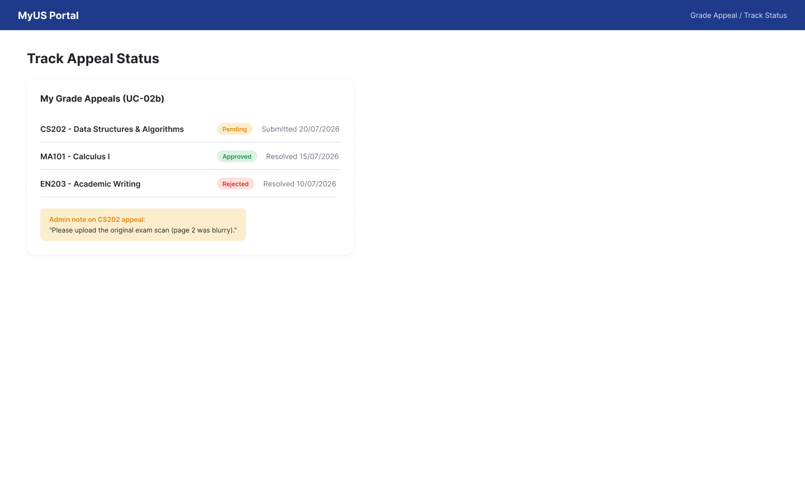

---
# UC-09. Submit Evaluation Surveys

**Use-Case ID:** UC-09

**Actor(s):** Student

## 1. Brief Description
Lets a student complete end-of-semester structured surveys evaluating course quality, lecturer performance, and campus facilities.

## 2. Preconditions
- Student is authenticated; the evaluation period for the current semester is open; student is enrolled in at least one course requiring evaluation.

## 3. Flow of Events
### 3.1 Basic Flow
1. Student navigates to "Evaluations" (or follows a notification that evaluations are open).
2. System displays pending surveys — one per enrolled course, plus any general campus-facilities survey.
3. Student opens a survey.
4. System presents structured questions (rating scales for content, delivery, materials, facilities) plus optional open-text comments.
5. Student answers all required questions and selects "Submit."
6. System validates that all required questions are answered.
7. System records the response and marks the survey **Completed** for that student.
8. System returns to the survey list, showing updated completion status.

### 3.2 Alternative Flows
- **3.2.1 AF1 – Incomplete Submission (branches at step 6):** Unanswered required questions are highlighted and submission is blocked.
- **3.2.2 AF2 – Save and Continue Later (branches at step 5):** Partial progress is saved and can be resumed before the deadline.
- **3.2.3 AF3 – Evaluation Period Closed (branches at step 1):** Completed vs. missed surveys are shown read-only; no further edits are allowed.
- **3.2.4 AF4 – Already Submitted (branches at step 3):** A completed survey opens read-only, optionally showing the student's own past responses.
- **3.2.5 AF5 – Deadline Reminder:** As the window nears its end, the system sends a reminder for any incomplete required surveys.
- **3.2.6 AF6 – Skip an Optional Survey (branches at step 3):** A non-mandatory survey (e.g., general facilities) can be dismissed without penalty.

## 4. Postconditions
- Response recorded; survey marked Completed; aggregated data becomes available to the university for quality review.

## 5. Special Requirements
- Responses should be de-identified before being visible to lecturers, to encourage candid feedback — a policy recommendation the university should confirm, since it isn't explicitly stated in the source documents.
- The survey must be quick to complete on mobile to maximize response rates (NFR ID13).
- Validation messages must be clear and specific (NFR ID14).

## 6. Extension Points
- None.

## 7. Prototype Requirement
Screens to design:
- Survey List
- Survey-Question Screen
- Locked / Read-Only Completed View
- Optional-Survey Skip Prompt
- Incomplete-Validation Error
- Submission-Confirmation Screen
- Save-and-Continue-Later State
- Deadline-Reminder Banner
- Period-Closed Read-Only View

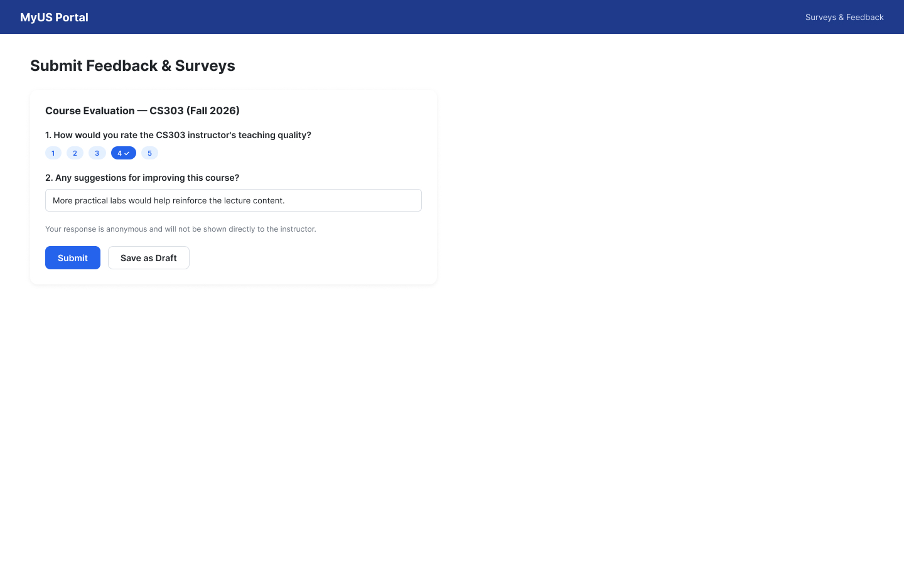

---
# UC-10. Access FAQs & Support

**Use-Case ID:** UC-10

**Actor(s):** Student

## 1. Brief Description
A searchable library of questions and answers about university policies, academic rules, and IT support, so students get instant answers without waiting on the helpdesk.

## 2. Preconditions
- Student is authenticated.

## 3. Flow of Events
### 3.1 Basic Flow
1. Student navigates to "Help & FAQ."
2. System displays FAQ categories (Academic Policies, Registration, Grades & Appeals, Tuition, IT/Technical Support).
3. Student searches a keyword or browses a category.
4. System displays matching entries as an expandable list.
5. Student selects a question to read the full answer.

### 3.2 Alternative Flows
- **3.2.1 AF1 – No Matching Results (branches at step 3/4):** "No results found," with suggested popular topics or a "Contact Support" option.
- **3.2.2 AF2 – Contact Support (branches at step 5):** If the FAQ doesn't resolve the issue, the student selects "Still need help?" to see helpdesk contact information or submit a ticket.
- **3.2.3 AF3 – Rate an Answer (branches at step 5):** Student marks an answer "Helpful"/"Not Helpful" to help the university improve FAQ content.
- **3.2.4 AF4 – Related Questions (branches at step 5):** After viewing one entry, related questions from the same category are suggested.
- **3.2.5 AF5 – Bookmark an FAQ (branches at step 5):** Student saves a frequently referenced entry for quick future access.

## 4. Postconditions
- FAQ content displayed; no core academic data modified; optional feedback/bookmark recorded.

## 5. Special Requirements
- Search must return relevant results without noticeable delay (NFR ID16).
- Search should tolerate typos and recognize keyword synonyms (e.g., "drop a class" ≈ "withdraw from course").
- FAQ content should be editable by administrators without a code deployment.

## 6. Extension Points
- None.

## 7. Prototype Requirement
Screens to design:
- FAQ Home / Category Screen
- No-Results / Contact-Support Screen
- Search-Results Screen
- Expanded-Answer Detail View
- Helpful / Not-Helpful Widget
- Related-Questions Suggestions
- Bookmarked-FAQs Screen

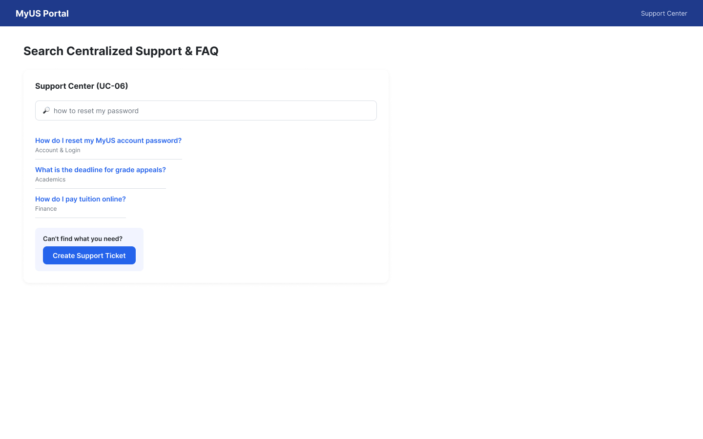

---
# UC-11. Admin Bulk Data and Class Control

**Use-Case ID:** UC-11

**Actor(s):** Administrator

## 1. Brief Description
This use case allows the Administrator to manage student, course, and class data in bulk from a centralized Class Control page.

## 2. Preconditions
- Administrator is authenticated and has permission to access Class Control.

## 3. Flow of Events
### 3.1 Basic Flow
1. The Administrator selects **Class Control**.
2. The system displays the available bulk-data management functions.
3. The Administrator selects **Import Student/Course Data**.
4. The system performs **UC-11.1 – Import Student/Course Data**.
5. If the import is completed successfully:

   5.1. The system updates the related student, course, or class records.
   5.2. The system displays the import summary.

   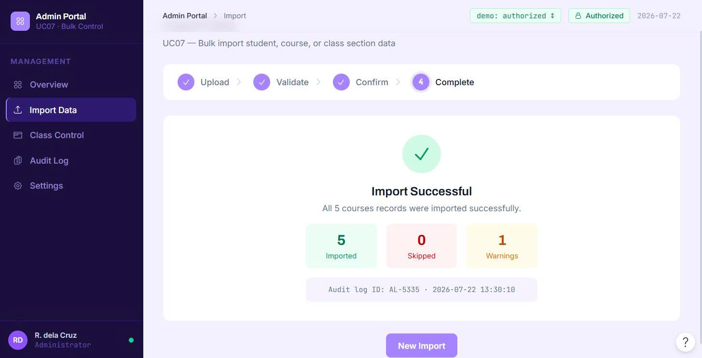

6. Else:

   6.1. The system displays the reason why the operation could not be completed.
   6.2. The system keeps the existing data unchanged.

   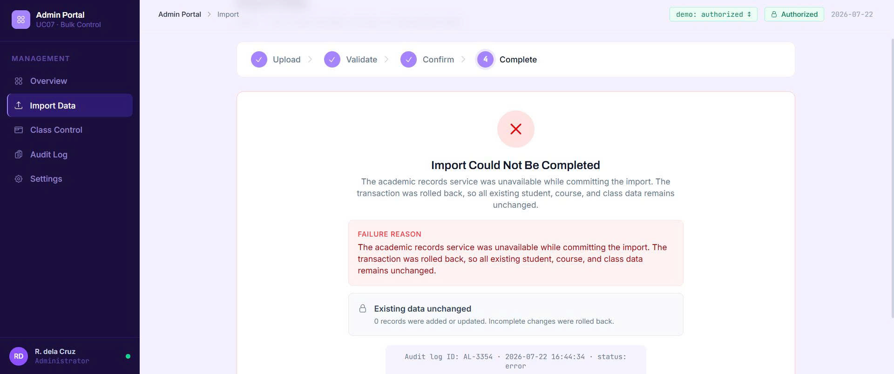

7. The system records the operation in the audit log.

   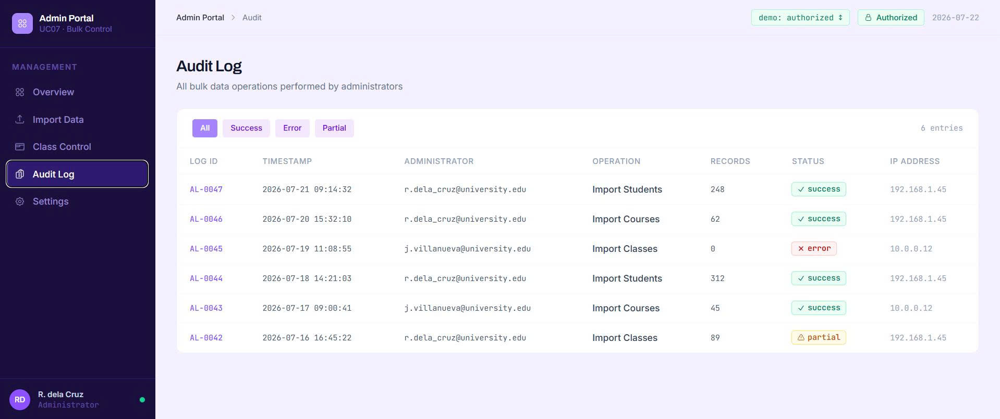

### 3.2 Alternative Flows
- **3.2.1 AF1 – Cancel before confirmation:** At any time before confirming the import, the Administrator may cancel the operation; the system discards the temporary import data and leaves existing academic records unchanged.
- **3.2.2 AF2 – Permission denied:** If the Administrator does not have sufficient permission, the system denies access and displays an authorization error.

   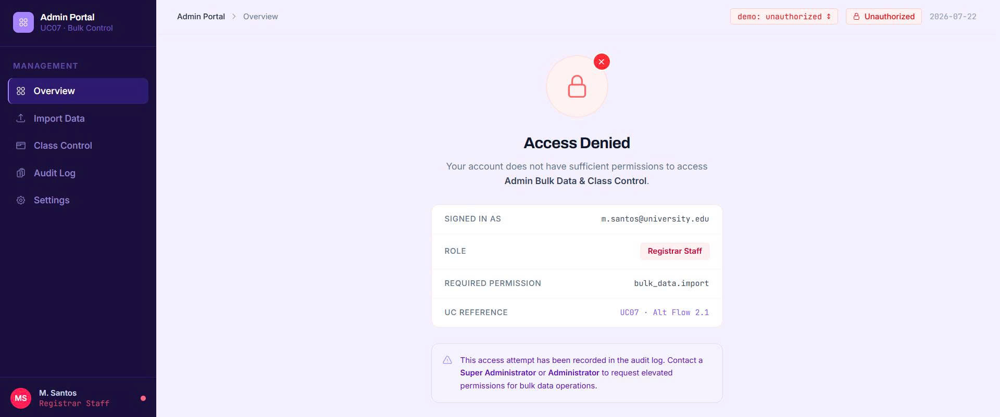

- **3.2.3 AF3 – Duplicate or conflicting records found:** If duplicate or conflicting records are detected, the system identifies the affected records and lets the Administrator choose to skip or update them before proceeding.

## 4. Postconditions
- The academic data is added, updated, or left unchanged, and the operation is recorded, according to the outcome of UC-11.1 – Import Student/Course Data.

## 5. Special Requirements
- Only authorized Administrators may access this function.
- All data changes must be recorded in the audit log.

## 6. Extension Points
- None.

## 7. Prototype Requirement
Screens to design:
- Class Control Page
- Import File Upload Screen
- Import Preview Screen
- Import Success Summary
- Import Failure/Error Screen
- Unauthorized Access Screen

---
# UC-11.1. Import Student/Course Data

**Use-Case ID:** UC-11.1

**Actor(s):** Administrator

## 1. Brief Description
This use case allows the Administrator to import student, course, or class data from a file.

## 2. Preconditions
- Invoked within UC-11, when the Administrator selects Import Student/Course Data.

## 3. Flow of Events
### 3.1 Basic Flow
1. The Administrator selects **Import Student/Course Data**.
2. The system asks the Administrator to select the data type and upload an import file.
3. The Administrator selects student, course, or class data and uploads the file.

   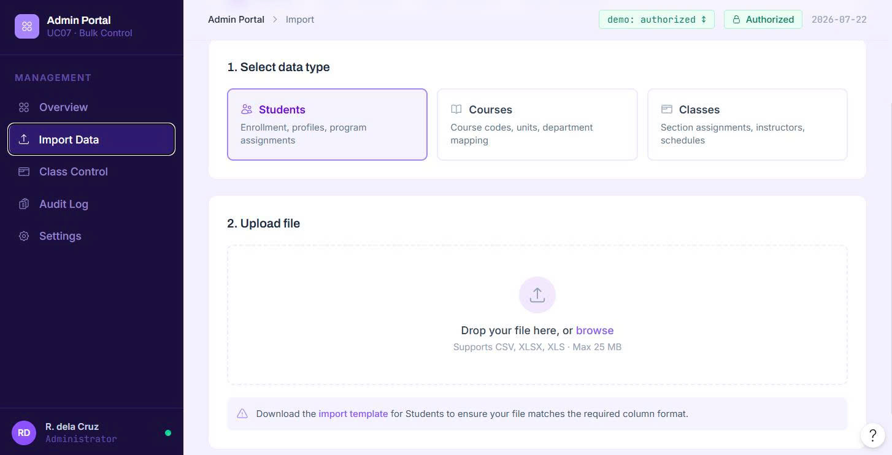

4. The system performs **UC-11.2 – Validate Data Format**.
5. If the uploaded data is valid:

   5.1. The system displays an import preview, including records to be added or updated.

   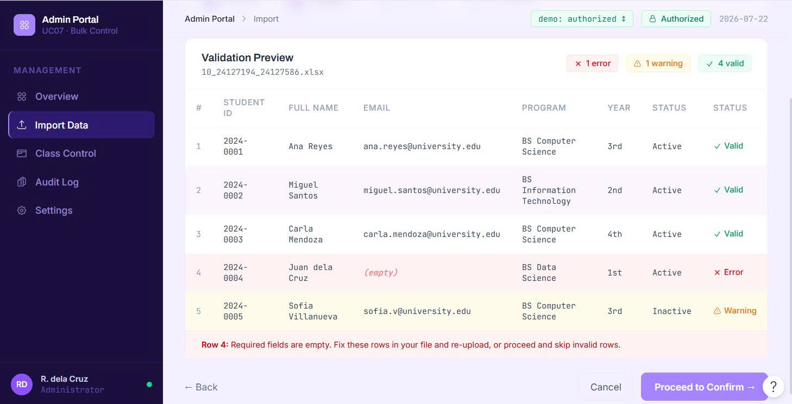

6. The Administrator reviews the preview and confirms the import.
7. The system imports the approved records.
8. The system displays the number of added, updated, and skipped records.

### 3.2 Alternative Flows
- **3.2.1 AF1 – Invalid file/data:** If the uploaded file is malformed or contains invalid rows, the system displays detailed errors, does not generate an import preview, and asks the Administrator to correct and re-upload the file.
- **3.2.2 AF2 – Duplicate or conflicting records:** If duplicate or conflicting records are found, the system identifies the affected entries and allows the Administrator to skip, overwrite, or merge them before continuing.
- **3.2.3 AF3 – Cancel before confirmation:** At any time before confirming the import, the Administrator may cancel the operation; the system discards temporary import data and leaves existing records unchanged.
- **3.2.4 AF4 – Permission denied:** If the Administrator does not have sufficient permission, the system denies access and displays an authorization error.

## 4. Postconditions
- Success: valid and approved records are added or updated; an import summary is available; the operation is recorded.
- Failure: invalid, cancelled, or unconfirmed data is not imported; existing data remains unchanged.

## 5. Special Requirements
- The system should support CSV and XLSX files.
- The Administrator must review the data before confirming the import.
- The import must not leave incomplete database changes.

## 6. Extension Points
- None.

## 7. Prototype Requirement
Screens to design:
- Data-Type & File-Upload Screen
- Import-Preview Screen
- Invalid-File / Error Screen
- Import-Summary Screen

---
# UC-11.2. Validate Data Format

**Use-Case ID:** UC-11.2

**Actor(s):** Administrator

## 1. Brief Description
This use case checks whether an uploaded file follows the required structure and data rules.

## 2. Preconditions
- Invoked within UC-11.1, after a file has been uploaded.

## 3. Flow of Events
### 3.1 Basic Flow
1. The system reads the uploaded file.
2. The system checks whether the required columns are present.
3. The system checks whether required fields contain values.
4. The system checks data formats, identifiers, references, and duplicate records.
5. If all records satisfy the validation rules:

   5.1. The system marks the records as valid.
   5.2. The system allows the import process to continue.

   

6. Else:

   6.1. The system marks the affected records as invalid or conflicting.
   6.2. The system identifies the related rows, fields, and errors.
7. The system displays the validation result.

   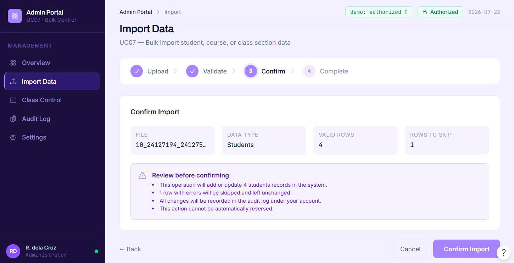

### 3.2 Alternative Flows
- **3.2.1 AF1 – File unreadable:** If the system cannot read the uploaded file, it stops validation, shows an error message, and asks the Administrator to upload a corrected file.
- **3.2.2 AF2 – Data validation failures:** If specific rows or fields fail checks, the system reports the row number, field, and error description, and prevents continuation until corrected.
- **3.2.3 AF3 – Duplicate record detection:** If duplicate entries are found, the system marks the affected rows, explains the duplicate conflict, and requires the Administrator to resolve it before continuing.

## 4. Postconditions
- Each record has a validation result.
- A validation report is available.
- No data is imported during this use case.

## 5. Special Requirements
- Each validation error should include the row number, field name, and error description.
- The validation report should be downloadable.

## 6. Extension Points
- None.

## 7. Prototype Requirement
Screens to design:
- Validation-Result Screen
- Validation-Error Detail

---
# UC-12. Appeal Processing Management

**Use-Case ID:** UC-12

**Actor(s):** Administrator

## 1. Brief Description
This use case allows the Administrator to review and process student appeals.

## 2. Preconditions
- Administrator is authenticated and has permission to access Appeal Processing Management.
- At least one appeal has been submitted (UC-07).

## 3. Flow of Events
### 3.1 Basic Flow
1. The Administrator selects **Appeal Processing Management**.
2. The system displays the submitted appeals.
3. The Administrator selects an appeal.
4. The system displays the student information, appeal details, supporting documents, payment information, and current status.

   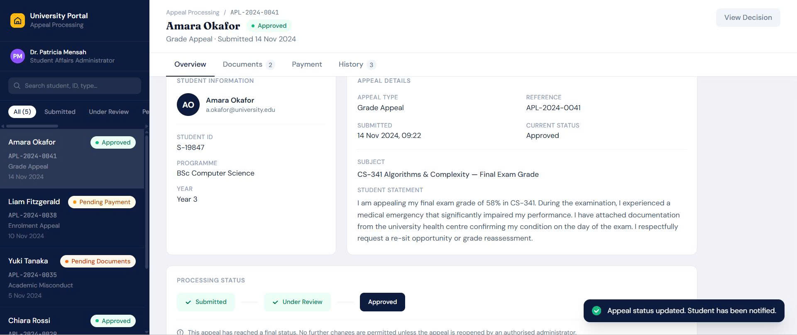

5. The Administrator reviews the appeal.
6. If the appeal requires a processing fee:

   6.1. The Administrator performs **UC-12.1 – Set Fee Payment Deadline**.

7. The Administrator performs **UC-12.2 – Update Appeal Status**.
8. If the appeal information is updated successfully (Details in UC-12.2):

   8.1. The system records the changes in the appeal history.
   8.2. The system notifies the student.
   8.3. The system displays the updated appeal.

9. Else:

   9.1. The system displays an error message.
   9.2. The system keeps the previous appeal information unchanged.

### 3.2 Alternative Flows
- **3.2.1 AF1 – No matching appeal found:** If no appeal matches the Administrator’s search or filters, the system displays a no-results message and lets the Administrator refine the criteria.
- **3.2.2 AF2 – Additional information required:** If the appeal needs more details, the Administrator requests it, the system updates the appeal record, and the student is notified to supply the missing information.
- **3.2.3 AF3 – Appeal already finalized:** If the appeal has reached a final status, the system shows the final decision and prevents further changes unless the appeal is reopened by an authorized Administrator.
- **3.2.4 AF4 – Cancel before save:** At any time before saving changes, the Administrator may cancel the operation; the system discards unsaved modifications and preserves the current appeal state.
- **3.2.5 AF5 – Permission denied:** If the Administrator lacks permission to process the appeal, access is denied and the system displays an authorization error.

## 4. Postconditions
- The appeal’s payment deadline and/or processing status are updated, and the student is notified, according to the outcomes of UC-12.1 – Set Fee Payment Deadline and UC-12.2 – Update Appeal Status.

## 5. Special Requirements
- Appeal documents must only be accessible to authorized users.
- Each change must record the Administrator, date, time, and change details.

## 6. Extension Points
- None.

## 7. Prototype Requirement
Screens to design:
- Appeal List Screen
- Appeal Detail Screen
- Status Update Screen
- Fee Deadline Screen
- Error / Invalid Update Screen
- Unauthorized Access Screen

---
# UC-12.1. Set Fee Payment Deadline

**Use-Case ID:** UC-12.1

**Actor(s):** Administrator

## 1. Brief Description
This use case allows the Administrator to set or change the payment deadline for an appeal-processing fee.

## 2. Preconditions
1. An appeal has been selected.
2. The appeal requires a processing fee.
3. The processing fee has not been paid.
4. The appeal has not been closed.

## 3. Flow of Events
### 3.1 Basic Flow
1. The Administrator selects **Set Fee Payment Deadline**.
2. The system displays the fee amount, payment status, and current deadline, if available.

   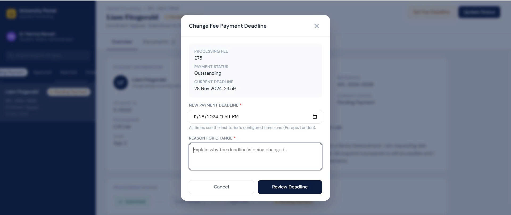

3. The Administrator enters a payment deadline.
4. The system validates the selected deadline.
5. If the deadline is valid:

   5.1. The system displays the deadline for confirmation.
   5.2. The Administrator confirms the deadline.
   5.3. The system saves the deadline.

   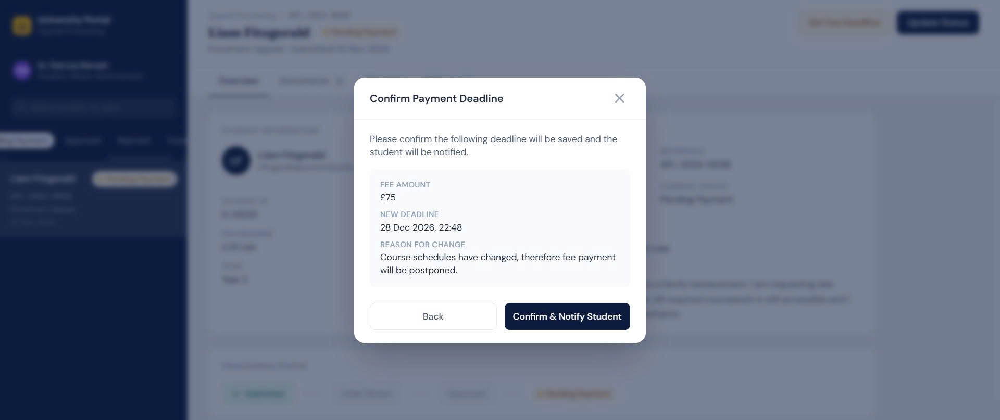

6. Else:

   6.1. The system explains why the deadline is invalid.
   6.2. The system asks the Administrator to enter another deadline.

   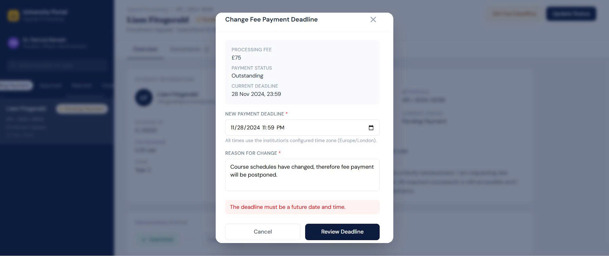

7. The system records the deadline in the appeal history.
8. The system notifies the student.

   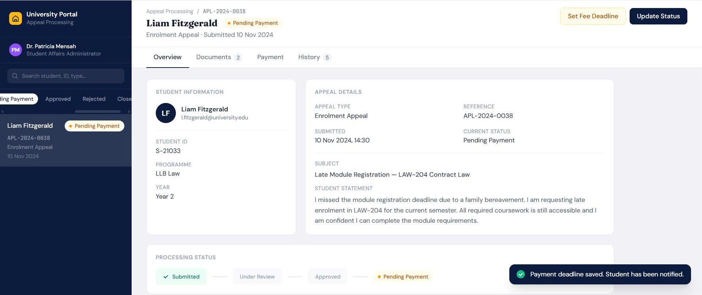

### 3.2 Alternative Flows
- **3.2.1 AF1 – Existing deadline being changed:** If a payment deadline already exists, the Administrator enters a new deadline and a reason for the change; the system records both the prior and the updated deadline.
- **3.2.2 AF2 – Fee already paid or no fee required:** If the fee has already been paid or is no longer required, the system prevents deadline setting and displays current payment status.
- **3.2.3 AF3 – Invalid deadline:** If the chosen deadline is not valid (e.g., earlier than today or outside service hours), the system explains the issue and prompts for a corrected date/time.
- **3.2.4 AF4 – Cancel before confirmation:** The Administrator may cancel before confirming; the system keeps the previous deadline unchanged.

## 4. Postconditions
- A valid payment deadline is associated with the appeal.
- The deadline is recorded in the appeal history.
- The student is notified.

## 5. Special Requirements
- The payment deadline must use the institution’s configured time zone.
- Changes to an existing deadline must include a reason.

## 6. Extension Points
- None.

## 7. Prototype Requirement
Screens to design:
- Fee-Deadline Entry Screen
- Deadline-Confirmation Screen
- Deadline-Set Success Screen
- Deadline-Invalid Error Screen

---
# UC-12.2. Update Appeal Status

**Use-Case ID:** UC-12.2

**Actor(s):** Administrator

## 1. Brief Description
This use case allows the Administrator to change the processing status of an appeal.

## 2. Preconditions
1. An appeal has been selected.
2. The Administrator has permission to update the appeal.

## 3. Flow of Events
### 3.1 Basic Flow
1. The Administrator selects **Update Appeal Status**.
2. The system displays the current status and the permitted next statuses.

   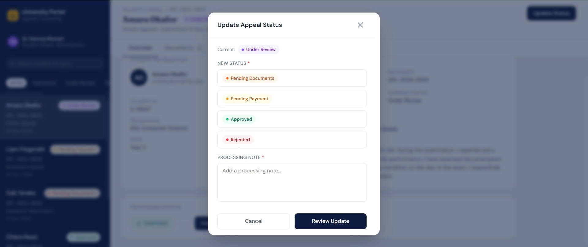

3. The Administrator selects a new status.
4. The Administrator enters a processing note.
5. The system validates the selected status and required information.
6. If the status change is valid:

   6.1. The system displays a summary of the change.
   6.2. The Administrator confirms the update.
   6.3. The system saves the new status.

   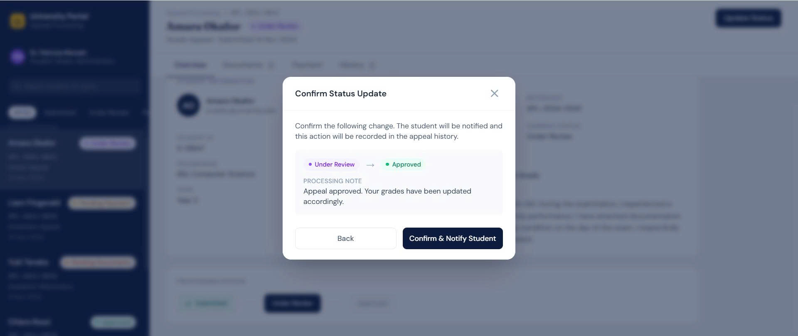

7. Else:

   7.1. The system identifies the invalid or missing information.
   7.2. The system asks the Administrator to correct the update.

   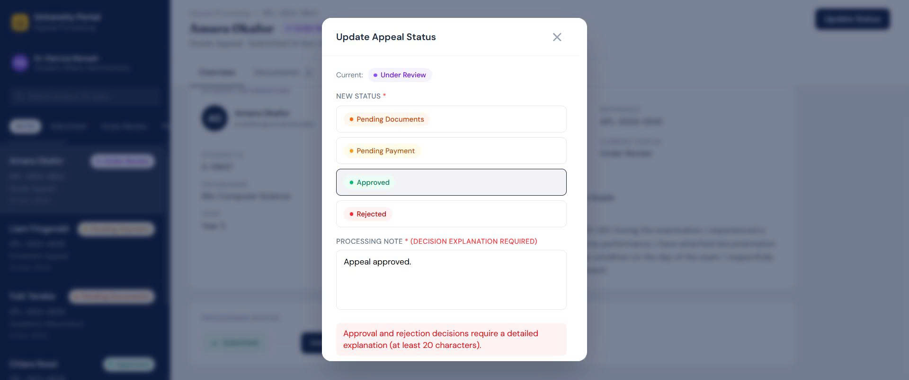

8. The system records the status change in the appeal history.
9. The system notifies the student.

   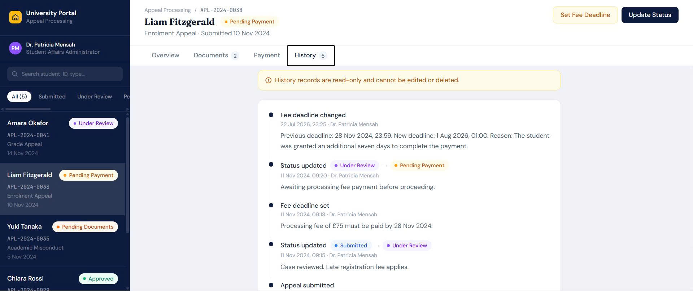

### 3.2 Alternative Flows
- **3.2.1 AF1 – Additional information requested:** If the Administrator needs more details before changing status, they request it and the system notifies the student of the required information.
- **3.2.2 AF2 – Reopen completed appeal:** If the Administrator reopens a completed appeal, the system verifies permission, captures a reopening reason, and moves the appeal back to an active status.
- **3.2.3 AF3 – Invalid status transition:** If the selected status is not permitted from the current state, the system prevents the change and explains the allowed next statuses.
- **3.2.4 AF4 – Cancel before confirmation:** The Administrator may cancel the update before confirmation; the system leaves the previous status unchanged.

## 4. Postconditions
- The appeal has the selected valid status.
- The status change and processing note are recorded.
- The student is notified.

## 5. Special Requirements
- Approval and rejection statuses must include a decision explanation.
- The system must enforce valid status transitions.

## 6. Extension Points
- None.

## 7. Prototype Requirement
Screens to design:
- Status-Update Screen
- Status-Change Confirmation
- Status-Update Success Screen
- Status-Update Error Screen

---
# UC-13. Student Data Administration

**Use-Case ID:** UC-13

**Actor(s):** Administrator

## 1. Brief Description
Allows the Administrator to access and review student records through a searchable administration interface while enforcing role-based access control and audit logging.

## 2. Preconditions
- The Administrator is authenticated.
- The Administrator has permission to access student data.
- The student database is available.

## 3. Flow of Events
### 3.1 Basic Flow
1. The Administrator selects **Student Data Administration**.
2. The system displays the student search page.
3. The Administrator performs **UC-13.1 – Search Student Records**.
4. If one or more matching students are found:

   4.1. The system displays the matching student records.

   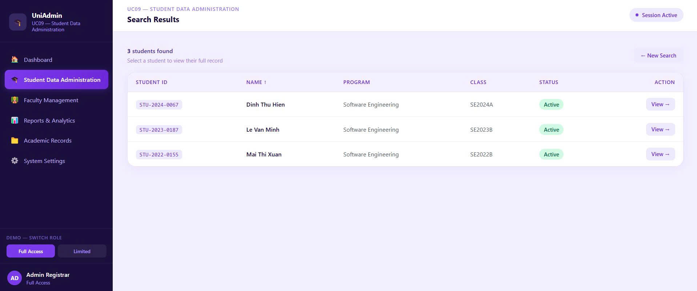

   4.2. The Administrator selects a student.
   4.3. The system displays the student information permitted by the Administrator’s role.

   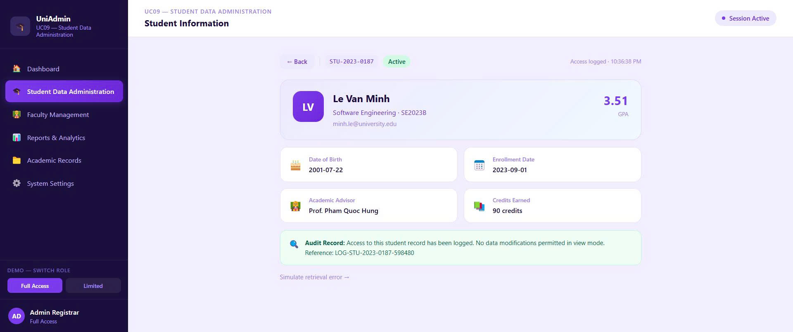

5. Else:

   5.1. The system informs the Administrator that no matching student was found.

   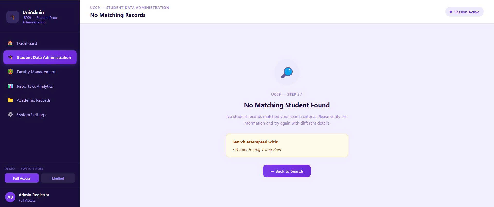

6. The system records access to the student record when required.

### 3.2 Alternative Flows
- **3.2.1 AF1 – No search results:** If no matching students are found, the system displays a no-results message and suggests refining the criteria.
- **3.2.2 AF2 – Restricted student record:** If a matching student’s record is restricted or archived, the system indicates the restriction and limits the displayed data accordingly.

   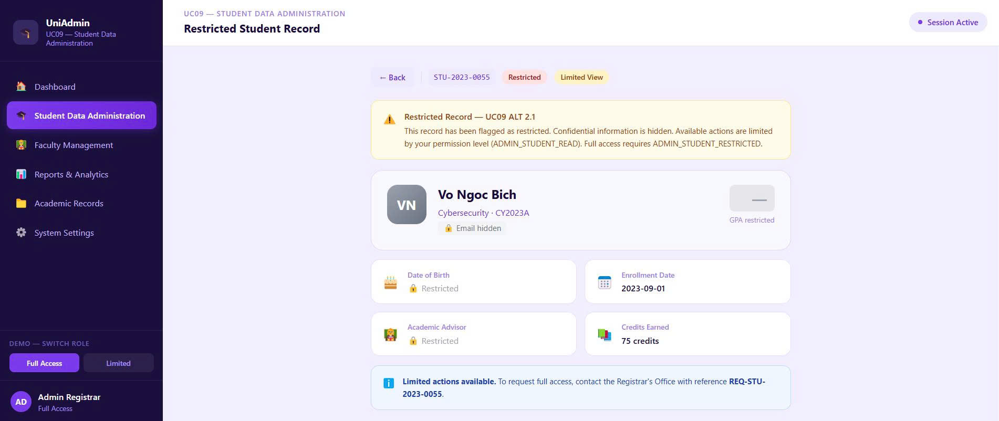

- **3.2.3 AF3 – Permission denied:** If the Administrator does not have permission to view student records, the system denies access and displays an authorization error.

   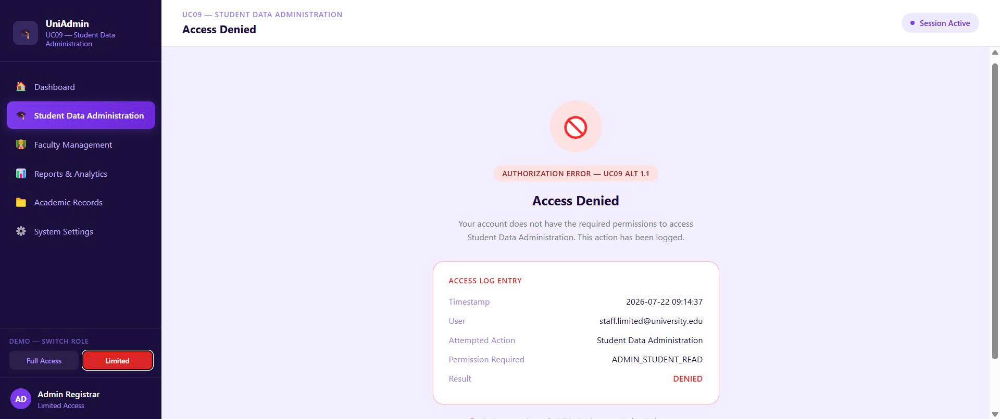

## 4. Postconditions
- The selected student information may be displayed according to the Administrator’s permissions.
- No student data is changed unless explicitly edited in a separate operation.

## 5. Special Requirements
- Student information must be protected using role-based access control.
- Access to confidential student records must be auditable.
- Search and record access must respect the Administrator’s assigned privileges.

## 6. Extension Points
- None.

## 7. Prototype Requirement
Screens to design:
- Student Search Page
- Multiple Student Search Results
- Student Detail Screen
- No-Results Message
- Restricted Record Notice
- Unauthorized Access Screen

---
# UC-13.1. Search Student Records

**Use-Case ID:** UC-13.1

**Actor(s):** Administrator

## 1. Brief Description
Allows the Administrator to search for students by one or more criteria and select a permitted student record for review.

## 2. Preconditions
- The Student Data Administration page is open.
- The student database is available.

## 3. Flow of Events
### 3.1 Basic Flow
1. The system asks the Administrator for search criteria.
2. The Administrator enters one or more criteria, such as student ID, name, program, class, or status.
3. The system validates the search criteria.
4. If the criteria are valid:

   4.1. The system searches for matching student records.

   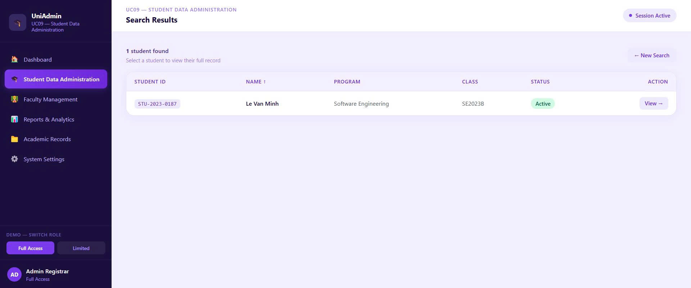

5. Else:

   5.1. The system identifies the invalid criteria and asks the Administrator to correct them.

6. If matching student records are found:

   6.1. The system displays the student ID, name, program, class, and status of each matching student.

   

   6.2. The Administrator may sort or filter the results.
   6.3. The Administrator selects a student.
   6.4. The system displays the permitted student information.

   

7. Else:

   7.1. The system informs the Administrator that no matching student was found.

   

### 3.2 Alternative Flows
- **3.2.1 AF1 – Invalid search criteria:** If the input is incomplete or invalid, the system requests corrected criteria.
- **3.2.2 AF2 – Too many results:** If a large result set is returned, the system paginates the results and suggests adding filters.

   

- **3.2.3 AF3 – Restricted or archived record:** If a found student record is restricted or archived, the system hides unauthorized details and shows the restriction status.

   

## 4. Postconditions
- Matching student records may be displayed.
- A student record may be selected for review.
- No student data is changed.

## 5. Special Requirements
- Search input must be validated and sanitized.
- Search results must only display information permitted for the Administrator.
- Large result sets must be paginated.

## 6. Extension Points
- None.

## 7. Prototype Requirement
Screens to design:
- Search Criteria Form
- Search Results List
- Paginated Search Results
- Restricted Record Notice
- No-Results Message

---