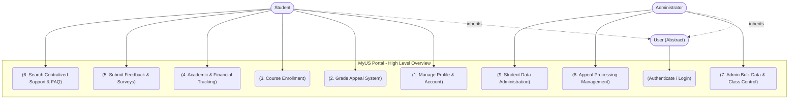
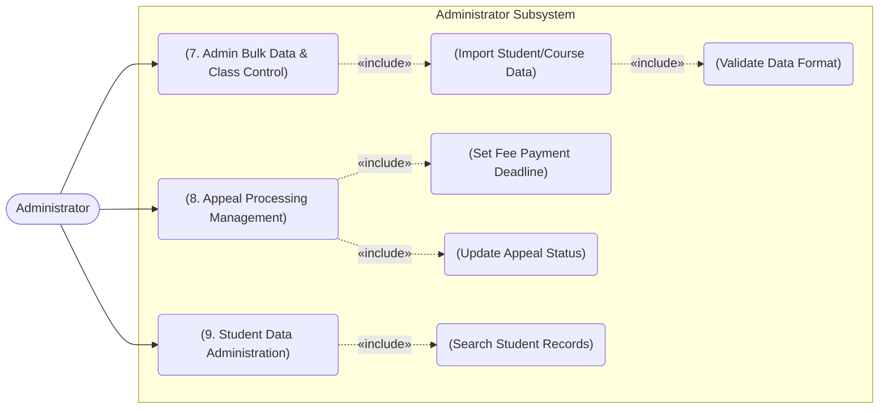

# USE-CASE MODEL - MyUS 

*Performed by: Lê Thị Như Ý | Reviewed by: Trần Tường Vi | Edited by: Lê Thị Như Ý*
## 1. Overall System & Actor Generalization
This diagram illustrates the high-level actors interacting with the MyUS portal. Both Student and Administrator inherit from the generalized abstract User actor, allowing them to share foundational use cases such as Authentication. All 9 core functional groups are represented here.


## 2. Student Subsystem (Academic Self-Service & Support)
This diagram isolates the workflows specific to the Student actor, focusing on academic self-management, financial tracking, and support interactions. To accurately reflect complex business logic, this model incorporates structural relationships:
- **«extend» Relationship:** The interaction with the external **AI Engine** during course enrollment is modeled as an extension (**Get AI Course Recommendations**). This indicates that AI consultation is an optional, value-adding feature that students can trigger to optimize their roadmap, rather than a mandatory step in the standard enrollment process.

- **«include» Relationships:** Complex workflows are decomposed into mandatory sub-processes. For instance, the **Grade Appeal System** includes **Upload Supporting Documents**, since an appeal cannot be processed without supporting evidence. Similarly, the **Academic & Financial Tracking** dashboard includes the retrieval of the student's **timetable** and **GPA records**, as these are essential components of the dashboard.

 ```mermaid
flowchart LR
    %% Actors
    Student(["Student"])
    AI(["AI Engine (External)"])

    %% System Boundary
    subgraph Student_Subsystem [Student Subsystem]
        direction TB
        
        UC1("(1. Manage Profile & Account)")
        
        UC2("(2. Grade Appeal System)")
        UC2a("(Upload Supporting Documents)")
        UC2b("(Track Appeal Status)")
        
        UC3("(3. Course Enrollment)")
        UC3a("(Check Prerequisites)")
        UC3b("(Get AI Course Recommendations)")
        
        UC4("(4. Academic & Financial Tracking)")
        UC4a("(View Timetable)")
        UC4b("(View Grades & GPA)")
        
        UC5("(5. Submit Feedback & Evaluation)")
        
        UC6("(6. Search Centralized Support & FAQ)")
    end

    %% Actor Connections
    Student --> UC1
    Student --> UC2
    Student --> UC3
    Student --> UC4
    Student --> UC5
    Student --> UC6
    
    AI --- UC3b

    %% Relationships
    UC2 -.->|"«include»"| UC2a
    UC2 -.->|"«include»"| UC2b
    
    UC3 -.->|"«include»"| UC3a
    UC3b -.->|"«extend»"| UC3
    
    UC4 -.->|"«include»"| UC4a
    UC4 -.->|"«include»"| UC4b
```
## 3. Administrator Subsystem (Operations & Processing)
This diagram details the exclusive back-office operations performed by the Administrator role, which are critical for maintaining system data integrity and handling student requests. The model heavily utilizes «include» relationships to define strict, mandatory operational procedures:

- When executing **Admin Bulk Data & Class Control**, the system must always include the **Validate Data Format** use case to ensure that imported CSV/Excel files do not corrupt the database schema.

- During **Appeal Processing Management**, the workflow explicitly includes **Set Fee Payment Deadline** and **Update Appeal Status**. This guarantees that whenever an administrator processes a grade review, the system enforces a standardized administrative trail, ensuring transparency and automated notifications for the student.

