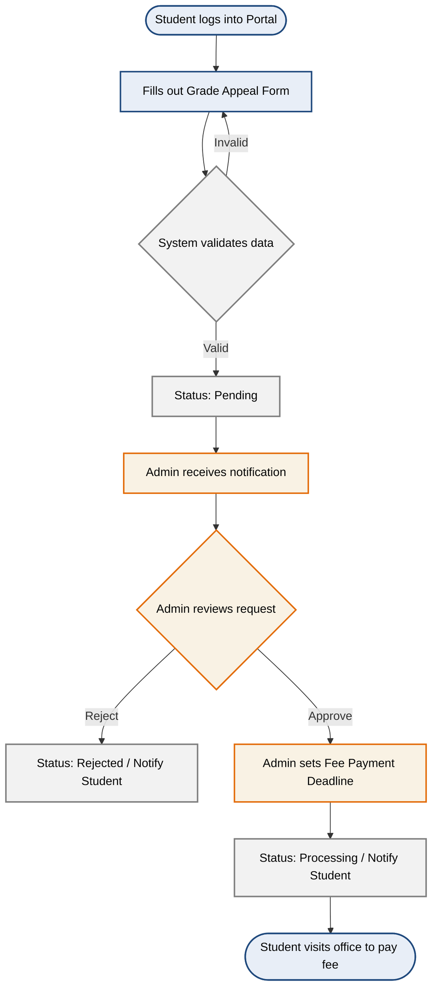

## 5. Product Features
*Performed by: Lê Thị Như Ý | Reviewed by: Trần Tường Vi | Edited by: Lê Thị Như Ý*

### 5.1. Feature Descriptions

**1. Profile & Account Management**
This feature allows students to independently manage and update their personal information, contact details, and emergency contacts within the portal. It is needed to ensure that the university's central database remains highly accurate and up-to-date without requiring manual data entry by the administration. Students benefit by never missing critical academic announcements, while the university benefits from a reliable communication channel.

**2. Grade Appeal System for Students**
Students can digitally submit requests to review their exam grades and continuously track the real-time processing status of their appeals. This feature is necessary to replace the slow, error-prone paper-based petition process and provide clear deadlines for fee payments. Students benefit from a transparent, stress-free process, eliminating the need for repeated, time-consuming visits to the academic office.

**3. Course Enrollment & AI Chatbot**
This module enables students to self-enroll in standard classes while utilizing an intelligent virtual assistant to suggest optimal academic roadmaps. It is required because manual course selection often leads to frustrating scheduling conflicts, prerequisite misunderstandings, and delayed graduation. Students benefit by receiving personalized guidance to stay on track, while the university benefits from optimized class size distribution.

**4. Academic & Financial Tracking**
This comprehensive dashboard aggregates a student's academic performance, daily class timetables, and detailed financial status including tuition balances and deadlines. It is essential to promote transparency and help users effectively plan their daily schedules and prepare for financial obligations. Students and their families are the primary beneficiaries, as it removes the stress of tracking scattered information across multiple disconnected systems.

**5. Feedback & Evaluation Surveys**
At the end of each semester, students can access and complete structured surveys to evaluate course quality, lecturer performance, and campus facilities. This feature is needed to provide the university with measurable, structured feedback to continuously improve the learning environment. The administration benefits from gathering actionable data, while students benefit from having a voice in shaping their educational experience.

**6. Centralized Support & FAQ**
This feature provides a comprehensive, searchable library containing common questions and answers regarding university policies, academic rules, and IT support. It is highly needed to offer students instant, 24/7 answers to routine issues, significantly reducing the volume of repetitive support tickets. Students benefit from immediate problem resolution, while the support staff benefits from a drastically reduced administrative workload.

**7. Admin Bulk Data & Class Control**
Administrators can utilize file upload capabilities to quickly import massive volumes of system data (such as student profiles and course offerings) and manually execute student class transfers. This is urgently needed to eliminate the error-prone and labor-intensive process of manual data entry for thousands of records each semester. Administrators heavily benefit from a massive reduction in operational workload and increased flexibility in managing unexpected scheduling conflicts.

**8. Appeal Processing Management**
This centralized dashboard provides administrators with the tools to receive, review, and process incoming student grade appeal requests efficiently. It is needed to create a structured and traceable workflow, allowing staff to update statuses and assign specific deadlines for fee payments directly to the student. The academic office benefits from an organized, paperless system that prevents lost documents and significantly speeds up resolution time.

**9. Student Data Administration**
Administrators are granted privileged access to search and view comprehensive student profiles, including personal details, academic standing, and contact information. This capability is crucial for verifying student identities, contacting families during emergencies, and providing direct, accurate support when students face issues. The administrative and academic staff benefit by having immediate access to reliable data to make informed operational decisions.

### 5.2. Core User Workflows

Below are the workflow diagrams illustrating the two most critical processes in the system[cite: 1].

#### Workflow 1: Grade Appeal Process

#### Workflow 2: AI-Assisted Course Registration

#### Workflow 3: Admin Bulk Data Import Process

