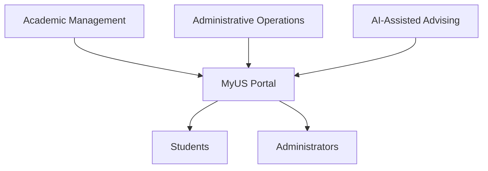
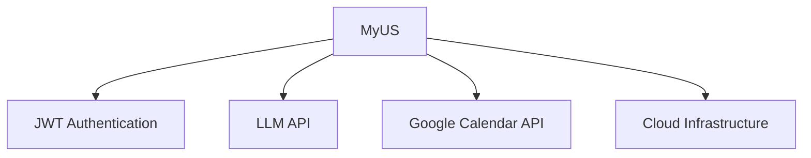
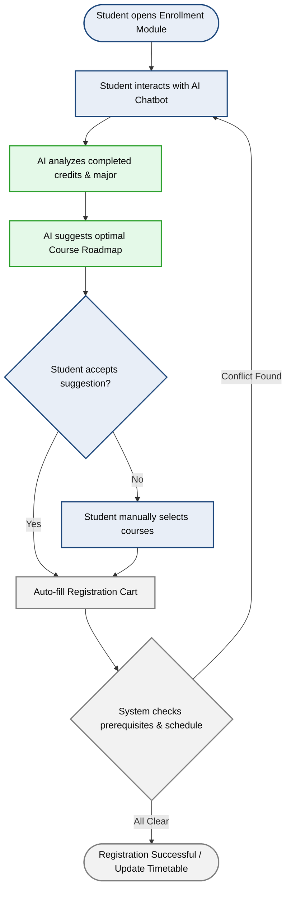
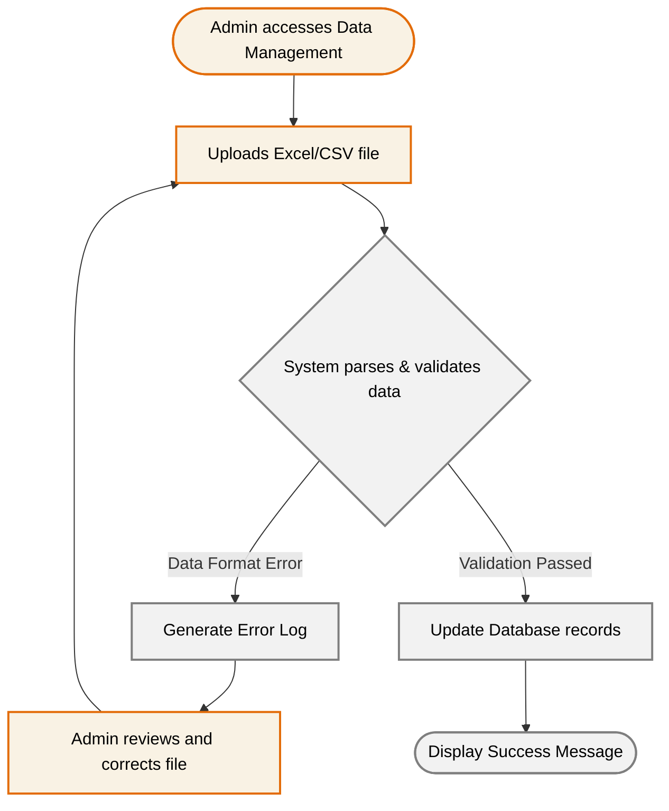

# VISION DOCUMENT - MyUS

## 1. Introduction
*Performed by: Trần Tường Vi | Reviewed by: Hoàng Trung Kiên | Edited by: Trần Tường Vi*

This Vision Document defines the purpose, scope, and direction of **MyUS** — an AI-integrated academic portal for university environments. 

It covers the problem being solved and product positioning, , stakeholder and user descriptions including existing alternatives, product perspective and assumptions, detailed feature descriptions with workflow diagrams, and measurable non-functional requirements.

### References

| Document | Description |
|---|---|
| Project Proposal (PA1) | Initial feature overview, target users, and AI feature description |
| PA1 Sprint Planning Meeting (25/05/2026) | Initial project direction, feature brainstorm, and role assignment |
| Weekly Meeting 1 (27/05/2026) | Task division and initial feature list |
| Weekly Meeting 2 (02/06/2026) | Proposal revisions based on TA feedback — scope reduction, chatbot redesign |
| PA2 Sprint Planning Meeting (07/06/2026) | Technical stack decisions and PA2 task breakdown |

---

## 2. Positioning
*Performed by: Trần Tường Vi | Reviewed by: Hoàng Trung Kiên | Edited by: Trần Tường Vi*

### 2.1 Problem Statement

| Field | Description |
|---|---|
| **The problem of** | Fragmented and paper-based academic management processes in universities, where students must manually track grades, submit physical forms for grade appeals, cross-check curriculum handbooks for course planning, and wait for in-person appointments with academic advisors. |
| **Affects** | University students who struggle to manage their academic progress efficiently, and administrators who spend significant time processing manual requests, managing schedules, and maintaining student records across disconnected systems. |
| **The impact of which is** | Wasted time and effort for both students and staff, a higher risk of administrative errors, delays in processing academic requests, and an increased likelihood of students missing prerequisites or misplanning their graduation timeline. |
| **A successful solution would be** | A centralized, web-based academic portal that digitalizes all key student-facing and administrative workflows, including course registration, grade management, grade appeals, tuition tracking, and integrates an AI-powered chatbot that proactively guides students through their academic roadmap based on their individual progress. |

### 2.2 Product Position Statement

| Field | Description |
|---|---|
| **For** | Students and administrators at universities. |
| **Who** | Need a unified, digital platform to manage academic and administrative tasks efficiently. |
| **The product name** | MyUS |
| **That** | Provides a centralized portal for course registration, grade tracking, tuition management, grade appeals, and AI-powered academic advising, all accessible from any device via a modern web browser. |
| **Unlike** | Existing university portals, which provide core academic features but offer no personalized guidance, require physical paperwork for processes like grade appeals, and do not support AI-driven academic planning. |
| **Our product** | Integrates all core academic workflows into a single platform with role-specific interfaces for students and administrators, and features an AI Learning Path Chatbot that recommends courses based on each student's completed credits and degree requirements. It helps reducing the risk of delayed graduation and eliminating reliance on manual advising. |

---

## 3. Stakeholder and User Descriptions
*Performed by: Hoàng Trung Kiên | Reviewed by: Dương Minh Huỳnh Khôi | Edited by:*

### 3.1 Stakeholder Summary

| Stakeholder | Role | Interest in MyUS |
|---|---|---|
| Development Group (Group 6) | Product owner & builder | Deliver a functional portal that meets course requirements |
| Students | Primary end users | Access all academic services in one unified platform |
| Administrators | Secondary end users | Manage academic data, appeals, and class operations efficiently |
| University Management *(implicit)* | Indirect beneficiary | Improved operational efficiency and data accuracy |

### 3.2 User Summary

| User | Technical Literacy | Primary Role |
|---|---|---|
| Students (undergraduates only) | Average | Register courses, view grades, submit appeals, use AI chatbot |
| Administrators (single flat role) | Average | Manage schedules, process appeals, view student records |

### 3.3 User Environment

- **Platform:** Web application via modern browsers (Chrome, Edge, Firefox, Safari)
- **Devices:** Desktop, laptop, tablet, smartphone — equal priority, fully responsive
- **OS:** Windows, macOS, Linux, Android, iOS
- **Language:** Vietnamese
- **Authentication:** JWT
- **External Integrations:** Google Calendar API, external LLM API

### 3.4 Key User Needs

| # | User | Need |
|---|---|---|
| 1 | Student | Single platform for all academic tasks |
| 2 | Student | Real-time grade and GPA visibility |
| 3 | Student | Transparent grade appeal status tracking |
| 4 | Student | AI-guided course and graduation planning |
| 5 | Student | Clear tuition and payment breakdown |
| 6 | Admin | Centralized dashboard for appeals and class management |
| 7 | Admin | Bulk schedule import |
| 8 | Admin | Searchable student records |

### 3.5 Alternatives and Competition

Three portals were surveyed in PA1 as competitive references:

| Portal | Weaknesses | Improvement Ideas |
|---|---|---|
| **HCMUS Portal** | Outdated and inconsistent UI; slow load during course registration; non-intuitive timetable | Personalized dashboard; global search; modern notification center |
| **UEH Portal** | Fragmented ecosystem (portal, LMS, email, surveys are separate); hard to track curriculum progress; non-intuitive timetable and exam schedule | AI chatbot for curriculum tree visualization *(inspired MyUS's AI feature)*; Google Calendar integration |
| **My Bach Khoa** | Hard to look up curriculum information; too many raw data tables, little visualization | Modern dashboard redesign with better data visualization |

**How MyUS differentiates:**
- Fully unified platform — no fragmented sub-systems
- AI chatbot for curriculum planning — absent in all three competitors
- Google Calendar integration for intuitive scheduling
- Student-first UI design, not an admin tool repurposed for students

> *Competitive understanding from PA1 remains largely unchanged — no significant new entrants identified.*

---

## 4. Product Overview
*Performed by: Hoàng Trung Kiên | Reviewed by: Dương Minh Huỳnh Khôi | Edited by:*

### 4.1 Product Perspective

MyUS is a **greenfield, fully self-contained** web application — it does not extend or integrate with any existing university system. It owns its own database and all backend services.

**Tech stack:**

| Layer | Technology |
|---|---|
| Frontend | React + Vite |
| Backend | Spring Boot (Java) |
| Auth | JWT |
| AI Chatbot | External LLM API (Gemini / OpenAI) |
| Scheduling | Google Calendar API |

### 4.2 Assumptions and Dependencies

**Assumptions**

- All users have reliable internet access
- Users are comfortable with a Vietnamese-language interface
- Scope is limited to undergraduates only
- Single flat admin role — no permission hierarchy required
- Curriculum and prerequisite data is manually seeded; no external data feed
- All academic data (grades, schedules, tuition) is managed entirely within MyUS

**Dependencies**

| # | Dependency | Purpose | Risk if Unavailable |
|---|---|---|---|
| D1 | JWT | Session management & route protection | Authenticated routes become insecure |
| D2 | External LLM API | AI chatbot feature | AI feature entirely unavailable |
| D3 | Google Calendar API | Timetable & exam schedule display | Scheduling feature degraded |
| D4 | Cloud hosting | Backend availability & data persistence | Full system outage |

## 5. Product Features
*Performed by: Lê Thị Như Ý | Reviewed by: Trần Tường Vi | Edited by: Lê Thị Như Ý*

### 5.1. Feature Descriptions

**1. Profile & Account Management**
This feature allows students to independently manage and update their personal information, contact details, and emergency contacts within the portal. It is needed to ensure that the university's central database remains highly accurate and up-to-date without requiring manual data entry by the administration. Students benefit by never missing critical academic announcements, while the university benefits from a reliable communication channel.

**2. Grade Appeal System for Students**
Students can digitally submit requests to review their exam grades and continuously track the real-time processing status of their appeals. This feature is necessary to replace the slow, error-prone paper-based petition process and provide clear deadlines for fee payments. Students benefit from a transparent, stress-free process, eliminating the need for repeated, time-consuming visits to the academic office.

**3. Course Enrollment & AI Chatbot**
This module enables students to self-enroll in standard classes while utilizing an intelligent virtual assistant to suggest optimal academic roadmaps. It is required because manual course selection often leads to frustrating scheduling conflicts, prerequisite misunderstandings, and delayed graduation. Students benefit by receiving personalized guidance to stay on track, while the university benefits from optimized class size distribution.

**4. Academic & Financial Tracking**
This comprehensive dashboard aggregates a student's academic performance, daily class timetables, and detailed financial status including tuition balances and deadlines. It is essential to promote transparency and help users effectively plan their daily schedules and prepare for financial obligations. Students and their families are the primary beneficiaries, as it removes the stress of tracking scattered information across multiple disconnected systems.

**5. Feedback & Evaluation Surveys**
At the end of each semester, students can access and complete structured surveys to evaluate course quality, lecturer performance, and campus facilities. This feature is needed to provide the university with measurable, structured feedback to continuously improve the learning environment. The administration benefits from gathering actionable data, while students benefit from having a voice in shaping their educational experience.

**6. Centralized Support & FAQ**
This feature provides a comprehensive, searchable library containing common questions and answers regarding university policies, academic rules, and IT support. It is highly needed to offer students instant, 24/7 answers to routine issues, significantly reducing the volume of repetitive support tickets. Students benefit from immediate problem resolution, while the support staff benefits from a drastically reduced administrative workload.

**7. Admin Bulk Data & Class Control**
Administrators can utilize file upload capabilities to quickly import massive volumes of system data (such as student profiles and course offerings) and manually execute student class transfers. This is urgently needed to eliminate the error-prone and labor-intensive process of manual data entry for thousands of records each semester. Administrators heavily benefit from a massive reduction in operational workload and increased flexibility in managing unexpected scheduling conflicts.

**8. Appeal Processing Management**
This centralized dashboard provides administrators with the tools to receive, review, and process incoming student grade appeal requests efficiently. It is needed to create a structured and traceable workflow, allowing staff to update statuses and assign specific deadlines for fee payments directly to the student. The academic office benefits from an organized, paperless system that prevents lost documents and significantly speeds up resolution time.

**9. Student Data Administration**
Administrators are granted privileged access to search and view comprehensive student profiles, including personal details, academic standing, and contact information. This capability is crucial for verifying student identities, contacting families during emergencies, and providing direct, accurate support when students face issues. The administrative and academic staff benefit by having immediate access to reliable data to make informed operational decisions.

### 5.2. Core User Workflows

Below are the workflow diagrams illustrating the two most critical processes in the system[cite: 1].

#### Workflow 1: Grade Appeal Process

#### Workflow 2: AI-Assisted Course Registration

#### Workflow 3: Admin Bulk Data Import Process

