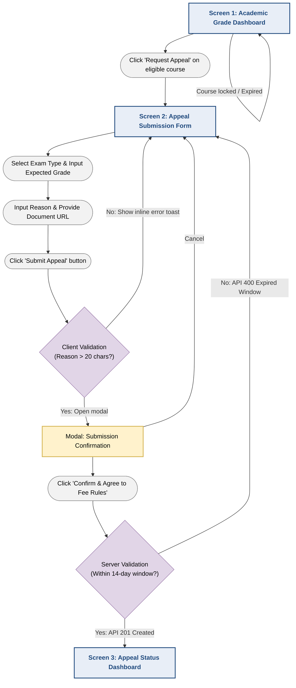

# Feature Specification: Submit Grade Appeal (Functional Group 2)
**Author:** Lê Thị Như Ý | **Reviewer:** Trần Tường Vi | **Editor:** Lê Thị Như Ý, Trần Tường Vi
**Project:** MyUS University Portal System  
**Module:** Grade Appeal System  
**Target Actor:** Student  

---

## 1. Overview & Purpose
The **Submit Grade Appeal** feature allows undergraduate students to digitally submit formal requests for exam grade re-evaluations directly through the MyUS portal. This replaces physical paperwork, streamlines administrative workflows by routing requests automatically to the academic department, and provides students with real-time tracking of their appeal status and office fee payment deadlines.

---

## 2. User Stories
* **US-GA-01:** As a Student, I want to select an enrolled course and exam type (Midterm/Final) to submit a digital grade appeal so that my grade can be reviewed without filling out physical paper forms.
* **US-GA-02:** As a Student, I want to provide a link/URL to supporting documents (e.g., assignment proofs, email correspondence, medical certificates) to my appeal request to provide evidence for the re-evaluation.
* **US-GA-03:** As a Student, I want to view a visual tracking dashboard of my submitted appeals showing real-time status updates (`PENDING`, `PROCESSING`, `RESOLVED`, `REJECTED`) and the exact deadline to complete fee payments at the academic office.

---

## 3. Functional Requirements

### 3.1. Course & Eligibility Selection
* **FR-01:** The system MUST only allow students to select courses they are currently enrolled in and where official grades have already been published.
* **FR-02:** The system MUST enforce an "Appeal Submission Window" (e.g., within 14 calendar days from the official grade release date). Expired courses must be disabled or hidden.

### 3.2. Appeal Form Input & Validation
* **FR-03:** The form MUST require the student to select the **Exam Type** (Assignment, Midterm Exam, Final Exam, Project).
* **FR-04:** The form MUST display the student's **Current Grade** automatically upon selecting the course and exam type.
* **FR-05:** Students MUST input their **Expected Grade** (must be a valid numerical grade between 0.0 and 10.0, higher than the current grade).
* **FR-06:** Students MUST provide a **Reason for Appeal** (mandatory text field, minimum 20 characters, maximum 1000 characters).

### 3.3. Document Link
* **FR-07:** The system MUST support providing a valid URL to a supporting document.
* **FR-08:** The document URL MUST be saved as text up to 2048 characters.

### 3.4. Workflow & Fee Deadline Calculation
* **FR-10:** Upon successful submission, the system MUST generate a unique Appeal record and set the initial status to `Submitted`.
* **FR-11:** The fee payment deadline is managed by the administrator and displayed to the student in the status tracking dashboard.

---

## 4. Acceptance Criteria

### Scenario 1: Successful Appeal Submission
* **Given** a logged-in Student is on the Appeal Submission page and selecting an eligible course within the 14-day window,
* **When** the student inputs valid expected grade (8.5 vs current 6.5), enters a valid reason (>20 chars), provides a valid document URL, and clicks "Submit Appeal",
* **Then** the system saves the record, displays a success confirmation modal, sets status to `Submitted`, and awaits administrator review for deadline assignment.

### Scenario 2: Submission Rejected Due to Validation Errors
* **Given** a logged-in Student is filling out the appeal form,
* **When** the student leaves the "Reason" field empty OR provides an invalid document URL length,
* **Then** the Submit button remains disabled or triggers an error toast notification specifying the exact validation failure without submitting data to the server.

### Scenario 3: Real-Time Appeal Status & Deadline Tracking
* **Given** a Student has previously submitted an appeal,
* **When** the student navigates to the `Appeal Status Dashboard`,
* **Then** the system displays a table/grid of all appeals with color-coded status badges (`PENDING` in yellow, `PROCESSING` in blue, `RESOLVED` in green) and clearly highlights any impending fee payment deadlines in red if within 24 hours.

---

# 5. Prototype Flow & UI Navigation

This section maps out the end-to-end user journey, screen transitions, and interactive validation states for the **Submit Grade Appeal** feature.

---

## 5.1. UI Flowchart (Mermaid)

---

## 5.2. Screen-by-Screen Interaction Breakdown

### Screen 1: Academic Grade Dashboard (`/grades`)

**Purpose**

The entry point for initiating a grade appeal.

#### UI Elements

- Data table displaying registered courses, final scores, and grade release dates.
- Inline action button labeled **"Request Appeal"** next to each eligible course.

#### System State & Rules

- If the course grade was released within the last **14 days**, the button is **Active** (Primary Color).
- If the 14-day appeal window has expired:
  - The button becomes **Disabled** (Grayed out).
  - A tooltip displays:
    > "Appeal window closed on [Date]"

#### User Interaction

- Clicking an active **"Request Appeal"** button redirects the user to **Screen 2**.
- The `courseOfferingId` is automatically pre-populated via URL parameters or application state.

---

### Screen 2: Appeal Submission Form (`/appeals/new`)

**Purpose**

The primary workspace where students create and submit a grade appeal with supporting evidence.

#### Layout & UI Components

##### Course Summary Card

Displays read-only information including:

- Course Code
- Course Name
- Lecturer
- Current Published Grade

##### Exam Type Selector

Selectable options:

- Midterm Exam
- Final Exam
- Assignment
- Project

##### Expected Grade Input

- Numeric input or spinner
- Allowed range: **0.0 – 10.0**
- Step size: **0.5**

##### Reason Text Area

- Multi-line textarea
- Live character counter (e.g., **25 / 1000 characters**)

##### Document Link Input

Supports:

- A text input field for providing a URL link to supporting evidence (e.g., Google Drive link).
- Maximum length: 2048 characters.

##### Footer Actions

- **Cancel**
  - Returns to Academic Grade Dashboard
- **Submit Appeal**
  - Primary action button

#### Validation & Error Handling

- If **Expected Grade ≤ Current Grade**
  - Show inline validation:
    > "Expected grade must be higher than current grade."

- If a document URL exceeds 2048 characters
  - Display toast notification:
    > "URL is too long."

#### User Interaction

- Clicking **Submit Appeal** performs client-side validation.
- If validation succeeds, **Modal 1** is displayed.

---

### Modal 1: Submission Confirmation (`AppealConfirmationModal.tsx`)

**Purpose**

Prevent accidental submissions and notify students about the mandatory administrative appeal fee.

#### UI Elements

##### Summary List

Displays a concise summary including:

- Course
- Exam Type
- Current Grade → Expected Grade
- Attached document URL

##### Warning Banner (Yellow)

Displays the university policy:

> By confirming, you agree to visit the Academic Affairs Office within 5 business days to pay the required re-evaluation fee of **50,000 VND**. Unpaid appeals will be automatically canceled.

##### Action Buttons

- **Go Back**
  - Closes the modal
- **Confirm & Submit**
  - Sends the appeal request to the backend

#### System Action

After confirmation:

- Frontend submits a `POST /api/v1/appeals` request using **JSON**.
- A full-screen loading spinner is displayed while the request and file upload are being processed.

---

### Screen 3: Appeal Status Dashboard (`/appeals/status`)

**Purpose**

The landing page after submission where students monitor both active and historical appeal requests.

#### UI Elements

##### Success Banner

Displays a success message:

> Appeal GA-2026-0891 submitted successfully!

##### Appeals Data Grid

Columns include:

- Tracking ID
- Course
- Exam Type
- Status Badge
- Action Required

#### Status Badges

| Status | Description |
|---------|-------------|
| **PENDING** (Yellow) | Waiting for fee payment or initial administrative review |
| **PROCESSING** (Blue) | Fee received and appeal is currently under academic review |
| **RESOLVED** (Green) | Appeal completed and grade updated |

#### Action Required

For **PENDING** appeals:

- Displays a highlighted countdown, for example:
  > **Pay fee by Aug 03, 2026 (3 days left)**

#### User Interaction

Clicking any appeal row opens a slide-over details panel containing:

- Appeal information
- Submitted reason
- Attached supporting documents
- Administrative comments
- Official resolution (if available)
