# C. Existing App Survey

# I. Overview

Our team conducted a survey of several existing university management applications in Vietnam. The purpose of this survey is to analyze their key functionalities, user interfaces, and user workflows; thereby identifying strengths, limitations, and potential opportunities for innovation.

The selected applications include HCMUS Portal, UEHStudent, and My Bach Khoa, which are widely used by students and lecturers for academic and administrative activities. These platforms provide features such as course registration, schedule management, grade tracking, tuition fee monitoring, and academic notifications.

By examining these systems, our team aims to learn from established design patterns and identify areas where MyUS can provide additional value. In particular, we focus on enhancing the user experience through AI-powered features such as  demand forecasting for course registration, personalized course wishlists, and AI-assisted academic request drafting.

# II. Survey of App 1: HCMUS Portal

## 1. Introduction

HCMUS Portal is the official academic portal of the University of Science, VNU-HCM. The platform serves as a centralized system for students to access academic and administrative services throughout their studies. Through a web-based interface, users can perform essential tasks such as course registration, timetable management, grade tracking, tuition fee monitoring, and accessing university announcements. The portal plays a crucial role in supporting daily academic activities and streamlining communication between students and the university.

## 2. Screenshots and Analysis

### a. Login page & Dashboard

The login page allows students to access the portal using their student ID and password. Before signing in, users must complete a CAPTCHA verification to confirm that they are not a bot. This authentication process helps protect the system from unauthorized access and automated login attempts.

  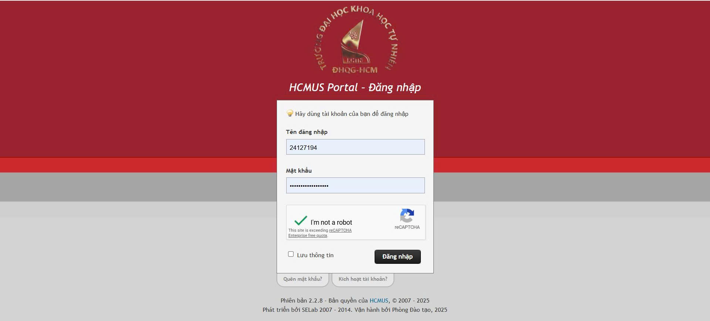 
  <em>Figure 1. HCMUS Portal - Login page.</em>

 
After authentication, students can access various university services directly from the dashboard. Each menu item links to a specialized subsystem that manages a particular service. The dashboard is designed to provide quick access to essential resources and reduce the number of navigation steps required to complete common academic and administrative tasks.

 

  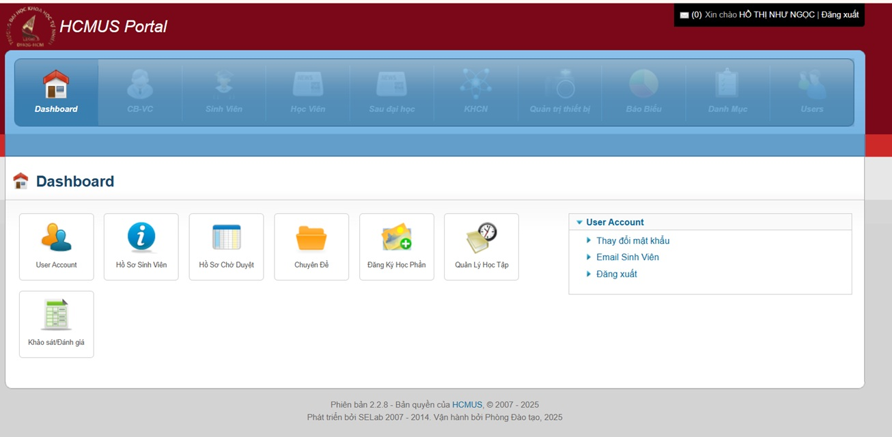 
  <em>Figure 2. HCMUS Portal - Dashboard.</em>

### b. Account Management
After logging in their account, users can change their account password via the "User Account" item, where they enter their current password, provide a new password and confirm it. After submitting the form, the system validates the entered information and updates the account credentials if all requirements are met.

  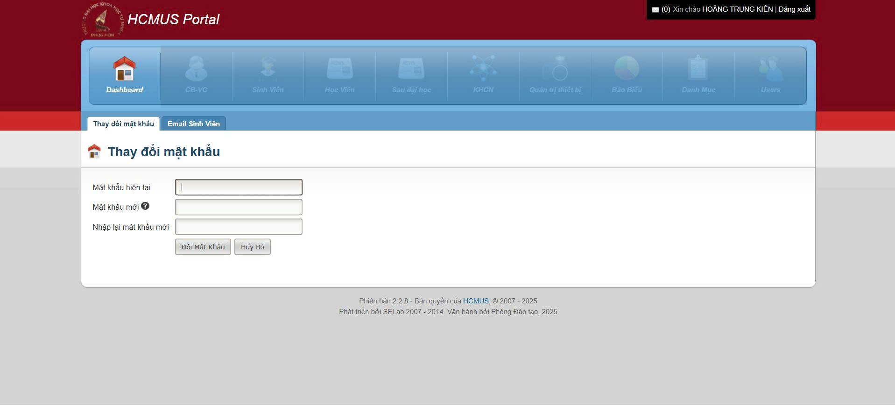 
  <em>Figure 3. HCMUS Portal - Account Settings – Change Password.</em>

 
Students can also view and manage their personal and academic information by clicking "Hồ Sơ Sinh Viên" in the dashboard. The profile is organized into multiple sections, including personal details, family information, academic records, conduct evaluation, rewards and disciplinary records, and enrollment information. Students can review their information and update editable fields when permitted by the university.

 

  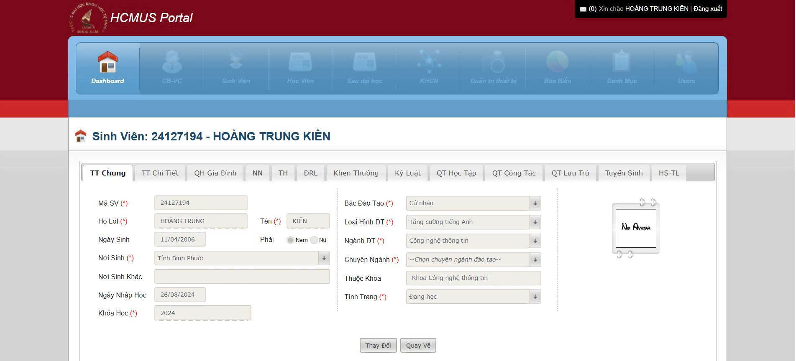 
  <em>Figure 4. HCMUS Portal - Student Profile Management.</em>

### c. Academic Management

To monitor monitor academic progress, view class and examination schedules, check course results and GPA, track accumulated credits, and access tuition fee information, students can access the "Đăng ký học phần" and "Quản lý học tập" items.

The Course Registration feature allows students to enroll in available courses or seminars for the upcoming semester. Students can browse offered classes, select suitable sections, and manage their study plans according to academic requirements and personal schedules through the "Đăng Ký Học Phần" item.
  

  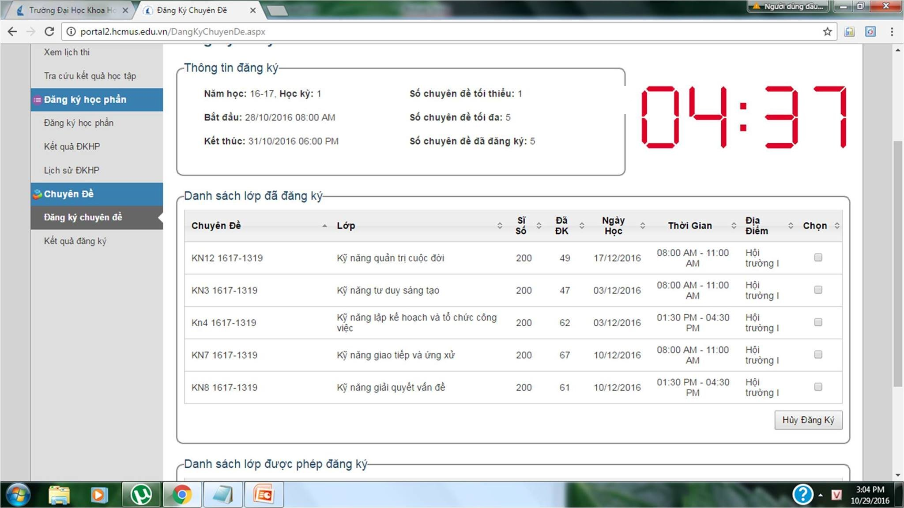 
  <em>Figure 5. HCMUS Portal - Course/Seminar Registration 

  (Source: Khoa Vật lý - Vật lý kỹ thuật, Trường Đại học Khoa học tự nhiên).</em>

 
After registering the desired courses or seminars, students check their enrollment details (including tuition fees and courses enrolled) by clicking "Tra cứu học phí" and "Kết quả ĐKHP" tabs.

 

  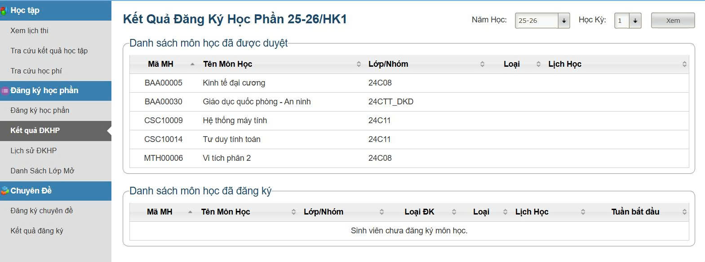 
  <em>Figure 6. HCMUS Portal - Course/Seminar Registration Results.</em>

 

  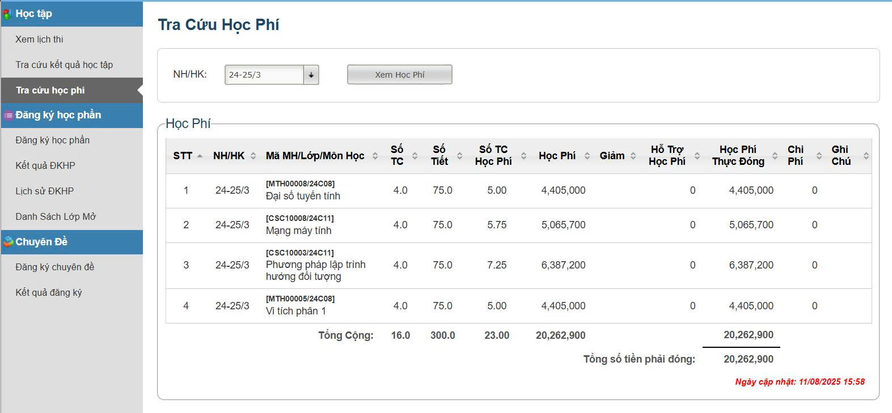 
  <em>Figure 7. HCMUS Portal - Tuition fee details.</em>

 
To help students prepare for upcoming examinations, the "Xem lịch thi" item in "Quản lý học tập" provides detailed information about exam dates, times, venues, and corresponding courses.

 

  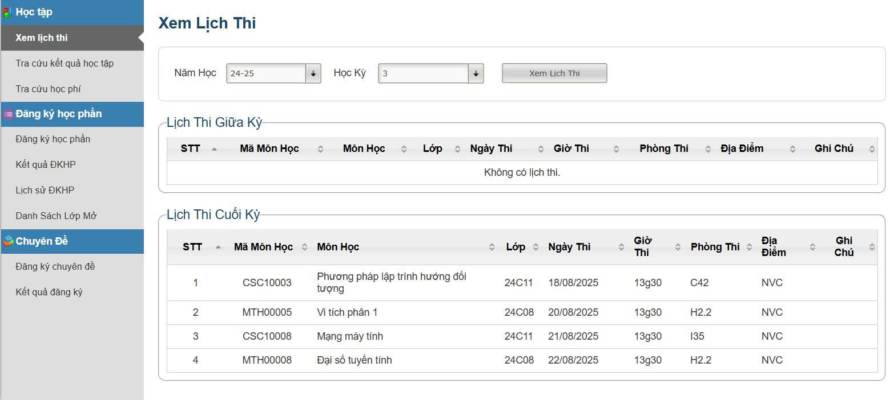 
  <em>Figure 8. HCMUS Portal - Examination schedules.</em>

After the examination, results and overall scores will be updated in the "Tra cứu kết quả học tập" tab, which can be accessed and viewed by students.

 

  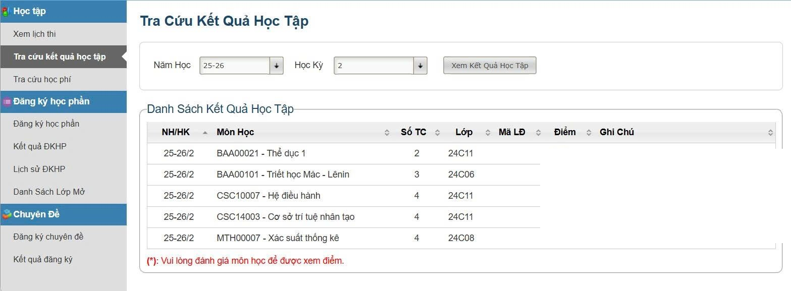 
  <em>Figure 9. HCMUS Portal - Course results.</em>

# III. Survey of App 2: UEH Student

## 1. Introduction

UEH Student is the official student application of the University of Economics Ho Chi Minh City (UEH). The platform is designed to provide students with convenient access to academic information and university services through both web and mobile environments. Key functionalities include viewing schedules, checking academic results, monitoring tuition fees, receiving notifications, and managing personal information.

## 2. Screenshots and Analysis

### a. Login Page & Dashboard
UEH Student login page allows users to enter their account (student ID) and password to authenticate before signing in. The page also offers account management and password recovery options.

 

   
  <em>Figure 10. UEH Student - Login page.</em>

 
After successful verification, they can access various academic and administrative services provided by the UEH Student portal. The homepage presents shortcuts to commonly used services, including timetable viewing, tuition fee management, e-learning, scholarship information, and other online verification services.

 

  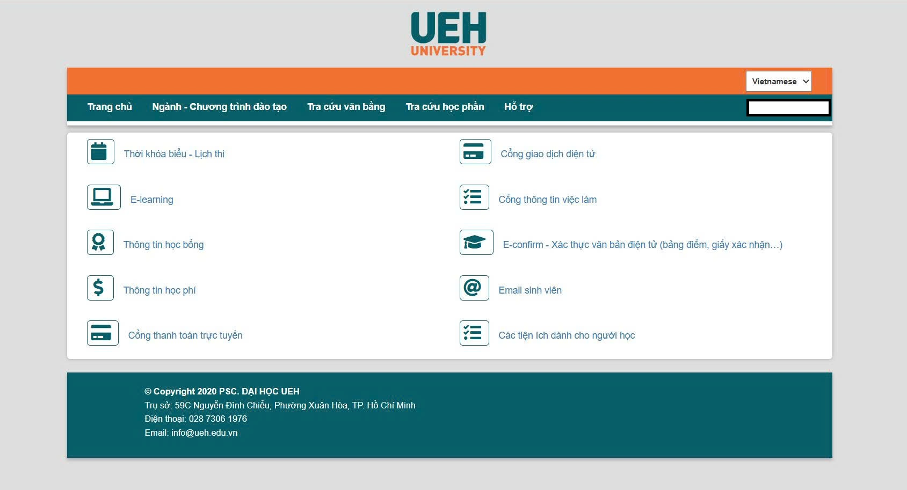 
  <em>Figure 11. UEH Student - Dashboard.</em>

### b. Academic Management

To manage academic aspects, click the "Các tiện ích dành cho người học" in the main dashboard, then a list of management functions will pop up.

One of the functions is Course Demand Survey, which helps the university better understand students' academic needs and allows students to indicate their interest in upcoming courses before the official registration period. The collected responses are used to estimate course demand, support class planning, and optimize resource allocation for future semesters. Click "Ghi danh nhu cầu học" tab and the following page will pop up.

  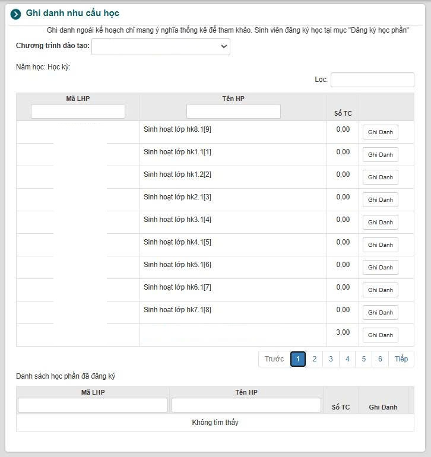 
  <em>Figure 12. UEH Student - Course Demand Survey.</em>

Students can also view the timetable, to view the current week's timetable, click "Tra cứu thời khóa biểu" and the following page will appear, which includes the name of the courses and their corresponding schedules.

  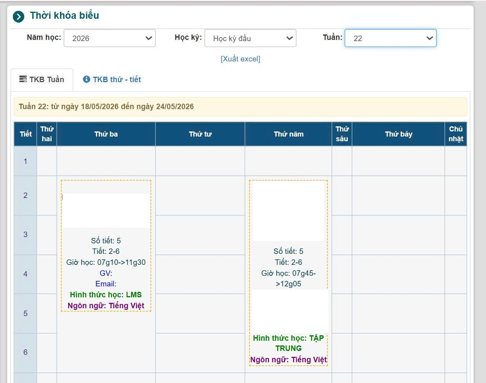 
  <em>Figure 13. UEH Student - Detailed Timetable.</em>

After each semester, students can view the scholarship information in the "Tra cứu học bổng" tab, which shows the currently available scholarships, and the list of scholarship that students have applied for.

  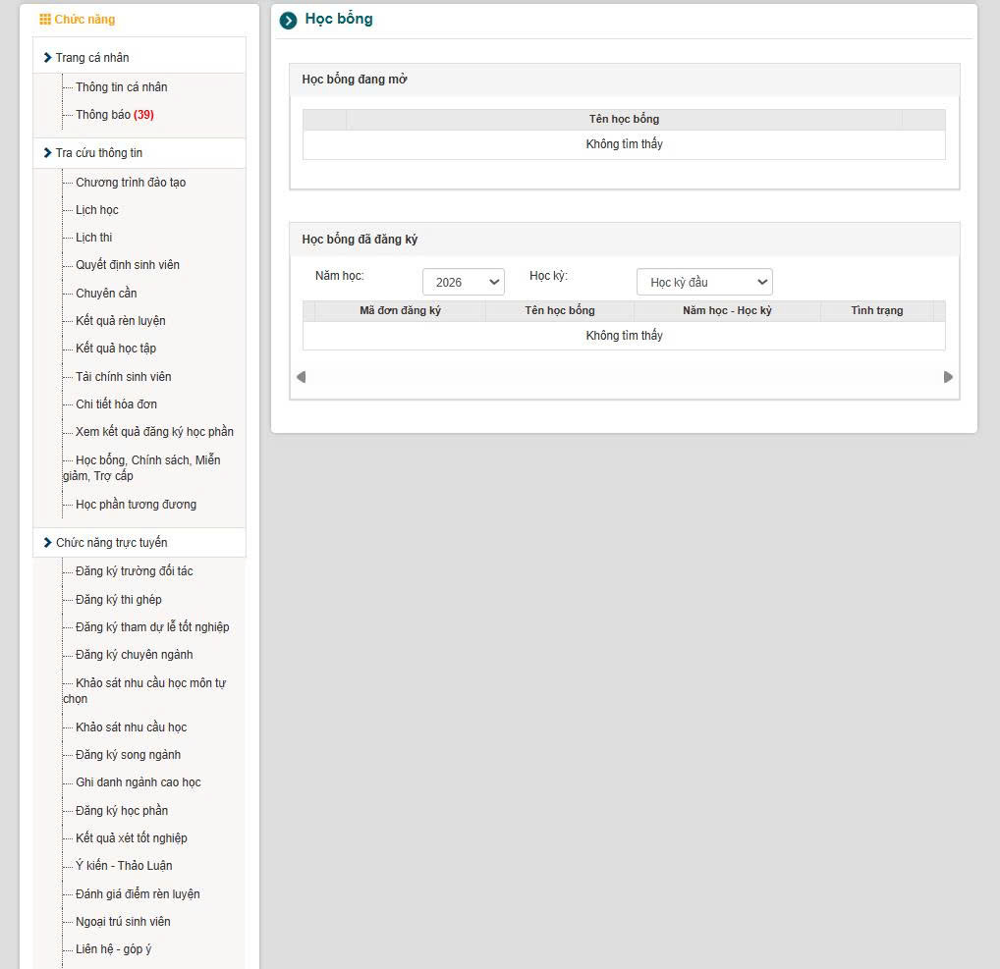 
  <em>Figure 14. UEH Student - Course Demand Survey.</em>

### c. Forms & Certification Letters
This page allows students to request official documents from the university. Simply choose the document you need from the list, then click "In" to get a PDF or "Email" to have it sent to your inbox. Documents are generated automatically based on your academic records — no waiting required.

  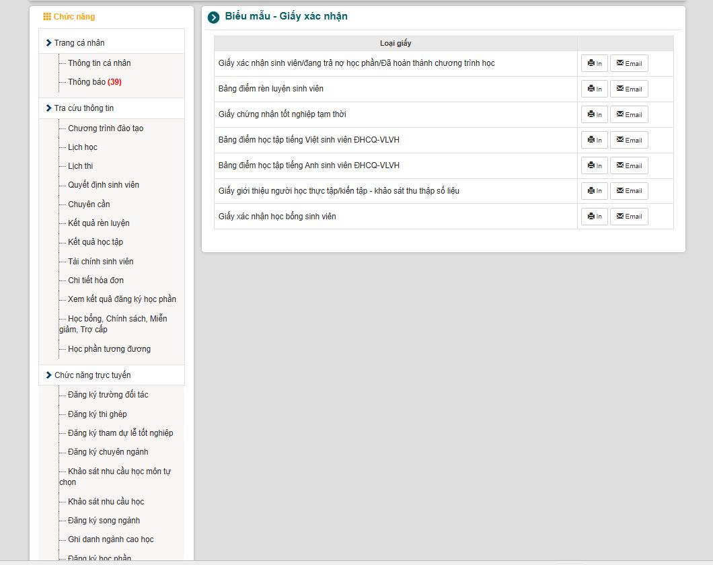 
  <em>Figure 15. UEH Student - Forms & Certification Letters.</em>

# IV. Survey of App 3: My Bach Khoa
## 1. Introduction

MyBK is the academic portal developed for students of Ho Chi Minh City University of Technology (HCMUT). The system integrates various academic management functions into a single platform, enabling students to access study-related information efficiently. Core features include course registration, timetable management, examination schedules, grade tracking, and administrative support services. MyBK serves as an important digital platform that facilitates interactions between students, faculty members, and university administrators.

## 2. Screenshots and Analysis

### a. Login Page & Dashboard
The login page allows students to access the portal using their student account and password. Additionally, students can also change their account password directly on this page.

  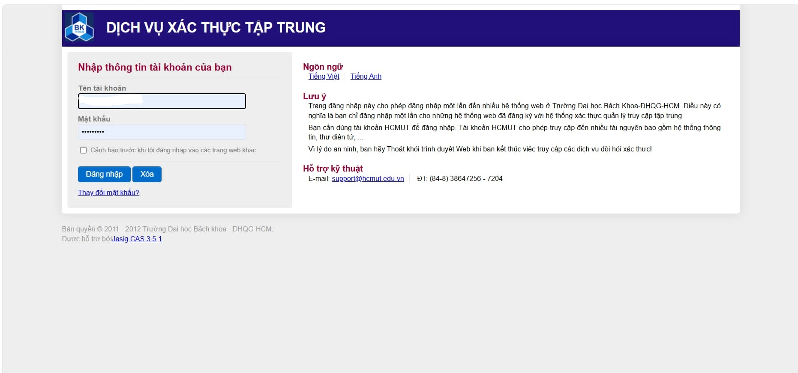 
  <em>Figure 16. My Bach Khoa - Login Page</em>

 
After signing in their account, students can access the following main dashboard:

  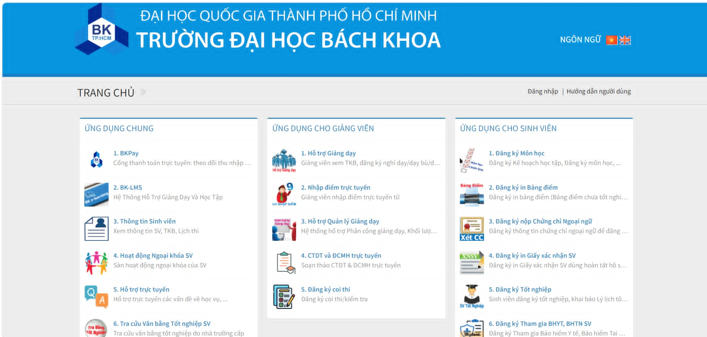 
  <em>Figure 17. My Bach Khoa - Dashboard</em>

### b. Academic Progress
The academic management module provides students with essential tools for planning and monitoring their studies. Through a unified interface, students can register for courses, participate in course demand surveys, access examination schedules, and view semester timetables.

To register for courses, students select an available registration period, browse the offered courses, and add desired subjects to their registration form. The system then records the selected courses and updates the registration results.

  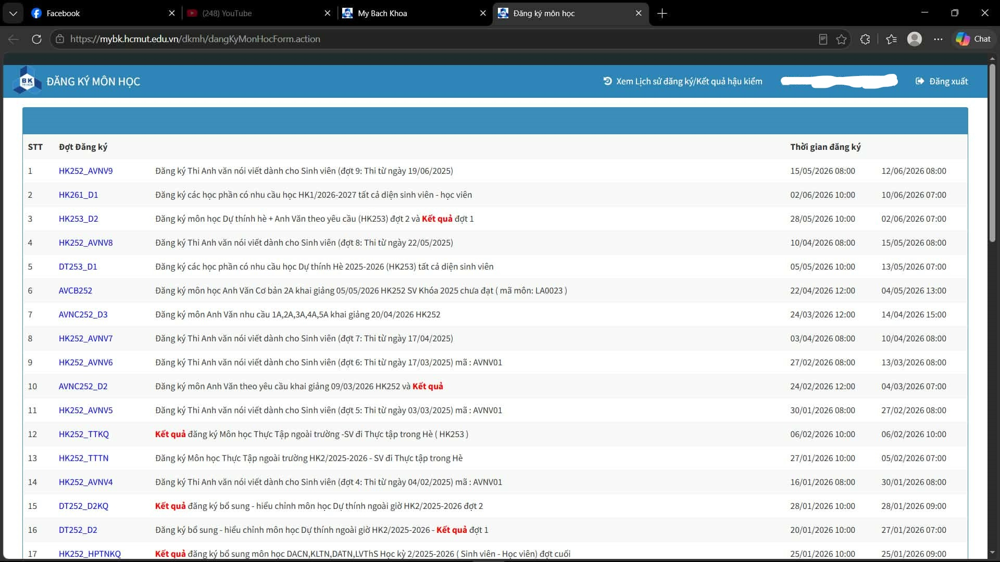 
  <em>Figure 18. My Bach Khoa - Course Registration</em>

To support academic planning, students can indicate their intention to enroll in courses offered in future semesters. The collected data helps the university estimate demand and organize classes more effectively.

  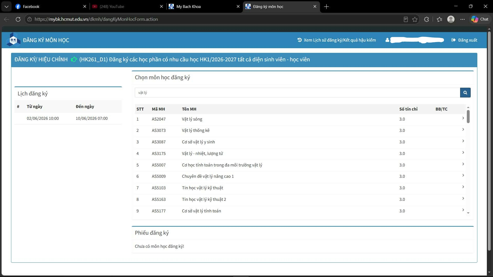 
  <em>Figure 19. My Bach Khoa - Course Demand Survey</em>

After registering their desired courses, students can view their semester timetable, including course information, class groups, schedules, classrooms, and study weeks. The timetable is automatically updated based on registered courses.

  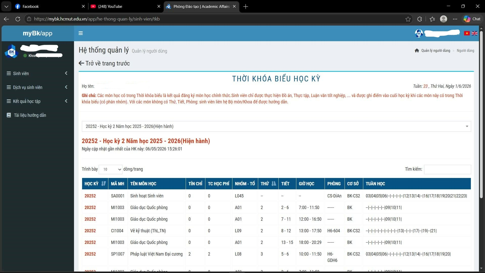 
  <em>Figure 20. My Bach Khoa - Timetable</em>

Finally, to view examination schedules, students choose an academic semester and access a detailed list of upcoming exams, including exam dates, times, locations, and room assignments.

  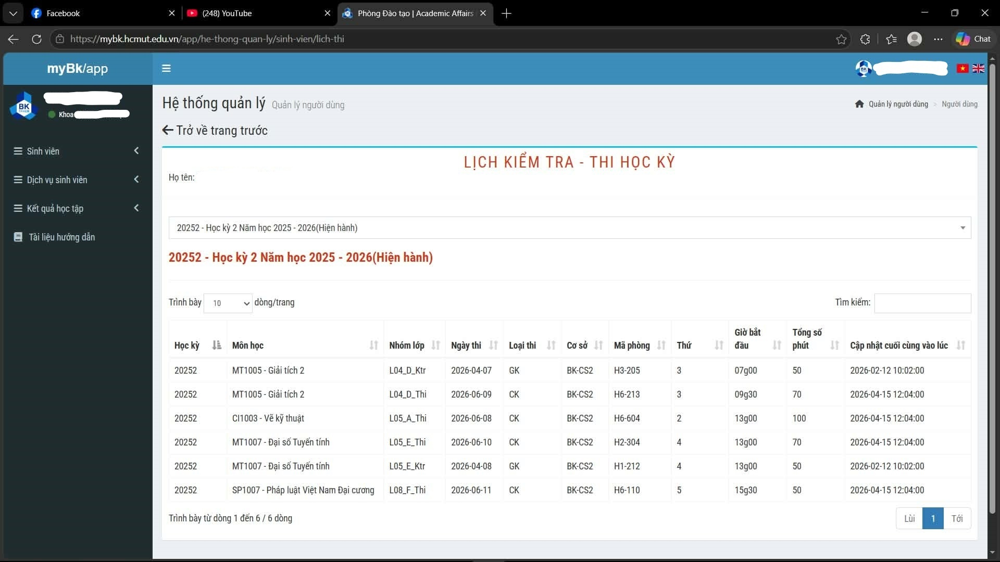 
  <em>Figure 21. My Bach Khoa - Examination details</em>

### c. Library
The system provides a categorized catalog that allows users to browse available resources and quickly locate relevant materials for their studies and research. Students can also view detailed information about each item, including availability and borrowing status, making it easier to access the resources they need.

  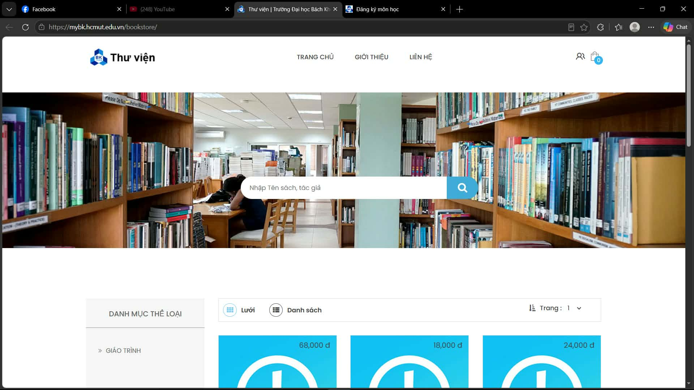 
  <em>Figure 22. My Bach Khoa - Library</em>

---

# V. Comparison and Insights

## 1. Common Features

### a. Shared Functionalities

* Centralized Authentication (SSO / CAS) — Students log in once via a central identity server (e.g., BK CAS) and gain access to all connected sub-systems — LMS, library, finance — without re-entering credentials.

* Online Course Registration — Students browse available subjects each semester, check seat availability, enroll or drop courses within a set registration window, and receive instant confirmation.

* Tuition Fee & Payment Management — Portals display itemized fee invoices per semester, show payment deadlines, and track payment status; some integrate with bank transfer or e-wallet gateways.

* Announcements & Notifications — Portals broadcast official school notices — exam schedules, registration deadlines, policy updates — often displayed as a feed on the dashboard or sent via email/SMS.

### b. Shared UI/UX Patterns

* Form-heavy, table-based layout — Most interactions are structured around input forms, filter dropdowns, and data tables, reflecting the administrative nature of the tasks and the legacy web stack these portals are built on.

* Dashboard / homepage with summary widgets — After login, users land on a summary page showing upcoming class schedules, pending tuition, unread announcements, and quick-access links to commonly used modules.

* Vietnamese-first language & localization — UI text, date formats, and error messages default to Vietnamese; English is offered as a secondary option, though some modules remain Vietnamese-only in practice.

* Role-based access control (student / staff / admin) — The same login system renders a different interface and feature set depending on the user's role — students see grades and schedules, lecturers see class rosters and grade-entry forms

## 2. Proposed Improvements in MyUS
### a. Features That MyUS Will Improve

* MyUS will improve the academic planning experience by helping students understand what courses they should take in each semester. Instead of only showing a list of available courses, the system provides guidance based on the student's current progress, completed subjects, remaining credits, and graduation requirements.

* MyUS will improve the course registration process by reducing confusion when students choose subjects. Students can check prerequisite requirements, course status, credit workload, and possible study plans before making their final registration decisions.

* MyUS will improve student support through an AI-powered chatbot. The chatbot can answer common academic questions, explain course requirements, and suggest a suitable learning path based on each student's academic situation. This helps students receive faster support without always needing to contact academic staff directly.
### b. Unique Features of MyUS

* The main unique feature of MyUS is an AI-powered chatbot that suggests personalized learning paths based on the actual course-opening rules of the university. Since the university only opens certain courses for each cohort in each semester, the chatbot can recommend suitable courses from the list of subjects that are realistically available instead of suggesting courses that students cannot register for.

* The chatbot can also support students who need to retake or improve their grades in previous courses. For example, students from an earlier cohort may be allowed to study with a later cohort if the course is opened again. Based on this rule, the chatbot can help students identify which available courses they can retake, which courses should be prioritized, and how those choices affect their future study plan.

* MyUS can help students build a semester plan that follows the maximum course limit. Because students can register for at most six courses in one semester, the chatbot will not suggest an overloaded plan. Instead, it can balance required courses, retake courses, prerequisite courses, and the student's expected graduation timeline to create a more realistic learning path.

* The chatbot does not only give course suggestions, but also explains the reason behind each recommendation. For example, it can explain that a subject should be taken first because it is a prerequisite for later courses, or that a retake course should be prioritized because it may not be opened every semester. This makes the recommendation more transparent and easier for students to trust.

* MyUS allows students to ask questions in a natural way, such as “Which courses should I take next semester?”, “Can I retake this subject with the next cohort?”, “How can I graduate on time?”, or “Which six courses should I choose this semester?”. This makes academic planning more flexible and more suitable for the real registration process at the university.

## 3. UI/UX Design Decisions

### a. Patterns to Adopt

* The system should adopt a dashboard-style layout so students can quickly see their academic progress, completed credits, remaining courses, and suggested next actions. This helps students understand their current study situation immediately after logging in.

* The AI chatbot should be easy to access from important pages such as the dashboard, course registration page, and academic progress page. Students should be able to ask for learning path suggestions without leaving their current workflow.

* The chatbot interface should use a simple conversation layout with clear messages, suggested questions, and short explanations. This design helps students who do not know what to ask and makes the AI feature easier to use.

* The system should display chatbot recommendations together with visual academic information, such as prerequisite chains, course groups, credit progress, and semester plans. This helps students verify the chatbot's suggestions instead of blindly following them.

### b. Patterns to Avoid

* The system should avoid giving AI recommendations without explanations. If the chatbot only tells students what to study next without explaining why, users may not trust the suggestion or may misunderstand their academic plan.

* The system should avoid making the chatbot the only way to access important information. Students should still be able to view course lists, prerequisites, and academic progress manually because not all users want to rely completely on AI.

* The interface should avoid long and complicated chatbot responses. Students usually need quick and clear guidance, so the chatbot should answer in short paragraphs and provide step-by-step suggestions when necessary.

* The system should avoid using too many technical terms in the chatbot. Academic rules such as prerequisites, credits, and graduation conditions should be explained in simple language so that students from all years can understand them.

## 4. Conclusion

MyUS is proposed as an AI-powered academic planning and course registration system for university students, academic staff, and administrators. The system aims to improve the traditional course registration experience by helping students understand their academic progress and make better study decisions.

After revising the original idea, the main AI feature of MyUS is an AI-powered chatbot that suggests personalized learning paths. This chatbot can support students by recommending suitable courses, explaining prerequisite relationships, and helping them plan future semesters based on their current academic situation.

Overall, MyUS is not only a course registration platform but also a smart academic assistant. By combining course registration, academic progress tracking, and AI-based learning path suggestions, the system can provide real value to students and reduce the workload of academic support staff.
