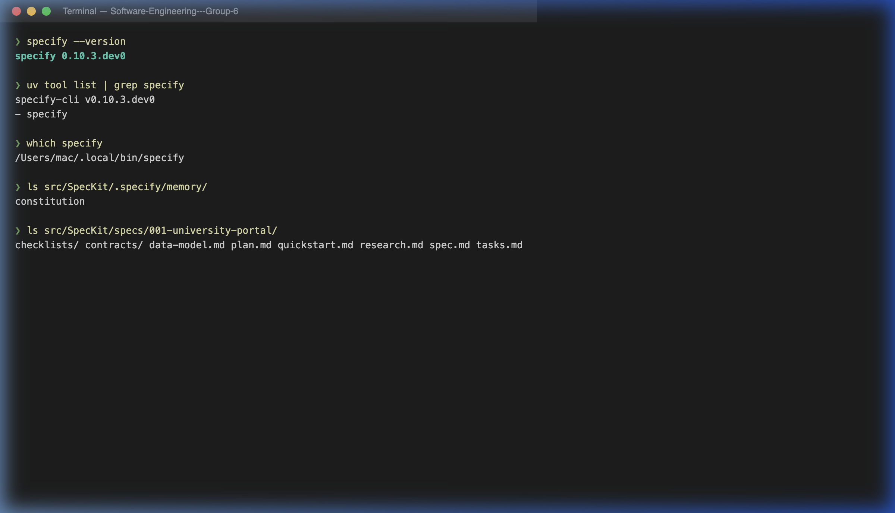

# GitHub Spec Kit Summary

**Performance by:** Duong Minh Huynh Khoi

## 1. What is GitHub Spec Kit?

GitHub Spec Kit is an open-source toolkit developed by GitHub that enables **Spec-Driven Development (SDD)** — a structured methodology where specifications are the authoritative source of truth, and code becomes a derived artifact. Instead of unstructured "vibe coding" where developers jump directly into writing code with AI, Spec Kit enforces a gated workflow: requirements must be clearly defined and validated before any implementation begins.

## 2. Core Concept: Spec-Driven Development

The traditional AI coding approach often leads to **architectural drift** — code that "looks right" but fails to meet actual requirements. SDD addresses this by placing specifications at the center of the development lifecycle:

* **Specification as Source of Truth**: Every design decision, requirement, and constraint is documented in structured Markdown artifacts before coding starts.
* **Gated Phases**: Development progresses through well-defined phases (Constitution → Specify → Plan → Tasks → Implement), and each phase must be reviewed before moving to the next.
* **Context Preservation**: AI agents receive clear, structured context rather than ad-hoc prompts, reducing non-determinism and improving output quality.

## 3. Key Components

### 3.1. Constitution

The Constitution (`constitution.md`) is a governing document that defines the project's non-negotiable principles:

* Technology stack (e.g., React, Spring Boot, SQL Server)
* Architecture principles (e.g., Clean Architecture, RESTful APIs)
* Code quality standards and naming conventions
* Security rules (authentication, authorization, data protection)
* Testing and documentation requirements

The Constitution acts as a "North Star" that ensures all AI-generated code remains compliant with the project's standards.

### 3.2. Structured Artifacts

Each development phase produces a Markdown artifact that feeds into the next phase:

| Phase | Artifact | Purpose |
|-------|----------|---------|
| Specify | `spec.md` | Define what to build — user stories, requirements, acceptance criteria |
| Plan | `plan.md` | Design how to build it — technical architecture, modules, constraints |
| Tasks | `tasks.md` | Decompose the plan into actionable, testable coding steps |

### 3.3. Quality Gates

Spec Kit provides additional quality gates to ensure consistency:

* **Clarify** (`/speckit.clarify`): Reduces ambiguity in specifications by asking targeted questions.
* **Checklist** (`/speckit.checklist`): Validates that all requirements are properly defined.
* **Analyze** (`/speckit.analyze`): Checks consistency between specs, plans, and tasks — catching conflicts before implementation.

## 4. Benefits

* **Reduced Rework**: Clear upfront specifications prevent costly rework from misunderstood requirements.
* **Agent-Neutral**: Works with any AI coding agent (GitHub Copilot, Claude, Gemini, etc.) — no vendor lock-in.
* **Scalable for Complex Projects**: Moves architectural decisions upstream, making it easier to manage large, mission-critical applications.
* **Supports Both New and Existing Projects**: The framework supports "Greenfield" (new projects) and "Brownfield" (existing systems) development.
* **Git Integration**: Leverages Git branching to manage parallel feature development, where each branch contains its own specifications and implementation path.

## 5. Comparison: Vibe Coding vs. Spec-Driven Development

| Aspect | Vibe Coding | Spec-Driven Development |
|--------|-------------|------------------------|
| Starting point | Ad-hoc prompt | Structured specification |
| Requirements | Implicit, often unclear | Explicit, documented |
| AI context | Fragmented, inconsistent | Rich, structured artifacts |
| Architecture | Emergent (often drifts) | Designed upfront |
| Maintainability | Low — hard to trace decisions | High — specs serve as documentation |
| Rework rate | High | Low |

## 6. Evidence: SpecKit Installation

The following screenshots demonstrate the successful installation and configuration of GitHub Spec Kit on the local development environment.

**Evidence 1**: SpecKit CLI installed via `uv tool`, version confirmed, and project artifacts verified.

**Evidence 2**: Running `specify check` confirms the CLI is ready and operational.

