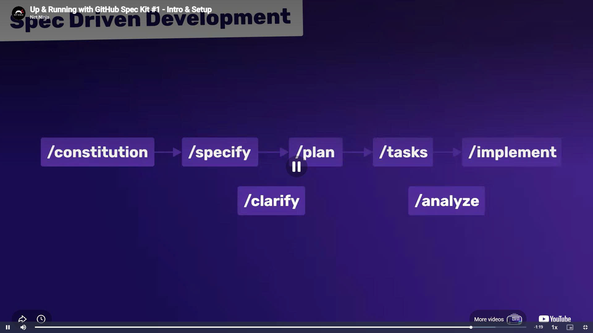

# GitHub Spec Kit Summary

## 1. Project Templates

When a project is initialized, GitHub Spec Kit generates several predefined templates that standardize the development process:

* **`constitution-template.md`**: Defines project principles, coding standards, and development rules.
* **`spec-template.md`**: Describes feature requirements, user stories, and acceptance criteria.
* **`plan-template.md`**: Outlines the technical design and implementation strategy.
* **`tasks-template.md`**: Breaks the implementation plan into actionable development tasks.

These templates provide a consistent structure for both developers and AI assistants throughout the project lifecycle.

## 2. Main Commands

GitHub Spec Kit uses a set of slash commands to guide development:

* **`/speckit.constitution`**: Establishes project guidelines and standards.
* **`/speckit.specify`**: Generates a feature specification from user requirements.
* **`/speckit.clarify`**: Refines and clarifies the generated specification.
* **`/speckit.plan`**: Creates a technical implementation plan.
* **`/speckit.tasks`**: Generates development tasks from the implementation plan.
* **`/speckit.analyze`**: Checks consistency between specifications, plans, and tasks.
* **`/speckit.implement`**: Begins implementation based on the generated documents.

## 3. Development Workflow

A typical GitHub Spec Kit workflow follows these steps:

**Constitution → Specify → Clarify → Plan → Tasks → Analyze → Implement**

This workflow ensures that requirements, planning, and implementation remain aligned throughout development.
