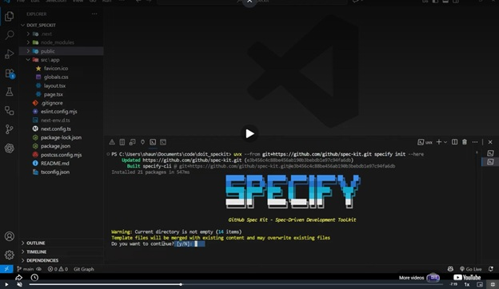

# GitHub Spec Kit Training Summary

**Project:** University Portal System
**Course:** CS300 - CSC13002 - Introduction to Software Engineering

This document summarizes the detailed learnings and practical takeaways of each team member after completing the "Up & Running with GitHub Spec Kit" training. It provides evidence of our understanding of Spec-Driven Development (SDD) and how to configure the toolset.

---

## 1. Lê Thị Như Ý
**Focus:** Environment Setup, Initialization, and Core Configuration

**Summary of Learnings:**
My training focused on the initial technical scaffolding of the Spec Kit environment. I learned how to properly set up the local development environment using the `uv` Python package manager, which is significantly faster and more reliable for fetching the CLI tools. 

By executing the initialization commands within the VS Code terminal, I observed how the toolkit scaffolds the project workspace from scratch. My main takeaway was understanding the critical role of the initial setup phase before any AI generation occurs. The process generates a foundational `constitution.md` file, which acts as the ultimate rulebook for the AI agent. I learned that by strictly dictating coding conventions, technology stacks, and architectural boundaries in this file, we can prevent the AI from hallucinating incorrect frameworks (e.g., using Vue instead of React) during the later implementation phases.

**Evidence:**
*(Please insert screenshot showing the VS Code terminal running `uv tool` or the initialized `constitution.md`)*

---

## 2. Trần Tường Vi
**Focus:** Workspace Structure and Command Functions

**Summary of Learnings:**
Starting from an empty `/src` folder, I ran the Spec Kit init command in a VS Code terminal and chose GitHub Copilot as the AI assistant. I learned that this generates specific directories:
- **`.specify/memory/constitution.md`**: empty template, to be filled in later.
- **`.specify/`**: supporting scripts and templates for specs, plans, and tasks.
- **`.github/prompts/`**: slash-command prompt files for each Spec Kit command.

I also learned the distinct purpose of each command in the workflow:
- [cite_start]**`/speckit.constitution`**: Defines the project's core principles, coding conventions, and quality standards[cite: 7].
- [cite_start]**`/speckit.specify`**: Generates a feature specification from a plain-language description[cite: 7].
- [cite_start]**`/speckit.clarify`**: Asks follow-up questions to resolve ambiguous or missing details[cite: 7].
- [cite_start]**`/speckit.plan`**: Creates a technical implementation plan based on the spec[cite: 7].
- [cite_start]**`/speckit.tasks`**: Breaks the implementation plan into a checklist of specific, ordered development tasks[cite: 7].
- [cite_start]**`/speckit.analyze`**: Checks consistency, flagging gaps or mismatches before implementation starts[cite: 7].
- [cite_start]**`/speckit.implement`**: Begins generating actual code based on the tasks[cite: 7].

**Personal Takeaway:** Init only sets up structure and prompts. Real documents come from running the full workflow. [cite_start]Agent mode is needed since each command must read context and generate/edit multiple files automatically[cite: 7].

**Evidence:**

---

## 3. Hoàng Trung Kiên
**Focus:** Project Templates and Development Workflow

**Summary of Learnings:**
[cite_start]When a project is initialized, I learned that GitHub Spec Kit generates several predefined templates that standardize the development process[cite: 8]:
* [cite_start]**`constitution-template.md`**: Defines project principles, coding standards, and development rules[cite: 8].
* [cite_start]**`spec-template.md`**: Describes feature requirements, user stories, and acceptance criteria[cite: 8].
* [cite_start]**`plan-template.md`**: Outlines the technical design and implementation strategy[cite: 8].
* [cite_start]**`tasks-template.md`**: Breaks the implementation plan into actionable development tasks[cite: 8].
[cite_start]These templates provide a consistent structure for both developers and AI assistants throughout the project lifecycle[cite: 8].

I also learned that a typical GitHub Spec Kit workflow follows these exact steps:
[cite_start]**Constitution → Specify → Clarify → Plan → Tasks → Analyze → Implement** [cite: 8]
[cite_start]This workflow ensures that requirements, planning, and implementation remain aligned throughout development[cite: 8].

**Evidence:**

---

## 4. Dương Minh Huỳnh Khôi
**Focus:** Conceptual Framework: Spec-Driven Development vs. Vibe Coding

**Summary of Learnings:**
[cite_start]I learned that GitHub Spec Kit enables **Spec-Driven Development (SDD)** — a structured methodology where specifications are the authoritative source of truth, and code becomes a derived artifact[cite: 9]. [cite_start]The traditional AI coding approach ("vibe coding") often leads to **architectural drift** — code that "looks right" but fails to meet actual requirements[cite: 9]. 

I learned the key benefits of this framework:
* [cite_start]**Model Agnostic**: Works with multiple LLMs (Claude, GPT-4, Gemini, etc.) — no vendor lock-in[cite: 9].
* [cite_start]**Scalable for Complex Projects**: Moves architectural decisions upstream, making it easier to manage large applications[cite: 9].
* [cite_start]**Git Integration**: Leverages Git branching to manage parallel feature development[cite: 9].

[cite_start]**Comparison: Vibe Coding vs. Spec-Driven Development** [cite: 9]
| Aspect | Vibe Coding | Spec-Driven Development |
|--------|-------------|------------------------|
| Starting point | Ad-hoc prompt | Structured specification |
| Requirements | Implicit, often unclear | Explicit, documented |
| AI context | Fragmented, inconsistent | Rich, structured artifacts |
| Architecture | Emergent (often drifts) | Designed upfront |
| Maintainability | Low — hard to trace decisions | High — specs serve as documentation |
| Rework rate | High | Low |

**Evidence:**

---

## 5. Hồ Thị Như Ngọc
**Focus:** Practical Execution Steps and Generated Artifacts

**Summary of Learnings:**
I focused on the practical execution steps to run the tool:
**Step 1:** Install `uv` via brew (Mac) or winget (Windows). [cite_start]Then use the CLI command `uvx` to run the specify tool in an existing project[cite: 10].
[cite_start]**Step 2:** Type the setup commands sequentially: `/constitution`, `/specify`, `/plan`, `/tasks`, and finally `/implement`[cite: 10].

I also analyzed the generated files and directories. The `.specify` directory includes 3 subdirectories: 
1. `memory/` containing the constitution file.
2. `scripts/` containing code snippets for automation.
3. [cite_start]`templates/` containing pre-formatted template files[cite: 10].

[cite_start]Next are the documents and source code created during the development process, including: 1 new Git branch for the feature, 1 specification file providing an overview, 1 technical plan detailing tools and methods, 1 list of coding tasks, and the actual source code[cite: 10].

**Evidence:**

