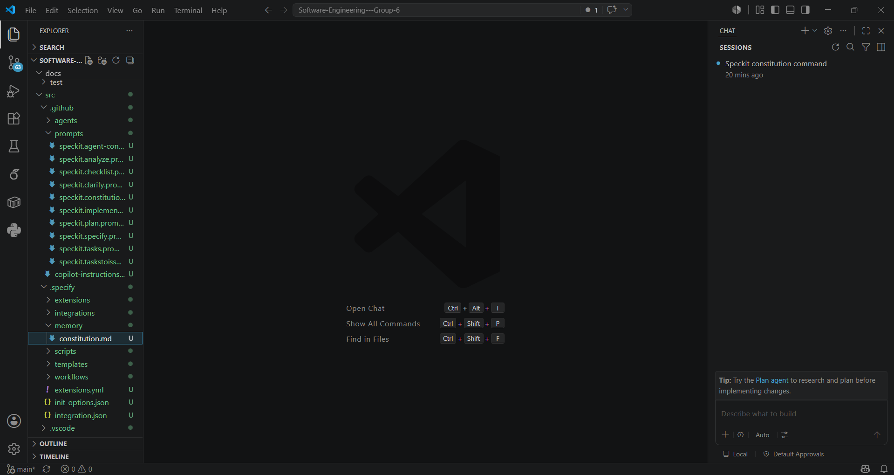
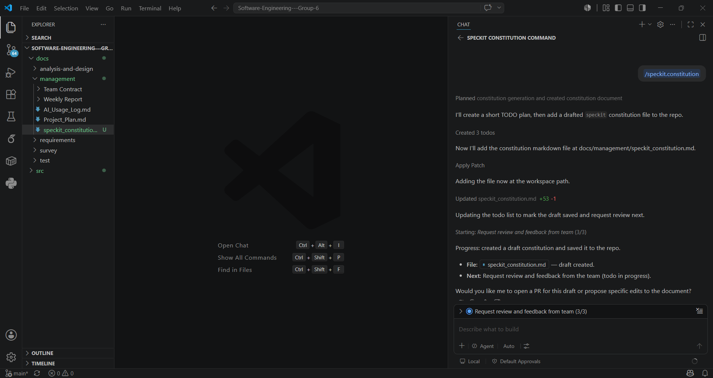

# GitHub Spec Kit Summary

## 1. Project Initialization

Starting from an empty `/src` folder, I ran the Spec Kit init command in a VS Code terminal and chose GitHub Copilot as the AI assistant. This generated:

- **`.specify/memory/constitution.md`**: empty template, to be filled in later.
- **`.specify/`**: supporting scripts and templates for specs, plans, and tasks.
- **`.github/prompts/`**: slash-command prompt files for each Spec Kit command.

At this stage, only the structure and prompts existed — no real content yet.

## 2. Spec Kit Commands and Their Functions

After switching Copilot Chat to Agent mode, I ran each command in order:

- **`/speckit.constitution`**: Defines the project's core principles, coding conventions, and quality standards, and writes them into `constitution.md`.
- **`/speckit.specify`**: Generates a feature specification from a plain-language description.
- **`/speckit.clarify`**: Asks follow-up questions to resolve ambiguous or missing details.
- **`/speckit.plan`**: Creates a technical implementation plan based on the spec.
- **`/speckit.tasks`**: Breaks the implementation plan into a checklist of specific, ordered development tasks.
- **`/speckit.analyze`**: Checks consistency, flagging gaps or mismatches before implementation starts.
- **`/speckit.implement`**: Begins generating actual code based on the tasks.

## 3. Personal Takeaway

Init only sets up structure and prompts. 

Real documents come from running the **Constitution → Specify → Clarify → Plan → Tasks → Analyze → Implement** workflow. 

Agent mode is needed since each command must read context and generate/edit multiple files automatically.
